# Contributing to MCP Multi-Agent Game System

<div align="center">

[](https://opensource.org)
[](LICENSE)
[](CONTRIBUTING.md)
[](docs/ISO_IEC_25010_CERTIFICATION.md)

**🎓 MIT-Level Open Source Project** | **🌍 Community-Driven** | **📚 Educational Focus**

[Code of Conduct](#code-of-conduct) •
[Getting Started](#getting-started) •
[Development Workflow](#development-workflow) •
[Community Resources](#community-resources)

</div>

---

## 🌟 Welcome Contributors!

Thank you for your interest in contributing to the **MCP Multi-Agent Game System**! This project is built on the principles of **open collaboration**, **knowledge sharing**, and **community excellence**. Whether you're fixing a bug, adding a feature, improving documentation, or sharing your research, your contribution is valued and appreciated.

### Why Contribute?


---

## 🎯 Types of Contributions

We welcome all types of contributions! Here's how you can help:

### 1. 🐛 Bug Reports & Fixes

**Report Bugs**: Found a bug? Let us know!
- Use GitHub Issues with the `bug` label
- Include reproduction steps
- Provide environment details
- Add relevant logs/screenshots

**Fix Bugs**: Pick from our [bug tracker](https://github.com/yourusername/repo/labels/bug)

### 2. ✨ Feature Development

**Propose Features**: Have an idea? We'd love to hear it!
- Create a GitHub Issue with the `feature-request` label
- Describe the use case
- Outline the proposed solution
- Discuss implementation approach

**Implement Features**: Work on [requested features](https://github.com/yourusername/repo/labels/feature-request)

### 3. 📚 Documentation Improvements

**Documentation is First-Class**: Help make knowledge accessible!
- Fix typos and clarify explanations
- Add examples and tutorials
- Create visual diagrams
- Translate to other languages
- Write blog posts or guides

### 4. 🎓 Research Contributions

**Advance the Science**: Share your research!
- Implement new game theory strategies
- Add mathematical proofs
- Conduct experiments
- Write academic papers
- Share benchmark results

### 5. 🧪 Testing & Quality

**Improve Quality**: Help us maintain excellence!
- Add test cases
- Improve test coverage
- Report edge cases
- Performance testing
- Security audits

### 6. 🎨 User Experience

**Enhance Usability**: Make the system better!
- UI/UX improvements
- Better error messages
- Improved logging
- Enhanced visualizations
- Tool integrations

---

## 🚀 Getting Started

### Step 1: Setup Your Environment

```bash
# Fork the repository on GitHub
# Then clone your fork
git clone https://github.com/YOUR_USERNAME/mcp-game-league.git
cd mcp-game-league

# Add upstream remote
git remote add upstream https://github.com/ORIGINAL_OWNER/mcp-game-league.git

# Install dependencies
pip install -e ".[dev]"
# or with uv (faster)
uv pip install -e ".[dev]"

# Verify installation
pytest tests/ -v
```

### Step 2: Find Something to Work On


**Labels to Look For**:
- 🟢 `good-first-issue` - Perfect for newcomers
- 🔵 `help-wanted` - We need community help
- 🟡 `documentation` - Docs improvements
- 🟠 `enhancement` - New features
- 🔴 `research` - Academic contributions

### Step 3: Create a Branch

```bash
# Create a descriptive branch name
git checkout -b feature/your-feature-name
# or
git checkout -b fix/issue-123-bug-description
# or
git checkout -b docs/improve-contributing-guide
```

---

## 💻 Development Workflow

### Standard Workflow


### Detailed Steps

#### 1. Write Your Code

**Code Quality Standards**:
```python
# ✅ Good: Type hints, docstring, clear logic
async def register_player(
    player_id: str,
    strategy: StrategyType,
    config: PlayerConfig
) -> RegistrationResult:
    """
    Register a new player in the league.
    
    Args:
        player_id: Unique identifier for the player
        strategy: Game strategy to use (e.g., "nash_equilibrium")
        config: Player configuration settings
        
    Returns:
        RegistrationResult with success status and player token
        
    Raises:
        ValueError: If player_id is already registered
        ConfigError: If configuration is invalid
        
    Example:
        >>> result = await register_player(
        ...     "Alice",
        ...     StrategyType.NASH,
        ...     PlayerConfig(timeout=30)
        ... )
        >>> print(result.token)
        'player_token_abc123'
    """
    # Validate inputs
    if not player_id:
        raise ValueError("player_id cannot be empty")
    
    # Implementation here
    ...
```

**Follow These Principles**:
- ✅ Type hints for all function parameters
- ✅ Comprehensive docstrings
- ✅ Clear variable names
- ✅ Error handling
- ✅ Logging where appropriate
- ✅ Comments for complex logic

#### 2. Write Tests

**Every contribution must include tests**:

```python
# tests/test_your_feature.py
import pytest
from src.agents import PlayerAgent

class TestPlayerRegistration:
    """Test suite for player registration feature."""
    
    @pytest.mark.asyncio
    async def test_register_player_success(self):
        """Test successful player registration."""
        # Arrange
        player = PlayerAgent(player_id="Alice", strategy="nash")
        
        # Act
        result = await player.register()
        
        # Assert
        assert result.success is True
        assert result.player_id == "Alice"
        assert result.token is not None
        
    @pytest.mark.asyncio
    async def test_register_duplicate_player(self):
        """Test that duplicate registration raises error."""
        # Arrange
        player = PlayerAgent(player_id="Alice", strategy="nash")
        await player.register()
        
        # Act & Assert
        with pytest.raises(ValueError, match="already registered"):
            await player.register()
            
    @pytest.mark.parametrize("invalid_id", ["", None, " ", "123"])
    async def test_register_invalid_player_id(self, invalid_id):
        """Test registration with invalid player IDs."""
        with pytest.raises(ValueError):
            player = PlayerAgent(player_id=invalid_id, strategy="nash")
            await player.register()
```

**Test Coverage Requirements**:
- ✅ Maintain 85%+ coverage
- ✅ Test happy paths
- ✅ Test error cases
- ✅ Test edge cases
- ✅ Test integration scenarios

#### 3. Run Quality Checks

```bash
# Run all quality checks
make test-all

# Or run individually:

# 1. Code formatting
ruff format src/ tests/

# 2. Linting
ruff check src/ tests/

# 3. Type checking
mypy src/

# 4. Security scan
bandit -r src/

# 5. Run tests
pytest tests/ -v --cov=src --cov-report=term-missing

# 6. Check coverage
pytest tests/ --cov=src --cov-report=html
open htmlcov/index.html
```

#### 4. Commit Your Changes

**Use Conventional Commits**:

```bash
# Format: <type>(<scope>): <description>

# Types:
# - feat: New feature
# - fix: Bug fix
# - docs: Documentation changes
# - style: Code style changes (formatting)
# - refactor: Code refactoring
# - test: Adding/updating tests
# - chore: Build process or auxiliary tool changes

# Examples:
git commit -m "feat(player): add player registration timeout handling"
git commit -m "fix(referee): correct round scoring calculation"
git commit -m "docs(api): add examples for MCP protocol usage"
git commit -m "test(strategies): add edge cases for nash equilibrium"
```

**Commit Message Best Practices**:
```
feat(player): add Byzantine fault tolerance to player agents

- Implement Byzantine consensus algorithm
- Add fault detection and recovery
- Include comprehensive test suite
- Update documentation with examples

Closes #123
```

#### 5. Push and Create Pull Request

```bash
# Push to your fork
git push origin feature/your-feature-name

# Create Pull Request on GitHub
# Use the PR template (automatically populated)
```

**Pull Request Template**:
```markdown
## Description
Brief description of what this PR does

## Type of Change
- [ ] Bug fix (non-breaking change fixing an issue)
- [ ] New feature (non-breaking change adding functionality)
- [ ] Breaking change (fix or feature causing existing functionality to break)
- [ ] Documentation update
- [ ] Research contribution

## Testing
- [ ] All tests pass
- [ ] New tests added
- [ ] Coverage maintained/improved
- [ ] Manual testing performed

## Checklist
- [ ] Code follows style guidelines
- [ ] Self-review completed
- [ ] Comments added for complex code
- [ ] Documentation updated
- [ ] No new warnings generated
- [ ] Tests added/updated
- [ ] All checks passing

## Related Issues
Closes #(issue number)

## Additional Notes
Any additional context or screenshots
```

---

## 🎨 Code Style Guidelines

### Python Style (PEP 8 + Project Standards)

```python
"""Module docstring: Brief description of module purpose."""

from typing import Dict, List, Optional, Union
import asyncio

from src.common.models import Player, GameState
from src.common.exceptions import ValidationError


class PlayerAgent:
    """
    Agent representing a player in the game system.
    
    Attributes:
        player_id: Unique identifier for the player
        strategy: Game strategy instance
        state: Current player state
        
    Example:
        >>> player = PlayerAgent("Alice", strategy="nash")
        >>> await player.register()
    """
    
    def __init__(
        self,
        player_id: str,
        strategy: str,
        *,  # Force keyword-only arguments after this
        timeout: int = 30,
        max_retries: int = 3,
    ) -> None:
        """Initialize player agent with configuration."""
        self.player_id = player_id
        self.strategy = self._load_strategy(strategy)
        self.timeout = timeout
        self.max_retries = max_retries
        
    async def make_move(self, game_state: GameState) -> int:
        """
        Generate a move based on current game state.
        
        Args:
            game_state: Current state of the game
            
        Returns:
            Integer representing the move choice
            
        Raises:
            ValueError: If game state is invalid
            TimeoutError: If move generation exceeds timeout
        """
        if not game_state.is_valid():
            raise ValueError("Invalid game state")
            
        try:
            move = await asyncio.wait_for(
                self.strategy.choose_move(game_state),
                timeout=self.timeout
            )
            return move
        except asyncio.TimeoutError:
            raise TimeoutError(f"Move generation exceeded {self.timeout}s")
```

### Key Style Rules

1. **Imports**:
   ```python
   # Standard library imports
   import asyncio
   import json
   
   # Third-party imports
   import pytest
   from pydantic import BaseModel
   
   # Local imports
   from src.common.models import Player
   from src.agents.strategies import NashStrategy
   ```

2. **Type Hints**: Always use type hints
3. **Docstrings**: Google or NumPy style
4. **Line Length**: 100 characters max
5. **Naming**:
   - Classes: `PascalCase`
   - Functions/Variables: `snake_case`
   - Constants: `UPPER_SNAKE_CASE`
   - Private: `_leading_underscore`

---

## 📝 Documentation Standards

### Code Documentation

```python
def calculate_nash_equilibrium(
    payoff_matrix: np.ndarray,
    iterations: int = 1000,
    tolerance: float = 1e-6
) -> Dict[str, Union[np.ndarray, float]]:
    """
    Calculate Nash Equilibrium using iterative algorithm.
    
    This function computes the mixed-strategy Nash Equilibrium for a
    two-player zero-sum game using the fictitious play algorithm.
    
    Args:
        payoff_matrix: 2D numpy array representing the payoff matrix.
            Shape should be (n_actions_p1, n_actions_p2).
        iterations: Maximum number of iterations. Defaults to 1000.
        tolerance: Convergence tolerance. Algorithm stops when strategy
            changes are below this threshold. Defaults to 1e-6.
            
    Returns:
        Dictionary containing:
            - 'strategy': np.ndarray of equilibrium probabilities
            - 'value': float representing expected payoff
            - 'iterations': int number of iterations until convergence
            
    Raises:
        ValueError: If payoff_matrix is not 2D or has invalid shape
        ConvergenceError: If algorithm doesn't converge within iterations
        
    Example:
        >>> payoff = np.array([[1, -1], [-1, 1]])
        >>> result = calculate_nash_equilibrium(payoff)
        >>> print(result['strategy'])
        [0.5, 0.5]  # Uniform mixing
        
    Note:
        This implementation assumes a zero-sum game. For general-sum
        games, use the `general_nash_equilibrium` function instead.
        
    References:
        - Nash, J. (1950). "Equilibrium Points in N-Person Games"
        - Fudenberg & Tirole (1991). "Game Theory"
    """
    # Implementation here
    ...
```

### README and Guides

Every major feature should have:
1. **Quick Start**: 5-minute getting started
2. **Tutorial**: Step-by-step walkthrough
3. **API Reference**: Complete API documentation
4. **Examples**: Real-world use cases
5. **Troubleshooting**: Common issues and solutions

---

## 🧪 Testing Guidelines

### Test Structure

```
tests/
├── unit/                      # Unit tests (fast, isolated)
│   ├── test_strategies.py
│   ├── test_agents.py
│   └── test_game_logic.py
├── integration/               # Integration tests (slower)
│   ├── test_player_referee.py
│   └── test_full_match.py
├── performance/               # Performance benchmarks
│   └── test_benchmarks.py
├── fixtures/                  # Shared test fixtures
│   └── conftest.py
└── utils/                     # Test utilities
    ├── factories.py           # Data factories
    └── assertions.py          # Custom assertions
```

### Test Quality Standards

```python
import pytest
from unittest.mock import Mock, patch, AsyncMock

class TestPlayerAgent:
    """Test suite for PlayerAgent."""
    
    @pytest.fixture
    def player(self):
        """Fixture providing a test player instance."""
        return PlayerAgent("TestPlayer", strategy="random")
        
    @pytest.fixture
    def game_state(self):
        """Fixture providing a test game state."""
        return GameState(round=1, scores={"P1": 0, "P2": 0})
        
    def test_initialization(self, player):
        """Test player initialization."""
        assert player.player_id == "TestPlayer"
        assert player.strategy is not None
        
    @pytest.mark.asyncio
    async def test_make_move_valid(self, player, game_state):
        """Test move generation with valid game state."""
        move = await player.make_move(game_state)
        assert isinstance(move, int)
        assert 0 <= move <= 10
        
    @pytest.mark.asyncio
    async def test_make_move_timeout(self, player, game_state):
        """Test that timeout is raised for slow strategies."""
        player.timeout = 0.01  # Very short timeout
        
        with patch.object(
            player.strategy,
            'choose_move',
            new=AsyncMock(side_effect=lambda x: asyncio.sleep(1))
        ):
            with pytest.raises(TimeoutError):
                await player.make_move(game_state)
                
    @pytest.mark.parametrize("invalid_state", [
        None,
        {},
        GameState(round=-1, scores={}),
    ])
    async def test_make_move_invalid_state(self, player, invalid_state):
        """Test error handling for invalid game states."""
        with pytest.raises(ValueError):
            await player.make_move(invalid_state)
```

### Test Coverage Goals

- **Overall**: 85%+ coverage
- **Critical paths**: 100% coverage
- **Edge cases**: Documented and tested
- **Performance**: Benchmarks for key operations

---

## 🔄 Pull Request Process

### Before Submitting


**Pre-submission Checklist**:
- [ ] Code formatted and linted
- [ ] All tests pass
- [ ] Coverage maintained/improved
- [ ] Documentation updated
- [ ] Commit messages follow convention
- [ ] Self-review completed
- [ ] No debug code or comments
- [ ] No unnecessary dependencies added

### Review Process

```mermaid
sequenceDiagram
    autonumber
    participant C as Contributor
    participant A as Automated Checks
    participant R as Reviewer
    participant M as Maintainer
    
    C->>A: Submit PR
    A->>A: Run CI/CD
    A-->>C: ✅ All checks pass
    A->>R: Request review
    R->>R: Review code
    R-->>C: Request changes
    C->>C: Make updates
    C->>A: Push updates
    A-->>C: ✅ Checks pass
    R->>R: Re-review
    R-->>M: Approve
    M->>M: Final review
    M->>M: Merge PR
    M-->>C: 🎉 Merged!
```



**What Reviewers Look For**:
1. **Code Quality**: Clean, readable, maintainable
2. **Tests**: Comprehensive coverage
3. **Documentation**: Clear and complete
4. **Performance**: No obvious bottlenecks
5. **Security**: No vulnerabilities
6. **Design**: Fits project architecture
7. **Compatibility**: No breaking changes

### After Merge

- Your contribution will be credited in release notes
- You'll be added to contributors list
- Consider writing a blog post about your contribution!

---

## 🏆 Recognition and Credits

### How We Recognize Contributors


**We Celebrate**:
- All contributors in README
- Release note mentions
- Twitter/social media shoutouts
- Academic co-authorship (for research contributions)
- Speaker opportunities at meetups/conferences

### Contributor Levels

| Level | Requirements | Benefits |
|-------|-------------|----------|
| **Contributor** | 1+ merged PR | Name in contributors list |
| **Active Contributor** | 5+ merged PRs | Priority PR reviews |
| **Core Contributor** | 20+ PRs, sustained engagement | Write access, decision input |
| **Maintainer** | Significant contributions, community trust | Full repository access |

---

## 📚 Learning Resources

### For New Contributors

**Start Here**:
1. [GitHub Flow Guide](https://guides.github.com/introduction/flow/)
2. [Git Basics Tutorial](https://git-scm.com/book/en/v2/Getting-Started-Git-Basics)
3. [Python Testing with pytest](https://docs.pytest.org/en/stable/getting-started.html)
4. [Type Hints in Python](https://docs.python.org/3/library/typing.html)

**Project-Specific**:
1. [Architecture Overview](docs/ARCHITECTURE.md)
2. [API Reference](docs/API.md)
3. [Game Theory Primer](docs/GAME_THEORY_STRATEGIES.md)
4. [Testing Guide](docs/guides/TESTING_INFRASTRUCTURE.md)

### For Academic Contributors

**Research Resources**:
1. [MIT Innovations](docs/MIT_LEVEL_INNOVATIONS.md)
2. [Revolutionary Innovations](docs/REVOLUTIONARY_INNOVATIONS.md)
3. [Theoretical Analysis](docs/research/THEORETICAL_ANALYSIS.md)
4. [Mathematical Proofs](docs/research/MATHEMATICAL_PROOFS.md)

**Publication Guidelines**:
- Research contributions can lead to co-authorship
- We support publication of new findings
- Access to experimental data for research
- Collaboration with academic institutions

---

## 🤝 Code of Conduct

### Our Pledge

We as members, contributors, and leaders pledge to make participation in our community a harassment-free experience for everyone, regardless of:
- Age, body size, disability, ethnicity
- Gender identity and expression
- Level of experience, education
- Nationality, personal appearance, race
- Religion, sexual identity and orientation

### Our Standards

**Positive Behaviors** ✅:
- Using welcoming and inclusive language
- Being respectful of differing viewpoints
- Gracefully accepting constructive criticism
- Focusing on what's best for the community
- Showing empathy towards others

**Unacceptable Behaviors** ❌:
- Trolling, insulting/derogatory comments
- Public or private harassment
- Publishing others' private information
- Other conduct reasonably considered inappropriate

### Enforcement

Violations can be reported to: conduct@example.com

**Consequences**:
1. **Warning**: Private written warning
2. **Temporary Ban**: Temporary ban from interaction
3. **Permanent Ban**: Permanent ban from the project

---

## 💬 Community and Support

### Getting Help

**Questions?**
- 💬 [GitHub Discussions](https://github.com/yourusername/repo/discussions) - Ask questions
- 🐛 [GitHub Issues](https://github.com/yourusername/repo/issues) - Report bugs
- 📧 Email: support@example.com
- 💻 [Slack Community](https://join.slack.com/...) - Real-time chat

### Community Calls

- **Monthly Contributors Call**: First Friday of each month
- **Office Hours**: Wednesdays 2-4pm ET
- **Research Seminars**: Last Thursday of each month

### Social Media

- **Twitter**: [@mcpgame](https://twitter.com/mcpgame)
- **Blog**: [blog.mcpgame.org](https://blog.mcpgame.org)
- **YouTube**: Tutorials and talks

---

## 🎓 Special Programs

### Research Collaboration Program

**For Academic Researchers**:
- Access to experimental infrastructure
- Co-authorship opportunities
- Research grant support letters
- Conference presentation opportunities

**Contact**: research@example.com

### Google Summer of Code

We participate in GSoC! Check our [GSoC Ideas List](docs/GSOC_IDEAS.md) for project proposals.

### Mentorship Program

**For New Contributors**:
- Paired with experienced contributor
- Guided through first contributions
- Code review learning
- Career development support

**Apply**: [Mentorship Application](https://forms.gle/...)

---

## 📅 Release Cycle


- **Patch releases** (bug fixes): Monthly
- **Minor releases** (new features): Quarterly
- **Major releases** (breaking changes): Yearly

---

## 📜 License

This project is licensed under the **MIT License** - see [LICENSE](LICENSE) file for details.

**What This Means**:
- ✅ Commercial use allowed
- ✅ Modification allowed
- ✅ Distribution allowed
- ✅ Private use allowed
- ✅ Must include license and copyright notice

---

## 🙏 Acknowledgments

### Special Thanks

This project wouldn't be possible without:
- The open-source community
- Academic researchers worldwide
- Our amazing contributors
- Game theory pioneers
- MCP protocol developers

### Sponsors

Support this project:
- [GitHub Sponsors](https://github.com/sponsors/...)
- [Open Collective](https://opencollective.com/...)
- [Patreon](https://patreon.com/...)

---

## 🎉 Thank You!

<div align="center">

### Every Contribution Matters

Whether you're fixing a typo or implementing a groundbreaking algorithm,
your contribution helps advance the state of the art in multi-agent systems.

**Thank you for being part of our community!** ❤️

---

**Quick Links**:
[Report Bug](https://github.com/yourusername/repo/issues/new?template=bug_report.md) •
[Request Feature](https://github.com/yourusername/repo/issues/new?template=feature_request.md) •
[Join Discussion](https://github.com/yourusername/repo/discussions) •
[View Roadmap](docs/ROADMAP.md)

---

*Last Updated: December 25, 2025*  
*Contributors: 50+ and growing*  
*Stars: Give us a ⭐ if this project helped you!*

</div>

