# 🎮 MCP Multi-Agent Game League

> **Production-Grade Agentic AI System using Model Context Protocol (MCP)**
>
> A sophisticated multi-agent game system implementing autonomous AI agents that communicate via the Model Context Protocol (MCP) standard. Features intelligent players competing in a round-robin league tournament, with optional LLM-powered strategies using Anthropic Claude or OpenAI GPT.

<div align="center">


</div>

---

## 📋 Table of Contents

- [System Overview](#-system-overview)
- [Architecture](#-architecture)
- [How to Operate](#-how-to-operate)
- [Complete Game Flow](#-complete-game-flow)
- [Agent Communication](#-agent-communication)
- [State Machines](#-state-machines)
- [The Game: Odd/Even](#-the-game-oddeven)
- [Protocol Specification](#-protocol-specification)
- [Configuration](#-configuration)
- [Project Structure](#-project-structure)
- [Testing](#-testing)
- [Deployment](#-deployment)

---

## 🏆 System Overview

### High-Level System Architecture

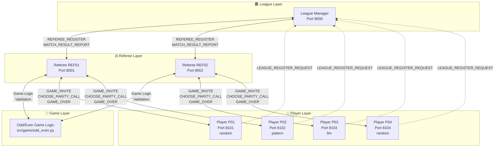

### 🔑 Key Design Principles

| Principle | Description | Implementation |
|-----------|-------------|----------------|
| **Separation of Concerns** | League/Referee layers are game-agnostic | Replace Odd/Even with any game without changing protocol |
| **Bidirectional MCP** | Each agent is BOTH server AND client | Enables peer-to-peer autonomous communication |
| **Round-Robin Assignment** | Referees assigned to matches in rotation | `MatchScheduler.create_round_robin_schedule()` |
| **Authentication Tokens** | Secure agent registration | `generate_auth_token()` in `protocol.py` |

---

## 🏗️ Architecture

### Three-Layer Architecture

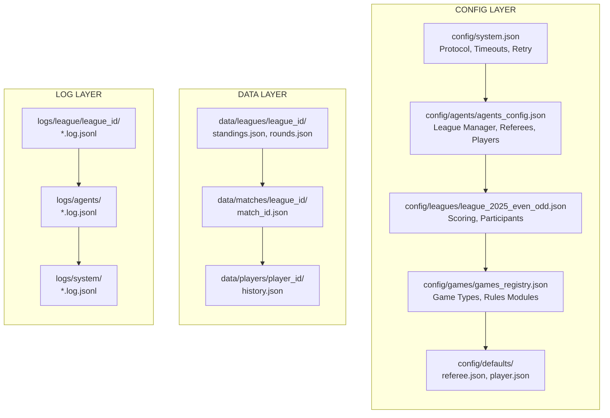

### MCP Server + Client Architecture (Each Agent)

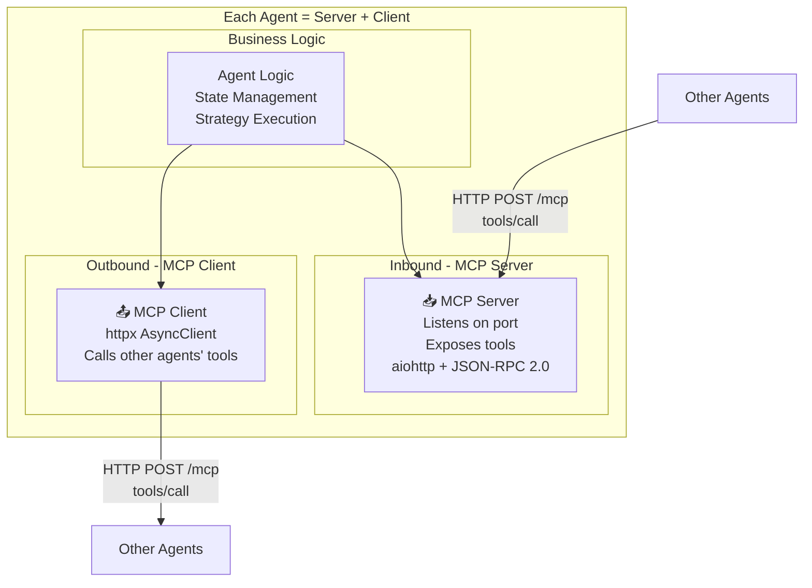

### Component Interaction Map

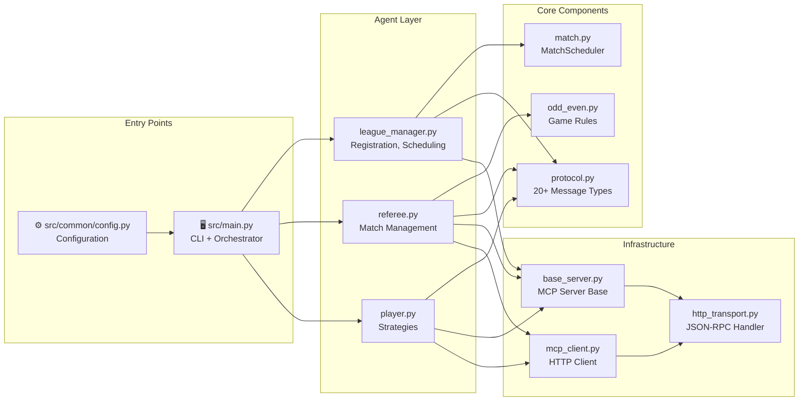

---

## 🚀 How to Operate

### Quick Start Flowchart


### Step-by-Step Instructions

#### Prerequisites

```bash
# Required
- Python 3.11+
- UV package manager (recommended) OR pip

# Optional (for LLM strategies)
export ANTHROPIC_API_KEY=your_key_here
export OPENAI_API_KEY=your_key_here
```

#### Option 1: Full Automatic League (Recommended)

```bash
# Step 1: Install dependencies
uv sync --all-extras
# OR with pip:
pip install -e '.[dev,llm]'

# Step 2: Run the full league (defaults: 1 League Manager, 2 Referees, 4 Players)
uv run python -m src.main --run

# Step 3: Watch the output - system automatically:
#   - Starts League Manager (port 8000)
#   - Starts 2 Referees (ports 8001, 8002)
#   - Starts 4 Players (ports 8101-8104)
#   - Registers all agents
#   - Runs round-robin tournament (6 matches for 4 players)
#   - Displays standings after each round
#   - Declares champion
```

#### Option 2: Custom Configuration

```bash
# Run with 6 players and 3 referees
uv run python -m src.main --run --players 6 --referees 3

# Run with LLM strategies (Claude)
uv run python -m src.main --run --strategy llm

# Run with mixed strategies
uv run python -m src.main --run --strategy mixed

# Run with debug logging
uv run python -m src.main --run --debug
```

#### Option 3: Manual Multi-Terminal Setup

```bash
# Terminal 1: Start League Manager
uv run python -m src.main --component league --debug

# Terminal 2: Start Referee 1
uv run python -m src.main --component referee --port 8001 --register

# Terminal 3: Start Referee 2 (optional)
uv run python -m src.main --component referee --port 8002 --register

# Terminal 4-7: Start Players
uv run python -m src.main --component player --name "AlphaBot" --port 8101 --register
uv run python -m src.main --component player --name "BetaBot" --port 8102 --register --strategy pattern
uv run python -m src.main --component player --name "ClaudeBot" --port 8103 --register --strategy llm
uv run python -m src.main --component player --name "DeltaBot" --port 8104 --register

# Terminal 8: Control Commands
uv run python -m src.main --start-league       # Create schedule
uv run python -m src.main --run-round          # Run one round
uv run python -m src.main --run-all-rounds     # Run all remaining rounds
uv run python -m src.main --get-standings      # Get current standings
```

#### Option 4: Docker

```bash
# Build and run
docker-compose up --build

# View logs
docker-compose logs -f

# Stop
docker-compose down
```

### Command Reference Table

| Command | Description |
|---------|-------------|
| `--run` | Run full automatic league |
| `--players N` | Number of players (default: 4) |
| `--referees N` | Number of referees (default: 2) |
| `--strategy [random\|pattern\|llm\|mixed]` | Player strategy type |
| `--component [league\|referee\|player]` | Start single component |
| `--name NAME` | Player display name |
| `--port PORT` | Component port |
| `--register` | Auto-register with league |
| `--start-league` | Send start_league command |
| `--run-round` | Run next round |
| `--run-all-rounds` | Run all remaining rounds |
| `--get-standings` | Get current standings |
| `--debug` | Enable debug logging |
| `--llm-provider [anthropic\|openai]` | LLM provider |
| `--llm-model MODEL` | LLM model name |

### Makefile Commands

```bash
make setup        # Install UV and dependencies
make run-league   # Run full league
make run-debug    # Run with debug logging
make test         # Run all tests
make lint         # Check code quality
make docker-up    # Start with Docker
make docker-down  # Stop Docker services
```

---

## 🔄 Complete Game Flow

### Full League Operation Sequence

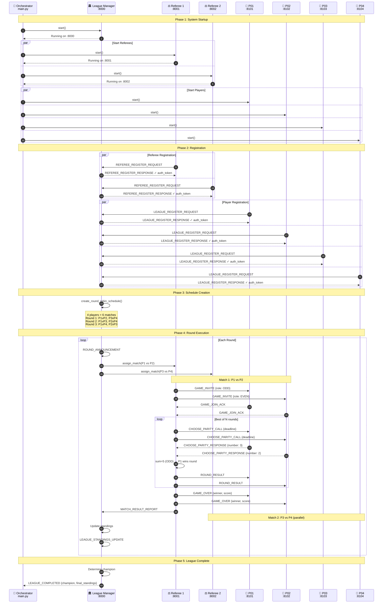

### Single Match Flow (Detailed)

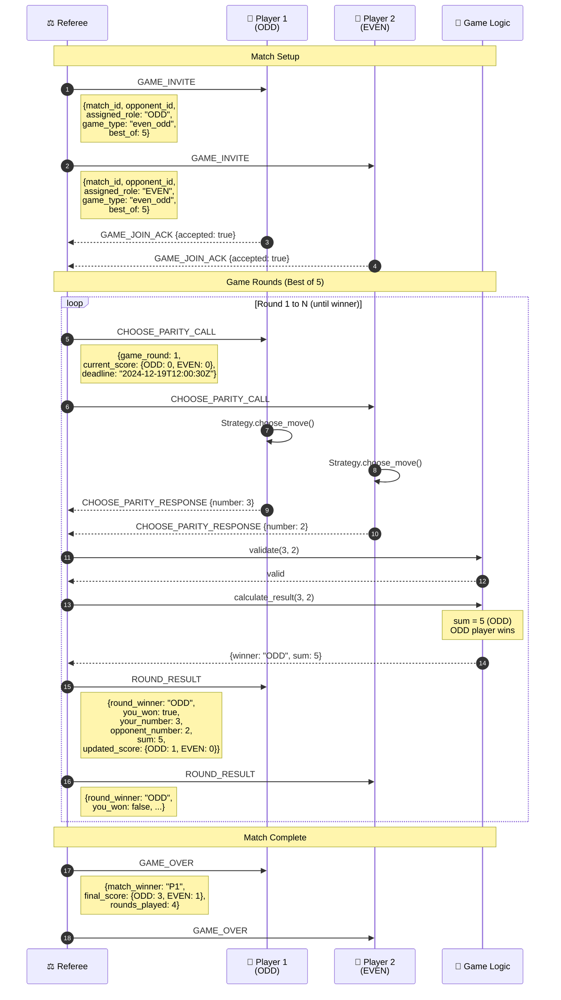

---

## 💬 Agent Communication

### Message Flow Overview

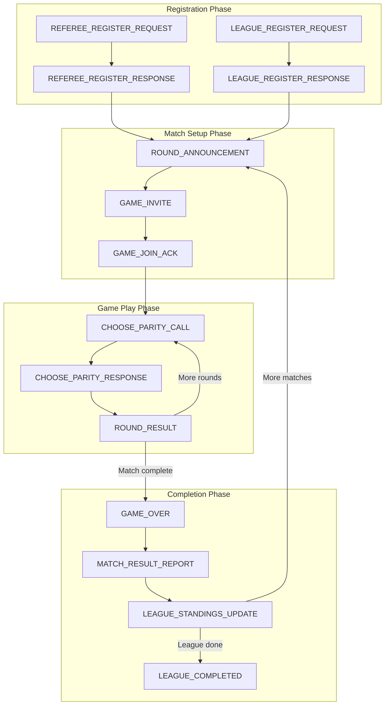

### Protocol Message Types (20+)

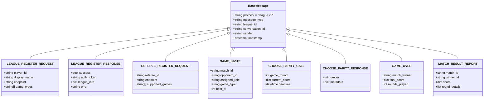

### Message Timeouts

| Message Type | Timeout |
|--------------|---------|
| `REFEREE_REGISTER` | 10 seconds |
| `GAME_JOIN_ACK` | 10 seconds |
| `CHOOSE_PARITY` (Move) | 30 seconds |
| `MATCH_RESULT_REPORT` | 10 seconds |
| `LEAGUE_QUERY` | 10 seconds |
| Generic Response | 10 seconds |

---

## 🔀 State Machines

### Player Agent States

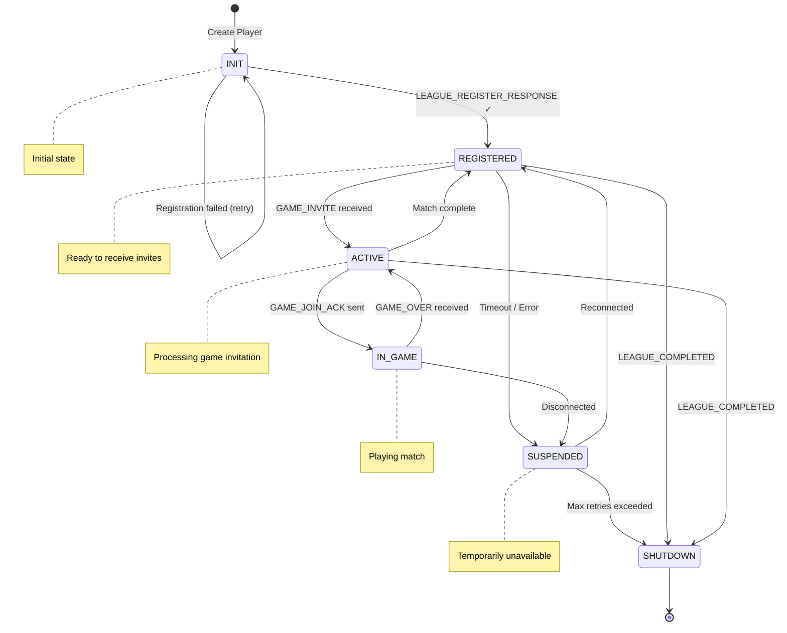

### Referee Agent States

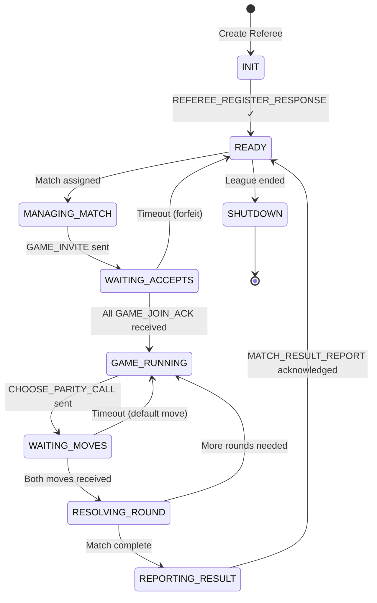

### League Manager States

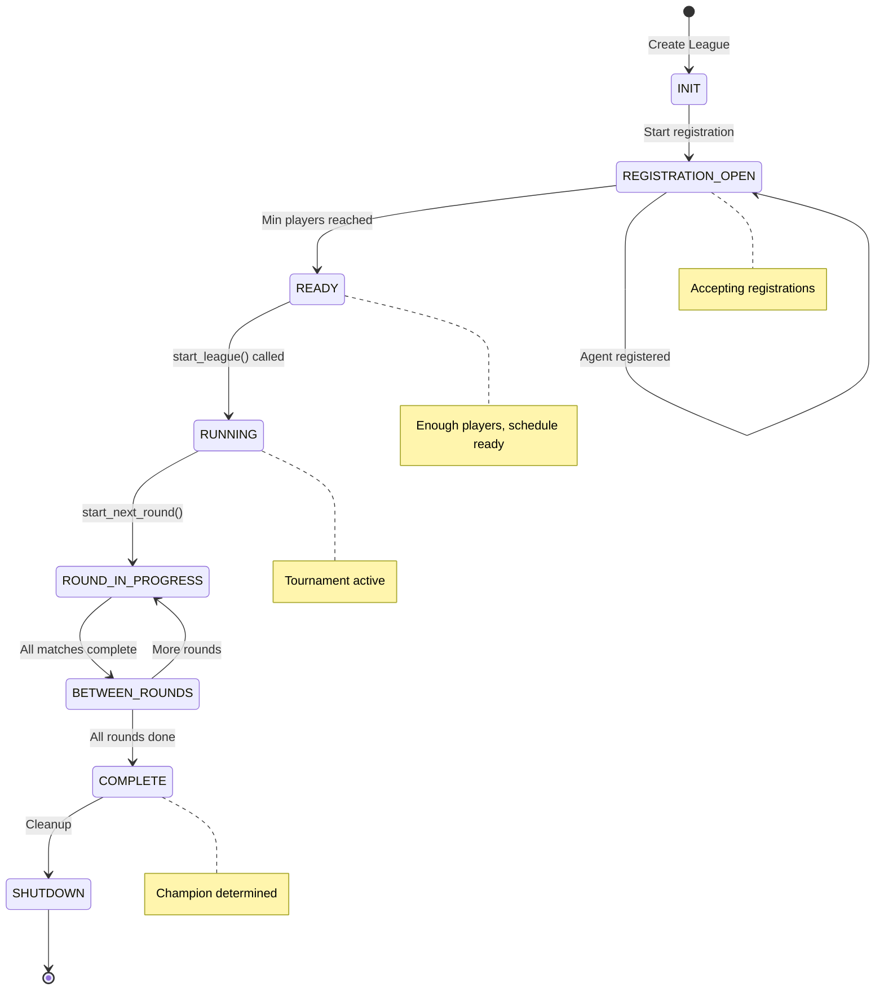

---

## 🎯 The Game: Odd/Even

### Game Rules

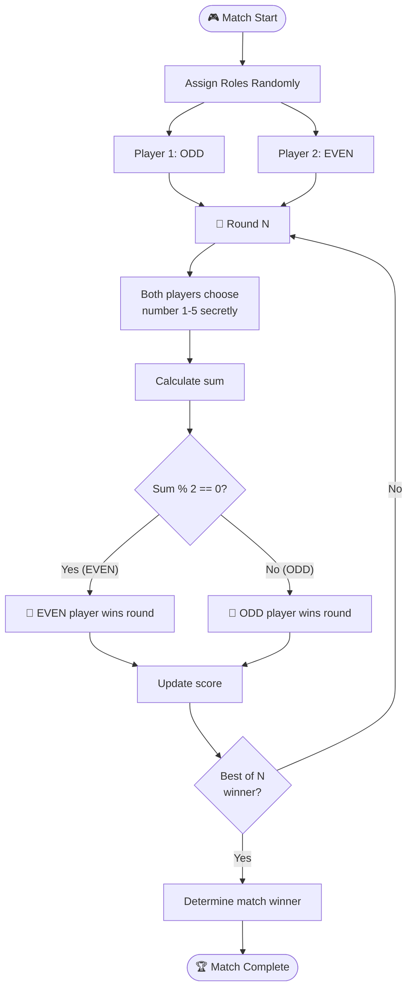

### Scoring System

| Match Result | League Points |
|--------------|---------------|
| **Win** | 3 points |
| **Draw** | 1 point |
| **Loss** | 0 points |

### Player Strategies

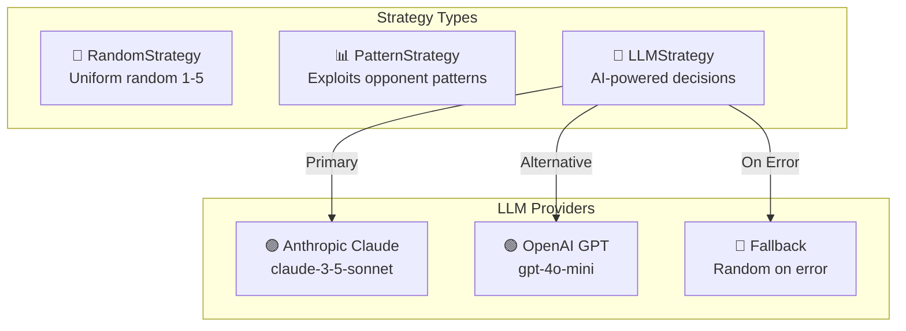

---

## 📨 Protocol Specification

### JSON-RPC 2.0 Format

```json
{
  "jsonrpc": "2.0",
  "id": "unique-request-id",
  "method": "tools/call",
  "params": {
    "name": "receive_game_invite",
    "arguments": {
      "protocol": "league.v2",
      "message_type": "GAME_INVITE",
      "league_id": "league_2025_even_odd",
      "match_id": "match_001",
      "opponent_id": "P02",
      "assigned_role": "ODD",
      "game_type": "even_odd",
      "best_of": 5
    }
  }
}
```

### Message Examples

See `docs/message-examples/` for all 18+ example messages:

- `registration/referee_register_request.json`
- `registration/player_register_request.json`
- `game_invite.json`
- `choose_parity.json`
- `game_over.json`
- `match_result_report.json`
- `standings_update.json`
- And more...

---

## 🔧 Configuration

### Port Configuration

| Component | Default Port | URL |
|-----------|--------------|-----|
| League Manager | 8000 | `http://localhost:8000/mcp` |
| Referee 1 | 8001 | `http://localhost:8001/mcp` |
| Referee 2 | 8002 | `http://localhost:8002/mcp` |
| Player 1 (P01) | 8101 | `http://localhost:8101/mcp` |
| Player 2 (P02) | 8102 | `http://localhost:8102/mcp` |
| Player 3 (P03) | 8103 | `http://localhost:8103/mcp` |
| Player 4 (P04) | 8104 | `http://localhost:8104/mcp` |
| Player N | 81XX | `http://localhost:81XX/mcp` |

### Configuration Files

| File | Purpose |
|------|---------|
| `config/system.json` | Global system settings, timeouts, retry policy |
| `config/agents/agents_config.json` | Agent definitions (LM, Referees, Players) |
| `config/leagues/league_2025_even_odd.json` | League scoring and participant limits |
| `config/games/games_registry.json` | Game type definitions and rules modules |
| `config/defaults/referee.json` | Default referee settings |
| `config/defaults/player.json` | Default player settings |

### Environment Variables

```bash
# LLM Configuration
export ANTHROPIC_API_KEY=your_anthropic_key
export OPENAI_API_KEY=your_openai_key

# Logging
export LOG_LEVEL=INFO  # DEBUG, INFO, WARNING, ERROR

# Server Configuration (optional overrides)
export LEAGUE_HOST=localhost
export LEAGUE_PORT=8000
```

---

## 📁 Project Structure

```
MCP_Multi_Agent_Game/
├── src/                           # Source code
│   ├── main.py                    # 🎯 Main entry point & orchestrator
│   ├── agents/                    # Agent implementations
│   │   ├── league_manager.py      # 🏛️ League Manager agent
│   │   ├── referee.py             # ⚖️ Referee agent  
│   │   └── player.py              # 🤖 Player agent + strategies
│   ├── game/                      # Game logic
│   │   ├── odd_even.py            # 🎲 Odd/Even game rules
│   │   ├── match.py               # 📅 Match scheduling
│   │   └── registry.py            # Game type registry
│   ├── common/                    # Shared utilities (≈ league_sdk)
│   │   ├── config.py              # Configuration management
│   │   ├── config_loader.py       # Config file loader
│   │   ├── protocol.py            # 📨 Message types & factories
│   │   ├── repositories.py        # Data persistence
│   │   ├── logger.py              # Structured logging
│   │   ├── lifecycle.py           # Agent lifecycle management
│   │   └── exceptions.py          # Custom exceptions
│   ├── server/                    # MCP Server implementation
│   │   ├── base_server.py         # Base MCP server class
│   │   ├── mcp_server.py          # Full MCP server
│   │   ├── tools/                 # Tool implementations
│   │   └── resources/             # Resource definitions
│   ├── client/                    # MCP Client implementation
│   │   ├── mcp_client.py          # HTTP client
│   │   ├── session_manager.py     # Session management
│   │   ├── connection_manager.py  # Connection & retry
│   │   ├── message_queue.py       # Message queuing
│   │   ├── tool_registry.py       # Tool discovery
│   │   └── resource_manager.py    # Resource management
│   └── transport/                 # Transport layer
│       ├── json_rpc.py            # JSON-RPC 2.0
│       ├── http_transport.py      # HTTP communication
│       └── base.py                # Transport interface
│
├── config/                        # Configuration layer
│   ├── system.json                # System-wide config
│   ├── agents/agents_config.json  # Agent definitions
│   ├── leagues/league_2025_even_odd.json
│   ├── games/games_registry.json
│   ├── defaults/                  # Default settings
│   └── servers.json               # Server registry
│
├── data/                          # Runtime data layer
│   ├── leagues/league_2025_even_odd/
│   │   ├── standings.json         # Current standings
│   │   └── rounds.json            # Round history
│   ├── matches/league_2025_even_odd/
│   └── players/                   # Player history
│       ├── P01/history.json
│       └── P02/history.json
│
├── logs/                          # Logging layer
│   ├── league/league_2025_even_odd/
│   ├── agents/
│   └── system/
│
├── docs/                          # Documentation
│   ├── protocol-spec.md           # Protocol specification
│   ├── message-examples/          # 18+ JSON examples
│   ├── ARCHITECTURE.md
│   ├── COMMAND_REFERENCE.md
│   ├── DEPLOYMENT.md
│   └── DEVELOPMENT.md
│
├── tests/                         # Test suite
│   ├── test_game.py
│   ├── test_protocol.py
│   ├── test_transport.py
│   └── ...
│
├── scripts/                       # Utility scripts
│   ├── setup.sh
│   ├── run_league.sh
│   └── run_tests.sh
│
├── pyproject.toml                 # Project configuration
├── Makefile                       # Common commands
├── Dockerfile                     # Docker build
├── docker-compose.yml             # Multi-container setup
├── README.md                      # This file
└── REQUIREMENTS.md                # Requirements specification
```

---

## 🧪 Testing

```bash
# Run all tests
uv run pytest tests/ -v

# Run with coverage
uv run pytest tests/ --cov=src --cov-report=html

# Run specific test
uv run pytest tests/test_game.py -v
uv run pytest tests/test_protocol.py -v
uv run pytest tests/test_transport.py -v

# Or use Makefile
make test
```

---

## 🐳 Deployment

### Docker Deployment

```bash
# Build and run all services
docker-compose up --build

# Run in background
docker-compose up -d

# View logs
docker-compose logs -f league_manager
docker-compose logs -f referee
docker-compose logs -f player1

# Stop all services
docker-compose down
```

### Production Considerations

- Set `LOG_LEVEL=INFO` in production
- Configure proper timeouts in `config/system.json`
- Use environment variables for secrets (API keys)
- Enable retry policy with exponential backoff

---

## 📚 References

- [Model Context Protocol Specification](https://spec.modelcontextprotocol.io/)
- [JSON-RPC 2.0 Specification](https://www.jsonrpc.org/specification)
- [UV Package Manager](https://docs.astral.sh/uv/)
- [Project Requirements](./REQUIREMENTS.md)
- [Protocol Specification](./docs/protocol-spec.md)
- [Architecture Documentation](./docs/ARCHITECTURE.md)
- [Command Reference](./docs/COMMAND_REFERENCE.md)

---

## 📄 License

MIT License

---

<div align="center">

**Built with ❤️ using Model Context Protocol**

*Last Updated: December 2024*

</div>
