# 🎮 MCP Multi-Agent Game League

> **Production-Grade Agentic AI System using Model Context Protocol (MCP)**
>
> A sophisticated multi-agent game system implementing autonomous AI agents that communicate via the Model Context Protocol (MCP) standard. Features intelligent players competing in a round-robin league tournament, with optional LLM-powered strategies using Anthropic Claude or OpenAI GPT.

<div align="center">


</div>

---

## 📋 Table of Contents

- [System Overview](#-system-overview)
- [Architecture Diagrams](#-architecture-diagrams)
- [MCP Client Architecture](#-mcp-client-architecture)
- [MCP Server Architecture](#-mcp-server-architecture)
- [Communication Flow](#-communication-flow)
- [Sequence Diagrams](#-sequence-diagrams)
- [Entity State Machine](#-entity-state-machine)
- [How to Operate](#-how-to-operate)
- [The Game: Odd/Even](#-the-game-oddeven)
- [Protocol Specification](#-protocol-specification)
- [Configuration](#-configuration)
- [Testing](#-testing)
- [Deployment](#-deployment)
- [References](#-references)

---

## 🏆 System Overview

### High-Level Architecture


### 🔑 Core Design Principle: Separation of Concerns

> **IMPORTANT**: The League Layer and Referee Layer are **NOT dependent** on the specific game.
>
> You can replace the "Odd/Even" game with Tic-Tac-Toe, Chess, or any other game - **WITHOUT changing the general protocol**.

### 🤖 Agentic AI Characteristics

Each agent in this system demonstrates key agentic AI properties:

| Property | Description | Implementation |
|----------|-------------|----------------|
| **Autonomy** | Agents operate independently | Self-registration, independent decision-making |
| **Reactivity** | Respond to environment changes | Handle game invites, move requests, results |
| **Proactivity** | Goal-directed behavior | Strategic planning, pattern recognition |
| **Social Ability** | Communicate with other agents | MCP protocol, JSON-RPC 2.0 |

### 🧠 LLM Integration

Players can use AI-powered strategies:

```mermaid
graph TB
    subgraph "Player Agent"
        direction TB
        PLAYER[🤖 Player Agent<br/>MCP Server + Client]
        
        subgraph "Strategy Selection"
            RANDOM[🎲 Random<br/>Strategy]
            PATTERN[📊 Pattern<br/>Strategy]
            LLM_STRAT[🧠 LLM<br/>Strategy]
        end
        
        PLAYER --> RANDOM
        PLAYER --> PATTERN
        PLAYER --> LLM_STRAT
    end
    
    subgraph "LLM Providers"
        ANTHROPIC[🟣 Anthropic<br/>Claude]
        OPENAI[🟢 OpenAI<br/>GPT-4]
        FALLBACK[🔄 Fallback<br/>Random]
    end
    
    LLM_STRAT -->|"Primary"| ANTHROPIC
    LLM_STRAT -->|"Alternative"| OPENAI
    LLM_STRAT -->|"On Error"| FALLBACK
```



---

## 🏗️ Architecture Diagrams

### Three-Layer Architecture (Detailed)

```mermaid
graph TB
    subgraph "LEAGUE LAYER"
        direction TB
        LM_REG[📝 Player Registration]
        LM_SCHED[📅 Match Scheduling]
        LM_STAND[🏆 Standings Management]
        LM_TOKEN[🔐 Token Generation]
        
        LM_REG --> LM_TOKEN
        LM_TOKEN --> LM_SCHED
        LM_SCHED --> LM_STAND
    end
    
    subgraph "REFEREE LAYER"
        direction TB
        REF_MGR[🎮 Match Management]
        REF_VAL[✅ Move Validation]
        REF_RES[📊 Result Resolution]
        REF_RPT[📤 Result Reporting]
        
        REF_MGR --> REF_VAL
        REF_VAL --> REF_RES
        REF_RES --> REF_RPT
    end
    
    subgraph "GAME LAYER"
        direction TB
        GAME_RULES[📜 Game Rules]
        GAME_VALID[🔍 Move Legality]
        GAME_WIN[🏅 Win Conditions]
        
        GAME_RULES --> GAME_VALID
        GAME_VALID --> GAME_WIN
    end
    
    subgraph "TRANSPORT LAYER"
        direction LR
        HTTP[🌐 HTTP Transport]
        JSONRPC[📦 JSON-RPC 2.0]
        RETRY[🔄 Retry Logic]
        
        HTTP --> JSONRPC
        JSONRPC --> RETRY
    end
    
    LM_SCHED --> REF_MGR
    REF_VAL --> GAME_VALID
    REF_RPT --> LM_STAND
    
    REF_MGR -.-> HTTP
```



### Component Interaction Map

```mermaid
flowchart LR
    subgraph External["External Interface"]
        CLI[🖥️ CLI Entry Point<br/>main.py]
        CFG[⚙️ Configuration<br/>config.py]
    end
    
    subgraph Agents["Agent Layer"]
        LM[League Manager]
        REF[Referee]
        PLAYER[Player Agent]
    end
    
    subgraph Core["Core Components"]
        PROTO[Protocol<br/>Messages]
        GAME[Game Logic<br/>Odd/Even]
        MATCH[Match<br/>Scheduler]
    end
    
    subgraph Infra["Infrastructure"]
        SERVER[MCP Server]
        CLIENT[MCP Client]
        TRANSPORT[HTTP Transport]
        LOGGER[Logger]
    end
    
    CLI --> CFG
    CLI --> LM
    CLI --> REF
    CLI --> PLAYER
    
    LM --> SERVER
    LM --> MATCH
    LM --> PROTO
    
    REF --> SERVER
    REF --> CLIENT
    REF --> GAME
    REF --> PROTO
    
    PLAYER --> SERVER
    PLAYER --> CLIENT
    PLAYER --> PROTO
    
    SERVER --> TRANSPORT
    CLIENT --> TRANSPORT
    
    TRANSPORT --> LOGGER
```



---

## 🔌 MCP Client Architecture

### Client Component Diagram

```mermaid
graph TB
    subgraph "MCP Client"
        direction TB
        
        subgraph "Session Layer"
            SM[📋 Session Manager<br/>Track active sessions]
            CM[🔗 Connection Manager<br/>Health & retry]
        end
        
        subgraph "Tool Layer"
            TR[🔧 Tool Registry<br/>Discover & namespace tools]
            TE[⚡ Tool Executor<br/>Execute tool calls]
        end
        
        subgraph "Resource Layer"
            RM[📦 Resource Manager<br/>Track & cache resources]
            SUB[📡 Subscription Manager<br/>Resource updates]
        end
        
        subgraph "Message Layer"
            MQ[📬 Message Queue<br/>Priority FIFO]
            RL[🚦 Rate Limiter<br/>Request throttling]
        end
        
        subgraph "Transport Layer"
            HTTP[🌐 HTTP Transport]
            JSONRPC[📄 JSON-RPC Handler]
        end
    end
    
    SM --> CM
    CM --> TR
    TR --> TE
    TE --> MQ
    
    RM --> SUB
    SUB --> MQ
    
    MQ --> RL
    RL --> HTTP
    HTTP --> JSONRPC
    
    JSONRPC -->|"Request"| SERVER[🖥️ MCP Server]
    SERVER -->|"Response"| JSONRPC
```



### Client Data Flow


---

## 🖥️ MCP Server Architecture

### Server Component Diagram


### Server Request Processing

```mermaid
flowchart TD
    REQ[📥 Incoming Request] --> PARSE[Parse JSON-RPC]
    PARSE --> VALIDATE{Valid<br/>Message?}
    
    VALIDATE -->|No| ERROR[❌ Return Error<br/>-32600 Invalid Request]
    VALIDATE -->|Yes| ROUTE{Route by<br/>Method}
    
    ROUTE -->|"tools/list"| TOOLS_LIST[Return Tool List]
    ROUTE -->|"tools/call"| TOOLS_CALL[Execute Tool]
    ROUTE -->|"resources/list"| RES_LIST[Return Resources]
    ROUTE -->|"resources/read"| RES_READ[Read Resource]
    ROUTE -->|"prompts/list"| PROMPT_LIST[Return Prompts]
    ROUTE -->|"Unknown"| NOT_FOUND[❌ Method Not Found<br/>-32601]
    
    TOOLS_CALL --> FIND_TOOL{Tool<br/>Exists?}
    FIND_TOOL -->|No| TOOL_ERROR[❌ Tool Not Found]
    FIND_TOOL -->|Yes| EXEC_TOOL[Execute Handler]
    EXEC_TOOL --> TOOL_RESULT[Return Result]
    
    TOOLS_LIST --> RESPONSE[📤 JSON-RPC Response]
    TOOL_RESULT --> RESPONSE
    RES_LIST --> RESPONSE
    RES_READ --> RESPONSE
    PROMPT_LIST --> RESPONSE
    ERROR --> RESPONSE
    NOT_FOUND --> RESPONSE
    TOOL_ERROR --> RESPONSE
```



---

## 🔄 Communication Flow

### Entity Communication Overview

```mermaid
graph LR
    subgraph "Players"
        P1[🤖 Player 1]
        P2[🤖 Player 2]
    end
    
    subgraph "League Manager"
        LM[🏛️ League Manager]
    end
    
    subgraph "Referee"
        REF[⚖️ Referee]
    end
    
    P1 -->|"1. REGISTER_REQUEST"| LM
    LM -->|"2. REGISTER_RESPONSE<br/>(token)"| P1
    
    P2 -->|"1. REGISTER_REQUEST"| LM
    LM -->|"2. REGISTER_RESPONSE<br/>(token)"| P2
    
    LM -->|"3. MATCH_ASSIGN"| REF
    
    REF -->|"4. GAME_INVITE"| P1
    REF -->|"4. GAME_INVITE"| P2
    
    P1 -->|"5. GAME_ACCEPT"| REF
    P2 -->|"5. GAME_ACCEPT"| REF
    
    REF -->|"6. GAME_START"| P1
    REF -->|"6. GAME_START"| P2
    
    REF -->|"7. MOVE_REQUEST"| P1
    REF -->|"7. MOVE_REQUEST"| P2
    
    P1 -->|"8. MOVE_RESPONSE"| REF
    P2 -->|"8. MOVE_RESPONSE"| REF
    
    REF -->|"9. ROUND_RESULT"| P1
    REF -->|"9. ROUND_RESULT"| P2
    
    REF -->|"10. GAME_END"| P1
    REF -->|"10. GAME_END"| P2
    
    REF -->|"11. MATCH_RESULT"| LM
```



### Message Protocol Flow


---

## 📊 Sequence Diagrams

### 1. Player Registration Sequence


### 2. Complete Game Flow Sequence

```mermaid
sequenceDiagram
    autonumber
    participant LM as 🏛️ League Manager
    participant REF as ⚖️ Referee
    participant P1 as 🤖 Player 1
    participant P2 as 🤖 Player 2
    participant GAME as 🎲 Game Logic
    
    Note over LM,GAME: Match Assignment
    
    LM->>+REF: MATCH_ASSIGN
    Note right of LM: {match_id, player1_info, player2_info}
    REF-->>-LM: ACK
    
    Note over LM,GAME: Game Invitation
    
    par Send invitations
        REF->>+P1: GAME_INVITE
        Note right of REF: {match_id, opponent_id, role: ODD}
        and
        REF->>+P2: GAME_INVITE
        Note right of REF: {match_id, opponent_id, role: EVEN}
    end
    
    P1-->>REF: GAME_ACCEPT
    P2-->>-REF: GAME_ACCEPT
    
    Note over LM,GAME: Game Start
    
    par Notify game start
        REF->>P1: GAME_START
        Note right of REF: {game_id, your_role, opponent_role}
        and
        REF->>P2: GAME_START
    end
    
    Note over LM,GAME: Round Loop (Best of N)
    
    loop Each Round
        par Request moves
            REF->>P1: MOVE_REQUEST
            Note right of REF: {round_number, time_limit}
            and
            REF->>P2: MOVE_REQUEST
        end
        
        P1->>P1: Strategy.choose_move()
        P2->>P2: Strategy.choose_move()
        
        par Submit moves
            P1-->>REF: MOVE_RESPONSE {move: 3}
            and
            P2-->>REF: MOVE_RESPONSE {move: 2}
        end
        
        REF->>GAME: validate_moves(3, 2)
        GAME-->>REF: {valid: true}
        
        REF->>GAME: calculate_result(3, 2)
        Note over GAME: sum=5 (ODD) → Player1 wins
        GAME-->>REF: {winner: player1, sum: 5}
        
        par Send round results
            REF->>P1: ROUND_RESULT
            Note right of REF: {winner: "you", sum: 5}
            and
            REF->>P2: ROUND_RESULT
            Note right of REF: {winner: "opponent", sum: 5}
        end
    end
    
    Note over LM,GAME: Game End
    
    par Notify game end
        REF->>P1: GAME_END
        Note right of REF: {match_winner, final_score}
        and
        REF->>P2: GAME_END
    end
    
    REF->>LM: MATCH_RESULT
    Note right of REF: {match_id, winner_id, score}
    
    LM->>LM: Update standings
```



### 3. Full League Operation Sequence

```mermaid
sequenceDiagram
    autonumber
    participant ORCH as 🎯 Orchestrator
    participant LM as 🏛️ League Manager
    participant REF as ⚖️ Referee
    participant P1 as 🤖 P1
    participant P2 as 🤖 P2
    participant P3 as 🤖 P3
    participant P4 as 🤖 P4
    
    Note over ORCH,P4: Phase 1: System Startup
    
    ORCH->>LM: start()
    LM-->>ORCH: Running on :8000
    
    ORCH->>REF: start()
    REF-->>ORCH: Running on :8001
    
    par Start all players
        ORCH->>P1: start()
        and
        ORCH->>P2: start()
        and
        ORCH->>P3: start()
        and
        ORCH->>P4: start()
    end
    
    Note over ORCH,P4: Phase 2: Registration
    
    par All players register
        P1->>LM: REGISTER_REQUEST
        LM-->>P1: REGISTER_RESPONSE ✓
        and
        P2->>LM: REGISTER_REQUEST
        LM-->>P2: REGISTER_RESPONSE ✓
        and
        P3->>LM: REGISTER_REQUEST
        LM-->>P3: REGISTER_RESPONSE ✓
        and
        P4->>LM: REGISTER_REQUEST
        LM-->>P4: REGISTER_RESPONSE ✓
    end
    
    Note over ORCH,P4: Phase 3: League Starts
    
    LM->>LM: Generate round-robin schedule
    Note over LM: 4 players = 6 matches<br/>Round 1: (P1vP2, P3vP4)<br/>Round 2: (P1vP3, P2vP4)<br/>Round 3: (P1vP4, P2vP3)
    
    loop Each Round
        LM->>REF: MATCH_ASSIGN (match1)
        LM->>REF: MATCH_ASSIGN (match2)
        
        Note over REF,P4: Referee runs matches...
        
        REF->>LM: MATCH_RESULT (match1)
        REF->>LM: MATCH_RESULT (match2)
        
        LM->>LM: Update standings
    end
    
    Note over ORCH,P4: Phase 4: League Complete
    
    LM->>LM: Determine champion
    LM-->>ORCH: Final standings
```



### 4. Error Handling & Retry Sequence


---

## 🔀 Entity State Machine

### Player Agent States


### Referee Agent States


### League Manager States


---

## 🚀 How to Operate

### Quick Start Flow

```mermaid
flowchart TD
    START([🚀 Start]) --> SETUP{Setup<br/>Complete?}
    
    SETUP -->|No| INSTALL[Install Dependencies]
    INSTALL --> UV{Use UV?}
    
    UV -->|Yes| UV_INSTALL["uv sync --all-extras"]
    UV -->|No| PIP_INSTALL["pip install -e '.[dev,llm]'"]
    
    UV_INSTALL --> SETUP
    PIP_INSTALL --> SETUP
    
    SETUP -->|Yes| RUN_MODE{Run Mode?}
    
    RUN_MODE -->|"Full League<br/>(Automatic)"| FULL["uv run python -m src.main --run --players 4"]
    RUN_MODE -->|"Manual<br/>(Multi-terminal)"| MANUAL[Start Components<br/>Separately]
    RUN_MODE -->|Docker| DOCKER["docker-compose up --build"]
    
    MANUAL --> T1["Terminal 1:<br/>--component league"]
    MANUAL --> T2["Terminal 2:<br/>--component referee"]
    MANUAL --> T3["Terminal 3-N:<br/>--component player --register"]
    
    FULL --> WATCH[📊 Watch League Progress]
    T1 --> WATCH
    T2 --> WATCH
    T3 --> WATCH
    DOCKER --> WATCH
    
    WATCH --> END([🏆 League Complete])
```



### Command Reference

#### Setup Commands

| Command | Description |
|---------|-------------|
| `./scripts/setup.sh` | Run automated setup script |
| `uv sync --all-extras` | Install all dependencies with UV |
| `pip install -e '.[dev,llm]'` | Install with pip (alternative) |

#### Run Commands

| Command | Description |
|---------|-------------|
| `uv run python -m src.main --run --players 4` | Run full league with 4 players |
| `make run-league` | Run league via Makefile |
| `docker-compose up` | Run with Docker |

#### Component Commands

| Option | Description |
|--------|-------------|
| `--component league` | Start League Manager only |
| `--component referee` | Start Referee only |
| `--component player --name X --port Y` | Start a Player with name and port |

#### CLI Options

| Option | Description |
|--------|-------------|
| `--debug` | Enable debug logging |
| `--register` | Auto-register player with league |
| `--players N` | Number of players to start |
| `--strategy [mixed\|random\|pattern\|llm]` | Player strategy type |

> **Full Command Reference:** See [docs/COMMAND_REFERENCE.md](./docs/COMMAND_REFERENCE.md) for complete details.

### Detailed Operation Steps

#### Option 1: Full League (Automatic - Recommended)

```bash
# Step 1: Setup (one time)
./scripts/setup.sh
# OR
uv sync --all-extras

# Step 2: Run the league
uv run python -m src.main --run --players 4

# Step 3: Watch the output
# System automatically:
# - Starts League Manager (port 8000)
# - Starts Referee (port 8001)
# - Starts 4 Players (ports 8101-8104)
# - Registers all players
# - Runs round-robin tournament
# - Displays standings after each round
# - Declares winner
```

#### Option 2: Manual (Multi-Terminal)

```bash
# Terminal 1: Start League Manager
uv run python -m src.main --component league --debug

# Terminal 2: Start Referee
uv run python -m src.main --component referee --debug

# Terminal 3: Start Player 1
uv run python -m src.main --component player --name "AlphaBot" --port 8101 --register

# Terminal 4: Start Player 2
uv run python -m src.main --component player --name "BetaBot" --port 8102 --register

# Terminal 5: Start Player 3
uv run python -m src.main --component player --name "GammaBot" --port 8103 --register

# Terminal 6: Start Player 4
uv run python -m src.main --component player --name "DeltaBot" --port 8104 --register
```

#### Option 3: Docker

```bash
# Build and start all services
docker-compose up --build

# View logs
docker-compose logs -f

# Stop
docker-compose down
```

### Makefile Commands

| Command | Description |
|---------|-------------|
| `make setup` | Install UV and all dependencies |
| `make run-league` | Run full league with 4 players |
| `make run-debug` | Run with debug logging |
| `make test` | Run all tests |
| `make lint` | Check code quality |
| `make docker-up` | Start with Docker |
| `make docker-down` | Stop Docker services |

---

## 🎯 The Game: Odd/Even

### Game Rules Diagram

```mermaid
flowchart TD
    START([🎮 Game Start]) --> ASSIGN[Assign Roles]
    ASSIGN --> ROLES{Roles}
    
    ROLES --> P1_ODD[Player 1: ODD]
    ROLES --> P2_EVEN[Player 2: EVEN]
    
    P1_ODD --> ROUND[🔄 Round N]
    P2_EVEN --> ROUND
    
    ROUND --> CHOOSE[Both players choose<br/>number 1-5]
    CHOOSE --> SUM[Calculate sum]
    
    SUM --> CHECK{Sum is<br/>Odd or Even?}
    
    CHECK -->|ODD| ODD_WIN[🎯 ODD player wins round]
    CHECK -->|EVEN| EVEN_WIN[🎯 EVEN player wins round]
    
    ODD_WIN --> MORE{More<br/>rounds?}
    EVEN_WIN --> MORE
    
    MORE -->|Yes| ROUND
    MORE -->|No| WINNER[Determine match winner<br/>Best of N]
    
    WINNER --> END([🏆 Match Complete])
```



### Scoring System

| Result | League Points |
|--------|--------------|
| **Win** | 3 points |
| **Draw** | 1 point |
| **Loss** | 0 points |

---

## 📨 Protocol Specification

### Message Structure


### JSON-RPC 2.0 Format

```json
{
  "jsonrpc": "2.0",
  "id": "unique-request-id",
  "method": "tools/call",
  "params": {
    "name": "make_move",
    "arguments": {
      "protocol": "league.v1",
      "message_type": "MOVE_RESPONSE",
      "move": 3
    }
  }
}
```

---

## 🔧 Configuration

### Port Configuration

| Component | Port | URL |
|-----------|------|-----|
| League Manager | 8000 | `http://localhost:8000/mcp` |
| Referee | 8001 | `http://localhost:8001/mcp` |
| Player 1 | 8101 | `http://localhost:8101/mcp` |
| Player 2 | 8102 | `http://localhost:8102/mcp` |
| Player N | 81XX | `http://localhost:81XX/mcp` |

### Environment Variables

```bash
# LLM Configuration (for AI strategies)
export OPENAI_API_KEY=your_key_here
export ANTHROPIC_API_KEY=your_key_here

# Logging
export LOG_LEVEL=INFO  # DEBUG, INFO, WARNING, ERROR

# Server Configuration
export LEAGUE_HOST=localhost
export LEAGUE_PORT=8000
export REFEREE_PORT=8001
```

---

## 📁 Project Structure

```
Assignment_7_MCP_Multi_Agent_Game/
├── src/
│   ├── client/                 # MCP Client Implementation
│   │   ├── mcp_client.py       # Main client
│   │   ├── session_manager.py  # Session management
│   │   ├── tool_registry.py    # Tool discovery & namespacing
│   │   ├── connection_manager.py # Health & retry logic
│   │   ├── message_queue.py    # Priority message handling
│   │   └── resource_manager.py # Resource & subscription management
│   │
│   ├── server/                 # MCP Server Implementation
│   │   ├── mcp_server.py       # Full MCP server
│   │   ├── base_server.py      # Game server base class
│   │   ├── tools/              # Tool implementations
│   │   └── resources/          # Resource definitions
│   │
│   ├── transport/              # Transport Layer
│   │   ├── json_rpc.py         # JSON-RPC 2.0 implementation
│   │   ├── http_transport.py   # HTTP communication
│   │   └── base.py             # Transport interface
│   │
│   ├── game/                   # Game Logic
│   │   ├── odd_even.py         # Odd/Even game implementation
│   │   └── match.py            # Match & scheduling
│   │
│   ├── agents/                 # AI Agents
│   │   ├── league_manager.py   # League management
│   │   ├── referee.py          # Game referee
│   │   └── player.py           # Player with strategies
│   │
│   ├── common/                 # Shared Utilities
│   │   ├── config.py           # Configuration management
│   │   ├── logger.py           # Structured logging
│   │   ├── exceptions.py       # Custom exceptions
│   │   └── protocol.py         # Protocol definitions
│   │
│   └── main.py                 # Main entry point
│
├── config/
│   └── servers.json            # Server configurations
│
├── tests/                      # Test Suite
├── scripts/                    # Setup & run scripts
├── docs/                       # Documentation
├── pyproject.toml              # Project configuration
├── Makefile                    # Common commands
├── Dockerfile                  # Docker build
└── docker-compose.yml          # Multi-container setup
```

---

## 🧪 Testing

```bash
# Run all tests
uv run pytest tests/ -v

# Run with coverage
uv run pytest tests/ --cov=src --cov-report=html

# Run specific test
uv run pytest tests/test_game.py -v

# Or use Makefile
make test
```

---

## 🐳 Deployment

### Docker Deployment

```bash
# Build the image
docker build -t mcp-game-league .

# Run single container
docker run -p 8000:8000 -p 8001:8001 mcp-game-league

# Or use Docker Compose
docker-compose up --build -d
```

---

## 📚 References

- [Model Context Protocol Specification](https://spec.modelcontextprotocol.io/)
- [JSON-RPC 2.0 Specification](https://www.jsonrpc.org/specification)
- [UV Package Manager](https://docs.astral.sh/uv/)
- [Assignment Requirements](./REQUIREMENTS.md)
- [Architecture Documentation](./docs/ARCHITECTURE.md)

---

## 📄 License

MIT License - Academic project for LLMs and Multi-Agent Orchestration course.

---

<div align="center">

**Built with ❤️ for MIT-Level Excellence**

*Last Updated: December 2024*

</div>
