# Architecture Overview

> **Production-Grade MCP Multi-Agent Game League System Architecture**
>
> This document provides comprehensive architecture diagrams and design decisions for the MCP-based multi-agent game system implementing the Model Context Protocol (MCP) specification for agentic AI communication.

---

## Table of Contents

- [Agentic AI Overview](#agentic-ai-overview)
- [System Overview](#system-overview)
- [Three-Layer Architecture](#three-layer-architecture)
- [MCP Client Architecture](#mcp-client-architecture)
- [MCP Server Architecture](#mcp-server-architecture)
- [LLM Integration](#llm-integration)
- [Communication Protocol](#communication-protocol)
- [Entity Communication](#entity-communication)
- [Sequence Diagrams](#sequence-diagrams)
- [State Machines](#state-machines)
- [Error Handling](#error-handling)
- [Scalability Design](#scalability-design)
- [Game Processing and Interaction](#game-processing-and-interaction)
- [Implementation Details](#implementation-details)

---

## Agentic AI Overview

### What is an AI Agent?

An AI Agent is an autonomous software entity that:
- **Perceives** its environment through sensors/inputs
- **Reasons** about the current state and goals
- **Acts** autonomously to achieve objectives
- **Learns** from interactions to improve behavior

### Agent Characteristics in This System


### MCP (Model Context Protocol) in Agentic Systems


### Host/Server Architecture: Each Agent Has Both Server AND Client

> **CRITICAL DESIGN CONCEPT**: In the MCP protocol, each Agent operates as BOTH an MCP Server (to receive requests) AND uses an MCP Client (to make outgoing requests). This enables true peer-to-peer agent communication.


### Bidirectional Agent Communication via MCP


### Why Both Server AND Client?

| Role | MCP Server (Inbound) | MCP Client (Outbound) |
|------|---------------------|----------------------|
| **League Manager** | Receives `register_player()`, `report_result()` | Broadcasts status, sends match assignments |
| **Referee** | Receives `submit_move()`, `accept_game()` | Sends `GAME_INVITE`, `MOVE_REQUEST` to players |
| **Player** | Receives `GAME_INVITE`, `MOVE_REQUEST` | Calls `register_player()`, `submit_move()` |

This dual role enables:
1. **Autonomy** - Each agent can independently receive and send messages
2. **Peer Communication** - Agents communicate directly without central broker
3. **Protocol Conformance** - Follows MCP Host/Server architecture specification

### Agent Types in the League System


---

## System Overview

### High-Level System Architecture

```mermaid
graph TB
    subgraph "Presentation Layer"
        CLI[🖥️ CLI Interface<br/>main.py]
        CONFIG[⚙️ Configuration<br/>config.py]
    end
    
    subgraph "Agent Layer"
        LM[🏛️ League Manager<br/>Port 8000]
        REF[⚖️ Referee Agent<br/>Port 8001]
        
        subgraph "Players"
            P1[🤖 Player 1<br/>Port 8101]
            P2[🤖 Player 2<br/>Port 8102]
            P3[🤖 Player 3<br/>Port 8103]
            P4[🤖 Player N<br/>Port 81XX]
        end
    end
    
    subgraph "Core Layer"
        PROTO[📨 Protocol<br/>Messages]
        GAME[🎲 Game Logic<br/>Odd/Even]
        MATCH[📅 Match<br/>Scheduler]
    end
    
    subgraph "Infrastructure Layer"
        SERVER[🖥️ MCP Server]
        CLIENT[🔌 MCP Client]
        TRANSPORT[🌐 HTTP Transport]
        JSONRPC[📄 JSON-RPC 2.0]
    end
    
    CLI --> LM
    CLI --> REF
    CLI --> P1
    CONFIG --> CLI
    
    LM --> MATCH
    LM --> PROTO
    REF --> GAME
    REF --> PROTO
    P1 --> PROTO
    
    LM --> SERVER
    REF --> SERVER
    REF --> CLIENT
    P1 --> SERVER
    P1 --> CLIENT
    
    SERVER --> TRANSPORT
    CLIENT --> TRANSPORT
    TRANSPORT --> JSONRPC
```



### System Context Diagram


---

## Three-Layer Architecture

### Layer Separation

```mermaid
graph TB
    subgraph "LEAGUE LAYER"
        direction TB
        L1[📝 Player Registration]
        L2[📅 Match Scheduling<br/>Round-Robin]
        L3[🏆 Standings Management]
        L4[🔐 Token Generation]
        
        L1 --> L4
        L4 --> L2
        L2 --> L3
    end
    
    subgraph "REFEREE LAYER"
        direction TB
        R1[🎮 Match Initialization]
        R2[📨 Move Collection]
        R3[✅ Move Validation]
        R4[📊 Result Resolution]
        R5[📤 Result Reporting]
        
        R1 --> R2
        R2 --> R3
        R3 --> R4
        R4 --> R5
    end
    
    subgraph "GAME LAYER"
        direction TB
        G1[📜 Game Rules<br/>Odd/Even]
        G2[🔍 Move Legality<br/>1-5 validation]
        G3[🏅 Win Conditions<br/>Odd/Even sum]
        
        G1 --> G2
        G2 --> G3
    end
    
    L2 ==>|"Match Assignment"| R1
    R3 ==>|"Validate Move"| G2
    R5 ==>|"Report Result"| L3
```



### Separation of Concerns


---

## MCP Client Architecture

### Client Component Diagram

```mermaid
graph TB
    subgraph "MCP Client"
        direction TB
        
        subgraph "Session Management"
            SM[📋 Session Manager<br/>Track active sessions]
            CM[🔗 Connection Manager<br/>Health monitoring]
        end
        
        subgraph "Tool Management"
            TR[🔧 Tool Registry<br/>Discover & namespace]
            TE[⚡ Tool Executor<br/>Execute calls]
        end
        
        subgraph "Resource Management"
            RM[📦 Resource Manager<br/>Cache & track]
            SUB[📡 Subscription Handler<br/>Real-time updates]
        end
        
        subgraph "Message Processing"
            MQ[📬 Message Queue<br/>Priority FIFO]
            RL[🚦 Rate Limiter<br/>Request throttling]
        end
        
        subgraph "Transport"
            HTTP[🌐 HTTP Client]
            JSONRPC[📄 JSON-RPC Parser]
        end
    end
    
    SM --> CM
    CM --> TR
    TR --> TE
    TE --> MQ
    
    RM --> SUB
    SUB --> MQ
    
    MQ --> RL
    RL --> HTTP
    HTTP --> JSONRPC
    
    JSONRPC --> SERVER[🖥️ MCP Server]
```



### Client Message Flow


### Tool Registry Namespace Management

```mermaid
graph TB
    subgraph "Server A (game_server)"
        A1[make_move]
        A2[get_state]
        A3[validate]
    end
    
    subgraph "Server B (league_server)"
        B1[get_standings]
        B2[get_state]
        B3[schedule_match]
    end
    
    subgraph "Tool Registry"
        direction LR
        TR[Tool Registry<br/>Namespace: server.tool]
        
        TR --> N1["game_server.make_move"]
        TR --> N2["game_server.get_state"]
        TR --> N3["game_server.validate"]
        TR --> N4["league_server.get_standings"]
        TR --> N5["league_server.get_state"]
        TR --> N6["league_server.schedule_match"]
    end
    
    A1 --> N1
    A2 --> N2
    A3 --> N3
    B1 --> N4
    B2 --> N5
    B3 --> N6
    
    style N2 fill:#ffcccc
    style N5 fill:#ffcccc
    
    Note1[Same name "get_state"<br/>but namespaced differently!]
```

---

## MCP Server Architecture

### Server Component Diagram

```mermaid
graph TB
    subgraph "MCP Server"
        direction TB
        
        subgraph "Request Processing"
            RECV[📥 Request Receiver]
            AUTH[🔐 Auth Handler]
            VAL[✅ Validator]
            ROUTE[🎯 Router]
        end
        
        subgraph "MCP Primitives"
            TOOLS[🔧 Tools Handler]
            RES[📦 Resources Handler]
            PROMPTS[📝 Prompts Handler]
        end
        
        subgraph "Business Logic"
            BL[💼 Business Logic]
            STATE[📊 State Manager]
        end
        
        subgraph "HTTP Server"
            AIOHTTP[🌐 aiohttp Server]
            JSONRPC[📄 JSON-RPC Handler]
        end
    end
    
    CLIENT[🔌 Client] -->|"HTTP POST /mcp"| AIOHTTP
    AIOHTTP --> JSONRPC
    JSONRPC --> RECV
    RECV --> AUTH
    AUTH --> VAL
    VAL --> ROUTE
    
    ROUTE -->|"tools/*"| TOOLS
    ROUTE -->|"resources/*"| RES
    ROUTE -->|"prompts/*"| PROMPTS
    
    TOOLS --> BL
    RES --> STATE
    PROMPTS --> STATE
    BL --> STATE
```



### MCP Primitives Detail


### Registered Tools Per Agent


### Registered Resources Per Agent


### Request Processing Flow


---

## LLM Integration

### LLM Strategy Architecture

The system supports multiple LLM providers for intelligent move selection:

```mermaid
graph TB
    subgraph "Player Agent"
        PLAYER[Player Agent<br/>MCP Server + Client]
        STRATEGY[Strategy Interface<br/>Abstract Base Class]
        
        PLAYER --> STRATEGY
        
        subgraph "Strategy Implementations"
            RANDOM[RandomStrategy<br/>random.randint(1,5)]
            PATTERN[PatternStrategy<br/>Analyze opponent history]
            LLM_STRAT[LLMStrategy<br/>AI-powered decisions]
        end
        
        STRATEGY --> RANDOM
        STRATEGY --> PATTERN
        STRATEGY --> LLM_STRAT
    end
    
    subgraph "LLM Providers"
        ANTHROPIC[Anthropic API<br/>Claude claude-sonnet-4-20250514]
        OPENAI[OpenAI API<br/>GPT-4]
    end
    
    LLM_STRAT -->|"AsyncAnthropic"| ANTHROPIC
    LLM_STRAT -->|"AsyncOpenAI"| OPENAI
```

### LLM Decision Flow


### LLM Prompt Engineering

```mermaid
graph TB
    subgraph "Prompt Construction"
        SYSTEM[System Prompt<br/>"You are an expert game player.<br/>Respond with ONLY a number 1-5."]
        
        subgraph "User Prompt Components"
            RULES[Game Rules<br/>Odd/Even mechanics]
            ROLE[Role Assignment<br/>ODD or EVEN]
            STATE[Current State<br/>Round, Scores]
            HISTORY[Move History<br/>Last 5 rounds]
            HINTS[Strategy Hints<br/>Game theory, patterns]
        end
        
        USER_PROMPT[Complete User Prompt]
        
        RULES --> USER_PROMPT
        ROLE --> USER_PROMPT
        STATE --> USER_PROMPT
        HISTORY --> USER_PROMPT
        HINTS --> USER_PROMPT
    end
    
    subgraph "LLM Response Processing"
        RESPONSE[LLM Response Text]
        REGEX[Regex: r'[1-5]']
        EXTRACT[Extract First Match]
        VALIDATE{Valid 1-5?}
        FALLBACK[Random Fallback]
        FINAL[Final Move]
        
        RESPONSE --> REGEX
        REGEX --> EXTRACT
        EXTRACT --> VALIDATE
        VALIDATE -->|Yes| FINAL
        VALIDATE -->|No| FALLBACK
        FALLBACK --> FINAL
    end
    
    SYSTEM --> RESPONSE
    USER_PROMPT --> RESPONSE
```

### Strategy Pattern Implementation

```mermaid
classDiagram
    class Strategy {
        <<abstract>>
        +decide_move(game_id, round, role, scores, history) int
    }
    
    class RandomStrategy {
        -min_value: int
        -max_value: int
        +decide_move() int
    }
    
    class PatternStrategy {
        -min_value: int
        -max_value: int
        +decide_move() int
        -analyze_opponent(history) float
    }
    
    class LLMStrategy {
        -config: LLMConfig
        -_client: AsyncAnthropic|AsyncOpenAI
        +decide_move() int
        -_get_client() Client
        -_build_prompt() str
    }
    
    class LLMConfig {
        +provider: str
        +model: str
        +api_key: str
        +temperature: float
        +max_tokens: int
    }
    
    class PlayerAgent {
        -strategy: Strategy
        -player_name: str
        +make_move(game_id) int
    }
    
    Strategy <|-- RandomStrategy
    Strategy <|-- PatternStrategy
    Strategy <|-- LLMStrategy
    LLMStrategy --> LLMConfig
    PlayerAgent --> Strategy
```

### Multi-Provider LLM Support

```mermaid
graph LR
    subgraph "Configuration"
        ENV_ANTHRO[ANTHROPIC_API_KEY]
        ENV_OPENAI[OPENAI_API_KEY]
        CONFIG[LLMConfig]
    end
    
    subgraph "Provider Selection"
        CHECK{config.provider}
        
        CHECK -->|"anthropic"| ANTHRO_CLIENT[AsyncAnthropic Client]
        CHECK -->|"openai"| OPENAI_CLIENT[AsyncOpenAI Client]
    end
    
    subgraph "API Calls"
        ANTHRO_CLIENT -->|"messages.create()"| CLAUDE[Claude API<br/>claude-sonnet-4-20250514]
        OPENAI_CLIENT -->|"chat.completions.create()"| GPT[OpenAI API<br/>gpt-4]
    end
    
    subgraph "Response Handling"
        CLAUDE -->|"response.content[0].text"| PARSE[Parse Move]
        GPT -->|"response.choices[0].message.content"| PARSE
    end
    
    ENV_ANTHRO --> CONFIG
    ENV_OPENAI --> CONFIG
    CONFIG --> CHECK
```

---

## Communication Protocol

### Protocol Stack

```mermaid
graph TB
    subgraph "Protocol Layers"
        direction TB
        
        APP[🎮 Application Layer<br/>Game Messages]
        PROTO[📨 Protocol Layer<br/>MCP League v1]
        RPC[📄 RPC Layer<br/>JSON-RPC 2.0]
        HTTP[🌐 Transport Layer<br/>HTTP/1.1]
        TCP[🔌 Network Layer<br/>TCP/IP]
    end
    
    APP --> PROTO
    PROTO --> RPC
    RPC --> HTTP
    HTTP --> TCP
```

### Message Types

```mermaid
graph LR
    subgraph "Registration Messages"
        REG_REQ[LEAGUE_REGISTER_REQUEST]
        REG_RES[LEAGUE_REGISTER_RESPONSE]
        REF_REG[REFEREE_REGISTER_REQUEST]
        REF_RES[REFEREE_REGISTER_RESPONSE]
    end
    
    subgraph "Game Setup Messages"
        ROUND_ANN[ROUND_ANNOUNCEMENT]
        INVITE[GAME_INVITE]
        ACCEPT[GAME_JOIN_ACK]
    end
    
    subgraph "Gameplay Messages"
        PARITY_CALL[CHOOSE_PARITY_CALL]
        PARITY_RES[CHOOSE_PARITY_RESPONSE]
        ROUND[ROUND_RESULT]
    end
    
    subgraph "Completion Messages"
        GAME_END[GAME_OVER]
        MATCH_RES[MATCH_RESULT_REPORT]
        STANDINGS[LEAGUE_STANDINGS_UPDATE]
        COMPLETE[LEAGUE_COMPLETED]
    end
    
    REG_REQ --> REG_RES
    REF_REG --> REF_RES
    REG_RES --> ROUND_ANN
    ROUND_ANN --> INVITE
    INVITE --> ACCEPT
    ACCEPT --> PARITY_CALL
    PARITY_CALL --> PARITY_RES
    PARITY_RES --> ROUND
    ROUND --> GAME_END
    GAME_END --> MATCH_RES
    MATCH_RES --> STANDINGS
    STANDINGS --> COMPLETE
```

### JSON-RPC Message Structure

```mermaid
classDiagram
    class JSONRPCRequest {
        +string jsonrpc = "2.0"
        +string|number id
        +string method
        +object params
    }
    
    class JSONRPCResponse {
        +string jsonrpc = "2.0"
        +string|number id
        +object result
        +object error
    }
    
    class MCPToolCall {
        +string name
        +object arguments
    }
    
    class GameMessage {
        +string protocol = "league.v2"
        +string message_type
        +string league_id
        +string conversation_id
        +string sender
        +datetime timestamp
    }
    
    JSONRPCRequest --> MCPToolCall : params contains
    MCPToolCall --> GameMessage : arguments contains
```

---

## Entity Communication

### Full Communication Flow

```mermaid
graph TB
    subgraph "League Manager"
        LM[🏛️ League Manager<br/>http://localhost:8000]
    end
    
    subgraph "Referee"
        REF[⚖️ Referee<br/>http://localhost:8001]
    end
    
    subgraph "Players"
        P1[🤖 Player 1<br/>http://localhost:8101]
        P2[🤖 Player 2<br/>http://localhost:8102]
    end
    
    P1 -->|"1. REGISTER"| LM
    P2 -->|"1. REGISTER"| LM
    LM -->|"2. TOKEN"| P1
    LM -->|"2. TOKEN"| P2
    
    LM -->|"3. MATCH_ASSIGN"| REF
    
    REF -->|"4. GAME_INVITE"| P1
    REF -->|"4. GAME_INVITE"| P2
    
    P1 -->|"5. ACCEPT"| REF
    P2 -->|"5. ACCEPT"| REF
    
    REF -->|"6. GAME_START"| P1
    REF -->|"6. GAME_START"| P2
    
    REF -->|"7. MOVE_REQ"| P1
    REF -->|"7. MOVE_REQ"| P2
    
    P1 -->|"8. MOVE_RES"| REF
    P2 -->|"8. MOVE_RES"| REF
    
    REF -->|"9. ROUND_RESULT"| P1
    REF -->|"9. ROUND_RESULT"| P2
    
    REF -->|"10. GAME_END"| P1
    REF -->|"10. GAME_END"| P2
    
    REF -->|"11. MATCH_RESULT"| LM
```

### Message Routing Matrix

```mermaid
graph LR
    subgraph "Sender"
        S_LM[League Manager]
        S_REF[Referee]
        S_P[Player]
    end
    
    subgraph "Receiver"
        R_LM[League Manager]
        R_REF[Referee]
        R_P[Player]
    end
    
    S_LM -->|"MATCH_ASSIGN<br/>LEAGUE_START"| R_REF
    S_LM -->|"REGISTER_RESPONSE<br/>LEAGUE_STATUS"| R_P
    
    S_REF -->|"MATCH_RESULT"| R_LM
    S_REF -->|"GAME_INVITE<br/>GAME_START<br/>MOVE_REQUEST<br/>ROUND_RESULT<br/>GAME_END"| R_P
    
    S_P -->|"REGISTER_REQUEST"| R_LM
    S_P -->|"GAME_ACCEPT<br/>MOVE_RESPONSE"| R_REF
```

---

## Sequence Diagrams

### Complete League Lifecycle

```mermaid
sequenceDiagram
    participant CLI as 🖥️ CLI
    participant LM as 🏛️ League Manager
    participant REF as ⚖️ Referee
    participant P1 as 🤖 Player 1
    participant P2 as 🤖 Player 2
    participant P3 as 🤖 Player 3
    participant P4 as 🤖 Player 4
    
    Note over CLI,P4: Phase 1: System Startup
    
    CLI->>LM: start(port=8000)
    LM-->>CLI: ✓ Running
    
    CLI->>REF: start(port=8001)
    REF-->>CLI: ✓ Running
    
    par Start Players
        CLI->>P1: start(port=8101)
        P1-->>CLI: ✓ Running
    and
        CLI->>P2: start(port=8102)
        P2-->>CLI: ✓ Running
    and
        CLI->>P3: start(port=8103)
        P3-->>CLI: ✓ Running
    and
        CLI->>P4: start(port=8104)
        P4-->>CLI: ✓ Running
    end
    
    Note over CLI,P4: Phase 2: Registration
    
    par Register Players
        P1->>LM: LEAGUE_REGISTER_REQUEST
        LM-->>P1: LEAGUE_REGISTER_RESPONSE {token}
    and
        P2->>LM: LEAGUE_REGISTER_REQUEST
        LM-->>P2: LEAGUE_REGISTER_RESPONSE {token}
    and
        P3->>LM: LEAGUE_REGISTER_REQUEST
        LM-->>P3: LEAGUE_REGISTER_RESPONSE {token}
    and
        P4->>LM: LEAGUE_REGISTER_REQUEST
        LM-->>P4: LEAGUE_REGISTER_RESPONSE {token}
    end
    
    Note over CLI,P4: Phase 3: League Execution
    
    LM->>LM: Generate Round-Robin Schedule
    Note over LM: Round 1: P1vP2, P3vP4<br/>Round 2: P1vP3, P2vP4<br/>Round 3: P1vP4, P2vP3
    
    loop Each Round
        LM->>REF: MATCH_ASSIGN {match_info}
        
        Note over REF,P2: Run Match (see Match Flow)
        
        REF->>LM: MATCH_RESULT {winner, score}
        LM->>LM: Update Standings
    end
    
    Note over CLI,P4: Phase 4: Completion
    
    LM->>LM: Determine Champion
    LM-->>CLI: Final Standings
```

### Single Match Flow

```mermaid
sequenceDiagram
    participant REF as ⚖️ Referee
    participant P1 as 🤖 Player 1 (ODD)
    participant P2 as 🤖 Player 2 (EVEN)
    participant GAME as 🎲 Game Logic
    
    Note over REF,GAME: Match Setup
    
    par Send Invitations
        REF->>P1: GAME_INVITE {role: ODD}
    and
        REF->>P2: GAME_INVITE {role: EVEN}
    end
    
    P1-->>REF: GAME_ACCEPT
    P2-->>REF: GAME_ACCEPT
    
    par Notify Game Start
        REF->>P1: GAME_START
    and
        REF->>P2: GAME_START
    end
    
    Note over REF,GAME: Round Loop (Best of 5)
    
    loop Round 1..5
        par Request Moves
            REF->>P1: MOVE_REQUEST {round, timeout}
        and
            REF->>P2: MOVE_REQUEST {round, timeout}
        end
        
        Note over P1: Strategy: choose(1-5)
        Note over P2: Strategy: choose(1-5)
        
        par Submit Moves
            P1-->>REF: MOVE_RESPONSE {move: 3}
        and
            P2-->>REF: MOVE_RESPONSE {move: 2}
        end
        
        REF->>GAME: validate(move1=3, move2=2)
        GAME-->>REF: valid ✓
        
        REF->>GAME: calculate_result(3, 2)
        Note over GAME: sum = 5 (ODD)<br/>Winner: Player 1
        GAME-->>REF: {winner: P1}
        
        par Send Round Result
            REF->>P1: ROUND_RESULT {winner: you}
        and
            REF->>P2: ROUND_RESULT {winner: opponent}
        end
        
        alt Match Winner Determined
            Note over REF: First to 3 wins
        end
    end
    
    Note over REF,GAME: Match Complete
    
    par Send Game End
        REF->>P1: GAME_END {match_winner, final_score}
    and
        REF->>P2: GAME_END {match_winner, final_score}
    end
```

### Error Handling Sequence

```mermaid
sequenceDiagram
    participant Client as 🔌 Client
    participant Retry as 🔄 Retry Handler
    participant CB as 🔘 Circuit Breaker
    participant HTTP as 🌐 HTTP
    participant Server as 🖥️ Server
    
    Client->>Retry: send_request()
    Retry->>CB: check_state()
    
    alt Circuit OPEN
        CB-->>Client: ❌ CircuitOpenError
    else Circuit CLOSED
        loop Max 3 Attempts
            Retry->>HTTP: POST /mcp
            
            alt Success
                HTTP->>Server: Request
                Server-->>HTTP: 200 OK
                HTTP-->>Retry: Response
                Retry->>CB: record_success()
                Retry-->>Client: ✓ Result
            else Timeout
                Note over HTTP,Server: ⏱️ Timeout
                HTTP-->>Retry: TimeoutError
                Retry->>Retry: wait(backoff)
                Note over Retry: delay = base × 2^n + jitter
            else Server Error
                Server-->>HTTP: 500 Error
                HTTP-->>Retry: ServerError
                Retry->>CB: record_failure()
                
                alt Failures >= Threshold
                    CB->>CB: state = OPEN
                end
                
                Retry->>Retry: wait(backoff)
            else Client Error
                Server-->>HTTP: 400 Error
                Note over Retry: No retry for 4xx
                HTTP-->>Retry: ClientError
                Retry-->>Client: ❌ Error
            end
        end
        
        Note over Retry: Max retries exceeded
        Retry-->>Client: ❌ MaxRetriesError
    end
```

---

## State Machines

### Player Agent State Machine

```mermaid
stateDiagram-v2
    [*] --> INIT: Create Player
    
    INIT --> REGISTERING: register()
    
    REGISTERING --> REGISTERED: success
    REGISTERING --> INIT: failed (retry)
    
    REGISTERED --> INVITED: game_invite
    REGISTERED --> SHUTDOWN: league_end
    
    INVITED --> READY: accept_game
    INVITED --> REGISTERED: decline/timeout
    
    READY --> IN_GAME: game_start
    
    IN_GAME --> MOVING: move_request
    
    MOVING --> WAITING: move_submitted
    
    WAITING --> IN_GAME: round_result
    WAITING --> REGISTERED: game_end
    
    REGISTERED --> SUSPENDED: error
    IN_GAME --> SUSPENDED: disconnect
    
    SUSPENDED --> REGISTERED: reconnected
    SUSPENDED --> SHUTDOWN: timeout
    
    SHUTDOWN --> [*]
    
    note right of INIT: Initial state
    note right of REGISTERED: Ready for games
    note right of IN_GAME: Active game session
    note right of SUSPENDED: Temporary error
```

### Referee Agent State Machine

```mermaid
stateDiagram-v2
    [*] --> INIT: Create Referee
    
    INIT --> READY: start()
    
    READY --> MATCH_SETUP: match_assigned
    
    MATCH_SETUP --> INVITING: send_invites
    
    INVITING --> WAITING_ACCEPTS: invites_sent
    
    WAITING_ACCEPTS --> STARTING_GAME: all_accepted
    WAITING_ACCEPTS --> READY: timeout_forfeit
    
    STARTING_GAME --> ROUND_ACTIVE: game_started
    
    ROUND_ACTIVE --> COLLECTING_MOVES: send_move_requests
    
    COLLECTING_MOVES --> RESOLVING: moves_received
    COLLECTING_MOVES --> RESOLVING: timeout_default
    
    RESOLVING --> ROUND_ACTIVE: more_rounds
    RESOLVING --> ENDING_GAME: match_decided
    
    ENDING_GAME --> REPORTING: send_game_end
    
    REPORTING --> READY: result_reported
    
    READY --> SHUTDOWN: league_end
    
    SHUTDOWN --> [*]
```

### Circuit Breaker State Machine

```mermaid
stateDiagram-v2
    [*] --> CLOSED
    
    CLOSED --> CLOSED: success
    CLOSED --> CLOSED: failure (count < threshold)
    CLOSED --> OPEN: failure (count >= threshold)
    
    OPEN --> OPEN: request (reject immediately)
    OPEN --> HALF_OPEN: timeout elapsed
    
    HALF_OPEN --> CLOSED: success (reset count)
    HALF_OPEN --> OPEN: failure (restart timeout)
    
    note right of CLOSED: Normal operation<br/>Requests pass through
    note right of OPEN: Fail fast<br/>No requests sent
    note right of HALF_OPEN: Test mode<br/>Limited requests
```

---

## Error Handling

### Error Classification

```mermaid
graph TB
    ERROR[⚠️ Error Occurred] --> CLASSIFY{Classify}
    
    CLASSIFY --> TRANSIENT[🔄 Transient<br/>Retry with backoff]
    CLASSIFY --> PERMANENT[❌ Permanent<br/>Fail gracefully]
    CLASSIFY --> TIMEOUT[⏱️ Timeout<br/>Increase & retry]
    
    TRANSIENT --> RETRY[Retry Handler]
    TIMEOUT --> RETRY
    
    RETRY --> BACKOFF[Exponential Backoff<br/>+ Jitter]
    
    BACKOFF --> SUCCESS{Success?}
    SUCCESS -->|Yes| DONE[✓ Complete]
    SUCCESS -->|No| MAX{Max<br/>Retries?}
    
    MAX -->|No| BACKOFF
    MAX -->|Yes| CIRCUIT[Circuit Breaker]
    
    PERMANENT --> LOG[Log Error]
    CIRCUIT --> LOG
    
    LOG --> FAIL[❌ Report Failure]
```

### Backoff Formula

```mermaid
graph LR
    subgraph "Exponential Backoff with Jitter"
        FORMULA["delay = min(base × 2^attempt, max_delay)<br/>jitter = random(0, delay × 0.1)<br/>final_delay = delay + jitter"]
    end
    
    subgraph "Example (base=1s, max=30s)"
        A1["Attempt 1: ~1.0s"]
        A2["Attempt 2: ~2.0s"]
        A3["Attempt 3: ~4.0s"]
        A4["Attempt 4: ~8.0s"]
        A5["Attempt 5: ~16.0s"]
        A6["Attempt 6: ~30.0s (capped)"]
    end
    
    A1 --> A2 --> A3 --> A4 --> A5 --> A6
```

---

## Scalability Design

### Scalable Architecture

```mermaid
graph TB
    subgraph "Load Balancing"
        LB[⚖️ Load Balancer<br/>Round-Robin / Least Conn]
    end
    
    subgraph "League Managers"
        LM1[🏛️ LM Instance 1]
        LM2[🏛️ LM Instance 2]
        LM3[🏛️ LM Instance N]
    end
    
    subgraph "Message Queue"
        MQ[📬 Redis / RabbitMQ<br/>Message Broker]
    end
    
    subgraph "Referee Pool"
        REF1[⚖️ Referee 1]
        REF2[⚖️ Referee 2]
        REF3[⚖️ Referee N]
    end
    
    subgraph "Data Layer"
        CACHE[📦 Redis Cache]
        DB[💾 PostgreSQL]
        STORAGE[🗄️ S3 Storage]
    end
    
    LB --> LM1
    LB --> LM2
    LB --> LM3
    
    LM1 --> MQ
    LM2 --> MQ
    LM3 --> MQ
    
    MQ --> REF1
    MQ --> REF2
    MQ --> REF3
    
    LM1 --> CACHE
    LM2 --> CACHE
    LM3 --> CACHE
    
    CACHE --> DB
    DB --> STORAGE
```

### Horizontal Scaling

```mermaid
graph LR
    subgraph "Before Scaling"
        B1[1 League Manager]
        B2[1 Referee]
        B3[4 Players]
    end
    
    subgraph "After Scaling (100K+ Players)"
        A1[10 League Managers]
        A2[100 Referees]
        A3[100,000+ Players]
        A4[Redis Cluster]
        A5[PostgreSQL HA]
    end
    
    B1 --> A1
    B2 --> A2
    B3 --> A3
```

---

## Implementation Details

### Project Structure

```
src/
├── client/                     # MCP Client
│   ├── mcp_client.py           # Main client
│   ├── session_manager.py      # Session tracking
│   ├── tool_registry.py        # Tool namespacing
│   ├── connection_manager.py   # Health & retry
│   ├── message_queue.py        # Priority queue
│   └── resource_manager.py     # Resource caching
│
├── server/                     # MCP Server
│   ├── mcp_server.py           # Full server
│   ├── base_server.py          # HTTP utilities
│   ├── tools/                  # Tool handlers
│   └── resources/              # Resource providers
│
├── transport/                  # Transport Layer
│   ├── base.py                 # Interface
│   ├── json_rpc.py             # JSON-RPC 2.0
│   └── http_transport.py       # HTTP transport
│
├── game/                       # Game Logic
│   ├── odd_even.py             # Odd/Even rules
│   └── match.py                # Match scheduler
│
├── agents/                     # AI Agents
│   ├── league_manager.py       # League orchestration
│   ├── referee.py              # Game referee
│   └── player.py               # Player strategies
│
├── common/                     # Shared
│   ├── config.py               # Configuration
│   ├── logger.py               # Logging
│   ├── exceptions.py           # Exceptions
│   └── protocol.py             # Protocol schemas
│
└── main.py                     # Entry point
```

### Key Implementation Patterns

```mermaid
graph TB
    subgraph "Patterns Used"
        ASYNC[Async/Await<br/>Non-blocking I/O]
        FACTORY[Factory Pattern<br/>Message creation]
        STRATEGY[Strategy Pattern<br/>Player strategies]
        OBSERVER[Observer Pattern<br/>Event handling]
        CIRCUIT[Circuit Breaker<br/>Fault tolerance]
        RETRY[Retry Pattern<br/>Error recovery]
    end
```

---

## Game Processing and Interaction

### Even/Odd Game Processing Flow

```mermaid
flowchart TD
    START([Game Start]) --> ASSIGN_ROLES
    
    subgraph "Role Assignment"
        ASSIGN_ROLES[Randomly Assign Roles]
        ASSIGN_ROLES --> P1_ODD[Player 1: ODD Role]
        ASSIGN_ROLES --> P2_EVEN[Player 2: EVEN Role]
    end
    
    P1_ODD --> ROUND_START
    P2_EVEN --> ROUND_START
    
    subgraph "Round Processing"
        ROUND_START([Round N Start])
        ROUND_START --> REQ_MOVES[Request Moves<br/>from Both Players]
        
        REQ_MOVES --> P1_CHOOSE[Player 1<br/>Chooses 1-5]
        REQ_MOVES --> P2_CHOOSE[Player 2<br/>Chooses 1-5]
        
        P1_CHOOSE --> COLLECT[Collect Both Moves]
        P2_CHOOSE --> COLLECT
        
        COLLECT --> VALIDATE{Validate<br/>Moves}
        
        VALIDATE -->|Invalid| TIMEOUT_CHECK{Timeout?}
        TIMEOUT_CHECK -->|Yes| DEFAULT_MOVE[Use Default Move = 3]
        TIMEOUT_CHECK -->|No| ERROR[Handle Error]
        DEFAULT_MOVE --> CALCULATE
        
        VALIDATE -->|Valid| CALCULATE[Calculate Sum]
        
        CALCULATE --> SUM_CHECK{Sum % 2}
        
        SUM_CHECK -->|"Odd (1,3,5,7,9)"| ODD_WINS[ODD Player<br/>Wins Round]
        SUM_CHECK -->|"Even (2,4,6,8,10)"| EVEN_WINS[EVEN Player<br/>Wins Round]
        
        ODD_WINS --> UPDATE_SCORE[Update Round Score]
        EVEN_WINS --> UPDATE_SCORE
    end
    
    UPDATE_SCORE --> CHECK_WINNER{Match<br/>Winner?}
    
    CHECK_WINNER -->|"Not Yet<br/>(Best of 5)"| ROUND_START
    CHECK_WINNER -->|"Winner Found<br/>(3 rounds won)"| DECLARE_WINNER[Declare Match Winner]
    
    DECLARE_WINNER --> REPORT[Report to League Manager]
    REPORT --> FINISH([Game End])
```

### Game State Machine

```mermaid
stateDiagram-v2
    [*] --> INITIALIZED: Create Game
    
    INITIALIZED --> WAITING_FOR_PLAYERS: Start Game
    
    WAITING_FOR_PLAYERS --> COLLECTING_CHOICES: Both Players Ready
    WAITING_FOR_PLAYERS --> CANCELLED: Timeout / Player Decline
    
    COLLECTING_CHOICES --> VALIDATING_MOVES: Moves Received
    COLLECTING_CHOICES --> COLLECTING_CHOICES: Waiting (timeout check)
    
    VALIDATING_MOVES --> DRAWING_NUMBER: Moves Valid
    VALIDATING_MOVES --> COLLECTING_CHOICES: Invalid Move (retry)
    
    DRAWING_NUMBER --> RESOLVING_ROUND: Calculate Sum
    
    RESOLVING_ROUND --> ROUND_COMPLETE: Winner Determined
    
    ROUND_COMPLETE --> COLLECTING_CHOICES: More Rounds Needed
    ROUND_COMPLETE --> FINISHED: Match Winner Found
    
    CANCELLED --> [*]
    FINISHED --> [*]
    
    note right of WAITING_FOR_PLAYERS: Both players must accept invite
    note right of COLLECTING_CHOICES: 30s timeout per move
    note right of DRAWING_NUMBER: sum = move1 + move2
    note right of FINISHED: Best of 5 rounds
```

### Player Strategy Interaction

```mermaid
sequenceDiagram
    participant REF as Referee
    participant PLAYER as Player Agent
    participant STRATEGY as Strategy Module
    participant LLM as LLM Service<br/>(Optional)
    
    Note over REF,LLM: Move Request Processing
    
    REF->>PLAYER: MOVE_REQUEST<br/>{round, game_state, timeout}
    
    PLAYER->>STRATEGY: choose_move(game_state)
    
    alt Random Strategy
        STRATEGY->>STRATEGY: random.randint(1, 5)
        STRATEGY-->>PLAYER: move = 3
    else Pattern Strategy
        STRATEGY->>STRATEGY: Analyze history
        STRATEGY->>STRATEGY: Apply pattern logic
        STRATEGY-->>PLAYER: move = 4
    else LLM Strategy
        STRATEGY->>LLM: POST /v1/messages<br/>{prompt, game_history}
        Note over LLM: Claude/GPT analyzes<br/>opponent patterns
        LLM-->>STRATEGY: {reasoning, move: 2}
        STRATEGY-->>PLAYER: move = 2
    end
    
    PLAYER->>PLAYER: Validate move (1-5)
    
    PLAYER-->>REF: MOVE_RESPONSE<br/>{move, timestamp}
```

### Round Result Processing

```mermaid
flowchart LR
    subgraph "Move Collection"
        M1[Player 1 Move: 3]
        M2[Player 2 Move: 4]
    end
    
    subgraph "Calculation"
        SUM["Sum = 3 + 4 = 7"]
        CHECK["7 % 2 = 1 (ODD)"]
    end
    
    subgraph "Winner Determination"
        P1_ROLE["Player 1 Role: ODD"]
        P2_ROLE["Player 2 Role: EVEN"]
        WINNER["Winner: Player 1<br/>(ODD role, sum is odd)"]
    end
    
    M1 --> SUM
    M2 --> SUM
    SUM --> CHECK
    CHECK --> P1_ROLE
    CHECK --> P2_ROLE
    P1_ROLE --> WINNER
    P2_ROLE --> WINNER
```

### Multi-Round Match Progression

```mermaid
gantt
    title Match Progression: Player 1 (ODD) vs Player 2 (EVEN)
    dateFormat X
    axisFormat %s
    
    section Round 1
    Move Request    :r1_req, 0, 1
    Move Collection :r1_col, 1, 3
    Result: P1 wins (sum=7) :milestone, r1_res, 3, 0
    
    section Round 2
    Move Request    :r2_req, 4, 5
    Move Collection :r2_col, 5, 7
    Result: P2 wins (sum=6) :milestone, r2_res, 7, 0
    
    section Round 3
    Move Request    :r3_req, 8, 9
    Move Collection :r3_col, 9, 11
    Result: P1 wins (sum=5) :milestone, r3_res, 11, 0
    
    section Round 4
    Move Request    :r4_req, 12, 13
    Move Collection :r4_col, 13, 15
    Result: P2 wins (sum=8) :milestone, r4_res, 15, 0
    
    section Round 5 (Deciding)
    Move Request    :r5_req, 16, 17
    Move Collection :r5_col, 17, 19
    Result: P1 wins (sum=9) :crit, r5_res, 19, 0
    Match Winner: P1 (3-2) :milestone, done, 20, 0
```

### Referee-Player-Game Interaction

```mermaid
graph TB
    subgraph "Referee Agent"
        REF_CTRL[Match Controller]
        REF_TIMER[Timeout Handler]
        REF_COLLECT[Move Collector]
    end
    
    subgraph "Player 1 Agent"
        P1_SERVER[MCP Server<br/>Port 8101]
        P1_STRATEGY[Strategy Module]
        P1_HISTORY[Game History]
    end
    
    subgraph "Player 2 Agent"
        P2_SERVER[MCP Server<br/>Port 8102]
        P2_STRATEGY[Strategy Module]
        P2_HISTORY[Game History]
    end
    
    subgraph "Game Logic Module"
        VALIDATOR[Move Validator<br/>Range: 1-5]
        CALCULATOR[Result Calculator<br/>Sum % 2]
        SCORER[Score Tracker]
    end
    
    REF_CTRL -->|"MOVE_REQUEST"| P1_SERVER
    REF_CTRL -->|"MOVE_REQUEST"| P2_SERVER
    
    P1_SERVER --> P1_STRATEGY
    P1_STRATEGY --> P1_HISTORY
    
    P2_SERVER --> P2_STRATEGY
    P2_STRATEGY --> P2_HISTORY
    
    P1_SERVER -->|"MOVE_RESPONSE"| REF_COLLECT
    P2_SERVER -->|"MOVE_RESPONSE"| REF_COLLECT
    
    REF_TIMER -->|"Check timeout"| REF_COLLECT
    
    REF_COLLECT --> VALIDATOR
    VALIDATOR --> CALCULATOR
    CALCULATOR --> SCORER
    
    SCORER -->|"Round result"| REF_CTRL
    
    REF_CTRL -->|"ROUND_RESULT"| P1_SERVER
    REF_CTRL -->|"ROUND_RESULT"| P2_SERVER
    
    P1_SERVER -->|"Update"| P1_HISTORY
    P2_SERVER -->|"Update"| P2_HISTORY
```

### Complete Game Interaction Sequence

```mermaid
sequenceDiagram
    participant LM as League Manager
    participant REF as Referee
    participant P1 as Player 1 (ODD)
    participant P2 as Player 2 (EVEN)
    participant GAME as Game Logic
    
    Note over LM,GAME: Match Assignment
    LM->>REF: MATCH_ASSIGN {P1, P2}
    
    Note over LM,GAME: Game Invitation
    par
        REF->>P1: GAME_INVITE {role: ODD}
    and
        REF->>P2: GAME_INVITE {role: EVEN}
    end
    
    P1-->>REF: GAME_ACCEPT
    P2-->>REF: GAME_ACCEPT
    
    Note over LM,GAME: Game Start
    par
        REF->>P1: GAME_START {opponent: P2}
    and
        REF->>P2: GAME_START {opponent: P1}
    end
    
    rect rgb(240, 248, 255)
        Note over REF,GAME: Round 1
        par
            REF->>P1: MOVE_REQUEST {round: 1}
        and
            REF->>P2: MOVE_REQUEST {round: 1}
        end
        
        P1-->>REF: MOVE_RESPONSE {move: 3}
        P2-->>REF: MOVE_RESPONSE {move: 4}
        
        REF->>GAME: calculate(3, 4)
        GAME-->>REF: {sum: 7, winner: ODD}
        
        par
            REF->>P1: ROUND_RESULT {winner: you, sum: 7}
        and
            REF->>P2: ROUND_RESULT {winner: opponent, sum: 7}
        end
    end
    
    rect rgb(255, 248, 240)
        Note over REF,GAME: Round 2
        par
            REF->>P1: MOVE_REQUEST {round: 2}
        and
            REF->>P2: MOVE_REQUEST {round: 2}
        end
        
        P1-->>REF: MOVE_RESPONSE {move: 2}
        P2-->>REF: MOVE_RESPONSE {move: 2}
        
        REF->>GAME: calculate(2, 2)
        GAME-->>REF: {sum: 4, winner: EVEN}
        
        par
            REF->>P1: ROUND_RESULT {winner: opponent, sum: 4}
        and
            REF->>P2: ROUND_RESULT {winner: you, sum: 4}
        end
    end
    
    rect rgb(240, 255, 240)
        Note over REF,GAME: Round 3 (P1 wins)
        par
            REF->>P1: MOVE_REQUEST {round: 3}
        and
            REF->>P2: MOVE_REQUEST {round: 3}
        end
        
        P1-->>REF: MOVE_RESPONSE {move: 5}
        P2-->>REF: MOVE_RESPONSE {move: 2}
        
        REF->>GAME: calculate(5, 2)
        GAME-->>REF: {sum: 7, winner: ODD}
        
        Note over GAME: P1 wins: 2-1
    end
    
    Note over LM,GAME: Continue until Best of 5 decided...
    
    Note over LM,GAME: Game End
    par
        REF->>P1: GAME_END {winner: P1, score: 3-2}
    and
        REF->>P2: GAME_END {winner: P1, score: 3-2}
    end
    
    REF->>LM: MATCH_RESULT {winner: P1, score: 3-2}
    LM->>LM: Update Standings
```

### LLM Strategy Decision Flow

```mermaid
flowchart TD
    START([Move Request Received]) --> GET_HISTORY
    
    subgraph "Context Gathering"
        GET_HISTORY[Get Game History]
        GET_OPPONENT[Analyze Opponent Patterns]
        GET_ROLE[Get Current Role<br/>ODD/EVEN]
    end
    
    GET_HISTORY --> GET_OPPONENT
    GET_OPPONENT --> GET_ROLE
    
    GET_ROLE --> BUILD_PROMPT
    
    subgraph "LLM Interaction"
        BUILD_PROMPT[Build Prompt]
        BUILD_PROMPT --> PROMPT_CONTENT["System: You are playing Even/Odd game<br/>Your role: {role}<br/>History: {moves}<br/>Choose move 1-5"]
        PROMPT_CONTENT --> CALL_LLM[Call Claude/GPT API]
        CALL_LLM --> PARSE_RESPONSE[Parse Response]
    end
    
    PARSE_RESPONSE --> VALIDATE{Valid<br/>Move?}
    
    VALIDATE -->|"Yes (1-5)"| RETURN[Return Move]
    VALIDATE -->|No| FALLBACK[Fallback: Random 1-5]
    FALLBACK --> RETURN
    
    RETURN --> RESPOND([Send MOVE_RESPONSE])
```

---

## References

- [Model Context Protocol Specification](https://spec.modelcontextprotocol.io/)
- [JSON-RPC 2.0 Specification](https://www.jsonrpc.org/specification)
- [Project Requirements](../REQUIREMENTS.md)
- [API Documentation](./API.md)
- [Command Reference](./COMMAND_REFERENCE.md)

---

*Last Updated: December 2024*
