# Architecture Overview

> **Production-Grade MCP Multi-Agent Game League System Architecture**
>
> This document provides comprehensive architecture diagrams and design decisions for the MCP-based multi-agent game system.

---

## Table of Contents

- [System Overview](#system-overview)
- [Three-Layer Architecture](#three-layer-architecture)
- [MCP Client Architecture](#mcp-client-architecture)
- [MCP Server Architecture](#mcp-server-architecture)
- [Communication Protocol](#communication-protocol)
- [Entity Communication](#entity-communication)
- [Sequence Diagrams](#sequence-diagrams)
- [State Machines](#state-machines)
- [Error Handling](#error-handling)
- [Scalability Design](#scalability-design)
- [Implementation Details](#implementation-details)

---

## System Overview

### High-Level System Architecture

```mermaid
graph TB
    subgraph "Presentation Layer"
        CLI[🖥️ CLI Interface<br/>main.py]
        CONFIG[⚙️ Configuration<br/>config.py]
    end
    
    subgraph "Agent Layer"
        LM[🏛️ League Manager<br/>Port 8000]
        REF[⚖️ Referee Agent<br/>Port 8001]
        
        subgraph "Players"
            P1[🤖 Player 1<br/>Port 8101]
            P2[🤖 Player 2<br/>Port 8102]
            P3[🤖 Player 3<br/>Port 8103]
            P4[🤖 Player N<br/>Port 81XX]
        end
    end
    
    subgraph "Core Layer"
        PROTO[📨 Protocol<br/>Messages]
        GAME[🎲 Game Logic<br/>Odd/Even]
        MATCH[📅 Match<br/>Scheduler]
    end
    
    subgraph "Infrastructure Layer"
        SERVER[🖥️ MCP Server]
        CLIENT[🔌 MCP Client]
        TRANSPORT[🌐 HTTP Transport]
        JSONRPC[📄 JSON-RPC 2.0]
    end
    
    CLI --> LM
    CLI --> REF
    CLI --> P1
    CONFIG --> CLI
    
    LM --> MATCH
    LM --> PROTO
    REF --> GAME
    REF --> PROTO
    P1 --> PROTO
    
    LM --> SERVER
    REF --> SERVER
    REF --> CLIENT
    P1 --> SERVER
    P1 --> CLIENT
    
    SERVER --> TRANSPORT
    CLIENT --> TRANSPORT
    TRANSPORT --> JSONRPC
```



### System Context Diagram


---

## Three-Layer Architecture

### Layer Separation

```mermaid
graph TB
    subgraph "LEAGUE LAYER"
        direction TB
        L1[📝 Player Registration]
        L2[📅 Match Scheduling<br/>Round-Robin]
        L3[🏆 Standings Management]
        L4[🔐 Token Generation]
        
        L1 --> L4
        L4 --> L2
        L2 --> L3
    end
    
    subgraph "REFEREE LAYER"
        direction TB
        R1[🎮 Match Initialization]
        R2[📨 Move Collection]
        R3[✅ Move Validation]
        R4[📊 Result Resolution]
        R5[📤 Result Reporting]
        
        R1 --> R2
        R2 --> R3
        R3 --> R4
        R4 --> R5
    end
    
    subgraph "GAME LAYER"
        direction TB
        G1[📜 Game Rules<br/>Odd/Even]
        G2[🔍 Move Legality<br/>1-5 validation]
        G3[🏅 Win Conditions<br/>Odd/Even sum]
        
        G1 --> G2
        G2 --> G3
    end
    
    L2 ==>|"Match Assignment"| R1
    R3 ==>|"Validate Move"| G2
    R5 ==>|"Report Result"| L3
```



### Separation of Concerns


---

## MCP Client Architecture

### Client Component Diagram

```mermaid
graph TB
    subgraph "MCP Client"
        direction TB
        
        subgraph "Session Management"
            SM[📋 Session Manager<br/>Track active sessions]
            CM[🔗 Connection Manager<br/>Health monitoring]
        end
        
        subgraph "Tool Management"
            TR[🔧 Tool Registry<br/>Discover & namespace]
            TE[⚡ Tool Executor<br/>Execute calls]
        end
        
        subgraph "Resource Management"
            RM[📦 Resource Manager<br/>Cache & track]
            SUB[📡 Subscription Handler<br/>Real-time updates]
        end
        
        subgraph "Message Processing"
            MQ[📬 Message Queue<br/>Priority FIFO]
            RL[🚦 Rate Limiter<br/>Request throttling]
        end
        
        subgraph "Transport"
            HTTP[🌐 HTTP Client]
            JSONRPC[📄 JSON-RPC Parser]
        end
    end
    
    SM --> CM
    CM --> TR
    TR --> TE
    TE --> MQ
    
    RM --> SUB
    SUB --> MQ
    
    MQ --> RL
    RL --> HTTP
    HTTP --> JSONRPC
    
    JSONRPC --> SERVER[🖥️ MCP Server]
```



### Client Message Flow


### Tool Registry Namespace Management

```mermaid
graph TB
    subgraph "Server A (game_server)"
        A1[make_move]
        A2[get_state]
        A3[validate]
    end
    
    subgraph "Server B (league_server)"
        B1[get_standings]
        B2[get_state]
        B3[schedule_match]
    end
    
    subgraph "Tool Registry"
        direction LR
        TR[Tool Registry<br/>Namespace: server.tool]
        
        TR --> N1["game_server.make_move"]
        TR --> N2["game_server.get_state"]
        TR --> N3["game_server.validate"]
        TR --> N4["league_server.get_standings"]
        TR --> N5["league_server.get_state"]
        TR --> N6["league_server.schedule_match"]
    end
    
    A1 --> N1
    A2 --> N2
    A3 --> N3
    B1 --> N4
    B2 --> N5
    B3 --> N6
    
    style N2 fill:#ffcccc
    style N5 fill:#ffcccc
    
    Note1[Same name "get_state"<br/>but namespaced differently!]
```

---

## MCP Server Architecture

### Server Component Diagram

```mermaid
graph TB
    subgraph "MCP Server"
        direction TB
        
        subgraph "Request Processing"
            RECV[📥 Request Receiver]
            AUTH[🔐 Auth Handler]
            VAL[✅ Validator]
            ROUTE[🎯 Router]
        end
        
        subgraph "MCP Primitives"
            TOOLS[🔧 Tools Handler]
            RES[📦 Resources Handler]
            PROMPTS[📝 Prompts Handler]
        end
        
        subgraph "Business Logic"
            BL[💼 Business Logic]
            STATE[📊 State Manager]
        end
        
        subgraph "HTTP Server"
            AIOHTTP[🌐 aiohttp Server]
            JSONRPC[📄 JSON-RPC Handler]
        end
    end
    
    CLIENT[🔌 Client] -->|"HTTP POST /mcp"| AIOHTTP
    AIOHTTP --> JSONRPC
    JSONRPC --> RECV
    RECV --> AUTH
    AUTH --> VAL
    VAL --> ROUTE
    
    ROUTE -->|"tools/*"| TOOLS
    ROUTE -->|"resources/*"| RES
    ROUTE -->|"prompts/*"| PROMPTS
    
    TOOLS --> BL
    RES --> STATE
    PROMPTS --> STATE
    BL --> STATE
```



### Request Processing Flow


---

## Communication Protocol

### Protocol Stack

```mermaid
graph TB
    subgraph "Protocol Layers"
        direction TB
        
        APP[🎮 Application Layer<br/>Game Messages]
        PROTO[📨 Protocol Layer<br/>MCP League v1]
        RPC[📄 RPC Layer<br/>JSON-RPC 2.0]
        HTTP[🌐 Transport Layer<br/>HTTP/1.1]
        TCP[🔌 Network Layer<br/>TCP/IP]
    end
    
    APP --> PROTO
    PROTO --> RPC
    RPC --> HTTP
    HTTP --> TCP
```



### Message Types


### JSON-RPC Message Structure


---

## Entity Communication

### Full Communication Flow

```mermaid
graph TB
    subgraph "League Manager"
        LM[🏛️ League Manager<br/>http://localhost:8000]
    end
    
    subgraph "Referee"
        REF[⚖️ Referee<br/>http://localhost:8001]
    end
    
    subgraph "Players"
        P1[🤖 Player 1<br/>http://localhost:8101]
        P2[🤖 Player 2<br/>http://localhost:8102]
    end
    
    P1 -->|"1. REGISTER"| LM
    P2 -->|"1. REGISTER"| LM
    LM -->|"2. TOKEN"| P1
    LM -->|"2. TOKEN"| P2
    
    LM -->|"3. MATCH_ASSIGN"| REF
    
    REF -->|"4. GAME_INVITE"| P1
    REF -->|"4. GAME_INVITE"| P2
    
    P1 -->|"5. ACCEPT"| REF
    P2 -->|"5. ACCEPT"| REF
    
    REF -->|"6. GAME_START"| P1
    REF -->|"6. GAME_START"| P2
    
    REF -->|"7. MOVE_REQ"| P1
    REF -->|"7. MOVE_REQ"| P2
    
    P1 -->|"8. MOVE_RES"| REF
    P2 -->|"8. MOVE_RES"| REF
    
    REF -->|"9. ROUND_RESULT"| P1
    REF -->|"9. ROUND_RESULT"| P2
    
    REF -->|"10. GAME_END"| P1
    REF -->|"10. GAME_END"| P2
    
    REF -->|"11. MATCH_RESULT"| LM
```



### Message Routing Matrix


---

## Sequence Diagrams

### Complete League Lifecycle

```mermaid
sequenceDiagram
    participant CLI as 🖥️ CLI
    participant LM as 🏛️ League Manager
    participant REF as ⚖️ Referee
    participant P1 as 🤖 Player 1
    participant P2 as 🤖 Player 2
    participant P3 as 🤖 Player 3
    participant P4 as 🤖 Player 4
    
    Note over CLI,P4: Phase 1: System Startup
    
    CLI->>LM: start(port=8000)
    LM-->>CLI: ✓ Running
    
    CLI->>REF: start(port=8001)
    REF-->>CLI: ✓ Running
    
    par Start Players
        CLI->>P1: start(port=8101)
        P1-->>CLI: ✓ Running
    and
        CLI->>P2: start(port=8102)
        P2-->>CLI: ✓ Running
    and
        CLI->>P3: start(port=8103)
        P3-->>CLI: ✓ Running
    and
        CLI->>P4: start(port=8104)
        P4-->>CLI: ✓ Running
    end
    
    Note over CLI,P4: Phase 2: Registration
    
    par Register Players
        P1->>LM: LEAGUE_REGISTER_REQUEST
        LM-->>P1: LEAGUE_REGISTER_RESPONSE {token}
    and
        P2->>LM: LEAGUE_REGISTER_REQUEST
        LM-->>P2: LEAGUE_REGISTER_RESPONSE {token}
    and
        P3->>LM: LEAGUE_REGISTER_REQUEST
        LM-->>P3: LEAGUE_REGISTER_RESPONSE {token}
    and
        P4->>LM: LEAGUE_REGISTER_REQUEST
        LM-->>P4: LEAGUE_REGISTER_RESPONSE {token}
    end
    
    Note over CLI,P4: Phase 3: League Execution
    
    LM->>LM: Generate Round-Robin Schedule
    Note over LM: Round 1: P1vP2, P3vP4<br/>Round 2: P1vP3, P2vP4<br/>Round 3: P1vP4, P2vP3
    
    loop Each Round
        LM->>REF: MATCH_ASSIGN {match_info}
        
        Note over REF,P2: Run Match (see Match Flow)
        
        REF->>LM: MATCH_RESULT {winner, score}
        LM->>LM: Update Standings
    end
    
    Note over CLI,P4: Phase 4: Completion
    
    LM->>LM: Determine Champion
    LM-->>CLI: Final Standings
```



### Single Match Flow

```mermaid
sequenceDiagram
    participant REF as ⚖️ Referee
    participant P1 as 🤖 Player 1 (ODD)
    participant P2 as 🤖 Player 2 (EVEN)
    participant GAME as 🎲 Game Logic
    
    Note over REF,GAME: Match Setup
    
    par Send Invitations
        REF->>P1: GAME_INVITE {role: ODD}
    and
        REF->>P2: GAME_INVITE {role: EVEN}
    end
    
    P1-->>REF: GAME_ACCEPT
    P2-->>REF: GAME_ACCEPT
    
    par Notify Game Start
        REF->>P1: GAME_START
    and
        REF->>P2: GAME_START
    end
    
    Note over REF,GAME: Round Loop (Best of 5)
    
    loop Round 1..5
        par Request Moves
            REF->>P1: MOVE_REQUEST {round, timeout}
        and
            REF->>P2: MOVE_REQUEST {round, timeout}
        end
        
        Note over P1: Strategy: choose(1-5)
        Note over P2: Strategy: choose(1-5)
        
        par Submit Moves
            P1-->>REF: MOVE_RESPONSE {move: 3}
        and
            P2-->>REF: MOVE_RESPONSE {move: 2}
        end
        
        REF->>GAME: validate(move1=3, move2=2)
        GAME-->>REF: valid ✓
        
        REF->>GAME: calculate_result(3, 2)
        Note over GAME: sum = 5 (ODD)<br/>Winner: Player 1
        GAME-->>REF: {winner: P1}
        
        par Send Round Result
            REF->>P1: ROUND_RESULT {winner: you}
        and
            REF->>P2: ROUND_RESULT {winner: opponent}
        end
        
        alt Match Winner Determined
            Note over REF: First to 3 wins
        end
    end
    
    Note over REF,GAME: Match Complete
    
    par Send Game End
        REF->>P1: GAME_END {match_winner, final_score}
    and
        REF->>P2: GAME_END {match_winner, final_score}
    end
```



### Error Handling Sequence

```mermaid
sequenceDiagram
    participant Client as 🔌 Client
    participant Retry as 🔄 Retry Handler
    participant CB as 🔘 Circuit Breaker
    participant HTTP as 🌐 HTTP
    participant Server as 🖥️ Server
    
    Client->>Retry: send_request()
    Retry->>CB: check_state()
    
    alt Circuit OPEN
        CB-->>Client: ❌ CircuitOpenError
    else Circuit CLOSED
        loop Max 3 Attempts
            Retry->>HTTP: POST /mcp
            
            alt Success
                HTTP->>Server: Request
                Server-->>HTTP: 200 OK
                HTTP-->>Retry: Response
                Retry->>CB: record_success()
                Retry-->>Client: ✓ Result
            else Timeout
                Note over HTTP,Server: ⏱️ Timeout
                HTTP-->>Retry: TimeoutError
                Retry->>Retry: wait(backoff)
                Note over Retry: delay = base × 2^n + jitter
            else Server Error
                Server-->>HTTP: 500 Error
                HTTP-->>Retry: ServerError
                Retry->>CB: record_failure()
                
                alt Failures >= Threshold
                    CB->>CB: state = OPEN
                end
                
                Retry->>Retry: wait(backoff)
            else Client Error
                Server-->>HTTP: 400 Error
                Note over Retry: No retry for 4xx
                HTTP-->>Retry: ClientError
                Retry-->>Client: ❌ Error
            end
        end
        
        Note over Retry: Max retries exceeded
        Retry-->>Client: ❌ MaxRetriesError
    end
```



---

## State Machines

### Player Agent State Machine


### Referee Agent State Machine


### Circuit Breaker State Machine


---

## Error Handling

### Error Classification

```mermaid
graph TB
    ERROR[⚠️ Error Occurred] --> CLASSIFY{Classify}
    
    CLASSIFY --> TRANSIENT[🔄 Transient<br/>Retry with backoff]
    CLASSIFY --> PERMANENT[❌ Permanent<br/>Fail gracefully]
    CLASSIFY --> TIMEOUT[⏱️ Timeout<br/>Increase & retry]
    
    TRANSIENT --> RETRY[Retry Handler]
    TIMEOUT --> RETRY
    
    RETRY --> BACKOFF[Exponential Backoff<br/>+ Jitter]
    
    BACKOFF --> SUCCESS{Success?}
    SUCCESS -->|Yes| DONE[✓ Complete]
    SUCCESS -->|No| MAX{Max<br/>Retries?}
    
    MAX -->|No| BACKOFF
    MAX -->|Yes| CIRCUIT[Circuit Breaker]
    
    PERMANENT --> LOG[Log Error]
    CIRCUIT --> LOG
    
    LOG --> FAIL[❌ Report Failure]
```

### Backoff Formula

```mermaid
graph LR
    subgraph "Exponential Backoff with Jitter"
        FORMULA["delay = min(base × 2^attempt, max_delay)<br/>jitter = random(0, delay × 0.1)<br/>final_delay = delay + jitter"]
    end
    
    subgraph "Example (base=1s, max=30s)"
        A1["Attempt 1: ~1.0s"]
        A2["Attempt 2: ~2.0s"]
        A3["Attempt 3: ~4.0s"]
        A4["Attempt 4: ~8.0s"]
        A5["Attempt 5: ~16.0s"]
        A6["Attempt 6: ~30.0s (capped)"]
    end
    
    A1 --> A2 --> A3 --> A4 --> A5 --> A6
```

---

## Scalability Design

### Scalable Architecture

```mermaid
graph TB
    subgraph "Load Balancing"
        LB[⚖️ Load Balancer<br/>Round-Robin / Least Conn]
    end
    
    subgraph "League Managers"
        LM1[🏛️ LM Instance 1]
        LM2[🏛️ LM Instance 2]
        LM3[🏛️ LM Instance N]
    end
    
    subgraph "Message Queue"
        MQ[📬 Redis / RabbitMQ<br/>Message Broker]
    end
    
    subgraph "Referee Pool"
        REF1[⚖️ Referee 1]
        REF2[⚖️ Referee 2]
        REF3[⚖️ Referee N]
    end
    
    subgraph "Data Layer"
        CACHE[📦 Redis Cache]
        DB[💾 PostgreSQL]
        STORAGE[🗄️ S3 Storage]
    end
    
    LB --> LM1
    LB --> LM2
    LB --> LM3
    
    LM1 --> MQ
    LM2 --> MQ
    LM3 --> MQ
    
    MQ --> REF1
    MQ --> REF2
    MQ --> REF3
    
    LM1 --> CACHE
    LM2 --> CACHE
    LM3 --> CACHE
    
    CACHE --> DB
    DB --> STORAGE
```

### Horizontal Scaling

```mermaid
graph LR
    subgraph "Before Scaling"
        B1[1 League Manager]
        B2[1 Referee]
        B3[4 Players]
    end
    
    subgraph "After Scaling (100K+ Players)"
        A1[10 League Managers]
        A2[100 Referees]
        A3[100,000+ Players]
        A4[Redis Cluster]
        A5[PostgreSQL HA]
    end
    
    B1 --> A1
    B2 --> A2
    B3 --> A3
```

---

## Implementation Details

### Project Structure

```
src/
├── client/                     # MCP Client
│   ├── mcp_client.py           # Main client
│   ├── session_manager.py      # Session tracking
│   ├── tool_registry.py        # Tool namespacing
│   ├── connection_manager.py   # Health & retry
│   ├── message_queue.py        # Priority queue
│   └── resource_manager.py     # Resource caching
│
├── server/                     # MCP Server
│   ├── mcp_server.py           # Full server
│   ├── base_server.py          # HTTP utilities
│   ├── tools/                  # Tool handlers
│   └── resources/              # Resource providers
│
├── transport/                  # Transport Layer
│   ├── base.py                 # Interface
│   ├── json_rpc.py             # JSON-RPC 2.0
│   └── http_transport.py       # HTTP transport
│
├── game/                       # Game Logic
│   ├── odd_even.py             # Odd/Even rules
│   └── match.py                # Match scheduler
│
├── agents/                     # AI Agents
│   ├── league_manager.py       # League orchestration
│   ├── referee.py              # Game referee
│   └── player.py               # Player strategies
│
├── common/                     # Shared
│   ├── config.py               # Configuration
│   ├── logger.py               # Logging
│   ├── exceptions.py           # Exceptions
│   └── protocol.py             # Protocol schemas
│
└── main.py                     # Entry point
```

### Key Implementation Patterns

```mermaid
graph TB
    subgraph "Patterns Used"
        ASYNC[Async/Await<br/>Non-blocking I/O]
        FACTORY[Factory Pattern<br/>Message creation]
        STRATEGY[Strategy Pattern<br/>Player strategies]
        OBSERVER[Observer Pattern<br/>Event handling]
        CIRCUIT[Circuit Breaker<br/>Fault tolerance]
        RETRY[Retry Pattern<br/>Error recovery]
    end
```

---

## References

- [Model Context Protocol Specification](https://spec.modelcontextprotocol.io/)
- [JSON-RPC 2.0 Specification](https://www.jsonrpc.org/specification)
- [Assignment Requirements](../REQUIREMENTS.md)
- [API Documentation](./API.md)

---

*Last Updated: December 2024*
