# System Architecture Documentation
## MCP Multi-Agent Game System - Enterprise Grade

<div align="center">

**Version 2.0.0** | **Status: Production** | **Classification: Technical**

*Comprehensive Architecture Documentation with Visual Design Patterns*

</div>

---

## 📋 Document Control

| Attribute | Value |
|-----------|-------|
| **Document ID** | ARCH-MCP-001 |
| **Version** | 2.0.0 |
| **Date** | December 25, 2025 |
| **Status** | ✅ Final - Production Ready |
| **Classification** | Technical Architecture |
| **Authors** | Architecture Team |

---

## 📑 Table of Contents

1. [Architecture Overview](#1-architecture-overview)
2. [System Context](#2-system-context)
3. [Container Architecture](#3-container-architecture)
4. [Component Architecture](#4-component-architecture)
5. [Deployment Architecture](#5-deployment-architecture)
6. [Data Architecture](#6-data-architecture)
7. [Communication Patterns](#7-communication-patterns)
8. [Security Architecture](#8-security-architecture)
9. [Scalability & Performance](#9-scalability--performance)
10. [Reliability & Resilience](#10-reliability--resilience)
11. [Monitoring & Observability](#11-monitoring--observability)
12. [Technology Stack](#12-technology-stack)

---

## 1. Architecture Overview

### 1.1 Executive Summary

The MCP Multi-Agent Game System is built on a **microservices-inspired, agent-based architecture** that emphasizes:
- **Protocol-first design** using MCP
- **Autonomous agents** with independent lifecycles
- **Event-driven communication** for loose coupling
- **Horizontal scalability** for growing user bases

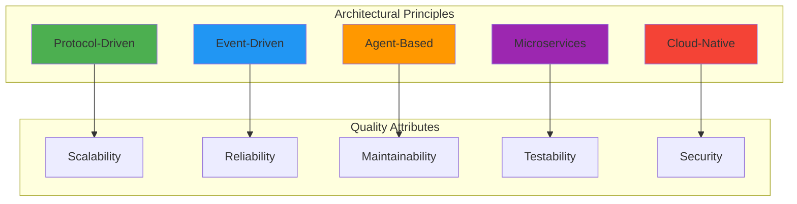
```mermaid
graph TB
    subgraph "Architectural Principles"
        A[Protocol-Driven]
        B[Event-Driven]
        C[Agent-Based]
        D[Microservices]
        E[Cloud-Native]
    end
    
    subgraph "Quality Attributes"
        F[Scalability]
        G[Reliability]
        H[Maintainability]
        I[Testability]
        J[Security]
    end
    
    A --> F
    B --> G
    C --> H
    D --> I
    E --> J
    
    style A fill:#4CAF50
    style B fill:#2196F3
    style C fill:#FF9800
    style D fill:#9C27B0
    style E fill:#F44336
```

### 1.2 Architecture Styles

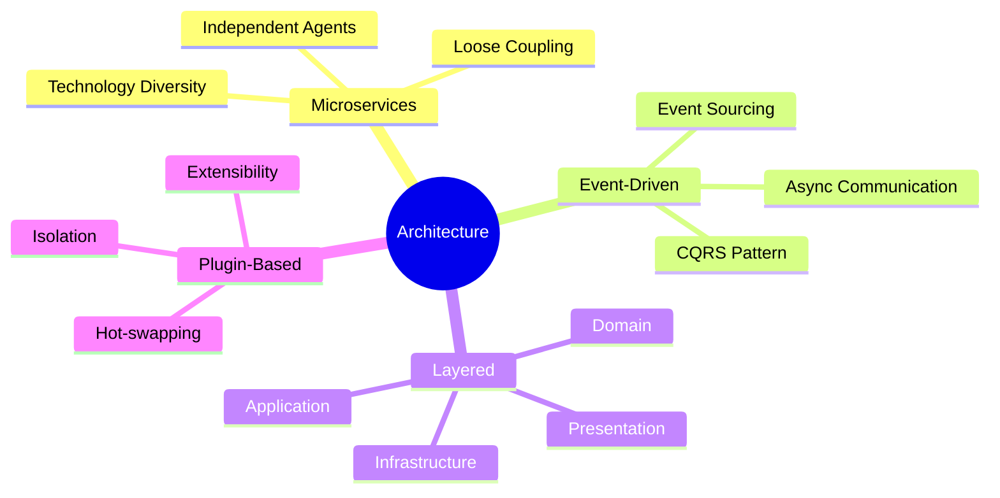
```mermaid
mindmap
  root((Architecture))
    Microservices
      Independent Agents
      Loose Coupling
      Technology Diversity
    Event-Driven
      Async Communication
      Event Sourcing
      CQRS Pattern
    Layered
      Presentation
      Application
      Domain
      Infrastructure
    Plugin-Based
      Extensibility
      Hot-swapping
      Isolation
```

---

## 2. System Context

### 2.1 Context Diagram

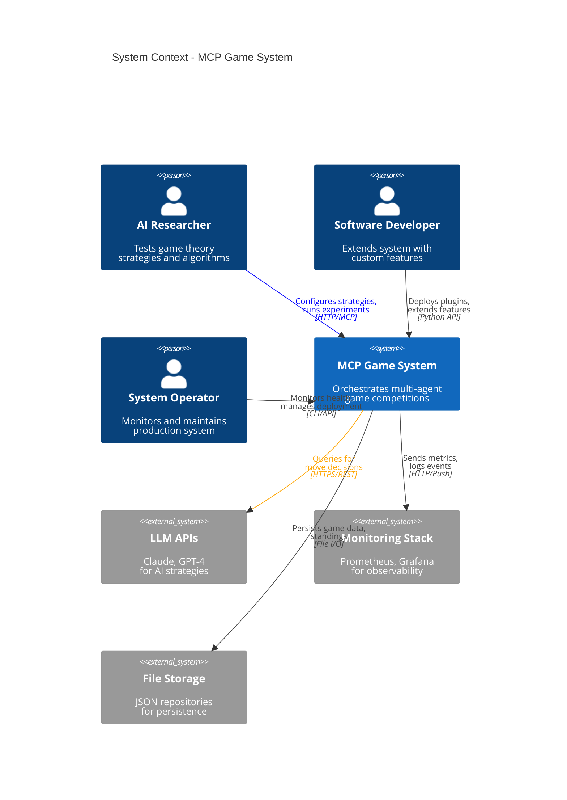
```mermaid
C4Context
    title System Context - MCP Game System
    
    Person(researcher, "AI Researcher", "Tests game theory<br/>strategies and algorithms")
    Person(developer, "Software Developer", "Extends system with<br/>custom features")
    Person(operator, "System Operator", "Monitors and maintains<br/>production system")
    
    System(mcp_system, "MCP Game System", "Orchestrates multi-agent<br/>game competitions")
    
    System_Ext(llm_api, "LLM APIs", "Claude, GPT-4<br/>for AI strategies")
    System_Ext(monitoring, "Monitoring Stack", "Prometheus, Grafana<br/>for observability")
    System_Ext(storage, "File Storage", "JSON repositories<br/>for persistence")
    
    Rel(researcher, mcp_system, "Configures strategies,<br/>runs experiments", "HTTP/MCP")
    Rel(developer, mcp_system, "Deploys plugins,<br/>extends features", "Python API")
    Rel(operator, mcp_system, "Monitors health,<br/>manages deployment", "CLI/API")
    
    Rel(mcp_system, llm_api, "Queries for<br/>move decisions", "HTTPS/REST")
    Rel(mcp_system, monitoring, "Sends metrics,<br/>logs events", "HTTP/Push")
    Rel(mcp_system, storage, "Persists game data,<br/>standings", "File I/O")
    
    UpdateRelStyle(researcher, mcp_system, $textColor="blue", $lineColor="blue")
    UpdateRelStyle(mcp_system, llm_api, $textColor="orange", $lineColor="orange")
```

### 2.2 External Actors

| Actor | Responsibilities | Interactions |
|-------|-----------------|--------------|
| **AI Researcher** | Configure strategies, run experiments, analyze results | CLI, Configuration Files |
| **Software Developer** | Extend system, develop plugins, contribute code | Python API, Git |
| **System Operator** | Deploy system, monitor health, manage infrastructure | Docker, Scripts, Monitoring |
| **LLM APIs** | Provide AI-powered strategy decisions | REST API calls |
| **Monitoring Tools** | Collect metrics, visualize system health | Metrics endpoints |

---

## 3. Container Architecture

### 3.1 Container Diagram

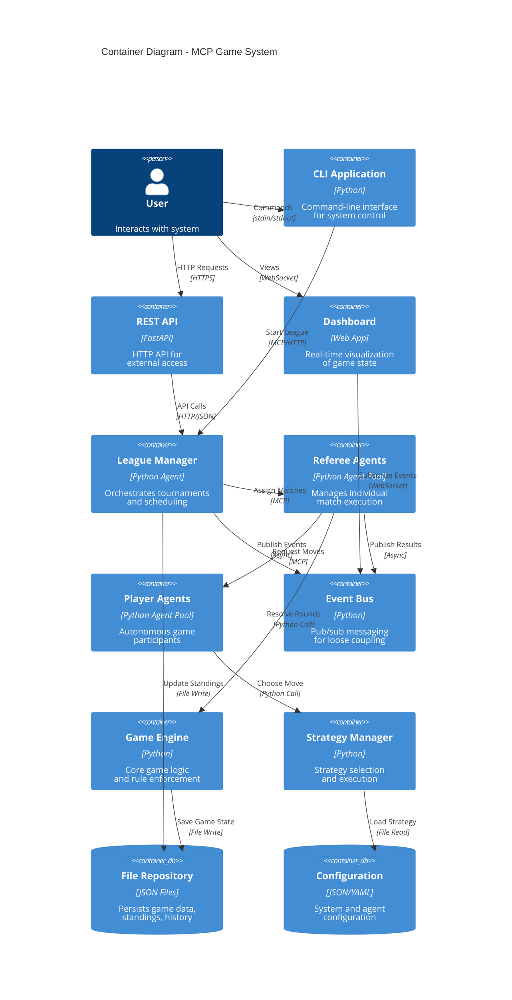
```mermaid
C4Container
    title Container Diagram - MCP Game System
    
    Person(user, "User", "Interacts with system")
    
    Container(cli, "CLI Application", "Python", "Command-line interface<br/>for system control")
    Container(api, "REST API", "FastAPI", "HTTP API for<br/>external access")
    Container(dashboard, "Dashboard", "Web App", "Real-time visualization<br/>of game state")
    
    Container(league_mgr, "League Manager", "Python Agent", "Orchestrates tournaments<br/>and scheduling")
    Container(referee, "Referee Agents", "Python Agent Pool", "Manages individual<br/>match execution")
    Container(player, "Player Agents", "Python Agent Pool", "Autonomous game<br/>participants")
    
    Container(event_bus, "Event Bus", "Python", "Pub/sub messaging<br/>for loose coupling")
    Container(game_engine, "Game Engine", "Python", "Core game logic<br/>and rule enforcement")
    Container(strategy_mgr, "Strategy Manager", "Python", "Strategy selection<br/>and execution")
    
    ContainerDb(file_store, "File Repository", "JSON Files", "Persists game data,<br/>standings, history")
    ContainerDb(config_store, "Configuration", "JSON/YAML", "System and agent<br/>configuration")
    
    Rel(user, cli, "Commands", "stdin/stdout")
    Rel(user, api, "HTTP Requests", "HTTPS")
    Rel(user, dashboard, "Views", "WebSocket")
    
    Rel(cli, league_mgr, "Start League", "MCP/HTTP")
    Rel(api, league_mgr, "API Calls", "HTTP/JSON")
    Rel(dashboard, event_bus, "Subscribe Events", "WebSocket")
    
    Rel(league_mgr, referee, "Assign Matches", "MCP")
    Rel(league_mgr, event_bus, "Publish Events", "Async")
    
    Rel(referee, player, "Request Moves", "MCP")
    Rel(referee, game_engine, "Resolve Rounds", "Python Call")
    Rel(referee, event_bus, "Publish Results", "Async")
    
    Rel(player, strategy_mgr, "Choose Move", "Python Call")
    Rel(strategy_mgr, config_store, "Load Strategy", "File Read")
    
    Rel(game_engine, file_store, "Save Game State", "File Write")
    Rel(league_mgr, file_store, "Update Standings", "File Write")
    
    UpdateLayoutConfig($c4ShapeInRow="4", $c4BoundaryInRow="2")
```

### 3.2 Container Responsibilities

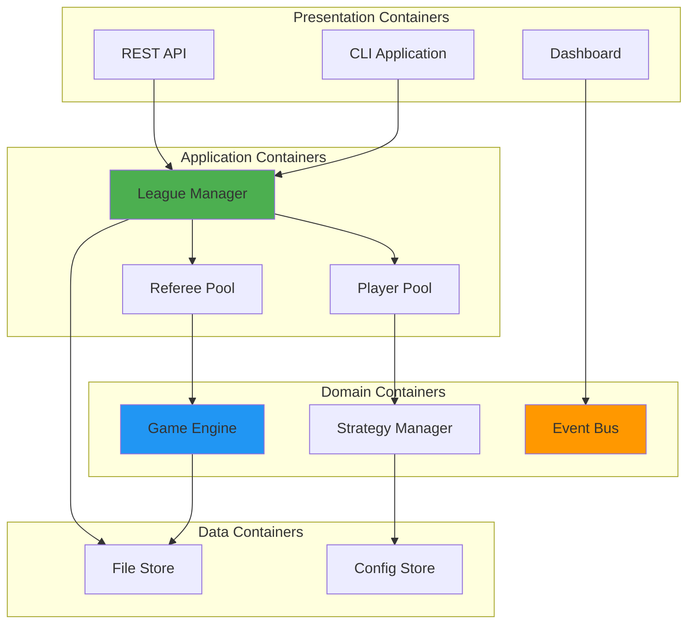
```mermaid
graph TB
    subgraph "Presentation Containers"
        CLI[CLI Application]
        API[REST API]
        DASH[Dashboard]
    end
    
    subgraph "Application Containers"
        LM[League Manager]
        REF[Referee Pool]
        PLY[Player Pool]
    end
    
    subgraph "Domain Containers"
        GE[Game Engine]
        SM[Strategy Manager]
        EB[Event Bus]
    end
    
    subgraph "Data Containers"
        FS[File Store]
        CS[Config Store]
    end
    
    CLI --> LM
    API --> LM
    DASH --> EB
    
    LM --> REF
    LM --> PLY
    
    REF --> GE
    PLY --> SM
    
    GE --> FS
    SM --> CS
    LM --> FS
    
    style LM fill:#4CAF50
    style GE fill:#2196F3
    style EB fill:#FF9800
```

---

## 4. Component Architecture

### 4.1 Component Diagram

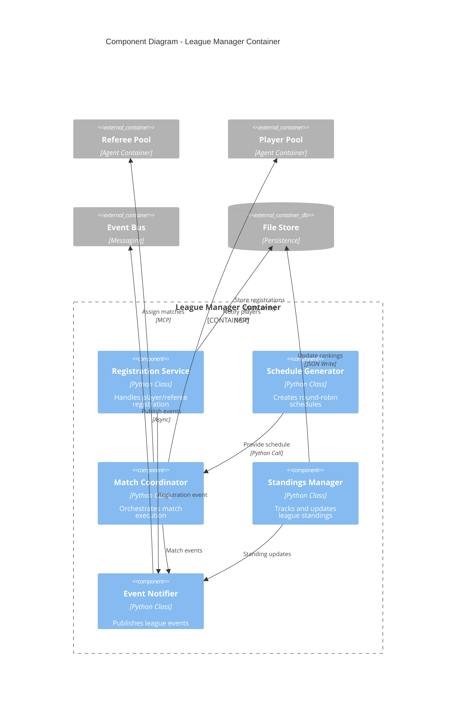
```mermaid
C4Component
    title Component Diagram - League Manager Container
    
    Container_Boundary(league_boundary, "League Manager Container") {
        Component(registration, "Registration Service", "Python Class", "Handles player/referee<br/>registration")
        Component(scheduler, "Schedule Generator", "Python Class", "Creates round-robin<br/>schedules")
        Component(coordinator, "Match Coordinator", "Python Class", "Orchestrates match<br/>execution")
        Component(standings, "Standings Manager", "Python Class", "Tracks and updates<br/>league standings")
        Component(notifier, "Event Notifier", "Python Class", "Publishes league events")
    }
    
    Container_Ext(referee, "Referee Pool", "Agent Container")
    Container_Ext(player, "Player Pool", "Agent Container")
    Container_Ext(event_bus, "Event Bus", "Messaging")
    ContainerDb_Ext(file_store, "File Store", "Persistence")
    
    Rel(registration, file_store, "Store registrations", "JSON Write")
    Rel(scheduler, coordinator, "Provide schedule", "Python Call")
    Rel(coordinator, referee, "Assign matches", "MCP")
    Rel(coordinator, player, "Notify players", "MCP")
    Rel(standings, file_store, "Update rankings", "JSON Write")
    Rel(notifier, event_bus, "Publish events", "Async")
    
    Rel(registration, notifier, "Registration event")
    Rel(coordinator, notifier, "Match events")
    Rel(standings, notifier, "Standing updates")
```

### 4.2 Agent Component Structure

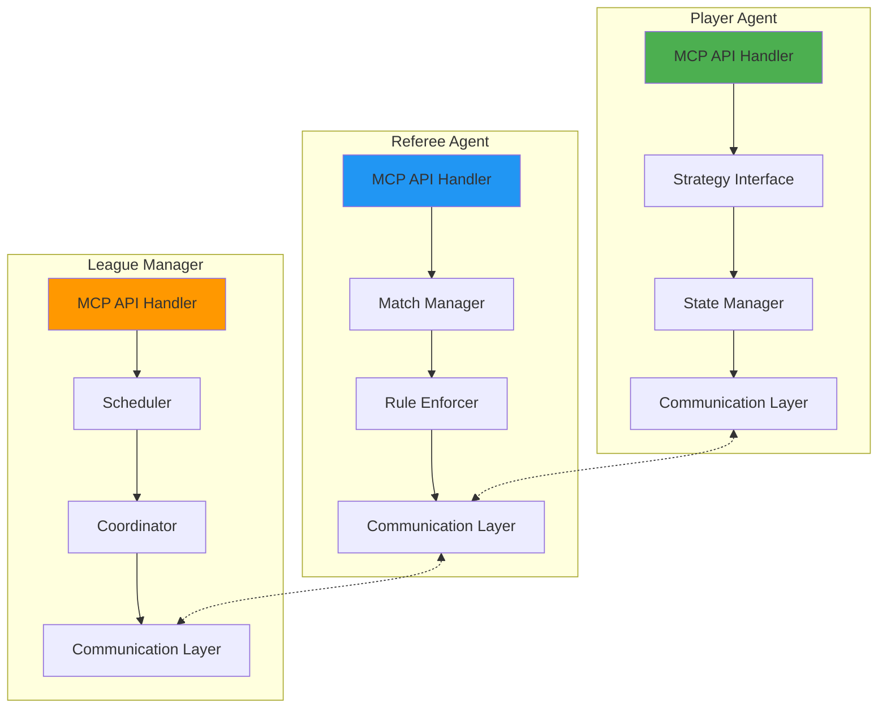
```mermaid
graph TB
    subgraph "Player Agent"
        PA_API[MCP API Handler]
        PA_STRAT[Strategy Interface]
        PA_STATE[State Manager]
        PA_COMM[Communication Layer]
    end
    
    subgraph "Referee Agent"
        RA_API[MCP API Handler]
        RA_MATCH[Match Manager]
        RA_RULES[Rule Enforcer]
        RA_COMM[Communication Layer]
    end
    
    subgraph "League Manager"
        LM_API[MCP API Handler]
        LM_SCHED[Scheduler]
        LM_COORD[Coordinator]
        LM_COMM[Communication Layer]
    end
    
    PA_API --> PA_STRAT
    PA_STRAT --> PA_STATE
    PA_STATE --> PA_COMM
    
    RA_API --> RA_MATCH
    RA_MATCH --> RA_RULES
    RA_RULES --> RA_COMM
    
    LM_API --> LM_SCHED
    LM_SCHED --> LM_COORD
    LM_COORD --> LM_COMM
    
    PA_COMM <-.-> RA_COMM
    RA_COMM <-.-> LM_COMM
    
    style PA_API fill:#4CAF50
    style RA_API fill:#2196F3
    style LM_API fill:#FF9800
```

### 4.3 Class Diagram - Core Components

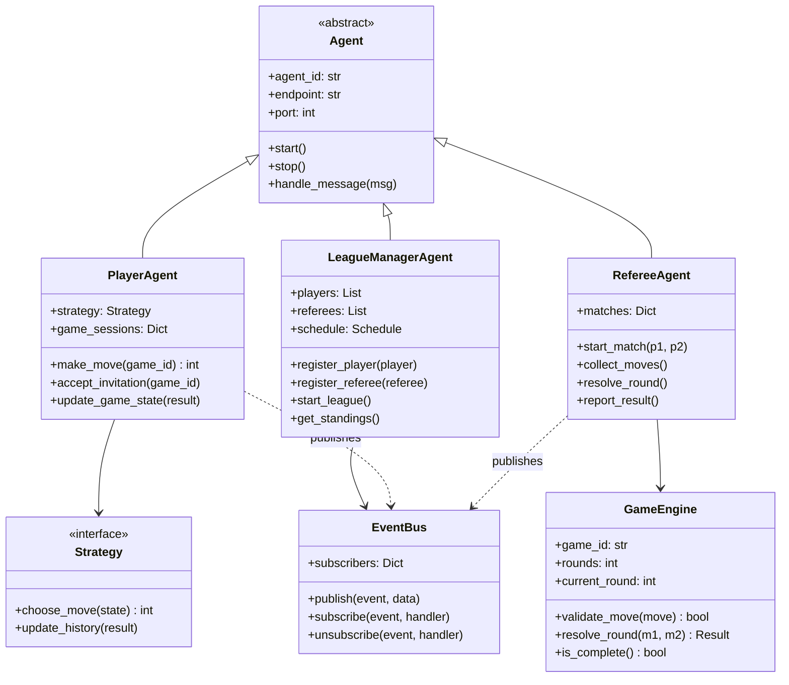
```mermaid
classDiagram
    class Agent {
        <<abstract>>
        +agent_id: str
        +endpoint: str
        +port: int
        +start()
        +stop()
        +handle_message(msg)
    }
    
    class PlayerAgent {
        +strategy: Strategy
        +game_sessions: Dict
        +make_move(game_id) int
        +accept_invitation(game_id)
        +update_game_state(result)
    }
    
    class RefereeAgent {
        +matches: Dict
        +start_match(p1, p2)
        +collect_moves()
        +resolve_round()
        +report_result()
    }
    
    class LeagueManagerAgent {
        +players: List
        +referees: List
        +schedule: Schedule
        +register_player(player)
        +register_referee(referee)
        +start_league()
        +get_standings()
    }
    
    class GameEngine {
        +game_id: str
        +rounds: int
        +current_round: int
        +validate_move(move) bool
        +resolve_round(m1, m2) Result
        +is_complete() bool
    }
    
    class Strategy {
        <<interface>>
        +choose_move(state) int
        +update_history(result)
    }
    
    class EventBus {
        +subscribers: Dict
        +publish(event, data)
        +subscribe(event, handler)
        +unsubscribe(event, handler)
    }
    
    Agent <|-- PlayerAgent
    Agent <|-- RefereeAgent
    Agent <|-- LeagueManagerAgent
    
    PlayerAgent --> Strategy
    RefereeAgent --> GameEngine
    LeagueManagerAgent --> EventBus
    
    PlayerAgent ..> EventBus : publishes
    RefereeAgent ..> EventBus : publishes
```

---

## 5. Deployment Architecture

### 5.1 Development Deployment

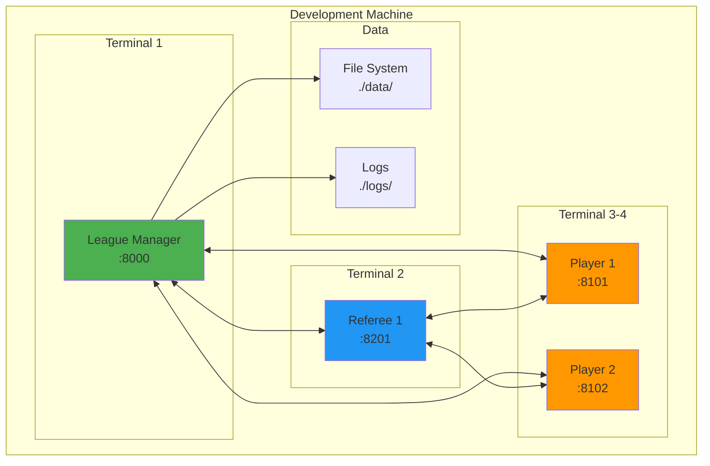
```mermaid
graph TB
    subgraph "Development Machine"
        subgraph "Terminal 1"
            LM[League Manager<br/>:8000]
        end
        
        subgraph "Terminal 2"
            REF1[Referee 1<br/>:8201]
        end
        
        subgraph "Terminal 3-4"
            PLY1[Player 1<br/>:8101]
            PLY2[Player 2<br/>:8102]
        end
        
        subgraph "Data"
            FS[File System<br/>./data/]
            LOGS[Logs<br/>./logs/]
        end
    end
    
    LM <--> REF1
    LM <--> PLY1
    LM <--> PLY2
    REF1 <--> PLY1
    REF1 <--> PLY2
    
    LM --> FS
    LM --> LOGS
    
    style LM fill:#4CAF50
    style REF1 fill:#2196F3
    style PLY1 fill:#FF9800
    style PLY2 fill:#FF9800
```

### 5.2 Docker Deployment

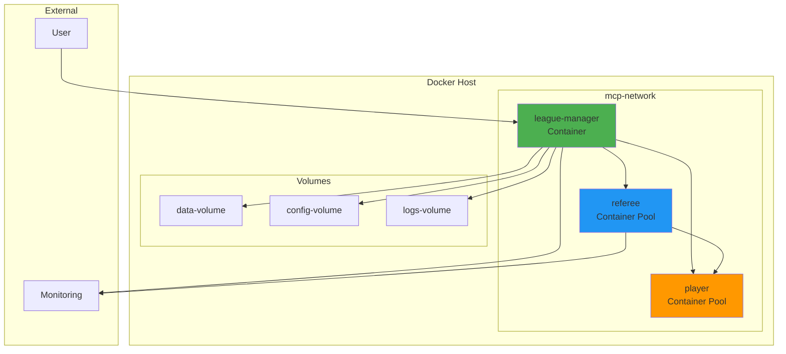
```mermaid
graph TB
    subgraph "Docker Host"
        subgraph "mcp-network"
            LM_C[league-manager<br/>Container]
            REF_C[referee<br/>Container Pool]
            PLY_C[player<br/>Container Pool]
        end
        
        subgraph "Volumes"
            DATA_V[data-volume]
            CONFIG_V[config-volume]
            LOGS_V[logs-volume]
        end
    end
    
    subgraph "External"
        USER[User]
        MON[Monitoring]
    end
    
    USER --> LM_C
    LM_C --> REF_C
    LM_C --> PLY_C
    REF_C --> PLY_C
    
    LM_C --> DATA_V
    LM_C --> CONFIG_V
    LM_C --> LOGS_V
    
    LM_C --> MON
    REF_C --> MON
    
    style LM_C fill:#4CAF50
    style REF_C fill:#2196F3
    style PLY_C fill:#FF9800
```

### 5.3 Production Deployment

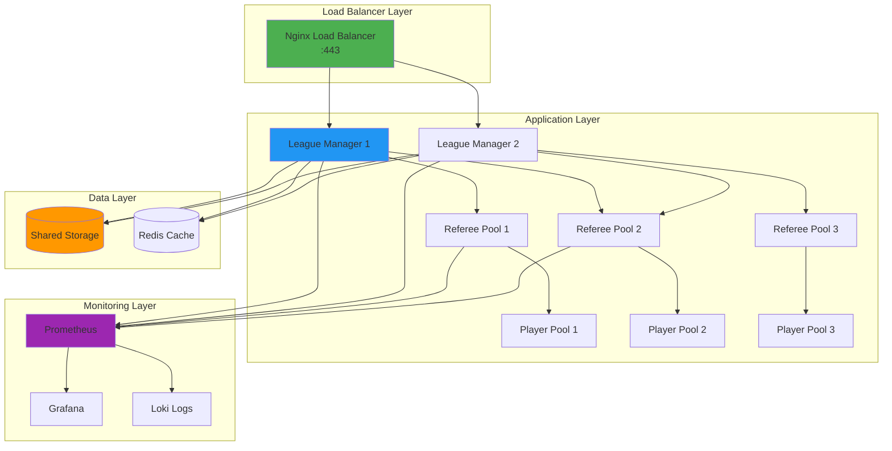
```mermaid
graph TB
    subgraph "Load Balancer Layer"
        LB[Nginx Load Balancer<br/>:443]
    end
    
    subgraph "Application Layer"
        LM1[League Manager 1]
        LM2[League Manager 2]
        
        REF1[Referee Pool 1]
        REF2[Referee Pool 2]
        REF3[Referee Pool 3]
        
        PLY1[Player Pool 1]
        PLY2[Player Pool 2]
        PLY3[Player Pool 3]
    end
    
    subgraph "Data Layer"
        DB[(Shared Storage)]
        CACHE[(Redis Cache)]
    end
    
    subgraph "Monitoring Layer"
        PROM[Prometheus]
        GRAF[Grafana]
        LOKI[Loki Logs]
    end
    
    LB --> LM1
    LB --> LM2
    
    LM1 --> REF1
    LM1 --> REF2
    LM2 --> REF2
    LM2 --> REF3
    
    REF1 --> PLY1
    REF2 --> PLY2
    REF3 --> PLY3
    
    LM1 --> DB
    LM2 --> DB
    LM1 --> CACHE
    LM2 --> CACHE
    
    LM1 --> PROM
    LM2 --> PROM
    REF1 --> PROM
    REF2 --> PROM
    
    PROM --> GRAF
    PROM --> LOKI
    
    style LB fill:#4CAF50
    style LM1 fill:#2196F3
    style DB fill:#FF9800
    style PROM fill:#9C27B0
```

### 5.4 Cloud Deployment (Kubernetes)

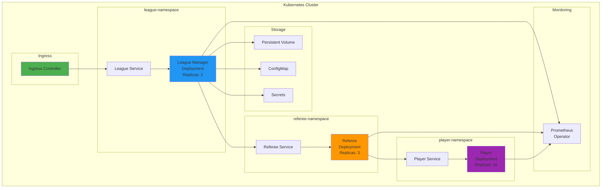
```mermaid
graph TB
    subgraph "Kubernetes Cluster"
        subgraph "Ingress"
            ING[Ingress Controller]
        end
        
        subgraph "league-namespace"
            LM_POD[League Manager<br/>Deployment<br/>Replicas: 2]
            LM_SVC[League Service]
        end
        
        subgraph "referee-namespace"
            REF_POD[Referee<br/>Deployment<br/>Replicas: 3]
            REF_SVC[Referee Service]
        end
        
        subgraph "player-namespace"
            PLY_POD[Player<br/>Deployment<br/>Replicas: 10]
            PLY_SVC[Player Service]
        end
        
        subgraph "Storage"
            PV[Persistent Volume]
            CM[ConfigMap]
            SEC[Secrets]
        end
        
        subgraph "Monitoring"
            PROM_OP[Prometheus<br/>Operator]
        end
    end
    
    ING --> LM_SVC
    LM_SVC --> LM_POD
    LM_POD --> REF_SVC
    REF_SVC --> REF_POD
    REF_POD --> PLY_SVC
    PLY_SVC --> PLY_POD
    
    LM_POD --> PV
    LM_POD --> CM
    LM_POD --> SEC
    
    LM_POD --> PROM_OP
    REF_POD --> PROM_OP
    PLY_POD --> PROM_OP
    
    style ING fill:#4CAF50
    style LM_POD fill:#2196F3
    style REF_POD fill:#FF9800
    style PLY_POD fill:#9C27B0
```

---

## 6. Data Architecture

### 6.1 Data Flow Diagram

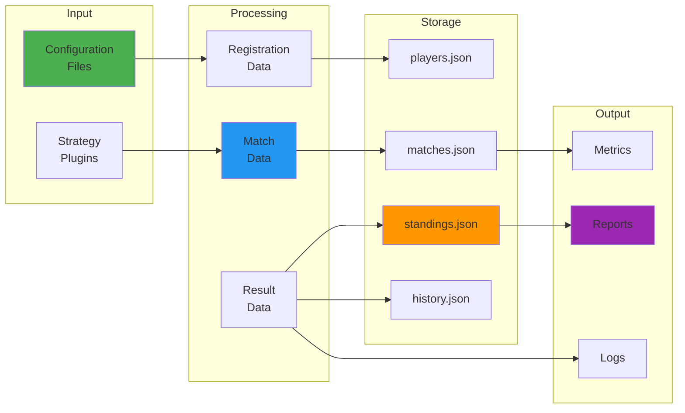
```mermaid
flowchart LR
    subgraph "Input"
        CONFIG[Configuration<br/>Files]
        STRAT[Strategy<br/>Plugins]
    end
    
    subgraph "Processing"
        REG[Registration<br/>Data]
        MATCH[Match<br/>Data]
        RESULT[Result<br/>Data]
    end
    
    subgraph "Storage"
        PLAYERS[players.json]
        MATCHES[matches.json]
        STANDINGS[standings.json]
        HISTORY[history.json]
    end
    
    subgraph "Output"
        REPORT[Reports]
        METRICS[Metrics]
        LOGS[Logs]
    end
    
    CONFIG --> REG
    STRAT --> MATCH
    
    REG --> PLAYERS
    MATCH --> MATCHES
    RESULT --> STANDINGS
    RESULT --> HISTORY
    
    STANDINGS --> REPORT
    MATCHES --> METRICS
    RESULT --> LOGS
    
    style CONFIG fill:#4CAF50
    style MATCH fill:#2196F3
    style STANDINGS fill:#FF9800
    style REPORT fill:#9C27B0
```

### 6.2 Data Model

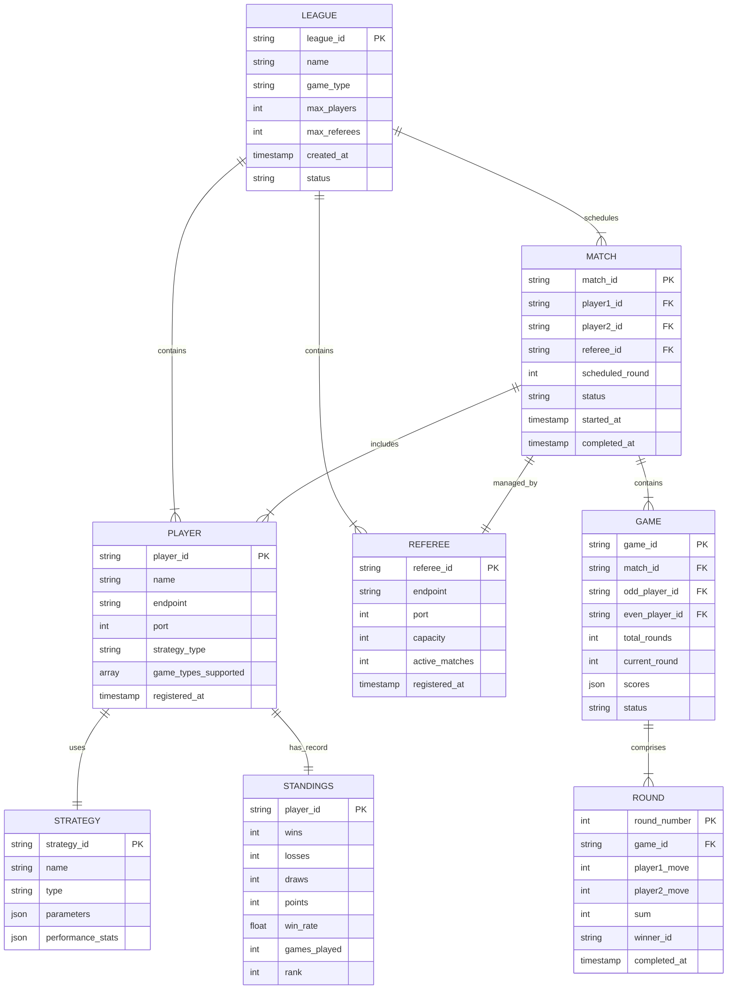
```mermaid
erDiagram
    LEAGUE ||--|{ PLAYER : contains
    LEAGUE ||--|{ REFEREE : contains
    LEAGUE ||--|{ MATCH : schedules
    MATCH ||--|| REFEREE : managed_by
    MATCH ||--|{ PLAYER : includes
    MATCH ||--|{ GAME : contains
    GAME ||--|{ ROUND : comprises
    PLAYER ||--|| STRATEGY : uses
    PLAYER ||--|| STANDINGS : has_record
    
    LEAGUE {
        string league_id PK
        string name
        string game_type
        int max_players
        int max_referees
        timestamp created_at
        string status
    }
    
    PLAYER {
        string player_id PK
        string name
        string endpoint
        int port
        string strategy_type
        array game_types_supported
        timestamp registered_at
    }
    
    REFEREE {
        string referee_id PK
        string endpoint
        int port
        int capacity
        int active_matches
        timestamp registered_at
    }
    
    MATCH {
        string match_id PK
        string player1_id FK
        string player2_id FK
        string referee_id FK
        int scheduled_round
        string status
        timestamp started_at
        timestamp completed_at
    }
    
    GAME {
        string game_id PK
        string match_id FK
        string odd_player_id FK
        string even_player_id FK
        int total_rounds
        int current_round
        json scores
        string status
    }
    
    ROUND {
        int round_number PK
        string game_id FK
        int player1_move
        int player2_move
        int sum
        string winner_id
        timestamp completed_at
    }
    
    STRATEGY {
        string strategy_id PK
        string name
        string type
        json parameters
        json performance_stats
    }
    
    STANDINGS {
        string player_id PK
        int wins
        int losses
        int draws
        int points
        float win_rate
        int games_played
        int rank
    }
```

### 6.3 File Structure

```
data/
├── leagues/
│   └── league_2025_even_odd/
│       ├── config.json          # League configuration
│       ├── standings.json       # Current standings
│       └── schedule.json        # Match schedule
│
├── players/
│   ├── P01/
│   │   ├── profile.json        # Player profile
│   │   ├── history.json        # Game history
│   │   └── stats.json          # Performance stats
│   └── P02/
│       └── ...
│
└── matches/
    └── league_2025_even_odd/
        ├── round_01/
        │   ├── match_001.json  # Match data
        │   └── match_002.json
        └── round_02/
            └── ...
```

---

## 7. Communication Patterns

### 7.1 MCP Protocol Flow

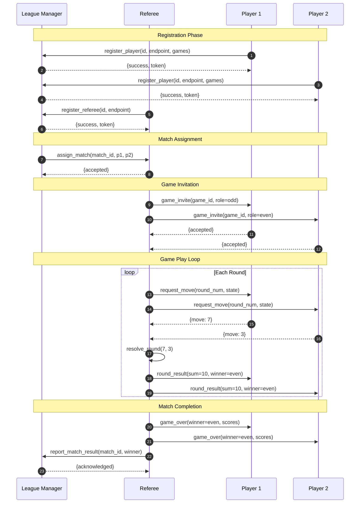
```mermaid
sequenceDiagram
    autonumber
    participant LM as League Manager
    participant R as Referee
    participant P1 as Player 1
    participant P2 as Player 2
    
    Note over LM,P2: Registration Phase
    P1->>LM: register_player(id, endpoint, games)
    LM-->>P1: {success, token}
    P2->>LM: register_player(id, endpoint, games)
    LM-->>P2: {success, token}
    R->>LM: register_referee(id, endpoint)
    LM-->>R: {success, token}
    
    Note over LM,P2: Match Assignment
    LM->>R: assign_match(match_id, p1, p2)
    R-->>LM: {accepted}
    
    Note over LM,P2: Game Invitation
    R->>P1: game_invite(game_id, role=odd)
    R->>P2: game_invite(game_id, role=even)
    P1-->>R: {accepted}
    P2-->>R: {accepted}
    
    Note over LM,P2: Game Play Loop
    loop Each Round
        R->>P1: request_move(round_num, state)
        R->>P2: request_move(round_num, state)
        P1-->>R: {move: 7}
        P2-->>R: {move: 3}
        R->>R: resolve_round(7, 3)
        R->>P1: round_result(sum=10, winner=even)
        R->>P2: round_result(sum=10, winner=even)
    end
    
    Note over LM,P2: Match Completion
    R->>P1: game_over(winner=even, scores)
    R->>P2: game_over(winner=even, scores)
    R->>LM: report_match_result(match_id, winner)
    LM-->>R: {acknowledged}
```

### 7.2 Event-Driven Architecture

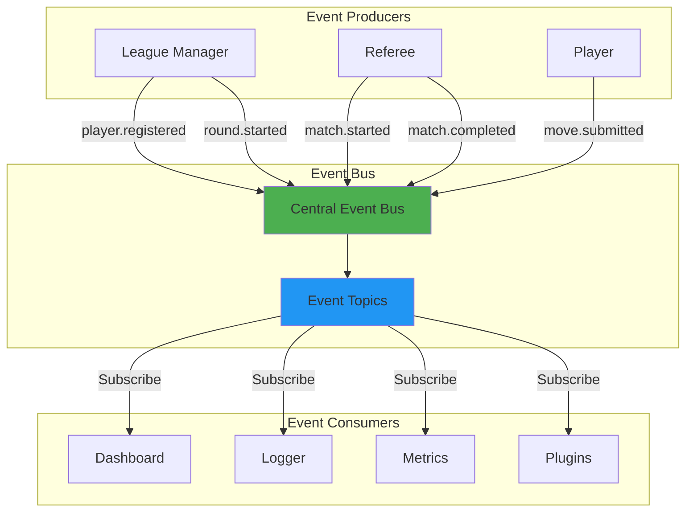
```mermaid
graph TB
    subgraph "Event Producers"
        LM[League Manager]
        REF[Referee]
        PLY[Player]
    end
    
    subgraph "Event Bus"
        EB[Central Event Bus]
        TOPICS[Event Topics]
    end
    
    subgraph "Event Consumers"
        DASH[Dashboard]
        LOGGER[Logger]
        METRICS[Metrics]
        PLUGIN[Plugins]
    end
    
    LM -->|player.registered| EB
    LM -->|round.started| EB
    REF -->|match.started| EB
    REF -->|match.completed| EB
    PLY -->|move.submitted| EB
    
    EB --> TOPICS
    
    TOPICS -->|Subscribe| DASH
    TOPICS -->|Subscribe| LOGGER
    TOPICS -->|Subscribe| METRICS
    TOPICS -->|Subscribe| PLUGIN
    
    style EB fill:#4CAF50
    style TOPICS fill:#2196F3
```

### 7.3 Request-Response Pattern

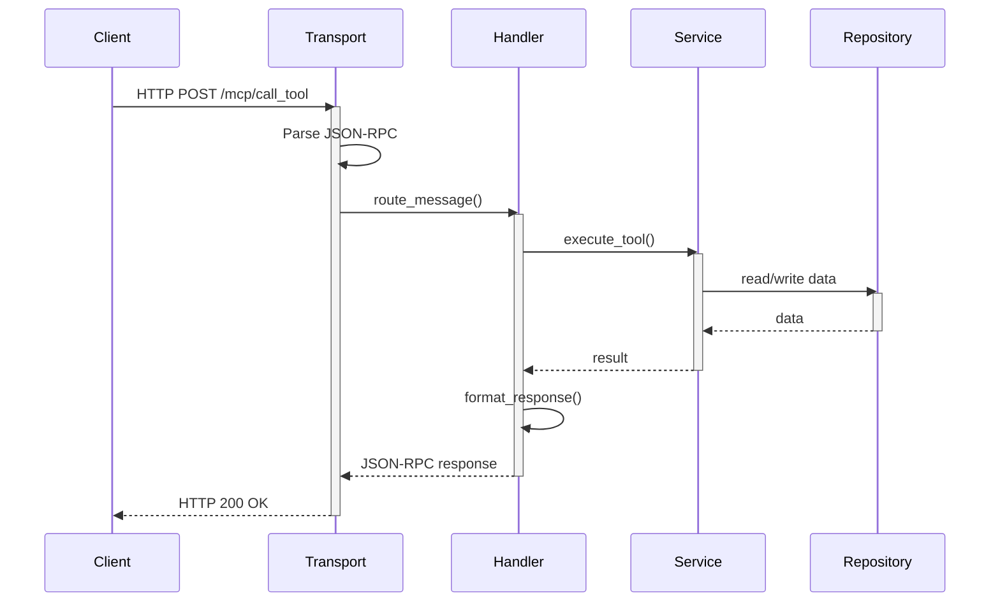
```mermaid
sequenceDiagram
    participant Client
    participant Transport
    participant Handler
    participant Service
    participant Repository
    
    Client->>Transport: HTTP POST /mcp/call_tool
    activate Transport
    Transport->>Transport: Parse JSON-RPC
    Transport->>Handler: route_message()
    activate Handler
    Handler->>Service: execute_tool()
    activate Service
    Service->>Repository: read/write data
    activate Repository
    Repository-->>Service: data
    deactivate Repository
    Service-->>Handler: result
    deactivate Service
    Handler->>Handler: format_response()
    Handler-->>Transport: JSON-RPC response
    deactivate Handler
    Transport-->>Client: HTTP 200 OK
    deactivate Transport
```

### 7.4 Pub/Sub Pattern

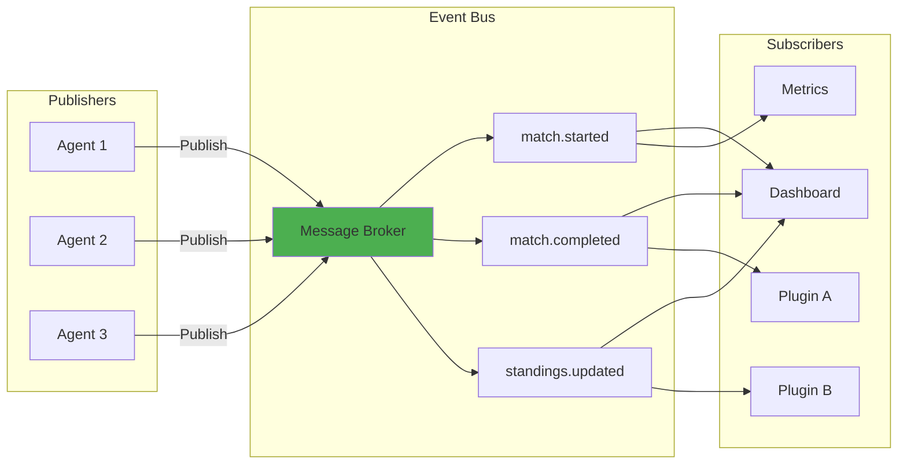
```mermaid
graph LR
    subgraph "Publishers"
        P1[Agent 1]
        P2[Agent 2]
        P3[Agent 3]
    end
    
    subgraph "Event Bus"
        BROKER[Message Broker]
        T1[match.started]
        T2[match.completed]
        T3[standings.updated]
    end
    
    subgraph "Subscribers"
        S1[Dashboard]
        S2[Metrics]
        S3[Plugin A]
        S4[Plugin B]
    end
    
    P1 -->|Publish| BROKER
    P2 -->|Publish| BROKER
    P3 -->|Publish| BROKER
    
    BROKER --> T1
    BROKER --> T2
    BROKER --> T3
    
    T1 --> S1
    T1 --> S2
    T2 --> S1
    T2 --> S3
    T3 --> S1
    T3 --> S4
    
    style BROKER fill:#4CAF50
```

---

## 8. Security Architecture

### 8.1 Security Layers

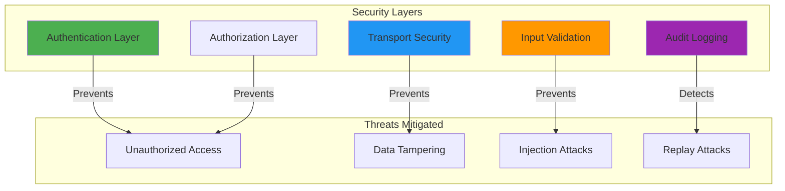
```mermaid
graph TB
    subgraph "Security Layers"
        A[Authentication Layer]
        B[Authorization Layer]
        C[Transport Security]
        D[Input Validation]
        E[Audit Logging]
    end
    
    subgraph "Threats Mitigated"
        T1[Unauthorized Access]
        T2[Data Tampering]
        T3[Injection Attacks]
        T4[Replay Attacks]
    end
    
    A -->|Prevents| T1
    B -->|Prevents| T1
    C -->|Prevents| T2
    D -->|Prevents| T3
    E -->|Detects| T4
    
    style A fill:#4CAF50
    style C fill:#2196F3
    style D fill:#FF9800
    style E fill:#9C27B0
```

### 8.2 Authentication Flow

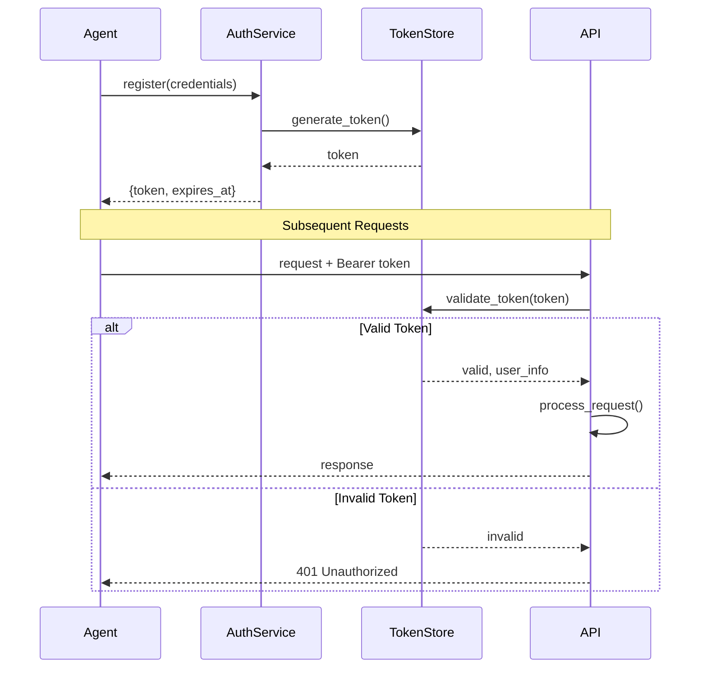
```mermaid
sequenceDiagram
    participant Agent
    participant AuthService
    participant TokenStore
    participant API
    
    Agent->>AuthService: register(credentials)
    AuthService->>TokenStore: generate_token()
    TokenStore-->>AuthService: token
    AuthService-->>Agent: {token, expires_at}
    
    Note over Agent,API: Subsequent Requests
    
    Agent->>API: request + Bearer token
    API->>TokenStore: validate_token(token)
    
    alt Valid Token
        TokenStore-->>API: valid, user_info
        API->>API: process_request()
        API-->>Agent: response
    else Invalid Token
        TokenStore-->>API: invalid
        API-->>Agent: 401 Unauthorized
    end
```

### 8.3 Security Controls

```mermaid
graph TB
    subgraph "Input Controls"
        IV[Input Validation]
        SR[Sanitization]
        TR[Type Checking]
    end
    
    subgraph "Access Controls"
        AUTH[Authentication]
        AUTHZ[Authorization]
        RL[Rate Limiting]
    end
    
    subgraph "Data Controls"
        ENC[Encryption at Rest]
        TLS[TLS in Transit]
        SIGN[Message Signing]
    end
    
    subgraph "Monitoring Controls"
        AUDIT[Audit Logging]
        ALERT[Intrusion Detection]
        MON[Security Monitoring]
    end
    
    IV --> AUTH
    AUTH --> ENC
    ENC --> AUDIT
    
    style AUTH fill:#4CAF50
    style ENC fill:#2196F3
    style AUDIT fill:#FF9800
```

---

## 9. Scalability & Performance

### 9.1 Scaling Strategy

```mermaid
graph LR
    subgraph "Horizontal Scaling"
        A[Add More Agents]
        B[Load Balancing]
        C[Stateless Design]
    end
    
    subgraph "Vertical Scaling"
        D[Increase CPU]
        E[Increase Memory]
        F[Optimize Code]
    end
    
    subgraph "Caching"
        G[In-Memory Cache]
        H[Redis Cache]
        I[CDN]
    end
    
    A --> B
    B --> C
    D --> E
    E --> F
    G --> H
    H --> I
    
    style A fill:#4CAF50
    style D fill:#2196F3
    style G fill:#FF9800
```

### 9.2 Performance Optimization

```mermaid
graph TB
    subgraph "Application Level"
        A1[Async I/O]
        A2[Connection Pooling]
        A3[Batch Processing]
    end
    
    subgraph "Data Level"
        D1[Caching]
        D2[Indexing]
        D3[Denormalization]
    end
    
    subgraph "Network Level"
        N1[Compression]
        N2[Keep-Alive]
        N3[HTTP/2]
    end
    
    A1 --> D1
    A2 --> D2
    A3 --> D3
    
    D1 --> N1
    D2 --> N2
    D3 --> N3
    
    style A1 fill:#4CAF50
    style D1 fill:#2196F3
    style N1 fill:#FF9800
```

### 9.3 Load Distribution

```mermaid
graph TB
    CLIENT[Clients] --> LB[Load Balancer]
    
    LB --> LM1[League Mgr 1<br/>Weight: 1.0]
    LB --> LM2[League Mgr 2<br/>Weight: 1.0]
    
    LM1 --> REF1[Referee Pool 1]
    LM1 --> REF2[Referee Pool 2]
    LM2 --> REF2
    LM2 --> REF3[Referee Pool 3]
    
    REF1 --> PLY1[Player Pool 1]
    REF2 --> PLY2[Player Pool 2]
    REF3 --> PLY3[Player Pool 3]
    
    style LB fill:#4CAF50
    style LM1 fill:#2196F3
    style REF1 fill:#FF9800
```

---

## 10. Reliability & Resilience

### 10.1 Failure Handling

```mermaid
graph TB
    A[Request] --> B{Circuit<br/>Open?}
    B -->|Yes| C[Fast Fail]
    B -->|No| D{Try Request}
    
    D -->|Success| E[Return Result]
    D -->|Timeout| F[Increment Failures]
    D -->|Error| F
    
    F --> G{Threshold<br/>Exceeded?}
    G -->|Yes| H[Open Circuit]
    G -->|No| I[Retry with<br/>Backoff]
    
    H --> J[Wait<br/>Half-Open]
    J --> D
    
    I --> D
    
    E --> K[Reset Counter]
    
    style A fill:#4CAF50
    style D fill:#2196F3
    style H fill:#FF9800
    style C fill:#F44336
```

### 10.2 Retry Strategy

```mermaid
sequenceDiagram
    participant Client
    participant Service
    participant External
    
    Client->>Service: Request
    Service->>External: Call (Attempt 1)
    External--xService: Timeout
    
    Note over Service: Wait 1s (exponential backoff)
    
    Service->>External: Call (Attempt 2)
    External--xService: Error
    
    Note over Service: Wait 2s
    
    Service->>External: Call (Attempt 3)
    External-->>Service: Success
    Service-->>Client: Response
```

### 10.3 Health Monitoring

```mermaid
graph TB
    subgraph "Health Checks"
        LIVE[Liveness Probe]
        READY[Readiness Probe]
        STARTUP[Startup Probe]
    end
    
    subgraph "Components"
        APP[Application]
        DB[Database]
        CACHE[Cache]
        EXT[External APIs]
    end
    
    subgraph "Actions"
        RESTART[Restart Container]
        REMOVE[Remove from LB]
        ALERT[Send Alert]
    end
    
    LIVE --> APP
    READY --> DB
    READY --> CACHE
    STARTUP --> EXT
    
    APP -->|Failed| RESTART
    DB -->|Not Ready| REMOVE
    EXT -->|Failed| ALERT
    
    style LIVE fill:#4CAF50
    style READY fill:#2196F3
    style STARTUP fill:#FF9800
```

---

## 11. Monitoring & Observability

### 11.1 Observability Stack

```mermaid
graph TB
    subgraph "Data Collection"
        LOGS[Logs]
        METRICS[Metrics]
        TRACES[Traces]
    end
    
    subgraph "Processing"
        LOKI[Loki]
        PROM[Prometheus]
        JAEGER[Jaeger]
    end
    
    subgraph "Visualization"
        GRAF[Grafana]
        DASH[Custom Dashboards]
    end
    
    subgraph "Alerting"
        ALERT[AlertManager]
        NOTIFY[Notifications]
    end
    
    LOGS --> LOKI
    METRICS --> PROM
    TRACES --> JAEGER
    
    LOKI --> GRAF
    PROM --> GRAF
    JAEGER --> GRAF
    
    GRAF --> DASH
    PROM --> ALERT
    ALERT --> NOTIFY
    
    style LOGS fill:#4CAF50
    style PROM fill:#2196F3
    style GRAF fill:#FF9800
```

### 11.2 Metrics Collection

```mermaid
graph LR
    subgraph "Application Metrics"
        REQ[Request Count]
        LAT[Latency]
        ERR[Error Rate]
    end
    
    subgraph "Business Metrics"
        MATCH[Matches Played]
        PLY[Active Players]
        WIN[Win Rates]
    end
    
    subgraph "System Metrics"
        CPU[CPU Usage]
        MEM[Memory Usage]
        NET[Network I/O]
    end
    
    REQ --> PROM[Prometheus]
    LAT --> PROM
    ERR --> PROM
    MATCH --> PROM
    PLY --> PROM
    WIN --> PROM
    CPU --> PROM
    MEM --> PROM
    NET --> PROM
    
    PROM --> GRAF[Grafana]
    
    style PROM fill:#4CAF50
    style GRAF fill:#2196F3
```

---

## 12. Technology Stack

### 12.1 Technology Choices

```mermaid
mindmap
  root((Tech Stack))
    Backend
      Python 3.11+
      FastAPI
      asyncio
      Pydantic
    Communication
      HTTP/REST
      JSON-RPC 2.0
      WebSocket
      MCP Protocol
    Testing
      PyTest
      pytest-cov
      pytest-asyncio
      Docker Test
    CI/CD
      GitHub Actions
      GitLab CI
      Jenkins
      Docker
    Monitoring
      Prometheus
      Grafana
      structlog
      OpenTelemetry
```

### 12.2 Architecture Patterns

| Pattern | Usage | Benefit |
|---------|-------|---------|
| **Microservices** | Agent architecture | Independent scaling, isolation |
| **Event-Driven** | Async communication | Loose coupling, scalability |
| **Repository** | Data access | Abstraction, testability |
| **Strategy** | Game strategies | Extensibility, flexibility |
| **Factory** | Agent creation | Consistency, configurability |
| **Observer** | Event handling | Decoupling, extensibility |
| **Circuit Breaker** | Failure handling | Resilience, fast-fail |
| **Retry** | Error recovery | Reliability, fault-tolerance |

---

## Appendices

### Appendix A: Glossary

| Term | Definition |
|------|------------|
| **Agent** | Autonomous software component with goals and capabilities |
| **MCP** | Model Context Protocol for AI agent communication |
| **Round-Robin** | Tournament format where each plays all others |
| **Strategy** | Algorithm for game decision-making |
| **Circuit Breaker** | Pattern to prevent cascading failures |

### Appendix B: References

- [C4 Model](https://c4model.com/)
- [MCP Specification](https://modelcontextprotocol.io/)
- [Microservices Patterns](https://microservices.io/patterns/)
- [12-Factor App](https://12factor.net/)

---

<div align="center">

**Document Status: ✅ Production Ready**

*This architecture document is maintained alongside the codebase.*

Version 2.0.0 | December 25, 2025

</div>

