# MCP Multi-Agent Game - Communication Flow Diagrams

> Complete visualization of message passing, agent communication, and league completion flow

---

## Table of Contents

1. [System Architecture Overview](#1-system-architecture-overview)
2. [MCP Agent Architecture (Server + Client)](#2-mcp-agent-architecture-server--client)
3. [Complete League Lifecycle Flow](#3-complete-league-lifecycle-flow)
4. [Registration Phase](#4-registration-phase)
5. [Match Execution Flow](#5-match-execution-flow)
6. [Single Round Communication](#6-single-round-communication)
7. [Message Protocol Flow](#7-message-protocol-flow)
8. [League Completion Flow](#8-league-completion-flow)
9. [JSON-RPC Transport Layer](#9-json-rpc-transport-layer)
10. [Agent State Machines](#10-agent-state-machines)

---

## 1. System Architecture Overview

```mermaid
graph TB
    subgraph "MCP Multi-Agent Game System"
        direction TB
        
        subgraph "CLI Layer"
            CLI[🖥️ main.py<br/>Command Line Interface]
        end
        
        subgraph "Agent Layer"
            LM[🏛️ League Manager<br/>Port 8000<br/>Orchestrates League]
            REF[⚖️ Referee Agent<br/>Port 8001<br/>Manages Games]
            
            subgraph "Player Agents"
                P1[🤖 Player 1<br/>Port 8101]
                P2[🤖 Player 2<br/>Port 8102]
                P3[🤖 Player 3<br/>Port 8103]
                PN[🤖 Player N<br/>Port 81XX]
            end
        end
        
        subgraph "Transport Layer"
            HTTP[🌐 HTTP Transport<br/>aiohttp]
            JSONRPC[📄 JSON-RPC 2.0<br/>Message Format]
        end
        
        subgraph "Game Logic Layer"
            MATCH[📅 Match Scheduler<br/>Round-Robin]
            GAME[🎲 Odd/Even Game<br/>Rules Engine]
        end
    end
    
    CLI --> LM
    CLI --> REF
    CLI --> P1
    
    LM <-->|MCP Protocol| REF
    REF <-->|MCP Protocol| P1
    REF <-->|MCP Protocol| P2
    REF <-->|MCP Protocol| P3
    REF <-->|MCP Protocol| PN
    
    LM --> MATCH
    REF --> GAME
    
    LM --> HTTP
    REF --> HTTP
    P1 --> HTTP
    HTTP --> JSONRPC
```

---

## 2. MCP Agent Architecture (Server + Client)

> **Key Concept**: Each agent has BOTH an MCP Server (to receive requests) AND an MCP Client (to make outgoing requests)

```mermaid
graph TB
    subgraph "Single Agent Architecture"
        direction TB
        
        AGENT[🤖 Agent<br/>Autonomous Entity]
        
        subgraph "Inbound Communication"
            SERVER[📥 MCP Server<br/>• Listens on dedicated port<br/>• Exposes tools & resources<br/>• Handles incoming JSON-RPC<br/>• HTTP POST /mcp endpoint]
        end
        
        subgraph "Outbound Communication"  
            CLIENT[📤 MCP Client<br/>• Connects to other agents<br/>• Discovers their tools<br/>• Makes tool calls via JSON-RPC<br/>• Connection pool management]
        end
        
        subgraph "Business Logic"
            LOGIC[💼 Agent Logic<br/>• Strategy / Game / Management<br/>• State management<br/>• Decision making]
        end
    end
    
    AGENT --> SERVER
    AGENT --> CLIENT
    AGENT --> LOGIC
    
    SERVER --> LOGIC
    CLIENT --> LOGIC
    
    EXT_CLIENT[External<br/>MCP Clients] -->|"HTTP POST /mcp<br/>JSON-RPC requests"| SERVER
    CLIENT -->|"HTTP POST /mcp<br/>JSON-RPC requests"| EXT_SERVER[External<br/>MCP Servers]
```

### Bidirectional Agent Communication

```mermaid
graph LR
    subgraph "League Manager Agent"
        LM_S[📥 Server<br/>:8000]
        LM_C[📤 Client]
        LM_LOGIC[Logic]
        LM_S -.-> LM_LOGIC
        LM_C -.-> LM_LOGIC
    end
    
    subgraph "Referee Agent"
        REF_S[📥 Server<br/>:8001]
        REF_C[📤 Client]
        REF_LOGIC[Logic]
        REF_S -.-> REF_LOGIC
        REF_C -.-> REF_LOGIC
    end
    
    subgraph "Player 1 Agent"
        P1_S[📥 Server<br/>:8101]
        P1_C[📤 Client]
        P1_LOGIC[Logic]
        P1_S -.-> P1_LOGIC
        P1_C -.-> P1_LOGIC
    end
    
    subgraph "Player 2 Agent"
        P2_S[📥 Server<br/>:8102]
        P2_C[📤 Client]
        P2_LOGIC[Logic]
        P2_S -.-> P2_LOGIC
        P2_C -.-> P2_LOGIC
    end
    
    %% Registration flow
    P1_C -->|"1️⃣ register_player()"| LM_S
    P2_C -->|"1️⃣ register_player()"| LM_S
    LM_S -->|"2️⃣ {token}"| P1_C
    LM_S -->|"2️⃣ {token}"| P2_C
    
    %% Referee assignment
    LM_C -->|"3️⃣ start_match()"| REF_S
    
    %% Game invitations
    REF_C -->|"4️⃣ GAME_INVITE"| P1_S
    REF_C -->|"4️⃣ GAME_INVITE"| P2_S
    
    %% Move submissions
    P1_C -->|"5️⃣ MOVE_RESPONSE"| REF_S
    P2_C -->|"5️⃣ MOVE_RESPONSE"| REF_S
    
    %% Result reporting
    REF_C -->|"6️⃣ report_result()"| LM_S
```

---

## 3. Complete League Lifecycle Flow

```mermaid
sequenceDiagram
    autonumber
    participant CLI as 🖥️ CLI
    participant LM as 🏛️ League Manager<br/>:8000
    participant REF as ⚖️ Referee<br/>:8001
    participant P1 as 🤖 Player 1<br/>:8101
    participant P2 as 🤖 Player 2<br/>:8102
    participant P3 as 🤖 Player 3<br/>:8103
    participant P4 as 🤖 Player 4<br/>:8104
    
    Note over CLI,P4: 🚀 PHASE 1: SYSTEM STARTUP
    
    rect rgb(240, 248, 255)
        CLI->>LM: start(port=8000)
        LM-->>CLI: ✅ MCP Server Running
        
        CLI->>REF: start(port=8001)
        REF-->>CLI: ✅ MCP Server Running
        
        par Start All Players
            CLI->>P1: start(port=8101)
            P1-->>CLI: ✅ Running
        and
            CLI->>P2: start(port=8102)
            P2-->>CLI: ✅ Running
        and
            CLI->>P3: start(port=8103)
            P3-->>CLI: ✅ Running
        and
            CLI->>P4: start(port=8104)
            P4-->>CLI: ✅ Running
        end
    end
    
    Note over CLI,P4: 📝 PHASE 2: REFEREE REGISTRATION
    
    rect rgb(255, 248, 240)
        REF->>LM: REFEREE_REGISTER_REQUEST<br/>{referee_id, endpoint, game_types}
        LM->>LM: Validate & Generate Token
        LM-->>REF: REFEREE_REGISTER_RESPONSE<br/>{status: ACCEPTED, auth_token}
    end
    
    Note over CLI,P4: 📋 PHASE 3: PLAYER REGISTRATION
    
    rect rgb(240, 255, 240)
        par Register All Players
            P1->>LM: PLAYER_REGISTER_REQUEST<br/>{display_name, endpoint}
            LM-->>P1: PLAYER_REGISTER_RESPONSE<br/>{player_id: P01, auth_token}
        and
            P2->>LM: PLAYER_REGISTER_REQUEST
            LM-->>P2: {player_id: P02, auth_token}
        and
            P3->>LM: PLAYER_REGISTER_REQUEST
            LM-->>P3: {player_id: P03, auth_token}
        and
            P4->>LM: PLAYER_REGISTER_REQUEST
            LM-->>P4: {player_id: P04, auth_token}
        end
    end
    
    Note over CLI,P4: 🏁 PHASE 4: LEAGUE START
    
    rect rgb(255, 245, 238)
        CLI->>LM: start_league()
        LM->>LM: Generate Round-Robin Schedule
        Note over LM: Round 1: P1vP2, P3vP4<br/>Round 2: P1vP3, P2vP4<br/>Round 3: P1vP4, P2vP3
        LM-->>CLI: {rounds: 3, schedule: [...]}
    end
    
    Note over CLI,P4: 🎮 PHASE 5: ROUND EXECUTION (Repeat for each round)
    
    rect rgb(230, 230, 250)
        LM->>LM: ROUND_ANNOUNCEMENT
        
        par Match 1: P1 vs P2
            LM->>REF: start_match({P1, P2})
            REF->>P1: GAME_INVITE {role: ODD}
            REF->>P2: GAME_INVITE {role: EVEN}
            P1-->>REF: GAME_JOIN_ACK ✓
            P2-->>REF: GAME_JOIN_ACK ✓
            Note over REF,P2: Run 5 rounds (see Match Flow)
            REF->>LM: MATCH_RESULT {winner: P1}
        and Match 2: P3 vs P4
            LM->>REF: start_match({P3, P4})
            REF->>P3: GAME_INVITE {role: ODD}
            REF->>P4: GAME_INVITE {role: EVEN}
            P3-->>REF: GAME_JOIN_ACK ✓
            P4-->>REF: GAME_JOIN_ACK ✓
            Note over REF,P4: Run 5 rounds
            REF->>LM: MATCH_RESULT {winner: P3}
        end
        
        LM->>LM: Update Standings
        LM->>P1: LEAGUE_STANDINGS_UPDATE
        LM->>P2: LEAGUE_STANDINGS_UPDATE
        LM->>P3: LEAGUE_STANDINGS_UPDATE
        LM->>P4: LEAGUE_STANDINGS_UPDATE
    end
    
    Note over CLI,P4: 🏆 PHASE 6: LEAGUE COMPLETION
    
    rect rgb(255, 250, 205)
        LM->>LM: Determine Champion
        LM->>P1: LEAGUE_COMPLETED
        LM->>P2: LEAGUE_COMPLETED
        LM->>P3: LEAGUE_COMPLETED
        LM->>P4: LEAGUE_COMPLETED
        LM-->>CLI: {champion: P1, standings: [...]}
    end
```

---

## 4. Registration Phase

### Player Registration Flow

```mermaid
sequenceDiagram
    participant P as 🤖 Player Agent
    participant PC as 📤 Player's MCP Client
    participant LMS as 📥 League Manager Server
    participant LM as 🏛️ League Manager Logic
    
    Note over P,LM: Player Registration via MCP Tool Call
    
    P->>PC: register_with_league()
    PC->>PC: connect("league_manager", URL)
    
    PC->>LMS: HTTP POST /mcp<br/>JSON-RPC: tools/call
    
    Note right of LMS: Request Body:<br/>{<br/>  "jsonrpc": "2.0",<br/>  "method": "tools/call",<br/>  "params": {<br/>    "name": "register_player",<br/>    "arguments": {<br/>      "display_name": "Alice",<br/>      "endpoint": "http://localhost:8101/mcp"<br/>    }<br/>  }<br/>}
    
    LMS->>LM: register_player(params)
    
    LM->>LM: Validate state (REGISTRATION)
    LM->>LM: Check league not full
    LM->>LM: Generate player_id (P01)
    LM->>LM: Generate auth_token
    LM->>LM: Store player record
    
    LM-->>LMS: PLAYER_REGISTER_RESPONSE
    
    Note left of LMS: Response:<br/>{<br/>  "status": "ACCEPTED",<br/>  "player_id": "P01",<br/>  "auth_token": "abc123..."<br/>}
    
    LMS-->>PC: JSON-RPC Response
    PC-->>P: Registration successful
    
    P->>P: Store player_id, auth_token
    P->>P: State: REGISTERED ✓
```

### Referee Registration Flow

```mermaid
sequenceDiagram
    participant R as ⚖️ Referee Agent
    participant RC as 📤 Referee's MCP Client
    participant LMS as 📥 League Manager Server
    participant LM as 🏛️ League Manager Logic
    
    Note over R,LM: Referee Registration (Step 1 of League Flow)
    
    R->>RC: register_with_league()
    RC->>LMS: tools/call: register_referee
    
    Note right of LMS: {<br/>  "referee_id": "REF01",<br/>  "endpoint": "http://localhost:8001/mcp",<br/>  "game_types": ["even_odd"],<br/>  "max_concurrent_matches": 2<br/>}
    
    LMS->>LM: register_referee(params)
    LM->>LM: Generate auth_token
    LM->>LM: Store referee record
    
    LM-->>LMS: REFEREE_REGISTER_RESPONSE
    LMS-->>RC: {status: ACCEPTED, auth_token}
    RC-->>R: ✅ Registered
    
    R->>R: Store auth_token
    R->>R: State: READY ✓
```

---

## 5. Match Execution Flow

### Single Match (Best of 5 Rounds)

```mermaid
sequenceDiagram
    participant REF as ⚖️ Referee
    participant P1 as 🤖 Player 1 (ODD)
    participant P2 as 🤖 Player 2 (EVEN)
    participant GAME as 🎲 Game Logic
    
    Note over REF,GAME: 🎫 MATCH SETUP
    
    rect rgb(240, 248, 255)
        par Send Invitations
            REF->>P1: GAME_INVITE<br/>{game_id, role: ODD, rounds: 5}
        and
            REF->>P2: GAME_INVITE<br/>{game_id, role: EVEN, rounds: 5}
        end
        
        P1-->>REF: GAME_JOIN_ACK {accept: true}
        P2-->>REF: GAME_JOIN_ACK {accept: true}
        
        par Notify Game Start
            REF->>P1: GAME_START
        and
            REF->>P2: GAME_START
        end
    end
    
    Note over REF,GAME: 🔄 ROUND LOOP (Best of 5)
    
    loop Round 1..5 (until winner determined)
        rect rgb(255, 248, 240)
            Note over REF,GAME: Round N
            
            par Request Parity Choices
                REF->>P1: CHOOSE_PARITY_CALL<br/>{round_id, deadline, your_standings}
            and
                REF->>P2: CHOOSE_PARITY_CALL<br/>{round_id, deadline, your_standings}
            end
            
            Note over P1: Strategy decides<br/>move (1-5)
            Note over P2: Strategy decides<br/>move (1-5)
            
            par Submit Moves
                P1-->>REF: CHOOSE_PARITY_RESPONSE<br/>{parity_choice: "odd", move: 3}
            and
                P2-->>REF: CHOOSE_PARITY_RESPONSE<br/>{parity_choice: "even", move: 2}
            end
            
            REF->>GAME: submit_move(P1, 3)
            REF->>GAME: submit_move(P2, 2)
            REF->>GAME: resolve_round()
            
            Note over GAME: sum = 3 + 2 = 5<br/>5 is ODD<br/>Winner: Player 1
            
            GAME-->>REF: RoundResult {winner: P1}
            
            par Send Round Results
                REF->>P1: ROUND_RESULT<br/>{winner: you, sum: 5}
            and
                REF->>P2: ROUND_RESULT<br/>{winner: opponent, sum: 5}
            end
        end
        
        alt Match Winner Determined (3 wins)
            Note over REF: First to 3 wins
        end
    end
    
    Note over REF,GAME: 🏁 MATCH COMPLETE
    
    rect rgb(240, 255, 240)
        par Send Game Over
            REF->>P1: GAME_OVER<br/>{status: WIN, winner: P1, score: 3-2}
        and
            REF->>P2: GAME_OVER<br/>{status: WIN, winner: P1, score: 3-2}
        end
    end
```

---

## 6. Single Round Communication

```mermaid
flowchart TD
    START([Round Start]) --> REQ_MOVES
    
    subgraph "Move Collection Phase"
        REQ_MOVES[📤 Referee sends<br/>CHOOSE_PARITY_CALL<br/>to both players]
        
        REQ_MOVES --> P1_DECIDE
        REQ_MOVES --> P2_DECIDE
        
        P1_DECIDE[🤖 Player 1<br/>Strategy.decide_move]
        P2_DECIDE[🤖 Player 2<br/>Strategy.decide_move]
        
        P1_DECIDE --> P1_SEND[📥 P1 sends<br/>CHOOSE_PARITY_RESPONSE]
        P2_DECIDE --> P2_SEND[📥 P2 sends<br/>CHOOSE_PARITY_RESPONSE]
    end
    
    P1_SEND --> COLLECT
    P2_SEND --> COLLECT
    
    subgraph "Resolution Phase"
        COLLECT[📋 Referee collects<br/>both moves]
        
        COLLECT --> VALIDATE{Validate<br/>moves 1-5?}
        
        VALIDATE -->|Invalid| TIMEOUT{Timeout?}
        TIMEOUT -->|Yes| DEFAULT[Use default = 3]
        TIMEOUT -->|No| ERROR[❌ Handle Error]
        DEFAULT --> CALC
        
        VALIDATE -->|Valid| CALC[🧮 Calculate Sum]
        
        CALC --> PARITY{Sum % 2?}
        
        PARITY -->|"Odd (1,3,5,7,9)"| ODD_WINS[🎯 ODD Player Wins]
        PARITY -->|"Even (2,4,6,8,10)"| EVEN_WINS[🎯 EVEN Player Wins]
    end
    
    ODD_WINS --> UPDATE
    EVEN_WINS --> UPDATE
    
    subgraph "Result Broadcast"
        UPDATE[📊 Update Scores]
        UPDATE --> SEND_RESULTS[📤 Send ROUND_RESULT<br/>to both players]
    end
    
    SEND_RESULTS --> CHECK{Match<br/>Winner?}
    
    CHECK -->|"No (continue)"| START
    CHECK -->|"Yes (3 wins)"| FINISH([Match Complete])
```

---

## 7. Message Protocol Flow

### Message Types and Routing

### Message Routing Matrix

```mermaid
graph LR
    subgraph "Senders"
        S_LM[🏛️ League Manager]
        S_REF[⚖️ Referee]
        S_P[🤖 Player]
    end
    
    subgraph "Receivers"
        R_LM[🏛️ League Manager]
        R_REF[⚖️ Referee]
        R_P[🤖 Player]
    end
    
    S_LM -->|"ROUND_ANNOUNCEMENT<br/>start_match()"| R_REF
    S_LM -->|"REGISTER_RESPONSE<br/>STANDINGS_UPDATE<br/>LEAGUE_COMPLETED"| R_P
    
    S_REF -->|"MATCH_RESULT_REPORT"| R_LM
    S_REF -->|"GAME_INVITE<br/>GAME_START<br/>CHOOSE_PARITY_CALL<br/>ROUND_RESULT<br/>GAME_OVER"| R_P
    
    S_P -->|"REGISTER_REQUEST"| R_LM
    S_P -->|"GAME_JOIN_ACK<br/>CHOOSE_PARITY_RESPONSE"| R_REF
```

---

## 8. League Completion Flow

```mermaid
sequenceDiagram
    participant LM as 🏛️ League Manager
    participant REF as ⚖️ Referee
    participant P1 as 🤖 Player 1
    participant P2 as 🤖 Player 2
    participant P3 as 🤖 Player 3
    participant P4 as 🤖 Player 4
    
    Note over LM,P4: All Rounds Completed
    
    rect rgb(255, 250, 205)
        LM->>LM: Calculate Final Standings
        
        Note over LM: Sort by:<br/>1. Points (desc)<br/>2. Wins (desc)<br/>3. Player ID (asc)
        
        LM->>LM: Determine Champion<br/>(Rank 1 player)
        
        LM->>LM: Create LEAGUE_COMPLETED message
        
        Note over LM: {<br/>  total_rounds: 3,<br/>  total_matches: 6,<br/>  champion: {<br/>    player_id: "P01",<br/>    points: 9<br/>  },<br/>  final_standings: [...]<br/>}
    end
    
    rect rgb(240, 255, 240)
        par Broadcast League Completed
            LM->>P1: LEAGUE_COMPLETED
        and
            LM->>P2: LEAGUE_COMPLETED
        and
            LM->>P3: LEAGUE_COMPLETED
        and
            LM->>P4: LEAGUE_COMPLETED
        end
        
        LM->>LM: State: COMPLETED ✓
    end
    
    Note over LM,P4: 🏆 League Finished!
```

### Standings Update After Each Round

---

## 9. JSON-RPC Transport Layer

### MCP Message Wrapping

```mermaid
graph TB
    subgraph "Application Layer"
        APP_MSG[🎮 Game Message<br/>GAME_INVITE, MOVE_REQUEST, etc.]
    end
    
    subgraph "MCP Layer"
        TOOL_CALL[🔧 MCP Tool Call<br/>or Protocol Message]
    end
    
    subgraph "JSON-RPC Layer"
        RPC_REQ[📄 JSON-RPC 2.0 Request]
    end
    
    subgraph "HTTP Layer"
        HTTP_REQ[🌐 HTTP POST /mcp<br/>Content-Type: application/json]
    end
    
    APP_MSG --> TOOL_CALL
    TOOL_CALL --> RPC_REQ
    RPC_REQ --> HTTP_REQ
```

### JSON-RPC Request/Response Flow

```mermaid
sequenceDiagram
    participant Client as 📤 MCP Client
    participant HTTP as 🌐 HTTP Transport
    participant Server as 📥 MCP Server
    participant Handler as 🔧 Tool Handler
    
    Note over Client,Handler: Tool Call Example: register_player
    
    Client->>HTTP: HTTP POST /mcp
    
    Note right of HTTP: Request Body:<br/>{<br/>  "jsonrpc": "2.0",<br/>  "id": "uuid-1",<br/>  "method": "tools/call",<br/>  "params": {<br/>    "name": "register_player",<br/>    "arguments": {<br/>      "display_name": "Alice"<br/>    }<br/>  }<br/>}
    
    HTTP->>Server: Parse JSON-RPC
    Server->>Server: Validate request
    Server->>Server: Route to method
    Server->>Handler: Call tool handler
    Handler-->>Server: Tool result
    
    Server->>HTTP: JSON-RPC Response
    
    Note left of HTTP: Response Body:<br/>{<br/>  "jsonrpc": "2.0",<br/>  "id": "uuid-1",<br/>  "result": {<br/>    "content": [{<br/>      "type": "text",<br/>      "text": "{...}"<br/>    }]<br/>  }<br/>}
    
    HTTP-->>Client: HTTP 200 OK
```

---

## 10. Agent State Machines

### League Manager State Machine

### Referee State Machine

### Player State Machine

---

## Summary: Complete Message Flow

```mermaid
flowchart TB
    subgraph "1️⃣ STARTUP"
        START[CLI starts all agents]
    end
    
    subgraph "2️⃣ REGISTRATION"
        REF_REG[Referee registers]
        PLAYER_REG[Players register]
    end
    
    subgraph "3️⃣ LEAGUE START"
        GEN_SCHEDULE[Generate round-robin schedule]
    end
    
    subgraph "4️⃣ FOR EACH ROUND"
        ANNOUNCE[Round announcement]
        
        subgraph "Match Execution"
            INVITE[Send GAME_INVITE]
            ACCEPT[Receive GAME_JOIN_ACK]
            ROUNDS[Play rounds<br/>CHOOSE_PARITY_CALL/RESPONSE]
            RESULT[Send GAME_OVER]
        end
        
        REPORT[MATCH_RESULT_REPORT]
        UPDATE[LEAGUE_STANDINGS_UPDATE]
    end
    
    subgraph "5️⃣ COMPLETION"
        COMPLETE[LEAGUE_COMPLETED<br/>🏆 Champion declared]
    end
    
    START --> REF_REG
    REF_REG --> PLAYER_REG
    PLAYER_REG --> GEN_SCHEDULE
    GEN_SCHEDULE --> ANNOUNCE
    ANNOUNCE --> INVITE
    INVITE --> ACCEPT
    ACCEPT --> ROUNDS
    ROUNDS --> RESULT
    RESULT --> REPORT
    REPORT --> UPDATE
    UPDATE -->|More rounds| ANNOUNCE
    UPDATE -->|All done| COMPLETE
```

---

*Generated: December 2024*

