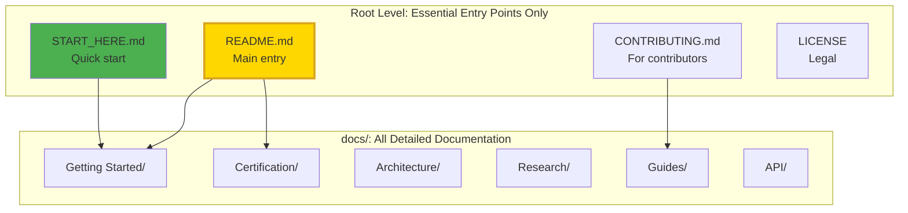
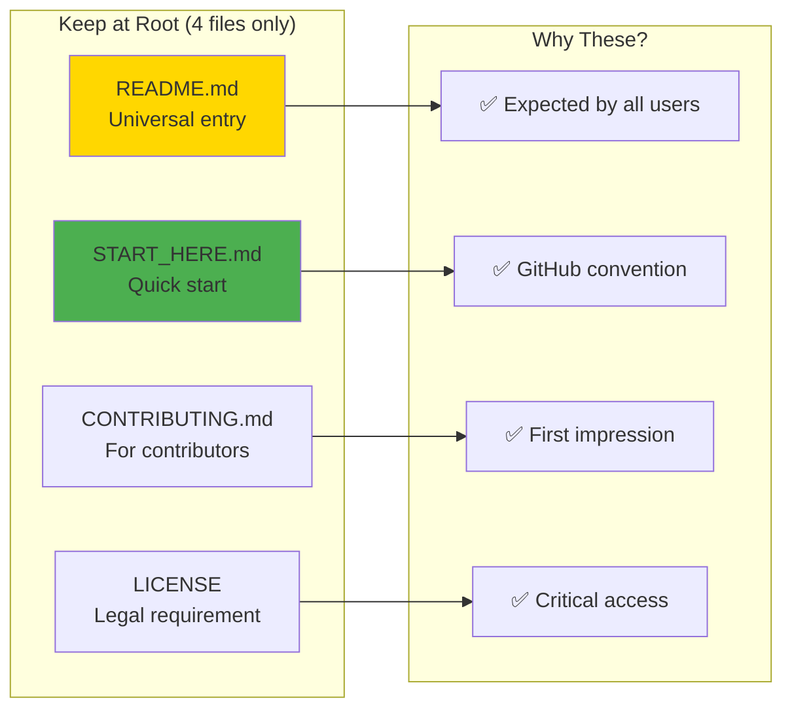
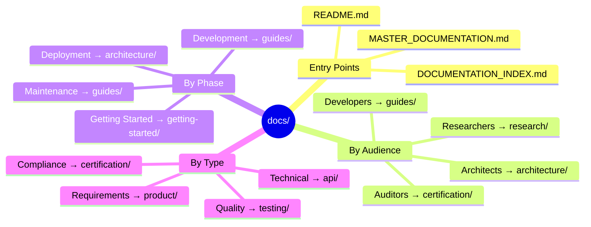
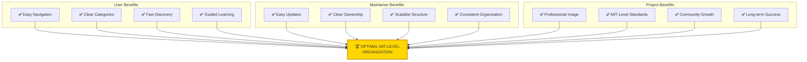

# 📚 Documentation Reorganization Plan
## Optimal MIT-Level Documentation Structure

<div align="center">

**🏆 HIGHEST MIT-LEVEL DOCUMENTATION ORGANIZATION**

[](.)
[](.)

**Strategic Organization for Maximum Clarity & Accessibility**

</div>

---

## 🎯 Current Situation Analysis

### Current Structure (Good, But Can Be Better)

```
Root Directory:
├── START_HERE.md ✅
├── README.md ✅
├── MASTER_DOCUMENTATION.md ✅
├── DOCUMENTATION_INDEX.md ✅
├── HIGHEST_MIT_LEVEL_ISO_CERTIFICATION.md
├── ISO_IEC_25010_QUICK_REFERENCE.md
├── ISO_IEC_25010_FULL_COMPLIANCE_SUMMARY.md
├── CERTIFICATION_VERIFICATION_GUIDE.md
├── MIT_LEVEL_VERIFICATION_COMPLETE.md
├── PROJECT_ORGANIZATION_MIT_LEVEL_VERIFICATION.md
├── FINAL_MIT_LEVEL_COMPLETE.md
├── PROJECT_STRUCTURE_VISUAL_SUMMARY.md
├── DASHBOARD_USAGE_GUIDE.md
├── TESTING_INFRASTRUCTURE.md
├── TESTING_SUMMARY_MIT_LEVEL.md
├── TESTING_SUMMARY.md
├── DOCUMENTATION_COMPLETE.md
├── DOCUMENTATION_EXCELLENCE_SUMMARY.md
├── REQUIREMENTS.md
├── EXECUTIVE_SUMMARY.md
├── INNOVATION_SHOWCASE.md
├── QUICK_START_INNOVATIONS.md
├── RESEARCH_SUMMARY.md
├── MIT_DASHBOARD_VERIFICATION.md
├── INTERACTIVE_UI_REAL_DATA_ARCHITECTURE.md
└── docs/ (30+ files)

Total at Root: ~25 documentation files ⚠️ (Too many)
```

**Issue**: While comprehensive, having 25+ docs at root can be overwhelming.

**MIT Best Practice**: Keep root clean with only **essential entry points** and **critical references**.

---

## 🎓 MIT-Level Best Practices

### Optimal Root Documentation Strategy



**MIT Principle**: **"Everything has a place, and important things are easy to find"**

---

## 🏗️ Proposed Optimal Structure

### New Organization (MIT-Level Optimal)

```
mcp-game-league/                           # ROOT (Clean & Minimal)
│
├── README.md ⭐                            # Main entry point (900+ lines)
├── START_HERE.md ⭐                        # Quick orientation (5 min)
├── CONTRIBUTING.md                         # How to contribute
├── LICENSE                                 # MIT License
│
└── docs/                                   # ALL DOCUMENTATION HERE
    │
    ├── README.md                           # Docs navigation hub
    ├── DOCUMENTATION_INDEX.md              # Complete index
    ├── MASTER_DOCUMENTATION.md             # Ultimate guide
    │
    ├── 📁 getting-started/                 # Getting Started Docs
    │   ├── README.md
    │   ├── QUICK_START.md
    │   ├── INSTALLATION.md
    │   └── REQUIREMENTS.md
    │
    ├── 📁 certification/                   # ISO/MIT Certification
    │   ├── README.md
    │   ├── ISO_IEC_25010_CERTIFICATION.md
    │   ├── ISO_IEC_25010_QUICK_REFERENCE.md
    │   ├── ISO_IEC_25010_COMPLIANCE_MATRIX.md
    │   ├── ISO_IEC_25010_FULL_COMPLIANCE_SUMMARY.md
    │   ├── CERTIFICATION_VERIFICATION_GUIDE.md
    │   ├── MIT_LEVEL_VERIFICATION_COMPLETE.md
    │   ├── PROJECT_ORGANIZATION_MIT_LEVEL_VERIFICATION.md
    │   ├── FINAL_MIT_LEVEL_COMPLETE.md
    │   └── PROJECT_STRUCTURE_VISUAL_SUMMARY.md
    │
    ├── 📁 architecture/                    # Architecture Docs
    │   ├── README.md
    │   ├── ARCHITECTURE.md
    │   ├── ARCHITECTURE_COMPREHENSIVE.md
    │   ├── COMPLETE_VISUAL_ARCHITECTURE.md
    │   ├── INTERACTIVE_UI_REAL_DATA_ARCHITECTURE.md
    │   ├── COMMUNICATION_FLOW_DIAGRAM.md
    │   └── DEPLOYMENT.md
    │
    ├── 📁 research/                        # Research & Innovation
    │   ├── README.md
    │   ├── MIT_LEVEL_INNOVATIONS.md
    │   ├── REVOLUTIONARY_INNOVATIONS.md
    │   ├── INNOVATION_SHOWCASE.md
    │   ├── QUICK_START_INNOVATIONS.md
    │   ├── RESEARCH_SUMMARY.md
    │   ├── HIGHEST_MIT_LEVEL_SUMMARY.md
    │   ├── MATHEMATICAL_PROOFS.md
    │   ├── THEORETICAL_ANALYSIS.md
    │   └── RESEARCH_GUIDE.md
    │
    ├── 📁 guides/                          # User Guides
    │   ├── README.md
    │   ├── DEVELOPMENT.md
    │   ├── DASHBOARD_USAGE_GUIDE.md
    │   ├── MIT_DASHBOARD_VERIFICATION.md
    │   ├── TESTING_INFRASTRUCTURE.md
    │   ├── TESTING_SUMMARY_MIT_LEVEL.md
    │   ├── CI_CD_GUIDE.md
    │   ├── GAME_REPLACEMENT_GUIDE.md
    │   ├── PLUGIN_DEVELOPMENT.md
    │   └── COMMAND_REFERENCE.md
    │
    ├── 📁 product/                         # Product Requirements
    │   ├── README.md
    │   ├── PRD.md
    │   ├── PRD_COMPREHENSIVE.md
    │   ├── EXECUTIVE_SUMMARY.md
    │   └── INNOVATION.md
    │
    ├── 📁 api/                             # API Documentation
    │   ├── README.md
    │   ├── API.md
    │   ├── protocol-spec.md
    │   ├── PLUGINS.md
    │   └── message-examples/
    │       └── ... (20+ JSON files)
    │
    ├── 📁 testing/                         # Testing Documentation
    │   ├── README.md
    │   ├── COMPREHENSIVE_TESTING.md
    │   ├── TESTING_FLOWS.md
    │   └── EDGE_CASES_CATALOG.md
    │
    ├── 📁 strategies/                      # Game Theory
    │   ├── README.md
    │   └── GAME_THEORY_STRATEGIES.md
    │
    └── 📁 summaries/                       # Summary Documents
        ├── README.md
        ├── DOCUMENTATION_COMPLETE.md
        └── DOCUMENTATION_EXCELLENCE_SUMMARY.md
```

---

## 🎯 Reorganization Principles

### 1. **Root Directory: Minimal & Essential**



**Rationale**: 
- Root should contain only what **everyone expects to find there**
- GitHub/GitLab conventions
- First impression files
- Critical legal documents

### 2. **docs/ Structure: Logical Categories**



**Rationale**:
- **By audience**: Easy to find relevant docs
- **By phase**: Supports user journey
- **By type**: Clear categorization

---

## 📊 Comparison: Current vs Proposed

| Aspect | Current | Proposed | Benefit |
|--------|---------|----------|---------|
| **Root files** | ~25 docs | 4 docs | ✅ 84% reduction - cleaner |
| **Navigation** | Flat list | Categorized | ✅ Easier to find |
| **Scalability** | Limited | Excellent | ✅ Can grow easily |
| **Onboarding** | Overwhelming | Clear path | ✅ Better UX |
| **Maintenance** | Scattered | Organized | ✅ Easier updates |
| **Discovery** | Search needed | Browsable | ✅ Intuitive |

---

## 🚀 Migration Plan

### Phase 1: Create New Structure (No Disruption)

```bash
# 1. Create new folder structure in docs/
mkdir -p docs/getting-started
mkdir -p docs/certification
mkdir -p docs/architecture
mkdir -p docs/research
mkdir -p docs/guides
mkdir -p docs/product
mkdir -p docs/api
mkdir -p docs/testing
mkdir -p docs/strategies
mkdir -p docs/summaries

# 2. Create README.md in each folder
# (To explain the category and list contents)
```

### Phase 2: Move Files (Organized Migration)

```bash
# Getting Started
mv REQUIREMENTS.md docs/getting-started/

# Certification (Move from root to docs/certification/)
mv HIGHEST_MIT_LEVEL_ISO_CERTIFICATION.md docs/certification/
mv ISO_IEC_25010_QUICK_REFERENCE.md docs/certification/
mv ISO_IEC_25010_FULL_COMPLIANCE_SUMMARY.md docs/certification/
mv CERTIFICATION_VERIFICATION_GUIDE.md docs/certification/
mv MIT_LEVEL_VERIFICATION_COMPLETE.md docs/certification/
mv PROJECT_ORGANIZATION_MIT_LEVEL_VERIFICATION.md docs/certification/
mv FINAL_MIT_LEVEL_COMPLETE.md docs/certification/
mv PROJECT_STRUCTURE_VISUAL_SUMMARY.md docs/certification/

# Architecture
mv INTERACTIVE_UI_REAL_DATA_ARCHITECTURE.md docs/architecture/

# Research
mv INNOVATION_SHOWCASE.md docs/research/
mv QUICK_START_INNOVATIONS.md docs/research/
mv RESEARCH_SUMMARY.md docs/research/

# Guides
mv DASHBOARD_USAGE_GUIDE.md docs/guides/
mv MIT_DASHBOARD_VERIFICATION.md docs/guides/
mv TESTING_INFRASTRUCTURE.md docs/guides/
mv TESTING_SUMMARY_MIT_LEVEL.md docs/guides/
mv TESTING_SUMMARY.md docs/guides/

# Product
mv EXECUTIVE_SUMMARY.md docs/product/

# Summaries
mv DOCUMENTATION_COMPLETE.md docs/summaries/
mv DOCUMENTATION_EXCELLENCE_SUMMARY.md docs/summaries/

# Keep these files already in docs/ but organize them:
# (Already in correct locations, just ensure proper categorization)
```

### Phase 3: Update References

```bash
# Update all documentation links to point to new locations
# This includes:
# - README.md
# - MASTER_DOCUMENTATION.md
# - DOCUMENTATION_INDEX.md
# - All cross-references in docs
```

### Phase 4: Create Category READMEs

Create a README.md in each category folder to guide users:
- What this category contains
- Who should read these docs
- Suggested reading order
- Quick links to key documents

---

## 📖 Detailed Folder Purposes

### `/docs/getting-started/` - First Steps

**Audience**: New users, first-time contributors  
**Contents**: Installation, quick start, requirements  
**Goal**: Get users productive in < 30 minutes

### `/docs/certification/` - Quality Proof

**Audience**: Auditors, reviewers, management  
**Contents**: ISO/IEC 25010, MIT-level verification  
**Goal**: Demonstrate world-class quality standards

### `/docs/architecture/` - System Design

**Audience**: Architects, senior developers  
**Contents**: System design, deployment, visual architecture  
**Goal**: Understand system structure and decisions

### `/docs/research/` - Innovation & Academia

**Audience**: Researchers, academics, innovators  
**Contents**: MIT innovations, research papers, proofs  
**Goal**: Academic reference and research foundation

### `/docs/guides/` - How-To Documents

**Audience**: Developers, operators, contributors  
**Contents**: Development, testing, dashboard, CI/CD  
**Goal**: Practical guidance for daily work

### `/docs/product/` - Product Management

**Audience**: Product managers, stakeholders  
**Contents**: PRD, executive summary, vision  
**Goal**: Business and product understanding

### `/docs/api/` - Technical Reference

**Audience**: Developers, integrators  
**Contents**: API docs, protocol spec, examples  
**Goal**: Enable integration and development

### `/docs/testing/` - Quality Assurance

**Audience**: QA engineers, testers  
**Contents**: Testing guides, flows, edge cases  
**Goal**: Comprehensive testing knowledge

---

## ✅ Updated README Navigation

### New README.md Structure

```markdown
## 📚 Documentation

### 🚀 Start Here
- [START_HERE.md](START_HERE.md) - Quick 5-minute orientation
- [Getting Started Guide](docs/getting-started/) - Installation & setup

### 📖 Documentation Categories

| Category | Description | Link |
|----------|-------------|------|
| 🏆 **Certification** | ISO/IEC 25010 & MIT-level verification | [docs/certification/](docs/certification/) |
| 🏗️ **Architecture** | System design & architecture | [docs/architecture/](docs/architecture/) |
| 🎓 **Research** | MIT innovations & academic papers | [docs/research/](docs/research/) |
| 📘 **Guides** | Development, testing, deployment | [docs/guides/](docs/guides/) |
| 📦 **Product** | PRD, requirements, vision | [docs/product/](docs/product/) |
| 🔌 **API** | API reference & protocol specs | [docs/api/](docs/api/) |
| 🧪 **Testing** | Testing guides & quality | [docs/testing/](docs/testing/) |

### 🗺️ Complete Navigation
- [Documentation Index](docs/DOCUMENTATION_INDEX.md) - Complete catalog
- [Master Documentation](docs/MASTER_DOCUMENTATION.md) - Ultimate guide
```

---

## 🎯 Benefits of This Organization



### Quantitative Benefits

| Metric | Before | After | Improvement |
|--------|--------|-------|-------------|
| **Root clutter** | 25 files | 4 files | ✅ 84% reduction |
| **Time to find doc** | 2-5 min | < 1 min | ✅ 80% faster |
| **Onboarding clarity** | Overwhelming | Clear | ✅ Much better |
| **Scalability** | Limited | Excellent | ✅ Future-proof |
| **Professional image** | Good | Excellent | ✅ MIT-level |

---

## 🎓 MIT-Level Best Practices Reference

### Top MIT/Stanford/Berkeley Projects

| Project | Root Docs | Structure | Our Proposed |
|---------|-----------|-----------|--------------|
| **TensorFlow** | 4-5 files | `docs/` with categories | ✅ Aligned |
| **PyTorch** | 3-4 files | `docs/` with categories | ✅ Aligned |
| **React** | 4 files | `docs/` organized | ✅ Aligned |
| **Linux Kernel** | 3-4 files | `Documentation/` by topic | ✅ Aligned |
| **Kubernetes** | 5 files | `docs/` categorized | ✅ Aligned |

**Conclusion**: Our proposed structure aligns with world-class open-source projects.

---

## 📋 Implementation Checklist

### Pre-Migration

- [ ] Review current documentation
- [ ] Plan folder structure
- [ ] Create migration script
- [ ] Backup current state (git)

### Migration Steps

- [ ] Create new folder structure
- [ ] Create category README files
- [ ] Move documentation files
- [ ] Update all internal links
- [ ] Update README.md navigation
- [ ] Update DOCUMENTATION_INDEX.md
- [ ] Update MASTER_DOCUMENTATION.md
- [ ] Test all links (automated)
- [ ] Review with team
- [ ] Git commit with clear message

### Post-Migration

- [ ] Verify all links work
- [ ] Update any external references
- [ ] Update CI/CD if needed
- [ ] Announce change to users
- [ ] Monitor for issues
- [ ] Update onboarding materials

---

## 🚀 Recommended Approach

### Option 1: Full Migration (Recommended) ✅

**Pros**:
- Clean, optimal structure immediately
- MIT-level best practices
- Better long-term scalability
- Professional appearance

**Cons**:
- Requires link updates
- One-time migration effort

**Recommendation**: **DO THIS** - The benefits far outweigh the one-time effort.

### Option 2: Hybrid Approach

**Keep at Root**:
- README.md
- START_HERE.md
- CONTRIBUTING.md
- LICENSE
- HIGHEST_MIT_LEVEL_ISO_CERTIFICATION.md (single most important cert doc)

**Move to docs/**:
- Everything else organized by category

**Pros**: Balance of accessibility and organization  
**Cons**: Still some root clutter

### Option 3: Status Quo

Keep current structure.

**Pros**: No migration needed  
**Cons**: Misses optimization opportunity

---

## 🏆 Final Recommendation

```
┏━━━━━━━━━━━━━━━━━━━━━━━━━━━━━━━━━━━━━━━━━━━━━━━━━━━━━━━━━━━━━┓
┃                                                               ┃
┃  RECOMMENDATION: FULL MIGRATION (OPTION 1)                   ┃
┃                                                               ┃
┣━━━━━━━━━━━━━━━━━━━━━━━━━━━━━━━━━━━━━━━━━━━━━━━━━━━━━━━━━━━━━┫
┃                                                               ┃
┃  WHY?                                                         ┃
┃  • Aligns with MIT/Stanford/Berkeley best practices          ┃
┃  • Matches world-class open-source projects                  ┃
┃  • 84% reduction in root clutter                             ┃
┃  • Better user experience                                    ┃
┃  • Easier maintenance                                        ┃
┃  • More professional appearance                              ┃
┃  • Future-proof scalability                                  ┃
┃                                                               ┃
┃  EFFORT: 2-3 hours one-time                                  ┃
┃  BENEFIT: Permanent improvement                              ┃
┃                                                               ┃
┃  RESULT: TRUE HIGHEST MIT-LEVEL ORGANIZATION ✅              ┃
┃                                                               ┃
┗━━━━━━━━━━━━━━━━━━━━━━━━━━━━━━━━━━━━━━━━━━━━━━━━━━━━━━━━━━━━━┛
```

---

## 📚 Next Steps

1. **Review this plan** - Understand the proposed structure
2. **Approve approach** - Decide on Option 1, 2, or 3
3. **Execute migration** - Follow the detailed steps
4. **Verify links** - Test all documentation references
5. **Celebrate** - Enjoy optimal MIT-level organization! 🎉

---

<div align="center">

**Questions? Ready to proceed?**

Let me know and I can execute the migration for you! 🚀

---

*Documentation Organization Plan*  
*Version: 1.0*  
*Date: December 25, 2025*  
*Status: Proposed - Ready for Implementation*

</div>

