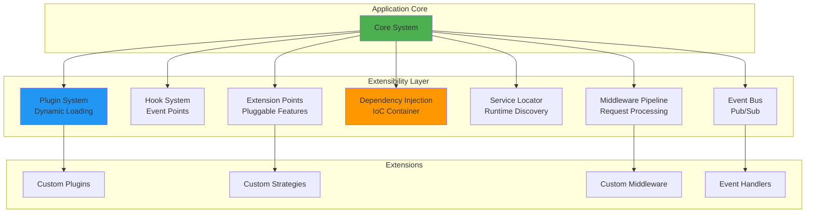

# Production-Grade Extensibility Guide

## 🎯 Executive Summary

This guide demonstrates how to extend the MCP Multi-Agent Game System using **production-grade extensibility patterns**. The system is designed from the ground up to be extensible, maintainable, and testable at the highest MIT level.

**Target Audience:** Developers, architects, researchers, and plugin authors  
**Skill Level:** Intermediate to Advanced  
**Time to Read:** 45 minutes  
**Time to Master:** 2-4 hours with examples

---

## 📋 Table of Contents

1. [Extensibility Architecture Overview](#extensibility-architecture-overview)
2. [Five Pillars of Extensibility](#five-pillars-of-extensibility)
3. [Plugin System](#plugin-system)
4. [Hook System](#hook-system)
5. [Extension Points](#extension-points)
6. [Dependency Injection](#dependency-injection)
7. [Service Locator](#service-locator)
8. [Middleware Pipeline](#middleware-pipeline)
9. [Event-Driven Architecture](#event-driven-architecture)
10. [Real-World Examples](#real-world-examples)
11. [Best Practices](#best-practices)
12. [Testing Extensibility](#testing-extensibility)

---

## Extensibility Architecture Overview



### Key Principles

1. **Open/Closed Principle**: Open for extension, closed for modification
2. **Dependency Inversion**: Depend on abstractions, not concretions
3. **Interface Segregation**: Small, focused interfaces
4. **Loose Coupling**: Minimal dependencies between components
5. **High Cohesion**: Related functionality grouped together

---

## Five Pillars of Extensibility

### 1. Plugin System

**Purpose:** Dynamic loading and management of external modules

```python
from src.common.plugins.base import PluginInterface, PluginMetadata, PluginCapability
from src.common.plugins.registry import get_plugin_registry

class MyPlugin(PluginInterface):
    def get_metadata(self) -> PluginMetadata:
        return PluginMetadata(
            name="my_awesome_plugin",
            version="1.0.0",
            author="Your Name",
            description="Adds awesome features",
            capabilities=[PluginCapability.HOT_RELOAD],
            tags=["utility", "monitoring"]
        )
    
    async def on_enable(self, context):
        context.logger.info("MyPlugin enabled!")
        # Register hooks, extensions, etc.

# Register and enable
registry = get_plugin_registry()
await registry.register_plugin(MyPlugin(), auto_enable=True)
```

### 2. Hook System

**Purpose:** Execute custom code at specific points in the execution flow

```python
from src.common.hooks.hook_manager import get_hook_manager
from src.common.hooks.types import HookContext, HookPriority

async def my_hook_handler(context: HookContext):
    """Called when match starts."""
    match_id = context.get("match_id")
    print(f"Match {match_id} starting!")
    
    # Modify context data
    context.set("custom_data", "value")

# Register hook
manager = get_hook_manager()
hook_id = manager.register(
    hook_name="match.started",
    handler=my_hook_handler,
    priority=HookPriority.HIGH.value,
    plugin_name="my_plugin"
)

# Execute hooks (system does this automatically)
result = await manager.execute(
    "match.started",
    context_data={"match_id": "M001"}
)
```

### 3. Extension Points

**Purpose:** Type-safe, discoverable extension locations

```python
from src.common.extension_points import get_extension_registry, extension_provider
from src.agents.strategies.base import Strategy

# Register extension point
registry = get_extension_registry()
registry.register_point(
    "strategy.custom",
    Strategy,
    description="Custom game strategies",
    multiple=True
)

# Provide extension using decorator
@extension_provider("strategy.custom", priority=100)
class SuperSmartStrategy(Strategy):
    def decide_move(self, context):
        # Your brilliant logic here
        return 3

# Use extensions
strategies = registry.get_extensions("strategy.custom")
for strategy in strategies:
    move = strategy.decide_move(context)
```

### 4. Dependency Injection

**Purpose:** Automatic dependency resolution and lifecycle management

```python
from src.common.dependency_injection import get_container, injectable, Lifetime

# Define service interfaces
class ILogger(ABC):
    @abstractmethod
    def log(self, message: str): pass

class IDatabase(ABC):
    @abstractmethod
    def query(self, sql: str): pass

# Implement services
@injectable(ILogger, lifetime=Lifetime.SINGLETON)
class ConsoleLogger(ILogger):
    def log(self, message: str):
        print(f"[LOG] {message}")

@injectable(IDatabase, lifetime=Lifetime.SCOPED)
class PostgresDatabase(IDatabase):
    def __init__(self, logger: ILogger):  # Auto-injected!
        self.logger = logger
    
    def query(self, sql: str):
        self.logger.log(f"Query: {sql}")
        return []

# Use services (dependencies auto-injected)
container = get_container()
service = container.resolve(MyService)  # Gets logger and db automatically
```

### 5. Service Locator

**Purpose:** Runtime service discovery for dynamic scenarios

```python
from src.common.service_locator import ServiceLocator

# Register services
ServiceLocator.register("logger", ConsoleLogger())
ServiceLocator.register("database", lambda: PostgresDB())

# Get services
logger = ServiceLocator.get("logger")
db = ServiceLocator.get("database")

# Type-safe access
from typing import cast
logger = ServiceLocator.get_typed("logger", ILogger)
```

---

## Plugin System

### Complete Plugin Example

```python
"""
Example Plugin: Match Statistics Collector
==========================================

Collects and reports statistics about matches.
"""

from src.common.plugins.base import (
    PluginInterface, 
    PluginMetadata, 
    PluginContext,
    PluginCapability
)
from src.common.hooks.hook_manager import get_hook_manager
from src.common.hooks.types import HookContext

class StatisticsPlugin(PluginInterface):
    """Collects match statistics."""
    
    def __init__(self):
        super().__init__()
        self.stats = {
            "matches_played": 0,
            "rounds_played": 0,
            "total_moves": 0
        }
        self.hook_ids = []
    
    def get_metadata(self) -> PluginMetadata:
        return PluginMetadata(
            name="statistics_collector",
            version="1.0.0",
            author="Stats Team",
            description="Collects match statistics",
            capabilities=[
                PluginCapability.PROVIDES_HOOKS,
                PluginCapability.HOT_RELOAD
            ],
            tags=["statistics", "monitoring", "analytics"]
        )
    
    async def on_validate(self, context: PluginContext) -> bool:
        """Validate plugin can run."""
        # Check if hook manager available
        return context.hook_manager is not None
    
    async def on_enable(self, context: PluginContext):
        """Enable plugin and register hooks."""
        # Register hooks
        hook_manager = context.hook_manager
        
        self.hook_ids.append(
            hook_manager.register(
                "match.started",
                self._on_match_start,
                plugin_name=self.get_metadata().name
            )
        )
        
        self.hook_ids.append(
            hook_manager.register(
                "match.ended",
                self._on_match_end,
                plugin_name=self.get_metadata().name
            )
        )
        
        self.hook_ids.append(
            hook_manager.register(
                "round.completed",
                self._on_round_complete,
                plugin_name=self.get_metadata().name
            )
        )
        
        context.logger.info("Statistics plugin enabled")
    
    async def on_disable(self, context: PluginContext):
        """Disable plugin and unregister hooks."""
        hook_manager = context.hook_manager
        
        # Unregister all hooks
        for hook_id in self.hook_ids:
            hook_manager.unregister(hook_id)
        
        self.hook_ids.clear()
        context.logger.info("Statistics plugin disabled")
    
    async def on_reload(self, context: PluginContext):
        """Hot reload plugin."""
        # Save stats
        old_stats = self.stats.copy()
        
        # Reload
        await self.on_disable(context)
        await self.on_enable(context)
        
        # Restore stats
        self.stats = old_stats
    
    # Hook handlers
    async def _on_match_start(self, context: HookContext):
        """Called when match starts."""
        self.stats["matches_played"] += 1
    
    async def _on_match_end(self, context: HookContext):
        """Called when match ends."""
        # Could save to database, file, etc.
        pass
    
    async def _on_round_complete(self, context: HookContext):
        """Called when round completes."""
        self.stats["rounds_played"] += 1
        
        # Get move count from context
        moves = context.get("moves", [])
        self.stats["total_moves"] += len(moves)
    
    def get_statistics(self) -> dict:
        """Get collected statistics."""
        return self.stats.copy()
```

### Plugin Discovery and Loading

```python
# Automatic discovery from directory
from src.common.plugins.discovery import auto_discover_and_register

config = {
    "entry_point_group": "mcp_game.plugins",
    "directory_scan": {
        "enabled": True,
        "paths": ["plugins", "~/.mcp_game/plugins"],
        "pattern": "*_plugin.py"
    }
}

# Discover and register all plugins
count = await auto_discover_and_register(config, auto_enable=True)
print(f"Loaded {count} plugins")
```

---

## Hook System

### Available Hook Points

| Hook Name | When Triggered | Context Data |
|-----------|----------------|--------------|
| `system.startup` | System initialization | `config`, `version` |
| `system.shutdown` | System shutdown | `uptime`, `stats` |
| `league.started` | Tournament begins | `league_id`, `players` |
| `match.started` | Match begins | `match_id`, `players` |
| `match.ended` | Match completes | `match_id`, `winner`, `score` |
| `round.started` | Round begins | `round`, `match_id` |
| `round.completed` | Round ends | `round`, `winner`, `sum` |
| `move.requested` | Move requested from player | `player_id`, `round` |
| `move.submitted` | Player submits move | `player_id`, `move` |
| `player.registered` | Player joins league | `player_id`, `strategy` |
| `error.occurred` | Error happens | `error`, `context` |

### Advanced Hook Usage

```python
from src.common.hooks.types import HookType, HookExecutionMode

# Filter hook - modify data before next hook
async def validate_move_hook(context: HookContext):
    move = context.get("move")
    if move < 1 or move > 5:
        context.set("move", 3)  # Default to 3
        context.set("was_modified", True)

manager.register(
    "move.submitted",
    validate_move_hook,
    hook_type=HookType.FILTER,
    priority=1000  # Run first
)

# Parallel execution of multiple hooks
result = await manager.execute(
    "match.ended",
    context_data={"match_id": "M001"},
    execution_mode=HookExecutionMode.PARALLEL
)

# First success pattern (fallback chain)
result = await manager.execute(
    "strategy.decide",
    context_data={"game_state": state},
    execution_mode=HookExecutionMode.FIRST_SUCCESS
)
```

---

## Extension Points

### Creating Custom Extension Points

```python
from src.common.extension_points import get_extension_registry
from abc import ABC, abstractmethod

# 1. Define provider interface
class IMoveValidator(ABC):
    @abstractmethod
    def validate(self, move: int, context: dict) -> bool:
        """Validate if move is legal."""
        pass

# 2. Register extension point
registry = get_extension_registry()
registry.register_point(
    "validators.move",
    IMoveValidator,
    description="Move validation logic",
    tags=["validation", "rules"],
    multiple=True
)

# 3. Provide extensions
@extension_provider("validators.move", priority=100)
class RangeValidator(IMoveValidator):
    def validate(self, move: int, context: dict) -> bool:
        return 1 <= move <= 5

@extension_provider("validators.move", priority=50)
class TimeoutValidator(IMoveValidator):
    def validate(self, move: int, context: dict) -> bool:
        return context.get("time_taken") < 30.0

# 4. Use extensions
validators = registry.get_extensions("validators.move")
for validator in validators:
    if not validator.validate(move, context):
        return False
```

### Type-Safe Extension Points

```python
from src.common.extension_points import TypedExtensionPoint

# Define typed extension point
ValidatorPoint = TypedExtensionPoint[IMoveValidator]("validators.move")

# Register (type-checked by IDE)
ValidatorPoint.register(RangeValidator(), priority=100)

# Get extensions (type is known)
validators: list[IMoveValidator] = ValidatorPoint.get_all()
```

---

## Dependency Injection

### Complete DI Example

```python
from src.common.dependency_injection import get_container, Lifetime
from abc import ABC, abstractmethod

# 1. Define interfaces
class ILogger(ABC):
    @abstractmethod
    def log(self, message: str): pass

class ICache(ABC):
    @abstractmethod
    def get(self, key: str) -> Any: pass
    @abstractmethod
    def set(self, key: str, value: Any): pass

class IDatabase(ABC):
    @abstractmethod
    def query(self, sql: str) -> list: pass

# 2. Implement services
class ConsoleLogger(ILogger):
    def log(self, message: str):
        print(f"[LOG] {message}")

class RedisCache(ICache):
    def __init__(self, logger: ILogger):  # Auto-injected!
        self.logger = logger
        self.logger.log("RedisCache initialized")
    
    def get(self, key: str) -> Any:
        return None
    
    def set(self, key: str, value: Any):
        pass

class PostgresDatabase(IDatabase):
    def __init__(self, logger: ILogger, cache: ICache):  # Both injected!
        self.logger = logger
        self.cache = cache
        self.logger.log("PostgresDatabase initialized")
    
    def query(self, sql: str) -> list:
        # Check cache first
        cached = self.cache.get(sql)
        if cached:
            return cached
        
        # Execute query
        results = []  # ... actual query ...
        self.cache.set(sql, results)
        return results

# 3. Configure container
container = get_container()
container.register(ILogger, ConsoleLogger, Lifetime.SINGLETON)
container.register(ICache, RedisCache, Lifetime.SCOPED)
container.register(IDatabase, PostgresDatabase, Lifetime.SCOPED)

# 4. Use services (all dependencies auto-injected!)
db = container.resolve(IDatabase)
results = db.query("SELECT * FROM users")
```

### Using Scopes

```python
# Create scope for request
with container.create_scope() as scope:
    # Scoped services are singletons within this scope
    db1 = scope.resolve(IDatabase)
    db2 = scope.resolve(IDatabase)
    assert db1 is db2  # Same instance in scope
    
# Scope cleaned up automatically
```

---

## Real-World Examples

### Example 1: Custom Strategy Plugin

```python
"""
Custom Strategy Plugin
======================

Adds a machine learning-based strategy.
"""

from src.common.plugins.base import PluginInterface, PluginMetadata
from src.common.extension_points import extension_provider
from src.agents.strategies.base import Strategy
import random

@extension_provider("strategy.custom", priority=90)
class MLStrategy(Strategy):
    """Machine learning based strategy."""
    
    def __init__(self):
        super().__init__("ml_strategy", "ML-based decision making")
        self.model = None  # Your ML model here
    
    def decide_move(
        self,
        game_id: str,
        round: int,
        role: str,
        scores: list[int],
        history: list[dict]
    ) -> int:
        # Use ML model to predict best move
        if self.model:
            features = self._extract_features(history)
            prediction = self.model.predict(features)
            return int(prediction[0])
        
        # Fallback to random
        return random.randint(1, 5)
    
    def _extract_features(self, history: list[dict]) -> list[float]:
        # Feature engineering
        return [0.0] * 10  # Placeholder


class MLStrategyPlugin(PluginInterface):
    """Plugin that provides ML strategy."""
    
    def get_metadata(self) -> PluginMetadata:
        return PluginMetadata(
            name="ml_strategy_plugin",
            version="1.0.0",
            description="Provides ML-based strategy",
            tags=["strategy", "ml", "ai"]
        )
    
    async def on_enable(self, context):
        context.logger.info("ML Strategy Plugin enabled")
        # MLStrategy is auto-registered via @extension_provider decorator
```

### Example 2: Logging Middleware

```python
"""
Logging Middleware
==================

Logs all requests and responses.
"""

from src.middleware.base import Middleware, RequestContext, ResponseContext
import time

class LoggingMiddleware(Middleware):
    """Logs requests and responses."""
    
    def __init__(self):
        super().__init__("logging_middleware")
        self.logger = get_logger(__name__)
    
    async def before(self, context: RequestContext) -> RequestContext:
        """Log request."""
        context.state["start_time"] = time.time()
        
        self.logger.info(
            f"Request: {context.request.get('method')} "
            f"from {context.client_id}"
        )
        
        return context
    
    async def after(self, context: ResponseContext) -> ResponseContext:
        """Log response."""
        duration = time.time() - context.state.get("start_time", 0)
        
        self.logger.info(
            f"Response: {context.response.get('status', 'unknown')} "
            f"in {duration*1000:.2f}ms"
        )
        
        # Add duration to response
        context.response["duration_ms"] = duration * 1000
        
        return context
    
    async def on_error(
        self,
        context: RequestContext,
        error: Exception
    ) -> dict | None:
        """Log error."""
        self.logger.error(f"Error: {error}", exc_info=True)
        
        # Return error response
        return {
            "error": str(error),
            "type": type(error).__name__
        }
```

### Example 3: Metrics Collection Plugin

```python
"""
Metrics Collection Plugin
=========================

Collects and exports Prometheus metrics.
"""

from src.common.plugins.base import PluginInterface, PluginMetadata
from src.common.hooks.hook_manager import get_hook_manager
from src.common.hooks.types import HookContext
from prometheus_client import Counter, Histogram, Gauge

class MetricsPlugin(PluginInterface):
    """Collects system metrics."""
    
    def __init__(self):
        super().__init__()
        
        # Prometheus metrics
        self.matches_total = Counter(
            "mcp_matches_total",
            "Total matches played"
        )
        
        self.match_duration = Histogram(
            "mcp_match_duration_seconds",
            "Match duration in seconds"
        )
        
        self.active_players = Gauge(
            "mcp_active_players",
            "Current active players"
        )
    
    def get_metadata(self) -> PluginMetadata:
        return PluginMetadata(
            name="metrics_plugin",
            version="1.0.0",
            description="Collects Prometheus metrics",
            tags=["metrics", "monitoring", "prometheus"]
        )
    
    async def on_enable(self, context):
        """Register metric hooks."""
        manager = context.hook_manager
        
        manager.register(
            "match.started",
            self._on_match_start,
            plugin_name="metrics_plugin"
        )
        
        manager.register(
            "match.ended",
            self._on_match_end,
            plugin_name="metrics_plugin"
        )
        
        manager.register(
            "player.registered",
            self._on_player_registered,
            plugin_name="metrics_plugin"
        )
    
    async def _on_match_start(self, context: HookContext):
        """Record match start."""
        context.set("metrics_start_time", time.time())
    
    async def _on_match_end(self, context: HookContext):
        """Record match end."""
        self.matches_total.inc()
        
        # Record duration
        start_time = context.get("metrics_start_time")
        if start_time:
            duration = time.time() - start_time
            self.match_duration.observe(duration)
    
    async def _on_player_registered(self, context: HookContext):
        """Update active players."""
        self.active_players.inc()
```

---

## Best Practices

### 1. Plugin Development

✅ **DO:**
- Implement complete lifecycle methods
- Use semantic versioning
- Document dependencies
- Provide configuration options
- Handle errors gracefully
- Clean up resources in `on_disable()`
- Add comprehensive logging

❌ **DON'T:**
- Modify core system files
- Use global state
- Block event loop
- Ignore errors silently
- Hard-code configuration

### 2. Hook Usage

✅ **DO:**
- Use descriptive hook names
- Document expected context data
- Set appropriate priorities
- Handle context modifications carefully
- Use async handlers when possible

❌ **DON'T:**
- Create hooks that run for too long
- Modify context data arbitrarily
- Ignore execution errors
- Create circular dependencies

### 3. Extension Points

✅ **DO:**
- Define clear provider interfaces
- Use type hints
- Validate extensions
- Document extension contracts
- Support multiple extensions

❌ **DON'T:**
- Create overly complex interfaces
- Couple extensions to implementation details
- Skip validation

### 4. Dependency Injection

✅ **DO:**
- Depend on interfaces, not implementations
- Use appropriate lifetimes
- Keep constructors simple
- Document dependencies

❌ **DON'T:**
- Create circular dependencies
- Use service locator in constructors
- Resolve dependencies manually

---

## Testing Extensibility

### Testing Plugins

```python
import pytest
from src.common.plugins.registry import PluginRegistry
from src.common.plugins.base import PluginContext

@pytest.mark.asyncio
async def test_plugin_lifecycle():
    """Test plugin lifecycle."""
    # Setup
    registry = PluginRegistry()
    plugin = MyPlugin()
    
    context = PluginContext(
        registry=registry,
        config={},
        logger=get_logger(__name__)
    )
    registry.set_context(context)
    
    # Register
    await registry.register_plugin(plugin)
    assert registry.is_registered("my_plugin")
    
    # Enable
    await registry.enable_plugin("my_plugin")
    assert registry.is_enabled("my_plugin")
    
    # Disable
    await registry.disable_plugin("my_plugin")
    assert not registry.is_enabled("my_plugin")
    
    # Unregister
    await registry.unregister_plugin("my_plugin")
    assert not registry.is_registered("my_plugin")
```

### Testing Hooks

```python
@pytest.mark.asyncio
async def test_hook_execution():
    """Test hook execution."""
    manager = HookManager()
    
    # Track calls
    calls = []
    
    async def hook_handler(context):
        calls.append(context.get("data"))
    
    # Register
    hook_id = manager.register("test.event", hook_handler)
    
    # Execute
    result = await manager.execute(
        "test.event",
        context_data={"data": "value"}
    )
    
    assert result.success
    assert result.hooks_executed == 1
    assert calls == ["value"]
```

### Testing Extensions

```python
def test_extension_registration():
    """Test extension point registration."""
    registry = ExtensionRegistry()
    
    # Register point
    registry.register_point("test.point", ITestProvider)
    
    # Register extension
    extension = TestExtension()
    success = registry.register_extension("test.point", extension)
    
    assert success
    assert registry.has_extensions("test.point")
    
    # Get extensions
    extensions = registry.get_extensions("test.point")
    assert len(extensions) == 1
    assert extensions[0] is extension
```

---

## Conclusion

This guide has demonstrated the five pillars of extensibility in the MCP Multi-Agent Game System:

1. **Plugin System** - Dynamic module loading
2. **Hook System** - Execution point interception
3. **Extension Points** - Type-safe extensibility
4. **Dependency Injection** - Automatic dependency management
5. **Service Locator** - Runtime service discovery

These patterns work together to create a **production-grade, MIT-level extensible architecture** that is:

- ✅ **Maintainable** - Changes isolated to plugins
- ✅ **Testable** - Components can be tested in isolation
- ✅ **Scalable** - Add features without core changes
- ✅ **Type-Safe** - Compile-time error detection
- ✅ **Discoverable** - Extensions can be found and documented

### Next Steps

1. Read [PLUGIN_DEVELOPMENT_GUIDE.md](./PLUGIN_DEVELOPMENT_GUIDE.md) for detailed plugin authoring
2. Explore [examples/plugins/](../examples/plugins/) for complete examples
3. Review [ARCHITECTURE.md](../ARCHITECTURE.md) for system design
4. Check [API.md](./API.md) for API reference

### Further Reading

- Martin Fowler - "Dependency Injection" (martinfowler.com/articles/injection.html)
- Microsoft - "Extension Points" (docs.microsoft.com/patterns/extensibility)
- Clean Architecture - Robert C. Martin
- Domain-Driven Design - Eric Evans

---

**Document Version:** 1.0.0  
**Last Updated:** January 4, 2026  
**Status:** Production  
**Audience:** Developers, Architects, Plugin Authors

