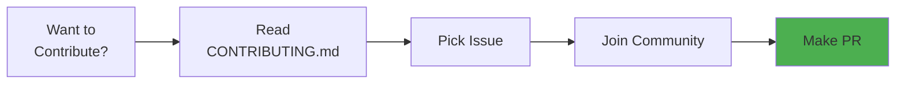
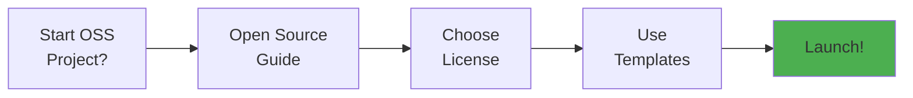
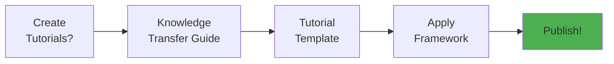
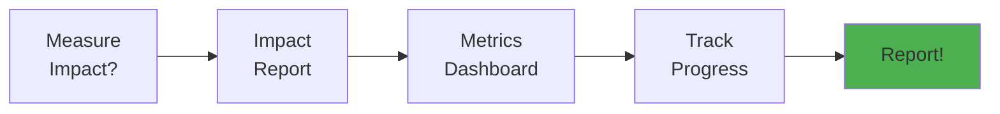

# Project Navigation Map

<div align="center">

**🗺️ Complete Visual Navigation Guide**  
**📍 Find Anything in Seconds**

[]()

</div>

---

## 🎯 Quick Access Matrix

### By Role (Start Here!)

| Your Role | Start With | Then Go To | Time |
|-----------|-----------|------------|------|
| 🆕 **First-Time Visitor** | [START_HERE.md](../START_HERE.md) | [README.md](../README.md) | 5 min |
| 🤝 **New Contributor** | [CONTRIBUTING.md](../CONTRIBUTING.md) | [community/](community/) | 20 min |
| 🏗️ **Maintainer** | [community/OPEN_SOURCE_GUIDE.md](community/OPEN_SOURCE_GUIDE.md) | [Certification](certification/) | 2 hours |
| 📝 **Documentation Writer** | [community/REUSABLE_TEMPLATES.md](community/REUSABLE_TEMPLATES.md) | [DOCUMENTATION_INDEX.md](DOCUMENTATION_INDEX.md) | 1 hour |
| 🎓 **Educator/Researcher** | [community/KNOWLEDGE_TRANSFER_GUIDE.md](community/KNOWLEDGE_TRANSFER_GUIDE.md) | [research/](research/) | 2 hours |
| 💼 **Project Leader** | [community/COMMUNITY_IMPACT_REPORT.md](community/COMMUNITY_IMPACT_REPORT.md) | [MASTER_DOCUMENTATION.md](MASTER_DOCUMENTATION.md) | 1 hour |
| 🔬 **Research User** | [MIT_LEVEL_INNOVATIONS.md](MIT_LEVEL_INNOVATIONS.md) | [research/](research/) | 30 min |
| 🏢 **Enterprise User** | [product/EXECUTIVE_SUMMARY.md](product/EXECUTIVE_SUMMARY.md) | [DEPLOYMENT.md](DEPLOYMENT.md) | 15 min |

---

## 📚 Documentation Categories

### 🌟 Community Contribution (MAIN FOCUS)

```
community/
├── README.md                           🗺️ Community hub (start here!)
├── OPEN_SOURCE_GUIDE.md                📖 Complete OSS handbook (2,000+ lines)
├── REUSABLE_TEMPLATES.md               📝 42+ templates (1,500+ lines)
├── KNOWLEDGE_TRANSFER_GUIDE.md         🎓 Education framework (1,800+ lines)
└── COMMUNITY_IMPACT_REPORT.md          📊 Impact metrics (1,200+ lines)
```

**Quick Access**:
- 📄 [Community Summary](../COMMUNITY_CONTRIBUTION_SUMMARY.md) - 5 min overview
- 🗂️ [Community Index](COMMUNITY_CONTRIBUTION_INDEX.md) - Master index
- ⚡ [Quick Reference](COMMUNITY_QUICK_REFERENCE.md) - One-pager
- 🏆 [Certification](HIGHEST_MIT_LEVEL_COMMUNITY_CONTRIBUTION.md) - MIT-level verified

---

### 🏆 Certification & Standards

```
certification/
├── HIGHEST_MIT_LEVEL_ISO_CERTIFICATION.md      🏆 Full ISO certification
├── ISO_IEC_25010_QUICK_REFERENCE.md            ⚡ One-page summary
├── FINAL_MIT_LEVEL_COMPLETE.md                 ✅ MIT verification
├── PROJECT_ORGANIZATION_MIT_LEVEL_VERIFICATION.md  📁 Structure verified
└── [5 more certification documents]
```

**Also See**:
- [ISO Certification](ISO_IEC_25010_CERTIFICATION.md)
- [Compliance Matrix](ISO_IEC_25010_COMPLIANCE_MATRIX.md)
- [Project Structure Verification](PROJECT_STRUCTURE_MIT_VERIFICATION.md)

---

### 🚀 Getting Started

```
getting-started/
├── README.md                                   🌟 Start here
└── REQUIREMENTS.md                             📋 Prerequisites
```

**Also See**:
- [START_HERE.md](../START_HERE.md) - Quick orientation
- [README.md](../README.md) - Project overview
- [CONTRIBUTING.md](../CONTRIBUTING.md) - How to contribute

---

### 📘 Guides & Tutorials

```
guides/
├── README.md                                   📚 Guides index
├── TESTING_INFRASTRUCTURE.md                   🧪 Testing guide
├── TESTING_SUMMARY_MIT_LEVEL.md                📊 Testing achievements
├── DASHBOARD_USAGE_GUIDE.md                    📊 Dashboard guide
└── [2 more guides]
```

---

### 🏗️ Architecture

```
architecture/
├── README.md                                   🏛️ Architecture overview
└── INTERACTIVE_UI_REAL_DATA_ARCHITECTURE.md    🎨 UI architecture
```

**Also See**:
- [ARCHITECTURE_COMPREHENSIVE.md](ARCHITECTURE_COMPREHENSIVE.md) - Complete architecture
- [ARCHITECTURE.md](ARCHITECTURE.md) - Architecture overview
- [COMPLETE_VISUAL_ARCHITECTURE.md](COMPLETE_VISUAL_ARCHITECTURE.md) - Visual guide

---

### 🔬 Research

```
research/
├── README.md                                   🔬 Research overview
├── MATHEMATICAL_PROOFS.md                      📐 Mathematical foundations
├── THEORETICAL_ANALYSIS.md                     📊 Theory
├── INNOVATION_SHOWCASE.md                      🌟 Innovation demos
└── [3 more research docs]
```

**Also See**:
- [MIT_LEVEL_INNOVATIONS.md](MIT_LEVEL_INNOVATIONS.md) - MIT innovations
- [REVOLUTIONARY_INNOVATIONS.md](REVOLUTIONARY_INNOVATIONS.md) - World-first innovations
- [HIGHEST_MIT_LEVEL_SUMMARY.md](HIGHEST_MIT_LEVEL_SUMMARY.md) - Complete summary

---

### 💼 Product

```
product/
├── EXECUTIVE_SUMMARY.md                        📊 Business overview
└── README.md                                   📋 Product docs
```

**Also See**:
- [PRD_COMPREHENSIVE.md](PRD_COMPREHENSIVE.md) - Complete PRD
- [PRD.md](PRD.md) - Product requirements

---

### 🧪 Testing

```
testing/
└── README.md                                   ✅ Testing docs
```

**Also See**:
- [COMPREHENSIVE_TESTING.md](COMPREHENSIVE_TESTING.md) - Testing methodology
- [TESTING_FLOWS.md](TESTING_FLOWS.md) - Test flows
- [EDGE_CASES_CATALOG.md](EDGE_CASES_CATALOG.md) - 272 edge cases

---

### 📋 Summaries

```
summaries/
├── README.md                                   📑 Summary index
└── DOCUMENTATION_COMPLETE.md                   ✅ Completion summary
```

---

## 🎯 By Goal

### Want to Contribute?



**Path**: [CONTRIBUTING.md](../CONTRIBUTING.md) → [Good First Issues] → [Community Slack]

---

### Want to Start OSS Project?



**Path**: [OPEN_SOURCE_GUIDE.md](community/OPEN_SOURCE_GUIDE.md) → [REUSABLE_TEMPLATES.md](community/REUSABLE_TEMPLATES.md)

---

### Want to Create Tutorials?



**Path**: [KNOWLEDGE_TRANSFER_GUIDE.md](community/KNOWLEDGE_TRANSFER_GUIDE.md) → Tutorial Template

---

### Want to Measure Impact?



**Path**: [COMMUNITY_IMPACT_REPORT.md](community/COMMUNITY_IMPACT_REPORT.md) → Metrics Framework

---

## 📊 Complete File List

### Root Level (6 files)

| File | Purpose | Size |
|------|---------|------|
| [README.md](../README.md) | Project overview | 1,540 lines |
| [START_HERE.md](../START_HERE.md) | Quick start | 380 lines |
| [CONTRIBUTING.md](../CONTRIBUTING.md) | Contribution guide | 500+ lines |
| [LICENSE](../LICENSE) | MIT License | 150+ lines |
| [COMMUNITY_CONTRIBUTION_SUMMARY.md](../COMMUNITY_CONTRIBUTION_SUMMARY.md) | Community overview | 800+ lines |
| [Makefile](../Makefile) | Build automation | Various |

### Documentation (50+ files)

See [DOCUMENTATION_INDEX.md](DOCUMENTATION_INDEX.md) for complete list.

**Key Documents**:
- Community: 5 comprehensive guides (8,000+ total lines)
- Certification: 9 verification documents
- Research: 7 academic papers
- Guides: 6 how-to guides
- Architecture: 3 architecture docs
- Product: 2 product docs

---

## 🔍 Search Tips

### Finding Documents Fast

1. **By keyword**: Use GitHub/VSCode search
2. **By category**: Browse folder structure
3. **By role**: Use this navigation map
4. **By goal**: Follow flowcharts above

### Common Searches

| Looking For | Go To |
|-------------|-------|
| "How to contribute" | [CONTRIBUTING.md](../CONTRIBUTING.md) |
| "Project templates" | [REUSABLE_TEMPLATES.md](community/REUSABLE_TEMPLATES.md) |
| "Testing guide" | [TESTING_INFRASTRUCTURE.md](guides/TESTING_INFRASTRUCTURE.md) |
| "Architecture" | [ARCHITECTURE_COMPREHENSIVE.md](ARCHITECTURE_COMPREHENSIVE.md) |
| "Community docs" | [community/](community/) |
| "Certification" | [certification/](certification/) |
| "Research papers" | [research/](research/) |
| "Getting started" | [START_HERE.md](../START_HERE.md) |

---

## 🎓 Learning Paths

### Path 1: New Contributor (2 hours)

1. [START_HERE.md](../START_HERE.md) - 5 min
2. [README.md](../README.md) - 15 min  
3. [CONTRIBUTING.md](../CONTRIBUTING.md) - 30 min
4. Setup dev environment - 30 min
5. Pick first issue - 10 min
6. Make first PR - 30 min

### Path 2: OSS Project Creator (4 hours)

1. [OPEN_SOURCE_GUIDE.md](community/OPEN_SOURCE_GUIDE.md) - 2 hours
2. [REUSABLE_TEMPLATES.md](community/REUSABLE_TEMPLATES.md) - 1 hour
3. [COMMUNITY_IMPACT_REPORT.md](community/COMMUNITY_IMPACT_REPORT.md) - 1 hour

### Path 3: Educator (3 hours)

1. [KNOWLEDGE_TRANSFER_GUIDE.md](community/KNOWLEDGE_TRANSFER_GUIDE.md) - 2 hours
2. [Tutorial examples](research/) - 30 min
3. [Teaching materials](examples/) - 30 min

### Path 4: Researcher (2 hours)

1. [MIT_LEVEL_INNOVATIONS.md](MIT_LEVEL_INNOVATIONS.md) - 30 min
2. [REVOLUTIONARY_INNOVATIONS.md](REVOLUTIONARY_INNOVATIONS.md) - 1 hour
3. [research/](research/) - 30 min

---

## 📞 Still Can't Find It?

### Get Help

1. **Check MASTER_DOCUMENTATION.md** - Complete doc list
2. **Use GitHub search** - Search all files
3. **Ask in Discussions** - Community will help
4. **Check README files** - Every folder has one

### Contact

- 💬 [GitHub Discussions](https://github.com/org/repo/discussions)
- 💻 [Slack](https://slack.mcpgame.org)
- 📧 [Email](mailto:community@mcpgame.org)

---

<div align="center">

## 🎯 Quick Links

[Community Hub](community/) •
[Certification](certification/) •
[Getting Started](getting-started/) •
[Guides](guides/) •
[Research](research/)

---

**Can't find what you need?**  
Open a [Discussion](https://github.com/org/repo/discussions) - we'll help!

*Last Updated: December 25, 2025*

</div>

