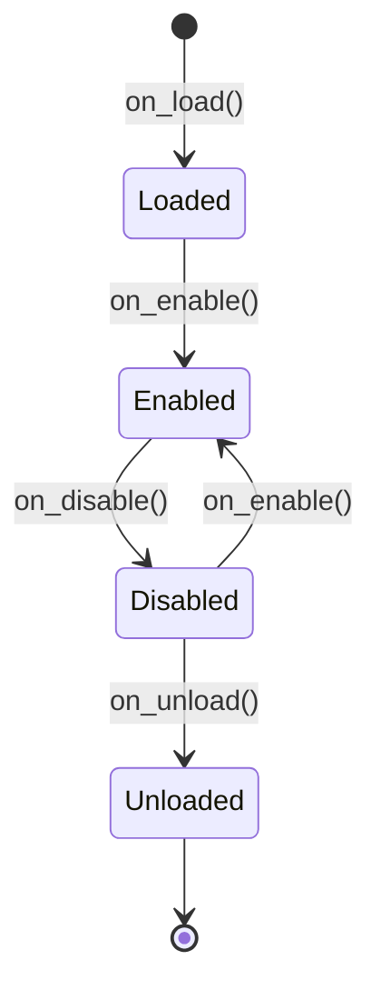

# Plugin Development Guide

This guide explains how to create custom plugins for the MCP Game League system, including strategy plugins, game plugins, and extension plugins.

## Table of Contents

1. [Plugin Architecture](#plugin-architecture)
2. [Strategy Plugins](#strategy-plugins)
3. [Plugin Discovery](#plugin-discovery)
4. [Plugin Lifecycle](#plugin-lifecycle)
5. [Best Practices](#best-practices)
6. [Testing Plugins](#testing-plugins)
7. [Example Plugins](#example-plugins)

## Plugin Architecture

The MCP Game League uses a flexible plugin architecture with:

- **Plugin Interface**: Base abstraction for all plugins
- **Plugin Registry**: Centralized plugin management
- **Discovery Mechanism**: Automatic plugin loading via entry points or directory scanning
- **Lifecycle Management**: Load → Enable → Disable → Unload

### Core Components

```
src/common/plugins/
├── base.py          # Plugin interface and metadata
├── registry.py      # Plugin registry (singleton)
└── discovery.py     # Automatic plugin discovery
```

## Strategy Plugins

Strategy plugins are the most common type, allowing you to add custom AI strategies without modifying the core codebase.

### 1. Basic Strategy Plugin

Create a new strategy by inheriting from `Strategy` and using the `@strategy_plugin` decorator:

```python
from src.agents.strategies.base import Strategy
from src.agents.strategies.plugin_registry import strategy_plugin
from src.agents.strategies.types import StrategyConfig, GameState, Move

@strategy_plugin(
    name="my_custom_strategy",
    version="1.0.0",
    description="My custom game theory strategy",
    category="custom"
)
class MyCustomStrategy(Strategy):
    """Custom strategy with unique decision-making logic."""

    def __init__(self, config: StrategyConfig = None):
        super().__init__(config)
        self.history = []  # Track past moves

    async def decide_move(self, game_state: GameState) -> Move:
        """Make a move decision based on game state."""
        # Your custom logic here
        if not self.history:
            # First move: random
            return self._random_move(game_state)

        # Subsequent moves: analyze history
        opponent_pattern = self._detect_pattern()
        return self._counter_move(opponent_pattern)

    def _random_move(self, game_state: GameState) -> Move:
        """Make a random move."""
        import random
        return random.choice(game_state.valid_moves)

    def _detect_pattern(self) -> str:
        """Detect opponent patterns from history."""
        # Analyze self.history
        pass

    def _counter_move(self, pattern: str) -> Move:
        """Generate counter-move based on detected pattern."""
        pass

    def _observe_outcome(self, move: Move, outcome: dict, game_state: GameState) -> None:
        """Called after each round to learn from outcomes."""
        self.history.append({
            'move': move,
            'outcome': outcome,
            'game_state': game_state
        })
```

### 2. Advanced Strategy with Configuration

Strategies can accept configuration parameters:

```python
@strategy_plugin(
    name="adaptive_q_learning",
    version="2.1.0",
    description="Q-Learning with adaptive learning rate",
    category="machine_learning"
)
class AdaptiveQLearningStrategy(Strategy):
    """Q-Learning strategy with adaptive parameters."""

    def __init__(self, config: StrategyConfig = None):
        super().__init__(config)

        # Read from config
        self.learning_rate = config.parameters.get("learning_rate", 0.1)
        self.discount_factor = config.parameters.get("discount_factor", 0.9)
        self.exploration_rate = config.parameters.get("exploration_rate", 0.2)

        # Initialize Q-table
        self.q_table = {}

    async def decide_move(self, game_state: GameState) -> Move:
        """Q-Learning decision with epsilon-greedy exploration."""
        state_key = self._encode_state(game_state)

        # Epsilon-greedy: explore vs exploit
        if random.random() < self.exploration_rate:
            return random.choice(game_state.valid_moves)

        # Exploit: choose best known move
        if state_key not in self.q_table:
            self.q_table[state_key] = {move: 0.0 for move in game_state.valid_moves}

        best_move = max(
            self.q_table[state_key].items(),
            key=lambda item: item[1]
        )[0]

        return best_move

    def _observe_outcome(self, move: Move, outcome: dict, game_state: GameState) -> None:
        """Update Q-values based on observed outcome."""
        state_key = self._encode_state(game_state)
        reward = outcome.get('reward', 0)

        # Q-learning update rule
        old_value = self.q_table[state_key][move]
        next_max = max(self.q_table.get(state_key, {}).values(), default=0)

        new_value = old_value + self.learning_rate * (
            reward + self.discount_factor * next_max - old_value
        )

        self.q_table[state_key][move] = new_value

        # Adaptive learning rate decay
        self.learning_rate *= 0.999

    def _encode_state(self, game_state: GameState) -> str:
        """Encode game state as hashable key."""
        return f"{game_state.round}_{game_state.opponent_id}_{game_state.score}"
```

### 3. Strategy Configuration

Create a configuration file for your strategy:

**`config/strategies/my_strategy_config.json`**:
```json
{
  "strategies": {
    "my_custom_strategy": {
      "enabled": true,
      "parameters": {
        "aggressiveness": 0.7,
        "risk_tolerance": 0.5
      }
    },
    "adaptive_q_learning": {
      "enabled": true,
      "parameters": {
        "learning_rate": 0.1,
        "discount_factor": 0.9,
        "exploration_rate": 0.2
      }
    }
  }
}
```

## Plugin Discovery

Plugins can be discovered in two ways:

### 1. Entry Points (Recommended for Packages)

Add your plugin to `pyproject.toml`:

```toml
[project.entry-points."mcp_game.plugins"]
my_custom_strategy = "my_package.strategies:MyCustomStrategyPlugin"
advanced_analytics = "my_package.analytics:AnalyticsPlugin"
```

### 2. Directory Scanning (Development)

Place your plugin in the `plugins/` directory:

```bash
plugins/
├── my_strategy_plugin.py
└── analytics_plugin.py
```

Files matching `*_plugin.py` are automatically discovered.

### 3. Manual Registration

Register plugins programmatically:

```python
from src.common.plugins import get_plugin_registry
from my_package import MyPlugin

registry = get_plugin_registry()
await registry.register_plugin(MyPlugin(), auto_enable=True)
```

## Plugin Lifecycle

### 1. Plugin Interface

All plugins must implement the `PluginInterface`:

```python
from src.common.plugins.base import PluginInterface, PluginMetadata, PluginContext

class MyPlugin(PluginInterface):
    """Custom plugin implementation."""

    def get_metadata(self) -> PluginMetadata:
        """Return plugin metadata."""
        return PluginMetadata(
            name="my_plugin",
            version="1.0.0",
            author="Your Name",
            description="My custom plugin for XYZ",
            dependencies=[]  # Optional: list of required plugins
        )

    async def on_load(self, context: PluginContext) -> None:
        """Called when plugin is loaded (initialization)."""
        self.logger = context.logger
        self.config = context.config
        self.logger.info(f"Loading plugin: {self.get_metadata().name}")

    async def on_enable(self, context: PluginContext) -> None:
        """Called when plugin is enabled (start running)."""
        self.logger.info("Plugin enabled")
        # Register event handlers, start background tasks, etc.

    async def on_disable(self, context: PluginContext) -> None:
        """Called when plugin is disabled (stop running)."""
        self.logger.info("Plugin disabled")
        # Unregister handlers, stop tasks, cleanup

    async def on_unload(self, context: PluginContext) -> None:
        """Called when plugin is unloaded (final cleanup)."""
        self.logger.info("Plugin unloaded")
        # Release resources, save state, etc.
```

### 2. Lifecycle Stages



### 3. Dependency Management

Plugins can depend on other plugins:

```python
def get_metadata(self) -> PluginMetadata:
    return PluginMetadata(
        name="advanced_analytics",
        version="1.0.0",
        dependencies=["basic_telemetry", "data_collector"]
    )
```

The plugin system automatically:
- Resolves dependencies using topological sort
- Loads plugins in correct order
- Validates all dependencies are present

## Best Practices

### 1. Configuration

**DO**: Use configuration files for tunable parameters

```python
@strategy_plugin(name="my_strategy", version="1.0.0")
class MyStrategy(Strategy):
    def __init__(self, config: StrategyConfig = None):
        super().__init__(config)
        self.param = config.parameters.get("param", default_value)
```

**DON'T**: Hardcode parameters

```python
class MyStrategy(Strategy):
    def __init__(self):
        self.param = 0.75  # Bad: not configurable
```

### 2. Error Handling

**DO**: Handle errors gracefully

```python
async def decide_move(self, game_state: GameState) -> Move:
    try:
        return await self._complex_analysis(game_state)
    except Exception as e:
        self.logger.error(f"Analysis failed: {e}")
        return self._fallback_move(game_state)
```

**DON'T**: Let exceptions crash the system

```python
async def decide_move(self, game_state: GameState) -> Move:
    result = await self._complex_analysis(game_state)  # May raise
    return result  # No error handling
```

### 3. Resource Management

**DO**: Clean up resources in `on_disable` and `on_unload`

```python
async def on_load(self, context: PluginContext):
    self.db_connection = await create_connection()

async def on_unload(self, context: PluginContext):
    await self.db_connection.close()
```

**DON'T**: Leave resources open

```python
async def on_load(self, context: PluginContext):
    self.db_connection = await create_connection()
    # No cleanup in on_unload!
```

### 4. Testing

**DO**: Write unit tests for your plugin

```python
@pytest.mark.asyncio
async def test_my_strategy():
    strategy = MyCustomStrategy()
    game_state = GameState(...)

    move = await strategy.decide_move(game_state)

    assert move in game_state.valid_moves
```

**DO**: Test plugin lifecycle

```python
@pytest.mark.asyncio
async def test_plugin_lifecycle():
    plugin = MyPlugin()
    context = PluginContext(...)

    await plugin.on_load(context)
    await plugin.on_enable(context)
    await plugin.on_disable(context)
    await plugin.on_unload(context)
```

### 5. Performance

**DO**: Profile performance-critical code

```python
async def decide_move(self, game_state: GameState) -> Move:
    start = time.time()
    move = await self._compute_move(game_state)
    duration = time.time() - start

    if duration > 0.1:
        self.logger.warning(f"Slow decision: {duration:.3f}s")

    return move
```

**DO**: Use async operations for I/O

```python
async def _load_data(self):
    async with aiohttp.ClientSession() as session:
        async with session.get(url) as response:
            return await response.json()
```

## Testing Plugins

### 1. Unit Tests

```python
import pytest
from my_package import MyCustomStrategy

@pytest.fixture
def strategy():
    return MyCustomStrategy()

@pytest.mark.asyncio
async def test_strategy_initialization(strategy):
    """Test strategy initializes correctly."""
    assert strategy is not None
    assert strategy.history == []

@pytest.mark.asyncio
async def test_strategy_first_move(strategy):
    """Test strategy makes valid first move."""
    game_state = GameState(
        round=1,
        valid_moves=["cooperate", "defect"],
        opponent_id="opponent1",
        score=0
    )

    move = await strategy.decide_move(game_state)

    assert move in game_state.valid_moves

@pytest.mark.asyncio
async def test_strategy_learns_from_outcomes(strategy):
    """Test strategy observes and learns."""
    game_state = GameState(...)
    move = "cooperate"
    outcome = {"reward": 3, "opponent_move": "cooperate"}

    strategy._observe_outcome(move, outcome, game_state)

    assert len(strategy.history) == 1
    assert strategy.history[0]['move'] == move
```

### 2. Integration Tests

```python
@pytest.mark.asyncio
async def test_strategy_registration():
    """Test strategy can be registered and discovered."""
    from src.agents.strategies import get_strategy_plugin_registry

    registry = get_strategy_plugin_registry()

    # Strategy should be auto-registered via decorator
    assert registry.is_registered("my_custom_strategy")

    # Should be able to create instance
    strategy = registry.create_strategy("my_custom_strategy")
    assert isinstance(strategy, MyCustomStrategy)
```

### 3. Performance Tests

```python
@pytest.mark.asyncio
async def test_strategy_performance(strategy, benchmark):
    """Benchmark strategy performance."""
    game_state = GameState(...)

    # Should decide in < 100ms
    start = time.perf_counter()
    move = await strategy.decide_move(game_state)
    duration = time.perf_counter() - start

    assert duration < 0.1  # 100ms
```

## Example Plugins

### 1. Simple Counter Strategy

```python
@strategy_plugin(name="counter", version="1.0.0")
class CounterStrategy(Strategy):
    """Always do the opposite of opponent's last move."""

    def __init__(self, config: StrategyConfig = None):
        super().__init__(config)
        self.last_opponent_move = None

    async def decide_move(self, game_state: GameState) -> Move:
        if self.last_opponent_move is None:
            return "cooperate"  # Default first move

        # Counter opponent's last move
        return "defect" if self.last_opponent_move == "cooperate" else "cooperate"

    def _observe_outcome(self, move: Move, outcome: dict, game_state: GameState):
        self.last_opponent_move = outcome.get("opponent_move")
```

### 2. Probabilistic Strategy

```python
@strategy_plugin(name="probabilistic", version="1.0.0")
class ProbabilisticStrategy(Strategy):
    """Make moves based on configurable probabilities."""

    def __init__(self, config: StrategyConfig = None):
        super().__init__(config)
        self.cooperate_prob = config.parameters.get("cooperate_probability", 0.7)

    async def decide_move(self, game_state: GameState) -> Move:
        if random.random() < self.cooperate_prob:
            return "cooperate"
        return "defect"
```

### 3. Machine Learning Strategy

See `/examples/plugins/quantum_strategy_plugin.py` for a complete ML-based strategy example.

## Plugin Configuration

### Global Plugin Configuration

**`config/plugins/plugins_config.json`**:
```json
{
  "plugin_discovery": {
    "enabled": true,
    "entry_point_group": "mcp_game.plugins",
    "directory_scan": {
      "enabled": true,
      "paths": [
        "plugins",
        "~/.mcp_game/plugins"
      ],
      "pattern": "*_plugin.py"
    },
    "auto_enable": true
  },
  "strategy_plugins": {
    "auto_discover": true,
    "allow_overrides": false
  }
}
```

## Troubleshooting

### Plugin Not Found

**Problem**: Plugin not discovered

**Solutions**:
1. Check plugin file name matches pattern `*_plugin.py`
2. Verify plugin directory is in `plugins_config.json`
3. Ensure `@strategy_plugin` decorator is applied
4. Check for import errors: `python -c "import my_plugin"`

### Dependency Errors

**Problem**: Plugin fails to load due to missing dependencies

**Solutions**:
1. Check `PluginMetadata.dependencies` are correct
2. Ensure dependency plugins are installed
3. Verify plugin load order (dependencies load first)

### Performance Issues

**Problem**: Strategy decisions are slow

**Solutions**:
1. Profile with `cProfile`: `python -m cProfile -s cumulative main.py`
2. Use async operations for I/O
3. Cache expensive computations
4. Reduce algorithmic complexity

## Resources

- [Plugin System Architecture](/docs/ARCHITECTURE.md)
- [Example Plugins](/examples/plugins/)
- [Strategy Pattern Documentation](/docs/GAME_THEORY_STRATEGIES.md)
- [Testing Guide](/docs/TESTING.md)

## Support

For questions or issues:
- Open an issue: https://github.com/your-org/mcp-game-league/issues
- Documentation: https://your-org.github.io/mcp-game-league
- Discord: https://discord.gg/your-server
