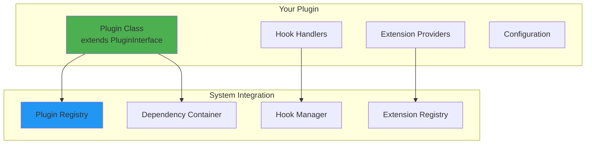
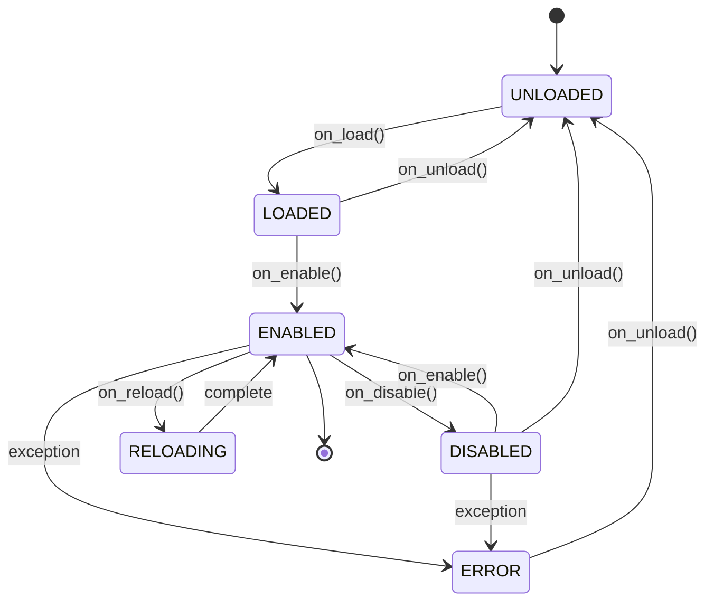

# Plugin Development Guide

## 🎯 Overview

This guide provides comprehensive instructions for developing production-grade plugins for the MCP Multi-Agent Game System. By the end of this guide, you'll be able to create plugins that integrate seamlessly with the system's extensibility architecture.

**Audience:** Plugin Developers  
**Level:** Intermediate to Advanced  
**Est. Time:** 2 hours

---

## Table of Contents

1. [Quick Start](#quick-start)
2. [Plugin Architecture](#plugin-architecture)
3. [Plugin Lifecycle](#plugin-lifecycle)
4. [Creating Your First Plugin](#creating-your-first-plugin)
5. [Advanced Patterns](#advanced-patterns)
6. [Testing Plugins](#testing-plugins)
7. [Publishing Plugins](#publishing-plugins)
8. [Best Practices](#best-practices)
9. [Troubleshooting](#troubleshooting)

---

## Quick Start

### 5-Minute Plugin

```python
"""
minimal_plugin.py - Simplest possible plugin
"""

from src.common.plugins.base import PluginInterface, PluginMetadata

class HelloPlugin(PluginInterface):
    """Minimal plugin example."""
    
    def get_metadata(self) -> PluginMetadata:
        return PluginMetadata(
            name="hello_plugin",
            version="1.0.0",
            description="Says hello"
        )
    
    async def on_enable(self, context):
        context.logger.info("Hello from plugin!")
```

**Register and use:**

```python
from src.common.plugins.registry import get_plugin_registry

# Register
registry = get_plugin_registry()
await registry.register_plugin(HelloPlugin(), auto_enable=True)

# Plugin is now active!
```

---

## Plugin Architecture

### Components



### Key Abstractions

1. **PluginInterface** - Base class all plugins inherit from
2. **PluginMetadata** - Plugin information and requirements
3. **PluginContext** - Runtime environment and services
4. **Hook Handlers** - Functions executed at specific points
5. **Extension Providers** - Implementations of extension points

---

## Plugin Lifecycle

### States



### Lifecycle Methods

| Method | When Called | Purpose |
|--------|-------------|---------|
| `on_validate()` | Before loading | Security/compatibility checks |
| `on_load()` | During registration | Initialize plugin |
| `on_configure()` | After loading | Apply configuration |
| `on_enable()` | When enabled | Register hooks, start operations |
| `on_disable()` | When disabled | Unregister hooks, stop operations |
| `on_reload()` | Hot reload | Update code while preserving state |
| `on_unload()` | Before removal | Final cleanup |
| `on_error()` | On exception | Error handling |

---

## Creating Your First Plugin

### Step 1: Create Plugin File

Create `my_plugin.py` in the `plugins/` directory:

```python
"""
My First Plugin
===============

A complete plugin example with all best practices.
"""

from src.common.plugins.base import (
    PluginInterface,
    PluginMetadata,
    PluginContext,
    PluginCapability,
)
from src.common.hooks.hook_manager import get_hook_manager
from src.common.hooks.types import HookContext, HookPriority
from src.common.logger import get_logger

logger = get_logger(__name__)


class MyFirstPlugin(PluginInterface):
    """
    My first plugin that tracks match statistics.
    
    Configuration:
        {
            "enabled": true,
            "log_level": "INFO",
            "save_stats": true
        }
    """
    
    def __init__(self):
        super().__init__()
        self.stats = {
            "matches_played": 0,
            "total_rounds": 0
        }
        self.hook_ids = []
        self.config = {}
    
    # Step 2: Define Metadata
    def get_metadata(self) -> PluginMetadata:
        """Provide plugin information."""
        return PluginMetadata(
            name="my_first_plugin",
            version="1.0.0",
            author="Your Name",
            description="Tracks basic game statistics",
            
            # Capabilities
            capabilities=[
                PluginCapability.HOT_RELOAD,
                PluginCapability.PROVIDES_HOOKS,
            ],
            
            # Tags for discovery
            tags=["statistics", "monitoring"],
            
            # Optional metadata
            homepage="https://github.com/yourusername/my-plugin",
            license="MIT",
            
            # Version requirements
            min_system_version="3.0.0",
        )
    
    # Step 3: Validation (Optional)
    async def on_validate(self, context: PluginContext) -> bool:
        """
        Validate plugin can run in this environment.
        
        This is your chance to check:
        - Required dependencies are available
        - System version compatibility
        - Required permissions
        - Configuration validity
        """
        # Check if hook manager is available
        if not context.hook_manager:
            logger.error("Hook manager not available")
            return False
        
        # Check if running correct Python version
        import sys
        if sys.version_info < (3, 11):
            logger.error("Requires Python 3.11+")
            return False
        
        logger.info("Plugin validation passed")
        return True
    
    # Step 4: Configuration (Optional)
    async def on_configure(self, context: PluginContext, config: dict) -> None:
        """Apply plugin configuration."""
        self.config = {
            "log_level": config.get("log_level", "INFO"),
            "save_stats": config.get("save_stats", True),
        }
        
        context.logger.info(f"Plugin configured: {self.config}")
    
    # Step 5: Initialization
    async def on_load(self, context: PluginContext) -> None:
        """Initialize plugin resources."""
        await super().on_load(context)
        
        # Setup any resources needed
        context.logger.info("Plugin loaded successfully")
    
    # Step 6: Enable Plugin
    async def on_enable(self, context: PluginContext) -> None:
        """Enable plugin and register hooks."""
        await super().on_enable(context)
        
        # Register hooks
        hook_manager = context.hook_manager
        
        # Hook 1: Match started
        hook_id = hook_manager.register(
            hook_name="match.started",
            handler=self._on_match_started,
            priority=HookPriority.NORMAL.value,
            plugin_name=self.get_metadata().name
        )
        self.hook_ids.append(hook_id)
        
        # Hook 2: Round completed
        hook_id = hook_manager.register(
            hook_name="round.completed",
            handler=self._on_round_completed,
            priority=HookPriority.NORMAL.value,
            plugin_name=self.get_metadata().name
        )
        self.hook_ids.append(hook_id)
        
        context.logger.info(
            f"Plugin enabled with {len(self.hook_ids)} hooks"
        )
    
    # Step 7: Hook Handlers
    async def _on_match_started(self, context: HookContext) -> None:
        """Called when match starts."""
        self.stats["matches_played"] += 1
        match_id = context.get("match_id")
        logger.info(f"Match {match_id} started (total: {self.stats['matches_played']})")
    
    async def _on_round_completed(self, context: HookContext) -> None:
        """Called when round completes."""
        self.stats["total_rounds"] += 1
        logger.debug(f"Round completed (total: {self.stats['total_rounds']})")
    
    # Step 8: Cleanup
    async def on_disable(self, context: PluginContext) -> None:
        """Disable plugin and cleanup."""
        # Unregister all hooks
        hook_manager = context.hook_manager
        for hook_id in self.hook_ids:
            hook_manager.unregister(hook_id)
        
        self.hook_ids.clear()
        
        # Save stats if configured
        if self.config.get("save_stats"):
            self._save_stats()
        
        await super().on_disable(context)
        context.logger.info("Plugin disabled")
    
    async def on_unload(self, context: PluginContext) -> None:
        """Final cleanup before plugin removal."""
        # Clean up any remaining resources
        self.stats.clear()
        
        await super().on_unload(context)
        context.logger.info("Plugin unloaded")
    
    # Step 9: Hot Reload Support (Optional)
    async def on_reload(self, context: PluginContext) -> None:
        """Hot reload while preserving state."""
        # Save state
        saved_stats = self.stats.copy()
        
        # Reload
        await self.on_disable(context)
        await self.on_enable(context)
        
        # Restore state
        self.stats = saved_stats
        
        context.logger.info("Plugin reloaded with state preserved")
    
    # Step 10: Public API
    def get_statistics(self) -> dict:
        """Get collected statistics."""
        return self.stats.copy()
    
    def reset_statistics(self) -> None:
        """Reset statistics."""
        self.stats = {
            "matches_played": 0,
            "total_rounds": 0
        }
    
    def _save_stats(self) -> None:
        """Save statistics to file."""
        import json
        from pathlib import Path
        
        stats_file = Path("data/plugin_stats.json")
        stats_file.parent.mkdir(parents=True, exist_ok=True)
        
        with open(stats_file, "w") as f:
            json.dump(self.stats, f, indent=2)
        
        logger.debug(f"Statistics saved to {stats_file}")
```

### Step 2: Test Your Plugin

```python
"""
test_my_plugin.py - Plugin tests
"""

import pytest
from my_plugin import MyFirstPlugin
from src.common.plugins.registry import PluginRegistry
from src.common.plugins.base import PluginContext
from src.common.hooks.hook_manager import HookManager
from src.common.logger import get_logger

@pytest.mark.asyncio
async def test_plugin_lifecycle():
    """Test complete plugin lifecycle."""
    # Setup
    plugin = MyFirstPlugin()
    registry = PluginRegistry()
    hook_manager = HookManager()
    
    context = PluginContext(
        registry=registry,
        config={},
        logger=get_logger(__name__),
        hook_manager=hook_manager
    )
    
    registry.set_context(context)
    
    # Test registration
    await registry.register_plugin(plugin)
    assert registry.is_registered("my_first_plugin")
    
    # Test enable
    await registry.enable_plugin("my_first_plugin")
    assert registry.is_enabled("my_first_plugin")
    
    # Test hook execution
    result = await hook_manager.execute(
        "match.started",
        context_data={"match_id": "M001"}
    )
    assert result.success
    assert plugin.stats["matches_played"] == 1
    
    # Test disable
    await registry.disable_plugin("my_first_plugin")
    assert not registry.is_enabled("my_first_plugin")


@pytest.mark.asyncio
async def test_plugin_hot_reload():
    """Test hot reload functionality."""
    plugin = MyFirstPlugin()
    # ... setup ...
    
    # Accumulate some state
    plugin.stats["matches_played"] = 10
    
    # Reload
    await plugin.on_reload(context)
    
    # State should be preserved
    assert plugin.stats["matches_played"] == 10
```

### Step 3: Register and Use

```python
"""
Using your plugin
"""

from src.common.plugins.discovery import auto_discover_and_register

# Automatic discovery from plugins/ directory
config = {
    "directory_scan": {
        "enabled": True,
        "paths": ["plugins"],
        "pattern": "*_plugin.py"
    }
}

count = await auto_discover_and_register(config, auto_enable=True)
print(f"Loaded {count} plugins")

# Or manual registration
from src.common.plugins.registry import get_plugin_registry
from my_plugin import MyFirstPlugin

registry = get_plugin_registry()
await registry.register_plugin(MyFirstPlugin(), auto_enable=True)
```

---

## Advanced Patterns

### Pattern 1: Providing Extension Points

```python
from src.common.extension_points import extension_provider

@extension_provider("validators.move", priority=100)
class CustomMoveValidator:
    """Validates moves according to custom rules."""
    
    def validate(self, move: int, context: dict) -> bool:
        # Custom validation logic
        return 1 <= move <= 5 and context.get("time_taken", 0) < 30

class MyPlugin(PluginInterface):
    """Plugin that provides validators."""
    
    def get_extensions(self) -> dict:
        return {
            "validators.move": CustomMoveValidator,
        }
```

### Pattern 2: Using Dependency Injection

```python
from src.common.dependency_injection import get_container

class MyPlugin(PluginInterface):
    """Plugin with dependency injection."""
    
    def __init__(self):
        super().__init__()
        self.logger = None
        self.config = None
    
    async def on_enable(self, context: PluginContext) -> None:
        await super().on_enable(context)
        
        # Resolve dependencies from container
        container = get_container()
        self.logger = container.try_resolve(ILogger)
        self.config = container.try_resolve(IConfig)
```

### Pattern 3: Middleware Integration

```python
from src.middleware.base import Middleware, RequestContext, ResponseContext

class LoggingMiddleware(Middleware):
    """Custom middleware for logging."""
    
    def __init__(self):
        super().__init__("plugin_logging")
        self.logger = get_logger(__name__)
    
    async def before(self, context: RequestContext) -> RequestContext:
        self.logger.info(f"Request: {context.request}")
        return context
    
    async def after(self, context: ResponseContext) -> ResponseContext:
        self.logger.info(f"Response: {context.response}")
        return context

class MyPlugin(PluginInterface):
    """Plugin that adds middleware."""
    
    async def on_enable(self, context: PluginContext) -> None:
        # Register middleware
        from src.middleware.pipeline import get_pipeline
        
        pipeline = get_pipeline()
        pipeline.add(LoggingMiddleware())
```

### Pattern 4: Event Publishing

```python
from src.common.events.bus import get_event_bus

class MyPlugin(PluginInterface):
    """Plugin that publishes events."""
    
    async def on_enable(self, context: PluginContext) -> None:
        self.event_bus = context.event_bus
    
    async def _on_special_condition(self, context: HookContext) -> None:
        # Publish custom event
        await self.event_bus.publish(
            "plugin.special_condition",
            {
                "plugin_name": self.get_metadata().name,
                "condition": "threshold_exceeded",
                "value": 100
            }
        )
```

---

## Testing Plugins

### Unit Testing

```python
import pytest
from unittest.mock import Mock, AsyncMock

@pytest.fixture
def plugin():
    """Create plugin instance for testing."""
    return MyPlugin()

@pytest.fixture
def context():
    """Create mock context."""
    context = Mock(spec=PluginContext)
    context.logger = Mock()
    context.hook_manager = Mock()
    context.is_production = Mock(return_value=False)
    return context

@pytest.mark.asyncio
async def test_plugin_enable(plugin, context):
    """Test plugin enable."""
    await plugin.on_enable(context)
    
    assert plugin.is_enabled
    context.logger.info.assert_called()
```

### Integration Testing

```python
@pytest.mark.asyncio
async def test_plugin_with_real_system():
    """Test plugin in real system."""
    # Setup real components
    registry = PluginRegistry()
    hook_manager = HookManager()
    
    context = PluginContext(
        registry=registry,
        config={},
        logger=get_logger(__name__),
        hook_manager=hook_manager
    )
    
    # Register and enable
    plugin = MyPlugin()
    await registry.register_plugin(plugin)
    await registry.enable_plugin(plugin.get_metadata().name)
    
    # Test hook execution
    result = await hook_manager.execute(
        "match.started",
        context_data={"match_id": "TEST001"}
    )
    
    assert result.success
    assert result.hooks_executed > 0
```

---

## Best Practices

### ✅ DO

1. **Always** call `super().__init__()` in plugin constructor
2. **Always** clean up resources in `on_disable()` and `on_unload()`
3. **Document** all configuration options
4. **Use** semantic versioning (MAJOR.MINOR.PATCH)
5. **Provide** comprehensive metadata
6. **Handle** errors gracefully
7. **Log** important events
8. **Test** thoroughly
9. **Use** type hints
10. **Follow** naming conventions

### ❌ DON'T

1. **Don't** modify core system files
2. **Don't** use global state
3. **Don't** block the event loop
4. **Don't** assume services are always available
5. **Don't** hard-code configuration
6. **Don't** ignore errors silently
7. **Don't** create circular dependencies
8. **Don't** access private APIs
9. **Don't** skip validation
10. **Don't** forget to unregister hooks

### Code Organization

```
my_plugin/
├── __init__.py
├── plugin.py              # Main plugin class
├── handlers/              # Hook handlers
│   ├── __init__.py
│   ├── match_handlers.py
│   └── player_handlers.py
├── extensions/            # Extension providers
│   ├── __init__.py
│   └── validators.py
├── config/                # Configuration schemas
│   └── default.json
├── tests/                 # Plugin tests
│   ├── __init__.py
│   ├── test_plugin.py
│   └── test_handlers.py
├── README.md
├── LICENSE
└── setup.py
```

---

## Publishing Plugins

### Package Structure

```toml
# pyproject.toml
[project]
name = "mcp-game-my-plugin"
version = "1.0.0"
description = "My awesome MCP Game plugin"
authors = [{name = "Your Name", email = "you@example.com"}]
license = {text = "MIT"}
requires-python = ">=3.11"
dependencies = [
    "mcp-game-league>=3.0.0",
]

[project.entry-points."mcp_game.plugins"]
my_plugin = "my_plugin.plugin:MyPlugin"
```

### Publishing to PyPI

```bash
# Build package
python -m build

# Upload to PyPI
python -m twine upload dist/*
```

### Plugin Marketplace

For discoverability, submit your plugin to the plugin marketplace:
https://github.com/your-org/mcp-game-plugins

---

## Troubleshooting

### Plugin Not Loading

**Problem:** Plugin not discovered

**Solutions:**
1. Check file naming (must end with `_plugin.py`)
2. Verify plugin directory is in config
3. Check class inherits from `PluginInterface`
4. Ensure `get_metadata()` is implemented

### Hooks Not Executing

**Problem:** Hook handlers not called

**Solutions:**
1. Verify hook registration in `on_enable()`
2. Check hook name spelling
3. Ensure hook_manager is available
4. Verify plugin is enabled

### Hot Reload Fails

**Problem:** State lost during reload

**Solutions:**
1. Implement `on_reload()` method
2. Save/restore state explicitly
3. Use persistent storage for critical state

### Configuration Not Applied

**Problem:** Config changes not taking effect

**Solutions:**
1. Implement `on_configure()` method
2. Check config file syntax
3. Verify config path is correct
4. Log config values for debugging

---

## Conclusion

You now have everything you need to create production-grade plugins for the MCP Multi-Agent Game System. Key takeaways:

1. ✅ Use `PluginInterface` as your base class
2. ✅ Implement comprehensive metadata
3. ✅ Follow the lifecycle pattern
4. ✅ Clean up resources properly
5. ✅ Test thoroughly
6. ✅ Document your plugin

### Next Steps

1. Create your first plugin following this guide
2. Study the [example plugins](../../examples/plugins/)
3. Read the [EXTENSIBILITY_GUIDE.md](./EXTENSIBILITY_GUIDE.md)
4. Join the community and share your plugins!

### Resources

- [Plugin API Reference](./API.md#plugin-system)
- [Hook Reference](./API.md#hook-system)
- [Extension Points Reference](./API.md#extension-points)
- [Example Plugins](../../examples/plugins/)

---

**Document Version:** 1.0.0  
**Last Updated:** January 4, 2026  
**Maintainer:** MCP Team  
**License:** MIT

