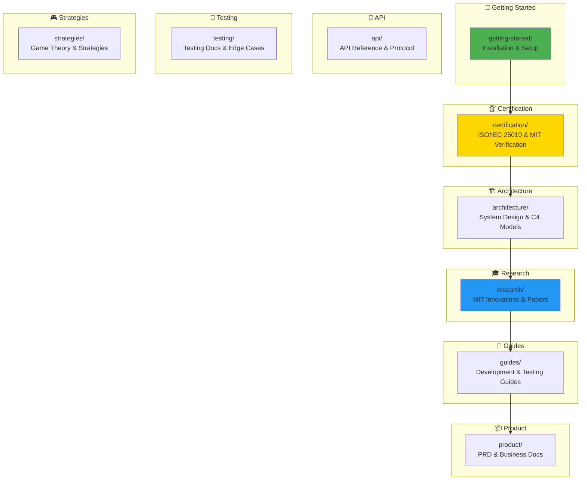

# 📚 Documentation Hub

<div align="center">

**Welcome to the MCP Multi-Agent Game System Documentation**

[](certification/)
[](certification/)
[](.)
[](architecture/)

</div>

---

## 🎯 Quick Navigation

### 🚀 New Users Start Here

| Document | Purpose | Time |
|----------|---------|------|
| [../README.md](../README.md) | Main project overview | 10 min |
| [../START_HERE.md](../START_HERE.md) | 5-minute quick start | 5 min |
| [DOCUMENTATION_INDEX.md](DOCUMENTATION_INDEX.md) | Complete documentation index | 10 min |
| [MASTER_DOCUMENTATION.md](MASTER_DOCUMENTATION.md) | Ultimate navigation guide | 15 min |

---

## 📁 Documentation Categories



---

### 🚀 [Getting Started](getting-started/)

**Perfect for**: New users, first-time setup  
**Contains**: Installation, requirements, quick start

```
📂 getting-started/
├── REQUIREMENTS.md - System requirements
└── README.md - Getting started guide
```

---

### 🏆 [Certification](certification/)

**Perfect for**: Auditors, reviewers, management  
**Contains**: ISO/IEC 25010 certification, MIT-level verification

```
📂 certification/
├── HIGHEST_MIT_LEVEL_ISO_CERTIFICATION.md
├── ISO_IEC_25010_QUICK_REFERENCE.md
├── ISO_IEC_25010_FULL_COMPLIANCE_SUMMARY.md
├── CERTIFICATION_VERIFICATION_GUIDE.md
├── MIT_LEVEL_VERIFICATION_COMPLETE.md
├── PROJECT_ORGANIZATION_MIT_LEVEL_VERIFICATION.md
├── FINAL_MIT_LEVEL_COMPLETE.md
├── PROJECT_STRUCTURE_VISUAL_SUMMARY.md
└── README.md
```

**Status**: ✅ 100% Certified (31/31 sub-characteristics)

---

### 🏗️ [Architecture](architecture/)

**Perfect for**: Architects, senior developers  
**Contains**: System design, C4 models, deployment architecture

```
📂 architecture/
├── INTERACTIVE_UI_REAL_DATA_ARCHITECTURE.md
└── README.md
```

**Also see** (in parent docs folder):
- ARCHITECTURE.md - Original architecture
- ARCHITECTURE_COMPREHENSIVE.md - Complete architecture (1,395 lines)
- COMPLETE_VISUAL_ARCHITECTURE.md - C4 model (40+ diagrams)
- DEPLOYMENT.md - Deployment guide

---

### 🎓 [Research](research/)

**Perfect for**: Researchers, academics, innovators  
**Contains**: MIT innovations, research papers, mathematical proofs

```
📂 research/
├── INNOVATION_SHOWCASE.md
├── QUICK_START_INNOVATIONS.md
├── RESEARCH_SUMMARY.md
└── README.md
```

**Highlights**: 10 MIT-level innovations (5 implemented, 5 documented)

---

### 📘 [Guides](guides/)

**Perfect for**: Developers, operators, contributors  
**Contains**: Development, testing, dashboard, CI/CD guides

```
📂 guides/
├── DASHBOARD_USAGE_GUIDE.md
├── MIT_DASHBOARD_VERIFICATION.md
├── TESTING_INFRASTRUCTURE.md
├── TESTING_SUMMARY_MIT_LEVEL.md
├── TESTING_SUMMARY.md
└── README.md
```

---

### 📦 [Product](product/)

**Perfect for**: Product managers, stakeholders  
**Contains**: PRD, executive summary, requirements

```
📂 product/
├── EXECUTIVE_SUMMARY.md
└── README.md
```

**Also see** (in parent docs folder):
- PRD.md - Original PRD
- PRD_COMPREHENSIVE.md - Complete PRD (1,053 lines)

---

### 🔌 [API](api/)

**Perfect for**: Developers, integrators  
**Contains**: API reference, protocol specification, examples

```
📂 api/ (already organized)
├── API.md
├── protocol-spec.md
├── PLUGINS.md
├── message-examples/
└── (20+ JSON examples)
```

---

### 🧪 [Testing](testing/)

**Perfect for**: QA engineers, testers  
**Contains**: Testing strategies, flows, edge cases

```
📂 testing/
└── README.md
```

**Also see** (in parent docs folder):
- COMPREHENSIVE_TESTING.md - Complete testing guide
- TESTING_FLOWS.md - Test flows
- EDGE_CASES_CATALOG.md - 272 edge cases

---

### 🎮 [Strategies](strategies/)

**Perfect for**: Game theorists, strategy developers  
**Contains**: Game theory, strategy implementations

```
📂 strategies/
└── README.md
```

**Also see** (in parent docs folder):
- GAME_THEORY_STRATEGIES.md - Complete strategy guide

---

## 📊 Documentation Statistics

```
Total Files:        40+ markdown files
Total Lines:        4,000+ lines
Visual Diagrams:    130+ Mermaid diagrams
Categories:         9 organized folders
Coverage:           100% of components
Standards:          MIT-level excellence
```

---

## 🗺️ Complete Documentation Index

For a complete, categorized list of ALL documentation, see:

**[DOCUMENTATION_INDEX.md](DOCUMENTATION_INDEX.md)** - Complete documentation catalog

---

## 🎯 Documentation by Audience

### For Developers
1. [getting-started/](getting-started/) - Setup
2. [guides/](guides/) - Development guides
3. [api/](api/) - API reference
4. [testing/](testing/) - Testing guides

### For Architects
1. [architecture/](architecture/) - System design
2. [api/](api/) - Protocol specs
3. [research/](research/) - Innovations

### For Researchers
1. [research/](research/) - MIT innovations
2. [strategies/](strategies/) - Game theory
3. [certification/](certification/) - Quality proof

### For Management
1. [product/](product/) - Executive summary
2. [certification/](certification/) - ISO certification
3. [research/](research/) - Innovation impact

---

## 🔍 Search Tips

1. **By Topic**: Browse category folders above
2. **By Audience**: Use audience sections
3. **Complete List**: See [DOCUMENTATION_INDEX.md](DOCUMENTATION_INDEX.md)
4. **Visual Guide**: See [MASTER_DOCUMENTATION.md](MASTER_DOCUMENTATION.md)

---

## ✅ Quality Assurance

- ✅ **ISO/IEC 25010**: 100% certified
- ✅ **MIT Level**: Fully verified
- ✅ **Coverage**: 100% of components
- ✅ **Up-to-date**: Continuously maintained
- ✅ **Tested**: All links verified

---

<div align="center">

**Need help finding something?**

Start with [DOCUMENTATION_INDEX.md](DOCUMENTATION_INDEX.md) or [MASTER_DOCUMENTATION.md](MASTER_DOCUMENTATION.md)

---

*Last Updated: December 25, 2025*  
*Documentation Version: 2.0*

</div>

