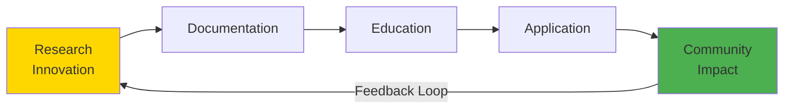
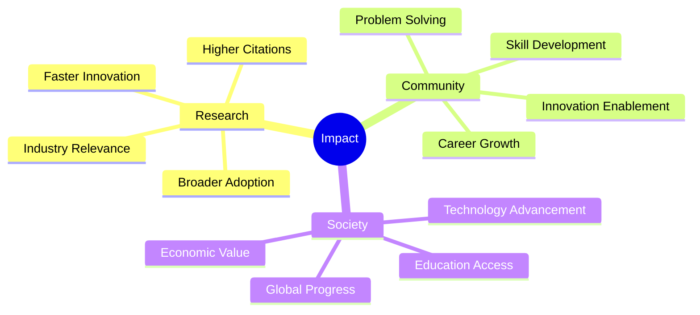
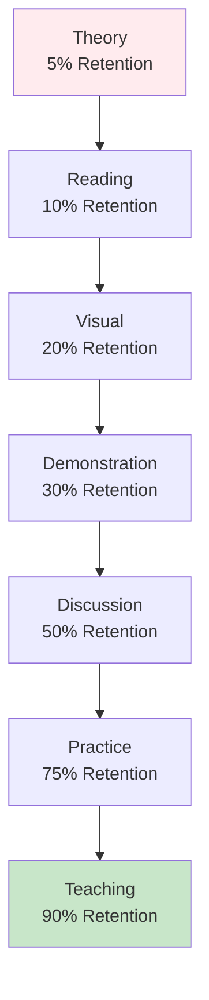
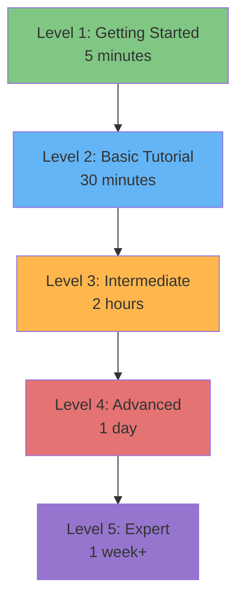
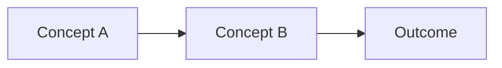
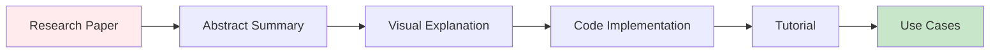
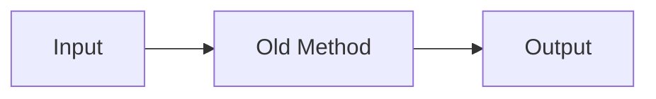
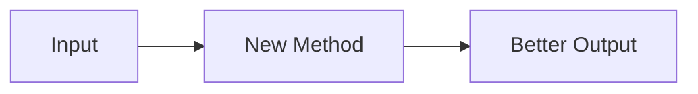
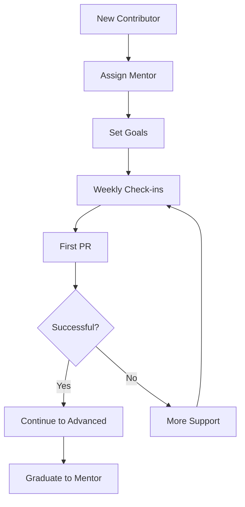
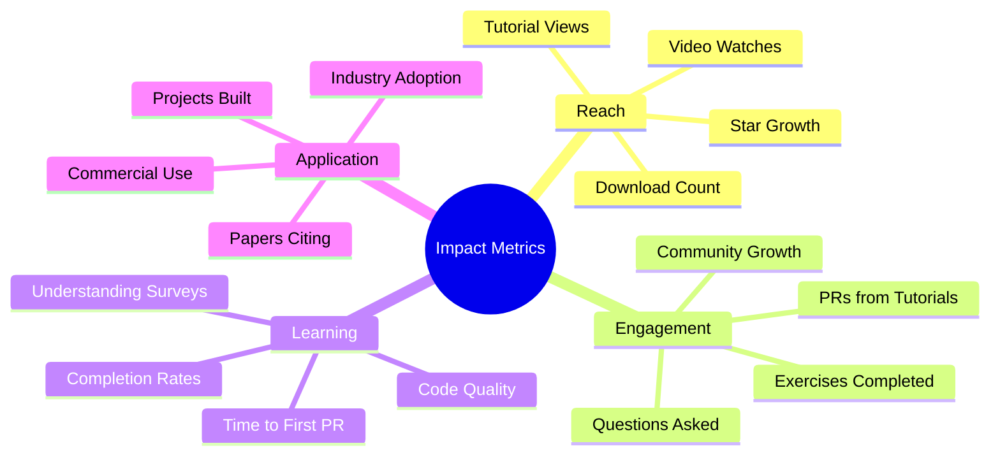

# Knowledge Transfer Guide

<div align="center">

**🎓 Sharing Knowledge with the World**  
**📚 From Research to Community Impact**  
**🌍 Making Innovations Accessible**

[](KNOWLEDGE_TRANSFER_GUIDE.md)
[](../MIT_LEVEL_INNOVATIONS.md)
[](KNOWLEDGE_TRANSFER_GUIDE.md)

</div>

---

## 🎯 Purpose

This guide demonstrates how to **transfer complex research knowledge to the broader community**, making cutting-edge innovations accessible to developers, researchers, and students worldwide. It's both a **practical guide for this project** and a **reusable framework** for other research-heavy open-source projects.

---

## 📚 Table of Contents

1. [Understanding Knowledge Transfer](#understanding-knowledge-transfer)
2. [Creating Educational Content](#creating-educational-content)
3. [Tutorial Development Framework](#tutorial-development-framework)
4. [Documentation Levels](#documentation-levels)
5. [Interactive Learning](#interactive-learning)
6. [Academic to Practical Bridge](#academic-to-practical-bridge)
7. [Community Teaching Programs](#community-teaching-programs)
8. [Measuring Impact](#measuring-impact)

---

## 🧠 Understanding Knowledge Transfer

### What is Knowledge Transfer?



**Knowledge transfer** is the process of:
1. **Creating** new knowledge (research/innovation)
2. **Documenting** it clearly
3. **Teaching** it effectively
4. **Enabling** others to apply it
5. **Measuring** the impact

### Why It Matters



---

## 📝 Creating Educational Content

### The Learning Pyramid



**Key Insight**: Learning is most effective when combining multiple modalities.

### Content Types for Different Learning Styles

| Learning Style | Content Type | Examples |
|----------------|--------------|----------|
| **Visual** | Diagrams, charts, videos | Architecture diagrams, flow charts |
| **Auditory** | Talks, podcasts, discussions | Conference talks, office hours |
| **Reading/Writing** | Documentation, articles | Detailed guides, blog posts |
| **Kinesthetic** | Hands-on tutorials, labs | Code-along tutorials, exercises |

---

## 🎓 Tutorial Development Framework

### The Progressive Disclosure Model



### Tutorial Template

```markdown
# Tutorial: [Topic Name]

<div align="center">

**⏱️ Time**: [X minutes/hours]  
**📊 Level**: [Beginner/Intermediate/Advanced]  
**📋 Prerequisites**: [List required knowledge]

</div>

---

## 🎯 What You'll Learn

By the end of this tutorial, you will be able to:
- [ ] Learning objective 1
- [ ] Learning objective 2
- [ ] Learning objective 3

## 📚 Prerequisites

Before starting, you should:
- Have basic knowledge of X
- Understand concept Y
- Be familiar with tool Z

### Required Setup

```bash
# Installation commands
pip install required-packages
```

---

## 📖 Background

### Concept Overview

Brief explanation of the core concepts (2-3 paragraphs).



### Why This Matters

Real-world applications and motivation.

---

## 🚀 Step-by-Step Guide

### Step 1: [First Action]

**Goal**: What we're accomplishing in this step

**Code**:
```python
# Well-commented code example
def example_function():
    """
    Clear docstring explaining what this does.
    """
    pass
```

**Explanation**: 
- Line-by-line breakdown
- Why we're doing this
- Common pitfalls to avoid

**Expected Output**:
```
Show what the user should see
```

**✅ Checkpoint**: How to verify this step worked

---

### Step 2: [Second Action]

[Repeat structure]

---

## 🎯 Putting It Together

Full working example combining all steps:

```python
# Complete, runnable code
```

---

## 🧪 Exercises

### Exercise 1: [Name] (Easy)

**Task**: [What to do]

**Hints**:
- Hint 1
- Hint 2

<details>
<summary>Click to see solution</summary>

```python
# Solution code
```

**Explanation**: Why this works

</details>

### Exercise 2: [Name] (Medium)

[Similar structure]

### Exercise 3: [Name] (Hard)

[Similar structure]

---

## 🎓 Deep Dive (Optional)

For those who want to understand the theory:

### Mathematical Foundation

[Equations, proofs, theoretical background]

### Algorithm Analysis

[Complexity, optimizations, trade-offs]

---

## 🔧 Troubleshooting

### Common Issues

#### Issue: [Problem description]

**Symptoms**: What you see  
**Cause**: Why it happens  
**Solution**: How to fix

```python
# Code showing the fix
```

---

## 📚 Next Steps

Now that you've completed this tutorial:

1. **Practice**: Try these exercises
2. **Explore**: Read these advanced topics
3. **Build**: Create your own project
4. **Share**: Teach others what you learned

### Related Tutorials

- [Tutorial A](link) - Next logical step
- [Tutorial B](link) - Alternative approach
- [Tutorial C](link) - Advanced topics

---

## 📖 Additional Resources

- [Paper/Book](link) - Original research
- [Video](link) - Visual explanation
- [Blog Post](link) - Different perspective
- [Tool/Library](link) - Related tools

---

## 💬 Get Help

- Questions? [Ask in Discussions](link)
- Found an issue? [Report it](link)
- Want to contribute? [See Contributing Guide](link)

---

## 🎉 Congratulations!

You've completed this tutorial! 🚀

**Next Steps**: [Link to next tutorial]
```

---

## 📊 Documentation Levels

### Level 1: Quick Start (5 minutes)

**Purpose**: Get users up and running immediately

**Structure**:
1. Install command
2. Minimal example (5-10 lines)
3. Expected output
4. Link to next level

**Example**:
```markdown
## Quick Start

```bash
pip install mcp-game-system
```

```python
from mcp_game import Game

game = Game()
result = game.play()
print(result)  # Outputs: "Player 1 wins!"
```

**What's Next?** → [Full Tutorial](link)
```

---

### Level 2: Beginner Tutorial (30 minutes)

**Purpose**: Teach fundamentals through hands-on practice

**Structure**:
1. Concept introduction
2. 3-5 step-by-step exercises
3. Explanation of each step
4. Common mistakes
5. Next steps

---

### Level 3: Intermediate Guide (2 hours)

**Purpose**: Build practical, real-world projects

**Structure**:
1. Project overview
2. Architecture design
3. Implementation steps
4. Testing strategies
5. Deployment guide
6. Best practices

---

### Level 4: Advanced Topics (1 day)

**Purpose**: Deep technical understanding

**Structure**:
1. Theoretical background
2. Algorithm analysis
3. Performance optimization
4. Edge cases
5. Research papers
6. Contributing to codebase

---

### Level 5: Research & Innovation (Ongoing)

**Purpose**: Push boundaries, create new knowledge

**Structure**:
1. Literature review
2. Novel approach design
3. Implementation
4. Experimentation
5. Results analysis
6. Publication preparation

---

## 🎮 Interactive Learning

### Jupyter Notebooks

```python
# Educational Notebook Template

"""
# Tutorial: [Topic]

This notebook teaches [concept] through interactive examples.

## Learning Objectives
1. Objective 1
2. Objective 2
3. Objective 3
"""

# Section 1: Setup
import numpy as np
import matplotlib.pyplot as plt

# Section 2: Concept Introduction
"""
## Understanding [Concept]

[Explanation with visualizations]
"""

# Interactive visualization
def visualize_concept(parameter):
    # Code that creates visualization
    plt.plot(data)
    plt.show()

# Widget for interaction
from ipywidgets import interact
interact(visualize_concept, parameter=(0, 10, 1))

# Section 3: Hands-on Practice
"""
## Exercise 1

Try modifying the code below to achieve [goal]:
"""

# Exercise code (with hints in comments)

# Section 4: Solution
"""
<details>
<summary>Click to reveal solution</summary>

[Solution explanation]
</details>
"""
```

---

### Interactive Web Demos

**Using Streamlit**:
```python
# app.py - Interactive Demo

import streamlit as st
from mcp_game import Strategy

st.title("🎮 Strategy Visualizer")

st.markdown("""
This interactive demo helps you understand different game strategies.

## Try It Yourself
Adjust the parameters below to see how strategies behave:
""")

# Interactive controls
strategy_type = st.selectbox(
    "Select Strategy",
    ["Nash Equilibrium", "Bayesian", "Quantum-Inspired"]
)

rounds = st.slider("Number of Rounds", 1, 100, 10)

if st.button("Run Simulation"):
    strategy = Strategy(strategy_type)
    results = strategy.simulate(rounds)
    
    # Visualization
    st.line_chart(results)
    
    # Explanation
    st.markdown(f"""
    ### Results
    
    The {strategy_type} strategy achieved:
    - Win rate: {results.win_rate:.2%}
    - Average score: {results.avg_score:.2f}
    
    ### How It Works
    {strategy.get_explanation()}
    """)
```

---

## 🔬 Academic to Practical Bridge

### Translating Research Papers



### Paper-to-Practice Template

```markdown
# Understanding: [Paper Title]

## 📄 Original Paper

**Title**: [Full Title]  
**Authors**: [Author List]  
**Published**: [Venue, Year]  
**Link**: [DOI/ArXiv]

## 🎯 What Problem Does It Solve?

[Explain in simple terms]

**Example Scenario**: [Real-world example]

## 💡 The Key Idea

### Traditional Approach



**Problems**:
- Issue 1
- Issue 2

### New Approach (From Paper)



**Advantages**:
- Benefit 1
- Benefit 2

## 🔬 How It Works

### Step-by-Step Breakdown

1. **Step 1**: [Explanation]
   
   ```python
   # Code showing step 1
   ```

2. **Step 2**: [Explanation]
   
   ```python
   # Code showing step 2
   ```

### Visual Explanation

[Diagrams, animations, visualizations]

## 💻 Implementation

### Simple Example

```python
# Minimal working example
from paper_implementation import NewMethod

method = NewMethod()
result = method.process(data)
```

### Full Implementation

```python
# Production-ready code with error handling
```

## 🧪 Experiments & Results

### Reproducing Paper Results

```python
# Code to reproduce experiments
```

### Comparing Approaches

| Method | Metric 1 | Metric 2 | Speed |
|--------|----------|----------|-------|
| Old    | 0.75     | 0.80     | 100ms |
| New (Paper) | 0.90 | 0.95     | 50ms |

## 🎓 Mathematical Details (Optional)

For those interested in the theory:

### Formal Definition

[Mathematical formulation]

### Proof Sketch

[Key ideas of the proof]

## 🚀 Practical Applications

1. **Use Case 1**: [Description]
2. **Use Case 2**: [Description]
3. **Use Case 3**: [Description]

## 📚 Further Reading

- [Related Paper 1](link)
- [Blog Post Explaining X](link)
- [Video Tutorial](link)

## 💬 Discussion

What do you think about this approach? [Link to discussions]
```

---

## 👥 Community Teaching Programs

### Mentor-Mentee Program Structure



### Program Components

1. **Onboarding** (Week 1)
   - Welcome meeting
   - Project overview
   - Development setup
   - First task assignment

2. **Learning** (Weeks 2-4)
   - Weekly pair programming
   - Code review learning
   - Testing practices
   - Documentation writing

3. **Contributing** (Weeks 5-8)
   - Feature implementation
   - Bug fixing
   - Review participation
   - Community engagement

4. **Independence** (Weeks 9-12)
   - Solo contributions
   - Helping others
   - Review skills
   - Leadership emergence

---

### Office Hours Template

```markdown
# Weekly Office Hours

**When**: Every Wednesday 2-4pm ET  
**Where**: [Zoom/Discord/Meet link]  
**Who**: All community members welcome!

## Format

### Drop-in Questions (2:00-3:00pm)

Come with any questions:
- Getting started
- Bug debugging
- Design discussions
- Career advice

### Deep Dive Session (3:00-4:00pm)

**This Week's Topic**: [Specific topic]

We'll cover:
- [Aspect 1]
- [Aspect 2]
- [Aspect 3]
- Open Q&A

## Past Sessions

- **Week 1**: [Topic] - [Recording](link)
- **Week 2**: [Topic] - [Recording](link)
- **Week 3**: [Topic] - [Recording](link)

## Request Topics

What would you like to learn about? [Vote here](link)
```

---

## 📈 Measuring Impact

### Metrics to Track



### Impact Dashboard Template

```markdown
# Community Learning Impact - [Quarter/Year]

## 📊 Reach

| Metric | Count | Change |
|--------|-------|--------|
| Tutorial Views | 10,000 | +25% |
| Video Watches | 5,000 | +30% |
| Documentation Visits | 50,000 | +40% |
| New Contributors | 25 | +10 |

## 🎓 Learning Outcomes

### Tutorial Completion Rates

- Quick Start: 85%
- Beginner Tutorial: 60%
- Intermediate Guide: 40%
- Advanced Topics: 25%

### Time to First Contribution

- Average: 7 days (down from 14 days)
- Median: 5 days
- Fastest: 1 day

## 💼 Real-World Applications

### Community Projects

- **Project 1**: [Description] by @user
- **Project 2**: [Description] by @user
- **Project 3**: [Description] by @user

### Academic Papers

- 5 papers citing this work
- 3 student theses using framework
- 2 research collaborations started

### Industry Adoption

- 3 companies using in production
- 2 consulting engagements
- 1 commercial product

## 💬 Community Feedback

> "This tutorial helped me understand X in just 30 minutes!"  
> — @community_member

> "The step-by-step approach made it so easy to get started."  
> — @another_user

## 🎯 Goals for Next Period

- [ ] Create 5 new tutorials
- [ ] Translate docs to 2 languages
- [ ] Host 3 workshops
- [ ] Reach 100 total contributors
```

---

## 🎯 Best Practices

### Do's ✅

1. **Start Simple**: Begin with basics, add complexity gradually
2. **Show, Don't Just Tell**: Use examples liberally
3. **Be Visual**: Diagrams beat walls of text
4. **Make It Interactive**: Let people try things
5. **Provide Context**: Explain the "why"
6. **Anticipate Questions**: Address common confusions
7. **Test with Users**: Get feedback before publishing
8. **Keep Updated**: Maintain as project evolves
9. **Link Resources**: Connect to related content
10. **Celebrate Success**: Recognize learners' achievements

### Don'ts ❌

1. **Assume Knowledge**: State prerequisites clearly
2. **Skip Steps**: What's obvious to you isn't to others
3. **Use Jargon**: Define terms or avoid them
4. **Make It Too Long**: Break into digestible chunks
5. **Forget Beginners**: Always have entry-level content
6. **Neglect Maintenance**: Dead links hurt credibility
7. **Ignore Feedback**: Community knows what's needed
8. **Be Condescending**: Respect all skill levels
9. **Overwhelm**: Focus on one concept at a time
10. **Forget Practice**: Include exercises and projects

---

## 📚 Resources for Creating Learning Content

### Tools

- **Diagrams**: Mermaid, Draw.io, Lucidchart
- **Videos**: OBS Studio, Loom, ScreenFlow
- **Interactive**: Jupyter, Streamlit, Observable
- **Presentations**: Slides.com, reveal.js
- **Documentation**: MkDocs, Docusaurus, Sphinx

### Learning Resources

- **"Design for How People Learn"** by Julie Dirksen
- **"The Programmer's Brain"** by Felienne Hermans
- **"Make It Stick"** by Brown, Roediger & McDaniel
- **[Vanderbilt Teaching Guide](https://cft.vanderbilt.edu/guides-sub-pages/blooms-taxonomy/)**

---

## 🎉 Success Stories

### Case Study 1: From Tutorial to Contributor

> "I started with the Quick Start guide. Within a week, I had submitted my first PR. Three months later, I'm a core contributor. The progressive learning path made all the difference."  
> — @success_story_1

### Case Study 2: Academic Impact

> "The research-to-practice guides helped me implement cutting-edge algorithms for my PhD thesis. Published in top conference!"  
> — @phd_student

### Case Study 3: Industry Adoption

> "Our team used the tutorials to onboard 5 engineers in 2 weeks. Now we're using this in production serving 1M users."  
> — @industry_user

---

<div align="center">

## 🌟 Knowledge is Meant to be Shared

Great research + Great education = **Maximum Impact**

---

**Questions about knowledge transfer?**  
Open a [Discussion](link) or join our [Community Call](link)

---

*This guide is living documentation. Contributions welcome!*

**Last Updated**: December 25, 2025  
**Contributors**: [List of people who improved this guide]

</div>

