# Open Source Guide: Building Community-Driven Projects

<div align="center">

**🌍 MIT-Level Open Source Excellence**  
**📚 Reusable Patterns & Templates**  
**🎓 Educational Resource for the Community**

[](https://opensource.org)
[](OPEN_SOURCE_GUIDE.md)
[](../MIT_LEVEL_INNOVATIONS.md)

</div>

---

## 🎯 Purpose of This Guide

This guide serves **dual purposes**:

1. **For This Project**: Guidelines for managing the MCP Multi-Agent Game System as an open-source project
2. **For the Community**: Reusable patterns and templates that other projects can adopt

**Who This Guide Is For**:
- 🎓 Academic researchers starting open-source projects
- 💻 Developers wanting to open-source their work
- 🏢 Organizations transitioning to open development
- 🌍 Community builders and maintainers
- 📚 Students learning open-source practices

---

## 📚 Table of Contents

1. [Open Source Fundamentals](#open-source-fundamentals)
2. [Choosing the Right License](#choosing-the-right-license)
3. [Project Governance](#project-governance)
4. [Community Building](#community-building)
5. [Contribution Workflows](#contribution-workflows)
6. [Code Review Best Practices](#code-review-best-practices)
7. [Documentation Standards](#documentation-standards)
8. [Release Management](#release-management)
9. [Community Health Metrics](#community-health-metrics)
10. [Sustainability Strategies](#sustainability-strategies)

---

## 🌟 Open Source Fundamentals

### What Makes Great Open Source Software?


### The Four Essential Freedoms

Open source is built on these freedoms (per Free Software Foundation):

1. **Freedom 0**: Use the software for any purpose
2. **Freedom 1**: Study how the software works and modify it
3. **Freedom 2**: Redistribute copies
4. **Freedom 3**: Distribute modified versions

### Open Source vs. Closed Source

| Aspect | Open Source | Closed Source |
|--------|-------------|---------------|
| **Code Access** | Public, anyone can view | Private, restricted |
| **Modification** | Anyone can modify | Only authorized developers |
| **Distribution** | Free to redistribute | Licensing restrictions |
| **Community** | Community-driven development | Company/team controlled |
| **Transparency** | Full transparency | Limited visibility |
| **Security** | Many eyes review code | Security through obscurity |
| **Innovation** | Community innovations | Company-driven only |
| **Cost** | Usually free (support paid) | Licensing fees |

---

## ⚖️ Choosing the Right License

### License Decision Tree


### Popular Open Source Licenses

#### 1. MIT License (Our Choice) ✅

**Why We Chose MIT**:
- ✅ Simple and permissive
- ✅ Maximum compatibility
- ✅ Commercial use friendly
- ✅ Academic research friendly
- ✅ No copyleft requirements

```
MIT License

Copyright (c) 2025 MCP Game System Contributors

Permission is hereby granted, free of charge, to any person obtaining a copy
of this software and associated documentation files (the "Software"), to deal
in the Software without restriction, including without limitation the rights
to use, copy, modify, merge, publish, distribute, sublicense, and/or sell
copies of the Software, and to permit persons to whom the Software is
furnished to do so, subject to the following conditions:

The above copyright notice and this permission notice shall be included in all
copies or substantial portions of the Software.

THE SOFTWARE IS PROVIDED "AS IS", WITHOUT WARRANTY OF ANY KIND...
```

**Use MIT When**:
- You want maximum adoption
- You're okay with commercial use
- You value simplicity
- You want academic use

#### 2. Apache 2.0

**Features**:
- Similar to MIT but includes patent protection
- Explicit contributor license agreement
- Better for corporate contributions

**Use Apache When**:
- Patent protection is important
- Working with corporations
- Need explicit trademark protection

#### 3. GPL v3

**Features**:
- Strong copyleft (derivatives must be GPL)
- Network copyleft (AGPL variant)
- Anti-tivoization

**Use GPL When**:
- You want to ensure code stays open
- Building on GPL software
- Preventing proprietary forks

#### 4. BSD (2-Clause, 3-Clause)

**Features**:
- Very permissive
- Simple requirements
- Well-established

**Use BSD When**:
- Maximum freedom desired
- Academic projects
- Building system software

### License Compatibility Matrix

| Your Project | Can Use | Cannot Use |
|--------------|---------|------------|
| **MIT** | MIT, Apache, BSD, Public Domain | GPL (unless relicensing) |
| **Apache 2.0** | Apache, MIT, BSD, Public Domain | GPL (unless specific version) |
| **GPL v3** | GPL, LGPL, compatible licenses | Proprietary, incompatible OSS |
| **BSD** | BSD, MIT, Public Domain | GPL (without compatibility) |

---

## 🏛️ Project Governance

### Governance Models

#### 1. Benevolent Dictator (BDFL)


**Examples**: Linux (Linus Torvalds), Python (was Guido van Rossum)

**Pros**:
- Clear decision making
- Consistent vision
- Fast decisions

**Cons**:
- Single point of failure
- Succession challenges
- Limited diverse input

#### 2. Meritocracy


**Examples**: Apache Software Foundation

**Pros**:
- Rewards contributions
- Natural leadership emergence
- Scalable

**Cons**:
- Can create elite groups
- Unclear promotion criteria
- May exclude diverse voices

#### 3. Liberal Contribution


**Examples**: GitHub-style projects

**Pros**:
- Low barrier to entry
- Fast innovation
- Large contributor base

**Cons**:
- Quality control challenges
- Maintenance burden
- Spam/noise issues

#### 4. Foundation-Led


**Examples**: Linux Foundation, Apache, Eclipse

**Pros**:
- Legal protection
- Financial sustainability
- Neutral governance
- Long-term stability

**Cons**:
- Bureaucracy
- Slower decisions
- Setup complexity

### Our Governance Model

**MCP Multi-Agent Game System** uses a **Hybrid Meritocracy + Liberal Contribution** model:


**Roles & Responsibilities**:

| Role | Responsibilities | How to Attain |
|------|------------------|---------------|
| **Steering Committee** | Project direction, major decisions, conflict resolution | Election by maintainers |
| **Core Maintainer** | Code review, releases, architectural decisions | 50+ PRs, 1 year active |
| **Active Contributor** | Regular contributions, community support | 10+ PRs, 3 months active |
| **Contributor** | Code, docs, issues, discussions | 1+ merged PR |
| **Community Member** | Use software, provide feedback | Join discussions |

---

## 👥 Community Building

### Building a Thriving Community


### Essential Community Components

#### 1. Communication Channels

**Synchronous** (Real-time):


**Asynchronous** (Delayed):


**Our Channels**:
- 💬 **GitHub Discussions**: Questions, proposals, general chat
- 🐛 **GitHub Issues**: Bug reports and feature requests
- 💻 **Slack**: Real-time community chat (join at: slack.mcpgame.org)
- 📧 **Mailing List**: Monthly newsletter and announcements
- 🐦 **Twitter**: Updates and community highlights (@mcpgame)

#### 2. Onboarding Experience

**First-Time Contributor Journey**:

```mermaid
graph LR
    A[Discover Project] --> B[Read README]
    B --> C[Try Quick Start]
    C --> D[Join Community]
    D --> E[Pick Issue]
    E --> F[First PR]
    F --> G[Celebrate! 🎉]
    
    style A fill:#e3f2fd
    style D fill:#fff3e0
    style G fill:#c8e6c9
```



**Onboarding Checklist**:
- [ ] Welcoming README with clear value proposition
- [ ] 5-minute quick start guide
- [ ] "Good first issue" labels
- [ ] Mentorship program
- [ ] Contributor guide (CONTRIBUTING.md)
- [ ] Code of conduct (CODE_OF_CONDUCT.md)
- [ ] Issue/PR templates
- [ ] Documentation for setup
- [ ] Example projects/tutorials

#### 3. Recognition and Appreciation

**Ways to Recognize Contributors**:


**Our Recognition Program**:
1. **All Contributors**: Name in README, automated via [all-contributors](https://allcontributors.org/)
2. **Release Credits**: Mentioned in release notes
3. **Monthly Highlights**: Featured contributor each month
4. **Swag**: Stickers, t-shirts for significant contributions
5. **Conference Support**: Sponsorship for talks about the project
6. **Academic Credit**: Co-authorship on research papers

#### 4. Community Events

**Event Types**:

| Event | Frequency | Purpose |
|-------|-----------|---------|
| **Community Call** | Monthly | Project updates, community Q&A |
| **Office Hours** | Weekly | Direct maintainer access |
| **Contributor Summit** | Yearly | In-person collaboration |
| **Hackathon** | Quarterly | Feature sprints, bug bashes |
| **Research Seminar** | Monthly | Academic presentations |
| **Workshop** | As needed | Deep-dive tutorials |

---

## 🔄 Contribution Workflows

### GitHub Flow (Our Standard)


**Steps**:
1. Create branch from `main`
2. Make changes
3. Open pull request
4. Review and iterate
5. Merge to `main`
6. Delete branch

### Alternative: Git Flow


**When to Use Git Flow**:
- Complex release cycles
- Multiple versions maintained
- Enterprise environments

### Pull Request Workflow


### Code Review Best Practices

#### For Authors

**Creating Great PRs**:

```markdown
# Pull Request Template

## Description
Brief description of what this PR accomplishes.

## Motivation and Context
Why is this change needed? What problem does it solve?

## Type of Change
- [ ] Bug fix (non-breaking change)
- [ ] New feature (non-breaking change)
- [ ] Breaking change (fix or feature that would cause existing functionality to not work as expected)
- [ ] Documentation update

## How Has This Been Tested?
- [ ] Unit tests added/updated
- [ ] Integration tests added/updated
- [ ] Manual testing performed

## Screenshots (if applicable)
Add screenshots to help explain your changes.

## Checklist
- [ ] My code follows the style guidelines of this project
- [ ] I have performed a self-review of my own code
- [ ] I have commented my code, particularly in hard-to-understand areas
- [ ] I have made corresponding changes to the documentation
- [ ] My changes generate no new warnings
- [ ] I have added tests that prove my fix is effective or that my feature works
- [ ] New and existing unit tests pass locally with my changes
- [ ] Any dependent changes have been merged and published

## Related Issues
Closes #(issue number)
```

**PR Size Guidelines**:
- ✅ **Small** (< 200 lines): Ideal, quick to review
- ⚠️ **Medium** (200-500 lines): Acceptable, may need breaking up
- ❌ **Large** (> 500 lines): Consider splitting into multiple PRs

#### For Reviewers

**What to Look For**:


**Review Feedback Template**:

```markdown
## Review Summary
Overall: [APPROVE / REQUEST CHANGES / COMMENT]

## Strengths
- What the author did well
- Positive observations

## Required Changes
1. [Critical] Issue that must be fixed
2. [Important] Significant improvement needed

## Suggestions
1. [Optional] Nice-to-have improvements
2. [Nit] Minor style/preference issues

## Questions
1. Clarification needed on X
2. Consider alternative approach Y?

## Testing
- [ ] Tests pass locally
- [ ] Coverage adequate
- [ ] Edge cases covered
```

**Review Etiquette**:
- ✅ **Be kind and constructive**
- ✅ **Explain the "why"**
- ✅ **Provide examples**
- ✅ **Acknowledge good work**
- ✅ **Ask questions, don't demand**
- ❌ **Don't be condescending**
- ❌ **Don't nitpick unnecessarily**
- ❌ **Don't ghost contributors**

---

## 📖 Documentation Standards

### The Documentation Hierarchy


### Documentation Types

#### 1. README.md (The Front Door)

**Essential Elements**:
```markdown
# Project Name

Brief description (1-2 sentences)

[]

## Features
- Key feature 1
- Key feature 2
- Key feature 3

## Quick Start
```bash
# 3-5 commands to get running
```

## Documentation
Links to detailed docs

## Contributing
Link to CONTRIBUTING.md

## License
MIT License
```

#### 2. API Documentation

**Auto-Generated from Code**:
```python
def register_player(
    player_id: str,
    strategy: StrategyType,
    *,
    timeout: int = 30
) -> RegistrationResult:
    """
    Register a new player in the league.
    
    Args:
        player_id: Unique player identifier
        strategy: Game strategy to use
        timeout: Move timeout in seconds (default: 30)
        
    Returns:
        RegistrationResult containing:
            - success (bool): Whether registration succeeded
            - player_token (str): Authentication token
            - player_id (str): Confirmed player ID
            
    Raises:
        ValueError: If player_id already exists
        ConfigError: If strategy configuration is invalid
        
    Example:
        >>> result = register_player("Alice", StrategyType.NASH)
        >>> print(result.player_token)
        'token_abc123'
        
    Note:
        Player IDs must be unique across the league. Once registered,
        the player cannot change their ID without re-registration.
        
    See Also:
        - unregister_player(): Remove a player
        - update_strategy(): Change player strategy
    """
    ...
```

#### 3. Tutorials

**Tutorial Structure**:
```markdown
# Tutorial: Building Your First Multi-Agent Game

## What You'll Learn
- Concept 1
- Concept 2
- Concept 3

## Prerequisites
- Required knowledge
- Required tools

## Step 1: Setup
Instructions with code

## Step 2: Implementation
Instructions with code

## Step 3: Testing
Instructions with code

## What's Next?
- Related tutorials
- Advanced topics

## Troubleshooting
Common issues and solutions
```

### Documentation Tools

**For Python Projects**:
- **Sphinx**: Industry standard, rich features
- **MkDocs**: Modern, Markdown-based
- **pdoc**: Lightweight, automatic
- **Read the Docs**: Free hosting

**Our Stack**:
- **Markdown**: All documentation
- **Mermaid**: Diagrams
- **GitHub Pages**: Hosting
- **Docusaurus**: Documentation site

---

## 🚀 Release Management

### Semantic Versioning

```
MAJOR.MINOR.PATCH
  |     |     |
  |     |     +-- Bug fixes (backward compatible)
  |     +-------- New features (backward compatible)  
  +-------------- Breaking changes (not backward compatible)
```

**Examples**:
- `1.0.0` → `1.0.1`: Bug fix
- `1.0.0` → `1.1.0`: New feature
- `1.0.0` → `2.0.0`: Breaking change

### Release Process


### Release Checklist

**Pre-Release**:
- [ ] All tests passing
- [ ] Documentation updated
- [ ] CHANGELOG.md updated
- [ ] Version numbers bumped
- [ ] Migration guide (if breaking changes)
- [ ] Security audit completed
- [ ] Performance benchmarks run

**Release**:
- [ ] Tag created (`git tag v1.2.0`)
- [ ] Release notes published
- [ ] Packages published (PyPI, npm, etc.)
- [ ] Docker images built and pushed
- [ ] Documentation deployed
- [ ] Social media announcement

**Post-Release**:
- [ ] Monitor for issues
- [ ] Respond to bug reports
- [ ] Prepare patch releases if needed
- [ ] Update roadmap

### Release Notes Template

```markdown
# Release v1.2.0

## 🎉 Highlights

Major new features and improvements

## ✨ New Features

- Feature 1 (#123) @contributor1
- Feature 2 (#124) @contributor2

## 🐛 Bug Fixes

- Fix for issue X (#125) @contributor3
- Fix for issue Y (#126) @contributor4

## 📚 Documentation

- Updated getting started guide (#127) @contributor5
- Added API examples (#128) @contributor6

## ⚡ Performance

- Improved strategy calculation speed by 50% (#129) @contributor7

## 🔒 Security

- Fixed vulnerability CVE-2025-XXXX (#130) @security-team

## 💥 Breaking Changes

⚠️ **IMPORTANT**: This release includes breaking changes

### Changed API

```python
# Old (v1.1.x)
player = Player(id="Alice")

# New (v1.2.0)
player = Player(player_id="Alice")  # renamed parameter
```

**Migration Guide**: [MIGRATION_1.2.md](docs/MIGRATION_1.2.md)

## 📦 Dependencies

- Updated numpy to 1.24.0
- Added new dependency: pydantic 2.0

## 👥 Contributors

Thank you to all 15 contributors who made this release possible!

@contributor1, @contributor2, @contributor3, ... [see full list](CONTRIBUTORS.md)

## 📝 Full Changelog

[v1.1.0...v1.2.0](https://github.com/org/repo/compare/v1.1.0...v1.2.0)
```

---

## 📊 Community Health Metrics

### Metrics to Track


### Using GitHub Insights

**Community Profile**:
- README ✅
- CODE_OF_CONDUCT.md ✅
- CONTRIBUTING.md ✅
- LICENSE ✅
- Issue templates ✅
- PR templates ✅

**Traffic**:
- Unique visitors
- Page views
- Git clones
- Popular content

**Contributors**:
- New contributors
- Commit frequency
- Code changes

### Tools for Metrics

- **GitHub Insights**: Built-in analytics
- **Orbit**: Community relationship management
- **CHAOSS**: Community health analytics
- **All Contributors**: Recognize all contributions
- **OpenSauced**: Contributor insights

---

## 💚 Sustainability Strategies

### Making Open Source Sustainable


### Financial Sustainability

**Funding Options**:

| Option | Pros | Cons | Examples |
|--------|------|------|----------|
| **GitHub Sponsors** | Easy setup, integrated | GitHub-only | Many projects |
| **Open Collective** | Transparent finances | Transaction fees | Babel, Webpack |
| **Patreon** | Regular income | Creator-focused | Evan You (Vue.js) |
| **Tidelift** | Enterprise focus | Application required | Many packages |
| **Grants** | Large sums | Competitive, time-consuming | NSF, DARPA |
| **Foundations** | Long-term support | Governance overhead | Apache, Linux |
| **Commercial Support** | Significant revenue | Requires company | Red Hat, Elastic |

**Our Approach**:
- GitHub Sponsors for individual donations
- Open Collective for transparent fund management
- Research grants for academic work
- Optional paid support for enterprises

### Community Sustainability

**Bus Factor Protection**:
```mermaid
graph LR
    A[Single Maintainer<br/>Bus Factor = 1 ❌] --> B[Small Team<br/>Bus Factor = 3-5 ⚠️]
    B --> C[Large Team<br/>Bus Factor = 10+ ✅]
    C --> D[Self-Sustaining<br/>Community-Owned ✅✅]
```

**Strategies**:
1. **Document Everything**: Knowledge should be written, not in heads
2. **Mentor New Maintainers**: Actively grow leadership
3. **Rotate Responsibilities**: No single points of failure
4. **Emergency Succession Plan**: Clear process if maintainer leaves
5. **Code Review Culture**: Multiple people understand all code

### Technical Sustainability

**Code Health Indicators**:
- Test coverage > 85%
- Documentation coverage > 90%
- No critical security vulnerabilities
- Dependencies kept up-to-date
- Regular releases (not abandoned)
- Active issue triage

**Preventing Technical Debt**:
- Regular refactoring sprints
- Architecture decision records (ADRs)
- Code quality gates in CI
- Dependency update automation (Dependabot)
- Performance regression testing

---

## 📝 Reusable Templates

### Issue Templates

#### Bug Report Template

```markdown
---
name: Bug Report
about: Report a bug to help us improve
title: '[BUG] '
labels: bug
assignees: ''
---

## Bug Description
A clear and concise description of what the bug is.

## To Reproduce
Steps to reproduce the behavior:
1. Go to '...'
2. Click on '....'
3. Scroll down to '....'
4. See error

## Expected Behavior
A clear description of what you expected to happen.

## Actual Behavior
What actually happened.

## Environment
- OS: [e.g., Ubuntu 22.04]
- Python Version: [e.g., 3.11]
- Project Version: [e.g., 1.2.0]
- Installation Method: [e.g., pip, source]

## Logs
```
Paste relevant logs here
```

## Screenshots
If applicable, add screenshots.

## Additional Context
Any other context about the problem.
```

#### Feature Request Template

```markdown
---
name: Feature Request
about: Suggest an idea for this project
title: '[FEATURE] '
labels: enhancement
assignees: ''
---

## Problem Statement
What problem does this feature solve?

## Proposed Solution
A clear description of what you want to happen.

## Alternatives Considered
Other solutions you've considered.

## Additional Context
Any other context or screenshots.

## Willingness to Contribute
- [ ] I'm willing to implement this feature
- [ ] I'm willing to help test this feature
- [ ] I'm interested but need guidance
```

### Pull Request Template

```markdown
## Description
Brief description of what this PR accomplishes.

## Related Issues
Closes #(issue)
Related to #(issue)

## Type of Change
- [ ] Bug fix (non-breaking change)
- [ ] New feature (non-breaking change)
- [ ] Breaking change
- [ ] Documentation update

## Testing
- [ ] All existing tests pass
- [ ] New tests added
- [ ] Manual testing performed

## Checklist
- [ ] Code follows style guidelines
- [ ] Self-review completed
- [ ] Comments added for complex code
- [ ] Documentation updated
- [ ] No new warnings

## Screenshots (if applicable)

## Additional Notes
```

---

## 🎓 Case Studies

### Successful Open Source Projects

#### 1. Kubernetes

**What They Do Well**:
- Clear governance (CNCF)
- Excellent documentation
- Special Interest Groups (SIGs)
- Regular community meetings
- Diverse contributor base

**Lessons Learned**:
- Foundation governance scales well
- SIGs distribute ownership
- Regular communication is key

#### 2. VS Code

**What They Do Well**:
- Corporate backing (Microsoft)
- Monthly release cycle
- Extension ecosystem
- Active community
- Transparent roadmap

**Lessons Learned**:
- Corporate + community can work
- Extensions create ecosystem
- Regular releases build momentum

#### 3. TensorFlow

**What They Do Well**:
- Comprehensive tutorials
- Research community engagement
- Multiple implementation levels
- Strong ecosystem
- Academic partnerships

**Lessons Learned**:
- Academic engagement crucial
- Multiple entry points help
- Research backing matters

---

## 🎯 Actionable Checklist

### Launch Checklist

**Before Going Open Source**:
- [ ] Clean up code (remove secrets, sensitive data)
- [ ] Add open source license
- [ ] Write comprehensive README
- [ ] Create CONTRIBUTING.md
- [ ] Add CODE_OF_CONDUCT.md
- [ ] Set up issue/PR templates
- [ ] Configure CI/CD
- [ ] Write documentation
- [ ] Add examples/tutorials
- [ ] Security audit
- [ ] Legal review (if corporate)

### First 30 Days

- [ ] Announce on social media
- [ ] Post to relevant communities (Reddit, HN, etc.)
- [ ] Respond to all issues within 24 hours
- [ ] Welcome first contributors
- [ ] Set up community channels
- [ ] Write blog post about launch
- [ ] Create roadmap
- [ ] Set up analytics

### Ongoing

- [ ] Weekly: Review and triage issues
- [ ] Weekly: Merge ready PRs
- [ ] Monthly: Community call
- [ ] Monthly: Newsletter
- [ ] Quarterly: Release new version
- [ ] Quarterly: Update roadmap
- [ ] Yearly: Contributor summit
- [ ] Yearly: Sustainability review

---

## 📚 Additional Resources

### Books

1. **"Producing Open Source Software"** by Karl Fogel (free online)
2. **"The Art of Community"** by Jono Bacon
3. **"Working in Public"** by Nadia Eghbal
4. **"Forge Your Future with Open Source"** by VM Brasseur

### Online Resources

- [Open Source Guides](https://opensource.guide/) by GitHub
- [TODO Group](https://todogroup.org/) - Open Source Program Office
- [CHAOSS](https://chaoss.community/) - Community Health Analytics
- [Apache Way](https://www.apache.org/theapacheway/) - Apache Foundation philosophy

### Communities

- [Open Source Friday](https://opensourcefriday.com/)
- [Open Source Summit](https://events.linuxfoundation.org/)
- [FOSDEM](https://fosdem.org/)
- [Open Source Initiative](https://opensource.org/)

---

## 🙏 Acknowledgments

This guide draws inspiration from:
- Linux Kernel development process
- Apache Software Foundation practices
- CNCF governance models
- Successful open source projects worldwide

---

<div align="center">

## 🌟 Thank You for Building Open Source!

This guide is itself open source and can be freely adapted for your project.

**Questions? Suggestions?**  
Open an issue or discussion on our GitHub repository.

---

**Made with ❤️ by the Open Source Community**

*Last Updated: December 25, 2025*

</div>

