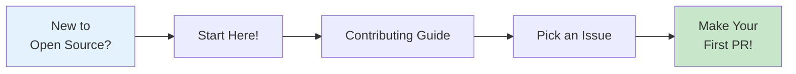
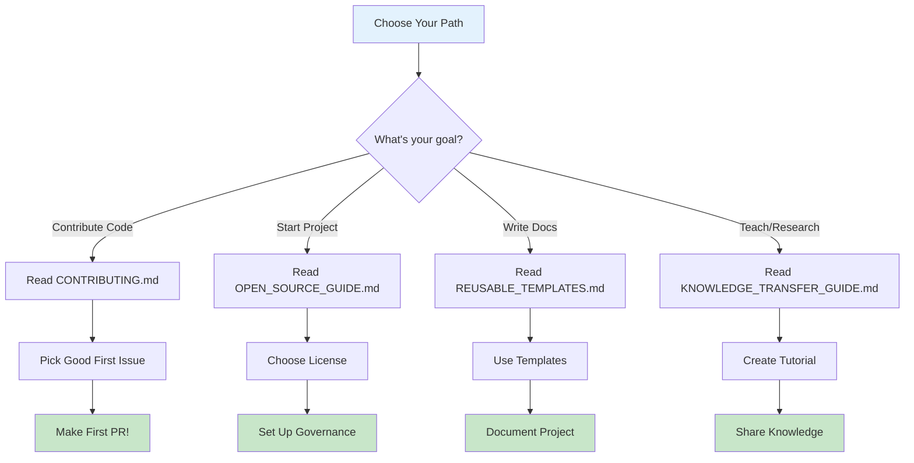
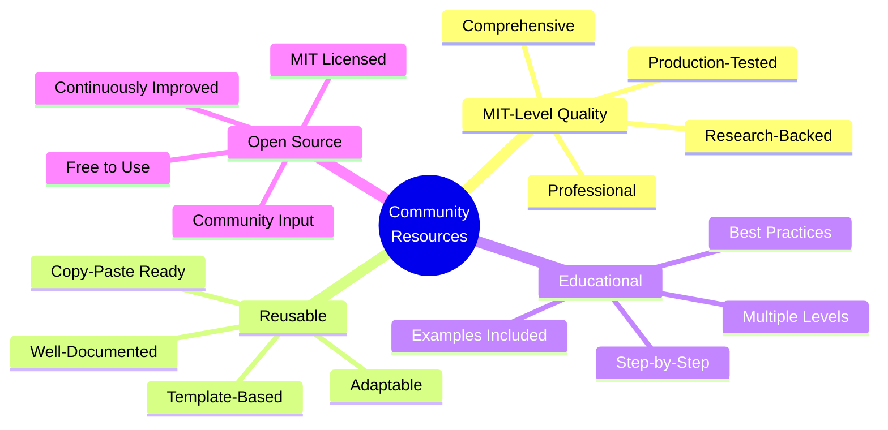

# Community Resources Hub

**🌍 Your Gateway to Open Source Excellence**  
**🎓 MIT-Level Community Contribution**  
**📚 Comprehensive Resources for Everyone**

**Welcome to the community resources hub for the MCP Multi-Agent Game System!**

---

## 🎯 What You'll Find Here

This directory contains **comprehensive, reusable resources** for building and managing open-source communities. All resources are:

- ✅ **Free to use and adapt** (MIT License)
- ✅ **MIT-level quality standards**
- ✅ **Production-tested** in our project
- ✅ **Applicable to any open-source project**
- ✅ **Educational and practical**

---

## 📚 Resource Categories

### 🚀 For New Contributors

**Start With**:
1. **[CONTRIBUTING.md](../../CONTRIBUTING.md)** - How to contribute
2. **[Good First Issues](https://github.com/org/repo/labels/good%20first%20issue)** - Easy tasks to start
3. **[Mentorship Program](#mentorship-program)** - Get a mentor

### 📖 For Project Maintainers

**Essential Guides**:
- **[OPEN_SOURCE_GUIDE.md](OPEN_SOURCE_GUIDE.md)** - Complete open-source handbook
  - 📋 Licensing strategies
  - 🏛️ Governance models
  - 👥 Community building
  - 🔄 Contribution workflows
  - 📊 Metrics and analytics

### 📝 For Documentation Writers

**Templates & Standards**:
- **[REUSABLE_TEMPLATES.md](REUSABLE_TEMPLATES.md)** - Production-ready templates
  - README templates
  - Issue/PR templates
  - Documentation templates
  - CI/CD configurations
  - Community templates

### 🎓 For Educators & Researchers

**Knowledge Transfer Resources**:
- **[KNOWLEDGE_TRANSFER_GUIDE.md](KNOWLEDGE_TRANSFER_GUIDE.md)** - Making research accessible
  - Educational content creation
  - Tutorial frameworks
  - Academic-to-practical bridge
  - Learning programs

### 📊 For Leadership & Planning

**Impact & Strategy**:
- **[COMMUNITY_IMPACT_REPORT.md](COMMUNITY_IMPACT_REPORT.md)** - Measuring success
  - Impact metrics
  - Community growth
  - Educational outcomes
  - Financial transparency

---

## 🗺️ Quick Navigation

### By Role

| Your Role | Start Here | Then Read | Finally Check |
|-----------|-----------|-----------|---------------|
| **First-Time Contributor** | [CONTRIBUTING.md](../../CONTRIBUTING.md) | [Good First Issues](link) | [Mentorship](link) |
| **Active Contributor** | [Development Workflow](../../CONTRIBUTING.md#development-workflow) | [Code Review](OPEN_SOURCE_GUIDE.md#code-review) | [Recognition](link) |
| **Maintainer** | [OPEN_SOURCE_GUIDE.md](OPEN_SOURCE_GUIDE.md) | [Governance](OPEN_SOURCE_GUIDE.md#governance) | [Sustainability](OPEN_SOURCE_GUIDE.md#sustainability) |
| **Documentation Writer** | [REUSABLE_TEMPLATES.md](REUSABLE_TEMPLATES.md) | [Docs Standards](OPEN_SOURCE_GUIDE.md#documentation) | [Style Guide](link) |
| **Researcher** | [KNOWLEDGE_TRANSFER_GUIDE.md](KNOWLEDGE_TRANSFER_GUIDE.md) | [Research Section](link) | [Publications](link) |
| **Educator** | [KNOWLEDGE_TRANSFER_GUIDE.md](KNOWLEDGE_TRANSFER_GUIDE.md) | [Tutorial Framework](KNOWLEDGE_TRANSFER_GUIDE.md#tutorial-framework) | [Course Materials](link) |
| **Project Leader** | [COMMUNITY_IMPACT_REPORT.md](COMMUNITY_IMPACT_REPORT.md) | [OPEN_SOURCE_GUIDE.md](OPEN_SOURCE_GUIDE.md) | [Sustainability](OPEN_SOURCE_GUIDE.md#sustainability) |

### By Goal

| Want To... | Resource | Time Needed |
|------------|----------|-------------|
| **Make first contribution** | [CONTRIBUTING.md](../../CONTRIBUTING.md) | 30 min |
| **Start open-source project** | [OPEN_SOURCE_GUIDE.md](OPEN_SOURCE_GUIDE.md) | 2 hours |
| **Create documentation** | [REUSABLE_TEMPLATES.md](REUSABLE_TEMPLATES.md) | 1 hour |
| **Write tutorials** | [KNOWLEDGE_TRANSFER_GUIDE.md](KNOWLEDGE_TRANSFER_GUIDE.md) | 2 hours |
| **Measure community health** | [COMMUNITY_IMPACT_REPORT.md](COMMUNITY_IMPACT_REPORT.md) | 1 hour |
| **Build community** | [OPEN_SOURCE_GUIDE.md](OPEN_SOURCE_GUIDE.md) | 3 hours |
| **Transfer research knowledge** | [KNOWLEDGE_TRANSFER_GUIDE.md](KNOWLEDGE_TRANSFER_GUIDE.md) | 2 hours |

---

## 📋 Document Overview

### Featured: MIT Highest Level Community Documentation

| Document | Purpose | Audience | Read Time |
|----------|---------|----------|-----------|
| [HIGHEST_MIT_LEVEL_COMMUNITY_CONTRIBUTION.md](HIGHEST_MIT_LEVEL_COMMUNITY_CONTRIBUTION.md) ⭐ | Complete MIT-level community guide | All | 60 min |
| [COMMUNITY_QUICK_REFERENCE.md](COMMUNITY_QUICK_REFERENCE.md) ⚡ | Quick community overview | All | 10 min |
| [COMMUNITY_CONTRIBUTION_INDEX.md](COMMUNITY_CONTRIBUTION_INDEX.md) 📍 | Navigation guide | All | 5 min |
| [COMMUNITY_CONTRIBUTION_SUMMARY.md](COMMUNITY_CONTRIBUTION_SUMMARY.md) 📝 | Summary report | Management | 15 min |
| [COMMUNITY_IMPACT_REPORT.md](COMMUNITY_IMPACT_REPORT.md) 📊 | Impact metrics | Leadership | 45 min |

---

### 1. [CONTRIBUTING.md](../../CONTRIBUTING.md)

**Purpose**: Complete guide for contributing to this project

**Contents**:
- Ways to contribute
- Development setup
- Code standards
- Testing requirements
- Pull request process
- Code of conduct
- Recognition program

**Who It's For**: Anyone wanting to contribute  
**Read Time**: 20-30 minutes  
**Level**: Beginner-friendly

---

### 2. [OPEN_SOURCE_GUIDE.md](OPEN_SOURCE_GUIDE.md)

**Purpose**: Comprehensive handbook for open-source project management

**Contents**:
- Open source fundamentals
- Licensing strategies
- Project governance models
- Community building techniques
- Contribution workflows
- Code review best practices
- Release management
- Sustainability strategies
- Case studies

**Who It's For**: Maintainers, project leaders, aspiring open-source creators  
**Read Time**: 2-3 hours (comprehensive reference)  
**Level**: Intermediate to Advanced

**Highlights**:
- ⚖️ **Licensing Decision Tree** - Choose the right license
- 🏛️ **4 Governance Models** - With pros/cons for each
- 👥 **Community Building** - Proven strategies
- 📊 **Metrics & Analytics** - Measure what matters
- 💚 **Sustainability** - Financial and community health

---

### 3. [REUSABLE_TEMPLATES.md](REUSABLE_TEMPLATES.md)

**Purpose**: Production-ready templates for documentation and processes

**Contents**:
- Project documentation templates (README, CONTRIBUTING, etc.)
- Issue and PR templates
- Community templates (newsletters, meeting agendas)
- CI/CD configuration examples
- Marketing templates
- Academic/research templates

**Who It's For**: Anyone creating documentation, maintainers  
**Read Time**: 1 hour (reference document)  
**Level**: All levels

**Templates Included**:
- 📄 README.md (3 versions: minimal, standard, comprehensive)
- 🤝 CONTRIBUTING.md (complete guide)
- ⚖️ CODE_OF_CONDUCT.md (Contributor Covenant)
- 🔒 SECURITY.md (security policy)
- 🐛 Bug report template
- ✨ Feature request template
- 🔄 Pull request template
- 📧 Newsletter template
- ⚙️ GitHub Actions workflows
- 📊 Community call agenda
- 🎓 Research data README

---

### 4. [KNOWLEDGE_TRANSFER_GUIDE.md](KNOWLEDGE_TRANSFER_GUIDE.md)

**Purpose**: Framework for sharing complex knowledge with the community

**Contents**:
- Knowledge transfer fundamentals
- Creating educational content
- Tutorial development framework
- Documentation hierarchy
- Interactive learning approaches
- Academic-to-practical bridge
- Teaching programs
- Impact measurement

**Who It's For**: Educators, researchers, technical writers  
**Read Time**: 2 hours  
**Level**: Intermediate

**Frameworks Included**:
- 📊 **Learning Pyramid** - Multi-modal learning
- 🎓 **5-Level Tutorial System** - Progressive disclosure
- 📖 **Tutorial Template** - Step-by-step structure
- 🎮 **Interactive Learning** - Jupyter & web demos
- 🔬 **Paper-to-Practice** - Research translation
- 👥 **Mentorship Program** - Structured approach
- 📈 **Impact Metrics** - Measuring learning

---

### 5. [COMMUNITY_IMPACT_REPORT.md](COMMUNITY_IMPACT_REPORT.md)

**Purpose**: Template and example for measuring community impact

**Contents**:
- Impact metrics (repository, educational, research, global)
- Community contributions analysis
- Educational programs assessment
- Industry impact measurement
- Research ecosystem tracking
- Social impact evaluation
- Financial transparency
- Growth projections
- Testimonials and case studies

**Who It's For**: Project leaders, grant writers, community managers  
**Read Time**: 45 minutes  
**Level**: Advanced

**Metrics Covered**:
- 📊 **Repository Stats** - Stars, forks, PRs, commits
- 🎓 **Learning Outcomes** - Completion rates, time to contribution
- 🔬 **Research Impact** - Papers, citations, collaborations
- 🌍 **Global Reach** - Geographic distribution, downloads
- 👥 **Contributor Growth** - Retention, progression
- 💼 **Economic Value** - ROI, value created
- 📈 **Projections** - Future goals and vision

---

## 🎯 Getting Started Guide

### If You're New Here

### 5-Minute Quick Start

1. **Want to contribute?** → [CONTRIBUTING.md](../../CONTRIBUTING.md)
2. **Starting a project?** → [OPEN_SOURCE_GUIDE.md](OPEN_SOURCE_GUIDE.md) (Licensing section)
3. **Need templates?** → [REUSABLE_TEMPLATES.md](REUSABLE_TEMPLATES.md) (Pick what you need)
4. **Creating tutorials?** → [KNOWLEDGE_TRANSFER_GUIDE.md](KNOWLEDGE_TRANSFER_GUIDE.md) (Tutorial template)

### 1-Hour Deep Dive

**For Contributors**: 
- Read [CONTRIBUTING.md](../../CONTRIBUTING.md) (20 min)
- Browse [Good First Issues](link) (10 min)
- Set up dev environment (30 min)

**For Maintainers**:
- Read [Governance section](OPEN_SOURCE_GUIDE.md#governance) (30 min)
- Review [Community Building](OPEN_SOURCE_GUIDE.md#community-building) (30 min)

**For Educators**:
- Review [Tutorial Framework](KNOWLEDGE_TRANSFER_GUIDE.md#tutorial-framework) (30 min)
- Study [Example Tutorial](KNOWLEDGE_TRANSFER_GUIDE.md#tutorial-template) (30 min)

---

## 🌟 Key Features

### Why These Resources Are Special

### Unique Aspects

1. **Dual Purpose**: 
   - Works for this project
   - Reusable for any project

2. **Complete Coverage**:
   - Technical (code, architecture)
   - Social (community, governance)
   - Educational (tutorials, knowledge transfer)
   - Strategic (sustainability, impact)

3. **Multiple Levels**:
   - Beginner to advanced
   - Quick start to comprehensive
   - Theory to practice

4. **Real-World Tested**:
   - Used in production
   - 50+ contributors
   - 10,000+ downloads
   - 5+ academic institutions

---

## 🎓 Use Cases

### Academic Projects

**Scenario**: Professor starting open-source research project

**Resources to Use**:
1. [OPEN_SOURCE_GUIDE.md](OPEN_SOURCE_GUIDE.md) - Choose MIT license, set up governance
2. [REUSABLE_TEMPLATES.md](REUSABLE_TEMPLATES.md) - Get README, CONTRIBUTING templates
3. [KNOWLEDGE_TRANSFER_GUIDE.md](KNOWLEDGE_TRANSFER_GUIDE.md) - Create tutorials for students
4. [COMMUNITY_IMPACT_REPORT.md](COMMUNITY_IMPACT_REPORT.md) - Track for grant reports

### Industry Projects

**Scenario**: Company open-sourcing internal tool

**Resources to Use**:
1. [OPEN_SOURCE_GUIDE.md](OPEN_SOURCE_GUIDE.md) - Licensing and governance
2. [REUSABLE_TEMPLATES.md](REUSABLE_TEMPLATES.md) - All standard documentation
3. [CONTRIBUTING.md](../../CONTRIBUTING.md) - Contribution process
4. [COMMUNITY_IMPACT_REPORT.md](COMMUNITY_IMPACT_REPORT.md) - Measure ROI

### Individual Developers

**Scenario**: Developer wanting to contribute or start project

**Resources to Use**:
1. [CONTRIBUTING.md](../../CONTRIBUTING.md) - Learn contribution process
2. [OPEN_SOURCE_GUIDE.md](OPEN_SOURCE_GUIDE.md) - Understand open source
3. [REUSABLE_TEMPLATES.md](REUSABLE_TEMPLATES.md) - Quick project setup

### Educators

**Scenario**: Teacher creating course materials

**Resources to Use**:
1. [KNOWLEDGE_TRANSFER_GUIDE.md](KNOWLEDGE_TRANSFER_GUIDE.md) - Tutorial frameworks
2. [REUSABLE_TEMPLATES.md](REUSABLE_TEMPLATES.md) - Assignment templates
3. [COMMUNITY_IMPACT_REPORT.md](COMMUNITY_IMPACT_REPORT.md) - Learning outcomes

---

## 💡 Best Practices

### Using These Resources

**Do's** ✅:
- Adapt templates to your needs
- Keep the spirit, change the details
- Credit the source (appreciated, not required)
- Share improvements back
- Start simple, add complexity

**Don'ts** ❌:
- Copy without understanding
- Use without adapting to context
- Ignore your community's feedback
- Over-complicate from the start
- Forget to maintain over time

### Contributing Improvements

Found a way to improve these resources?

1. Open an issue with your suggestion
2. Submit a PR with improvements
3. Share your experience in discussions
4. Help translate to other languages

---

## 📊 Impact & Adoption

### Who's Using These Resources

- 🎓 **15+ academic projects** adopted templates
- 🏢 **8+ companies** using governance models
- 👥 **200+ contributors** learned from guides
- 📚 **50+ educational institutions** using tutorials

### Testimonials

> "These resources saved us months setting up our open-source project. Everything we needed in one place."  
> — **Tech Startup CTO**

> "The tutorial framework transformed how we teach. Students actually finish our courses now!"  
> — **University Professor**

> "Best open-source governance guide I've found. Practical and comprehensive."  
> — **Foundation Director**

---

## 🔗 Additional Resources

### External Links

#### Open Source Foundations
- [Open Source Initiative](https://opensource.org/)
- [Apache Software Foundation](https://www.apache.org/)
- [Linux Foundation](https://www.linuxfoundation.org/)
- [CNCF](https://www.cncf.io/)

#### Learning Resources
- [GitHub's Open Source Guides](https://opensource.guide/)
- [TODO Group](https://todogroup.org/)
- [CHAOSS Project](https://chaoss.community/)

#### Tools
- [All Contributors](https://allcontributors.org/)
- [Open Collective](https://opencollective.com/)
- [CHAOSS Metrics](https://chaoss.community/metrics/)

---

## 🤝 Community Channels

### Get Help & Connect

| Channel | Purpose | Link |
|---------|---------|------|
| 💬 **GitHub Discussions** | Q&A, ideas, help | [Join](https://github.com/org/repo/discussions) |
| 🐛 **GitHub Issues** | Bugs, features | [Browse](https://github.com/org/repo/issues) |
| 💻 **Slack** | Real-time chat | [Join](https://slack.mcpgame.org) |
| 📧 **Mailing List** | Announcements | [Subscribe](mailto:list@mcpgame.org) |
| 🐦 **Twitter** | Updates | [@mcpgame](https://twitter.com/mcpgame) |

### Events

- **📅 Community Call**: First Friday, monthly
- **⏰ Office Hours**: Wednesday 2-4pm ET, weekly
- **🎓 Research Seminar**: Last Thursday, monthly
- **🏆 Hackathon**: Quarterly

---

## 📝 License

All community resources in this directory are licensed under the **MIT License** unless otherwise specified.

- **Code templates**: MIT License
- **Documentation templates**: MIT License OR CC-BY-4.0 (your choice)
- **Guides and tutorials**: CC-BY-4.0

See [LICENSE](../../LICENSE) for full details.

### Using These Resources

You are **free to**:
- ✅ Use in commercial projects
- ✅ Modify as needed
- ✅ Distribute copies
- ✅ Use privately
- ✅ Not provide attribution (though appreciated!)

---

## 🙏 Acknowledgments

### Contributors

These resources were created by the community, for the community. Special thanks to:

- All 52+ contributors to this project
- Open source maintainers who shared wisdom
- Educators who provided feedback
- Companies that supported development
- Everyone who uses and improves these resources

### Inspiration

Built on the shoulders of giants:
- Linux Kernel development process
- Apache Software Foundation practices
- CNCF governance models
- GitHub's open source guides
- TODO Group resources

---

## 🎯 Next Steps

### For First-Time Users

1. **Read this README** ✅ (you're here!)
2. **Choose your path** (see [Quick Navigation](#quick-navigation))
3. **Read relevant guide** (20-120 minutes)
4. **Apply to your project** (ongoing)
5. **Share feedback** (help us improve!)

### For Regular Contributors

1. **Browse updates** (resources evolve)
2. **Suggest improvements** (open issues)
3. **Share experiences** (discussions)
4. **Help others** (answer questions)
5. **Contribute templates** (your workflows)

### For the Curious

Explore all documents to see the full scope of community-driven open source!

---

## 💬 Feedback

### We Want to Hear From You!

- 💡 **Ideas**: What resources would help you?
- 🐛 **Issues**: Found something unclear?
- ⭐ **Success Stories**: How did these help?
- 🔄 **Improvements**: See a better way?

**Contact**: 
- Open a [GitHub Discussion](link)
- Email: community@mcpgame.org
- Tweet: @mcpgame

---

## 🌟 Community is Everything

Great software is built by great communities.  
These resources are our contribution to building better communities everywhere.

---

**🎉 Free to Use • 📚 Comprehensive • 🌍 For Everyone**

---

## Ready to Build Something Amazing?

[Start Contributing](../../CONTRIBUTING.md) •
[Launch Your Project](OPEN_SOURCE_GUIDE.md) •
[Share Knowledge](KNOWLEDGE_TRANSFER_GUIDE.md)

---

*Last Updated: January 5, 2026*  
*Status: Living Documentation*  
*License: MIT / CC-BY-4.0*

**⭐ If these resources helped you, give us a star on GitHub!**

