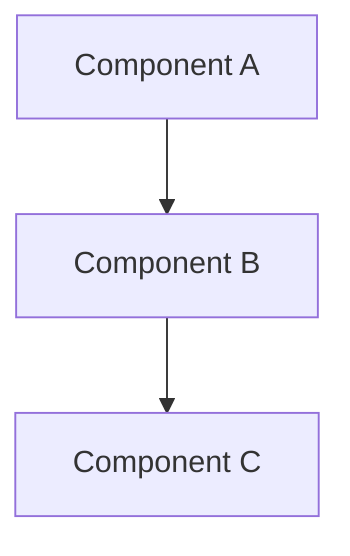

# Reusable Documentation Templates

<div align="center">

**📚 Templates for the Open Source Community**  
**🎓 MIT-Level Quality Standards**  
**🌍 Free to Use and Adapt**

[](https://opensource.org)
[](REUSABLE_TEMPLATES.md)

</div>

---

## 🎯 Purpose

This document provides **production-ready, reusable templates** that any open-source project can adapt. All templates are provided under the **MIT License** and are based on industry best practices and MIT-level standards.

**Target Audience**:
- 🚀 New open-source projects
- 🎓 Academic research projects
- 💼 Companies open-sourcing internal projects
- 🌍 Community maintainers
- 📚 Documentation writers

---

## 📋 Table of Contents

1. [Project Documentation Templates](#project-documentation-templates)
2. [Issue and PR Templates](#issue-and-pr-templates)
3. [Community Templates](#community-templates)
4. [CI/CD Configuration Templates](#cicd-configuration-templates)
5. [Marketing and Outreach Templates](#marketing-and-outreach-templates)
6. [Academic and Research Templates](#academic-and-research-templates)

---

## 📚 Project Documentation Templates

### 1. README.md Template

```markdown
# Project Name

Brief one-line description of what this project does.

<div align="center">

[](https://github.com/user/repo/actions)
[](https://codecov.io/gh/user/repo)
[](https://opensource.org/licenses/MIT)
[](https://github.com/user/repo/releases)

[Features](#-features) •
[Installation](#-installation) •
[Quick Start](#-quick-start) •
[Documentation](#-documentation) •
[Contributing](#-contributing)

</div>

---

## 🌟 Overview

2-3 paragraph description of the project:
- What problem does it solve?
- Who is it for?
- What makes it unique?

### Key Features

- ✨ **Feature 1**: Brief description
- 🚀 **Feature 2**: Brief description
- 🎯 **Feature 3**: Brief description
- 🔒 **Feature 4**: Brief description

---

## 🚀 Quick Start

### Prerequisites

- Requirement 1 (version)
- Requirement 2 (version)
- Requirement 3 (version)

### Installation

```bash
# Installation command
pip install your-project

# Or from source
git clone https://github.com/user/repo.git
cd repo
pip install -e .
```

### Basic Usage

```python
# Your most basic example here
from your_project import MainClass

# Simple usage that shows immediate value
result = MainClass().do_something()
print(result)
```

---

## 📖 Documentation

| Resource | Description |
|----------|-------------|
| [Documentation](https://docs.example.com) | Full documentation |
| [API Reference](https://docs.example.com/api) | Complete API docs |
| [Tutorials](https://docs.example.com/tutorials) | Step-by-step guides |
| [Examples](examples/) | Code examples |

---

## 💡 Examples

### Example 1: Basic Use Case

```python
# Code example showing basic use case
```

### Example 2: Advanced Use Case

```python
# Code example showing advanced features
```

---

## 🏗️ Architecture

Brief overview of system architecture (with diagram if possible)



---

## 🧪 Testing

```bash
# Run tests
pytest tests/

# With coverage
pytest --cov=src tests/
```

---

## 🤝 Contributing

We welcome contributions! Please see:
- [Contributing Guide](CONTRIBUTING.md)
- [Code of Conduct](CODE_OF_CONDUCT.md)
- [Development Guide](docs/DEVELOPMENT.md)

---

## 📝 License

This project is licensed under the MIT License - see the [LICENSE](LICENSE) file for details.

---

## 🙏 Acknowledgments

- Credit to inspirations
- Credit to contributors
- Credit to dependencies

---

## 📞 Contact

- **Issues**: [GitHub Issues](https://github.com/user/repo/issues)
- **Discussions**: [GitHub Discussions](https://github.com/user/repo/discussions)
- **Email**: support@example.com

---

<div align="center">

Made with ❤️ by [Your Name/Team]

⭐ Star us on GitHub — it helps!

</div>
```

---

### 2. CONTRIBUTING.md Template

```markdown
# Contributing to [Project Name]

Thank you for your interest in contributing! This document provides guidelines for contributing to this project.

## 🌟 Ways to Contribute

- 🐛 Report bugs
- ✨ Suggest new features
- 📚 Improve documentation
- 🔧 Submit code changes
- 🧪 Add tests
- 💡 Share ideas

## 🚀 Getting Started

### Setting Up Development Environment

```bash
# Fork and clone the repository
git clone https://github.com/YOUR_USERNAME/project.git
cd project

# Install development dependencies
pip install -e ".[dev]"

# Run tests to verify setup
pytest
```

### Finding Something to Work On

- Check [good first issues](https://github.com/user/repo/labels/good%20first%20issue)
- Look for [help wanted](https://github.com/user/repo/labels/help%20wanted) labels
- Review the [roadmap](ROADMAP.md)

## 💻 Development Workflow

1. **Create a Branch**
   ```bash
   git checkout -b feature/your-feature-name
   ```

2. **Make Changes**
   - Write your code
   - Add tests
   - Update documentation

3. **Test Your Changes**
   ```bash
   pytest tests/
   ruff check src/
   mypy src/
   ```

4. **Commit Your Changes**
   ```bash
   git commit -m "feat: add new feature"
   ```
   
   Use [Conventional Commits](https://www.conventionalcommits.org/):
   - `feat:` New feature
   - `fix:` Bug fix
   - `docs:` Documentation
   - `test:` Testing
   - `refactor:` Code refactoring

5. **Push and Create PR**
   ```bash
   git push origin feature/your-feature-name
   ```

## 📝 Code Style

- Follow [PEP 8](https://pep8.org/) for Python
- Use type hints
- Write docstrings
- Keep functions small and focused
- Add comments for complex logic

## 🧪 Testing

- Write tests for all new features
- Maintain test coverage above 85%
- Test edge cases
- Include integration tests

## 📚 Documentation

- Update README for new features
- Add docstrings to all public APIs
- Update CHANGELOG.md
- Add examples

## 🔍 Pull Request Process

1. Ensure all tests pass
2. Update documentation
3. Add your changes to CHANGELOG.md
4. Request review from maintainers
5. Address review feedback
6. Get approval and merge

## 🤝 Code of Conduct

This project follows the [Code of Conduct](CODE_OF_CONDUCT.md). By participating, you agree to uphold this code.

## ❓ Questions?

- Open a [Discussion](https://github.com/user/repo/discussions)
- Ask in our [Slack](https://slack.example.com)
- Email: support@example.com

## 🙏 Recognition

All contributors will be recognized in:
- README.md contributors section
- Release notes
- Project website

Thank you for contributing! 🎉
```

---

### 3. CODE_OF_CONDUCT.md Template

```markdown
# Code of Conduct

## Our Pledge

We pledge to make participation in our community a harassment-free experience for everyone, regardless of age, body size, visible or invisible disability, ethnicity, sex characteristics, gender identity and expression, level of experience, education, socio-economic status, nationality, personal appearance, race, religion, or sexual identity and orientation.

## Our Standards

### Positive Behavior ✅

- Using welcoming and inclusive language
- Being respectful of differing viewpoints and experiences
- Gracefully accepting constructive criticism
- Focusing on what is best for the community
- Showing empathy towards other community members

### Unacceptable Behavior ❌

- The use of sexualized language or imagery
- Trolling, insulting or derogatory comments, and personal attacks
- Public or private harassment
- Publishing others' private information without explicit permission
- Other conduct which could reasonably be considered inappropriate

## Enforcement

### Reporting

Instances of abusive, harassing, or otherwise unacceptable behavior may be reported to the community leaders responsible for enforcement at conduct@example.com.

All complaints will be reviewed and investigated promptly and fairly.

### Enforcement Guidelines

1. **Correction**
   - **Impact**: Minor violation
   - **Consequence**: Private written warning

2. **Warning**
   - **Impact**: Single or repeated violation
   - **Consequence**: Warning with consequences for continued behavior

3. **Temporary Ban**
   - **Impact**: Serious violation or sustained inappropriate behavior
   - **Consequence**: Temporary ban from community interaction

4. **Permanent Ban**
   - **Impact**: Pattern of violation or severe single incident
   - **Consequence**: Permanent ban from community

## Attribution

This Code of Conduct is adapted from the [Contributor Covenant](https://www.contributor-covenant.org/), version 2.1.

## Questions?

Contact: conduct@example.com
```

---

### 4. SECURITY.md Template

```markdown
# Security Policy

## Supported Versions

| Version | Supported          |
| ------- | ------------------ |
| 1.x.x   | :white_check_mark: |
| < 1.0   | :x:                |

## Reporting a Vulnerability

**Please do not report security vulnerabilities through public GitHub issues.**

Instead, please report them via email to: security@example.com

You should receive a response within 48 hours. If for some reason you do not, please follow up via email to ensure we received your original message.

### What to Include

- Type of issue (e.g., buffer overflow, SQL injection, XSS)
- Full paths of source file(s) related to the issue
- Location of the affected source code (tag/branch/commit or direct URL)
- Step-by-step instructions to reproduce the issue
- Proof-of-concept or exploit code (if possible)
- Impact of the issue

### What to Expect

1. **Acknowledgment**: Within 48 hours
2. **Investigation**: Within 1 week
3. **Fix Development**: Within 2 weeks
4. **Patch Release**: Within 3 weeks
5. **Public Disclosure**: After patch is available

## Security Updates

Subscribe to security announcements:
- Watch this repository
- Join our mailing list: security-announce@example.com
- Follow us on Twitter: @projectname

## Bug Bounty

We currently do not offer a bug bounty program. However, we deeply appreciate security researchers who responsibly disclose vulnerabilities.

### Recognition

Security researchers who responsibly disclose vulnerabilities will be:
- Credited in the security advisory (unless they prefer to remain anonymous)
- Listed in our SECURITY_HALL_OF_FAME.md
- Mentioned in release notes

## Security Best Practices

For users of this project:

1. **Keep Updated**: Always use the latest stable version
2. **Review Dependencies**: Regularly update dependencies
3. **Use HTTPS**: Always use encrypted connections
4. **API Keys**: Never commit API keys or secrets
5. **Principle of Least Privilege**: Run with minimal permissions

## Contact

Security Team: security@example.com  
PGP Key: [link to public key]
```

---

## 🎫 Issue and PR Templates

### Bug Report Template

```markdown
---
name: Bug Report
about: Create a report to help us improve
title: '[BUG] '
labels: bug
assignees: ''
---

## 🐛 Bug Description

A clear and concise description of what the bug is.

## 📝 To Reproduce

Steps to reproduce the behavior:

1. Go to '...'
2. Click on '....'
3. Scroll down to '....'
4. See error

## ✅ Expected Behavior

A clear description of what you expected to happen.

## ❌ Actual Behavior

What actually happened instead.

## 🖼️ Screenshots

If applicable, add screenshots to help explain your problem.

## 🔧 Environment

- **OS**: [e.g., Ubuntu 22.04, macOS 13, Windows 11]
- **Python Version**: [e.g., 3.11.0]
- **Project Version**: [e.g., 1.2.0]
- **Installation Method**: [e.g., pip, conda, source]

## 📋 Logs

<details>
<summary>Click to expand logs</summary>

```
Paste your logs here
```

</details>

## 💭 Additional Context

Add any other context about the problem here.

## ✅ Checklist

- [ ] I have searched existing issues to avoid duplicates
- [ ] I have provided all requested information
- [ ] I have included reproduction steps
- [ ] I have included environment details
```

---

### Feature Request Template

```markdown
---
name: Feature Request
about: Suggest an idea for this project
title: '[FEATURE] '
labels: enhancement
assignees: ''
---

## 💡 Feature Description

A clear and concise description of the feature you'd like to see.

## 🎯 Problem Statement

What problem does this feature solve? Why is it needed?

**Example**: "I'm frustrated when [...]"

## 🚀 Proposed Solution

A clear description of what you want to happen.

```python
# Example of how it might work
new_feature.do_something()
```

## 🔄 Alternatives Considered

Describe any alternative solutions or features you've considered.

## 📊 Additional Context

Add any other context, mockups, or examples about the feature request here.

## 🎨 Mockups/Examples

If applicable, add mockups or examples from other projects.

## ✅ Acceptance Criteria

How will we know when this feature is complete?

- [ ] Criterion 1
- [ ] Criterion 2
- [ ] Criterion 3

## 🤝 Willingness to Contribute

- [ ] I am willing to implement this feature myself
- [ ] I can help test this feature
- [ ] I can help with documentation
- [ ] I need guidance on how to contribute

## 🎯 Priority

How important is this feature to you?

- [ ] Nice to have
- [ ] Important
- [ ] Critical
```

---

### Pull Request Template

```markdown
## 📝 Description

Brief description of what this PR accomplishes.

## 🔗 Related Issues

- Closes #(issue number)
- Related to #(issue number)
- Part of #(issue number)

## 🎯 Type of Change

- [ ] 🐛 Bug fix (non-breaking change which fixes an issue)
- [ ] ✨ New feature (non-breaking change which adds functionality)
- [ ] 💥 Breaking change (fix or feature that would cause existing functionality to not work as expected)
- [ ] 📚 Documentation update
- [ ] 🎨 Style update (formatting, renaming)
- [ ] ♻️ Code refactoring
- [ ] ⚡ Performance improvement
- [ ] 🧪 Test update

## 🧪 Testing

Describe the tests that you ran to verify your changes.

- [ ] All existing tests pass locally
- [ ] New tests added
- [ ] Manual testing performed

### Test Configuration

- **OS**: 
- **Python Version**: 
- **Test Framework**: 

### Test Output

<details>
<summary>Click to expand test results</summary>

```
Paste test output here
```

</details>

## 📸 Screenshots (if applicable)

Add screenshots to help explain your changes.

| Before | After |
|--------|-------|
|  |  |

## ✅ Checklist

- [ ] My code follows the style guidelines of this project
- [ ] I have performed a self-review of my own code
- [ ] I have commented my code, particularly in hard-to-understand areas
- [ ] I have made corresponding changes to the documentation
- [ ] My changes generate no new warnings
- [ ] I have added tests that prove my fix is effective or that my feature works
- [ ] New and existing unit tests pass locally with my changes
- [ ] Any dependent changes have been merged and published in downstream modules
- [ ] I have checked my code and corrected any misspellings
- [ ] I have updated the CHANGELOG.md

## 📚 Documentation

- [ ] README.md updated
- [ ] API documentation updated
- [ ] Code comments added/updated
- [ ] Examples added/updated

## 🎯 Performance Impact

Does this change have any performance implications?

- [ ] No performance impact
- [ ] Performance improvement (describe below)
- [ ] Performance degradation (explain and justify below)

**Details**: 

## 🔒 Security Considerations

Does this change have any security implications?

- [ ] No security impact
- [ ] Security improvement (describe below)
- [ ] Requires security review

**Details**: 

## 💭 Additional Notes

Add any other notes about the PR here.

## 👥 Reviewers

@mention specific reviewers if needed

## 🎉 Post-Merge Checklist

- [ ] Update changelog
- [ ] Update version number (if applicable)
- [ ] Create/update migration guide (if breaking change)
- [ ] Announce on community channels
```

---

## 👥 Community Templates

### Community Call Agenda Template

```markdown
# Community Call - [Date]

**Time**: [Time in UTC and other major timezones]  
**Video**: [Zoom/Meet/Teams link]  
**Recording**: [Will be posted here after call]

## 📋 Agenda

1. **Welcome & Introductions** (5 min)
   - New community members
   - Quick round of introductions

2. **Project Updates** (15 min)
   - Recent releases
   - Upcoming features
   - Important changes

3. **Community Highlights** (10 min)
   - Contributor spotlight
   - Interesting use cases
   - Community projects

4. **Technical Deep Dive** (20 min)
   - [Topic]: Presented by [Name]
   - Q&A

5. **Open Discussion** (10 min)
   - Questions
   - Ideas
   - Feedback

## 📝 Notes

[Space for taking notes during the call]

## 🎬 Action Items

- [ ] Action item 1 - @owner
- [ ] Action item 2 - @owner

## 📅 Next Call

**Date**: [Next call date]  
**Topic**: [Planned topic]

## 📞 Join Information

- **Video Link**: [link]
- **Calendar**: [Add to calendar link]
- **Time Zone Converter**: [link]
```

---

### Newsletter Template

```markdown
# [Project Name] Newsletter - [Month Year]

## 🎉 Highlights

Brief summary of the most exciting news this month.

## 🚀 New Releases

### Version X.Y.Z Released

Brief description of the release. [Read full release notes](link)

**Key Features**:
- Feature 1
- Feature 2
- Feature 3

## 👥 Community

### 📊 Growth

- **Contributors**: XX (+Y this month)
- **Stars**: XX (+Y this month)
- **Downloads**: XX (+Y% this month)

### 🌟 Contributor Spotlight

**[Contributor Name]** - Brief bio and contribution highlights

### 🎤 Upcoming Events

- **[Event Name]** - Date, Time - [Registration](link)
- **[Event Name]** - Date, Time - [Registration](link)

## 📚 Content & Resources

### 📝 Blog Posts

- [Post Title](link) by Author
- [Post Title](link) by Author

### 🎥 Videos & Tutorials

- [Video Title](link) by Creator
- [Tutorial Title](link) by Creator

### 🐦 Social Media Highlights

Best tweets, posts, and discussions from the community.

## 🔧 Development Updates

### 🚧 In Progress

- Feature/Issue being worked on
- Feature/Issue being worked on

### 🎯 Roadmap

Brief update on roadmap progress. [See full roadmap](link)

## 💼 Jobs & Opportunities

Companies hiring for [Project] experience:

- **Company Name** - Position - [Apply](link)
- **Company Name** - Position - [Apply](link)

## 🙏 Thank You

Special thanks to this month's contributors:

@contributor1, @contributor2, @contributor3, ...

## 📅 Save the Date

- **Next Community Call**: Date & Time
- **Next Release**: Expected Date
- **Conference**: Date & Location

## 💬 Stay Connected

- 🐦 [Twitter](link)
- 💬 [Slack](link)
- 📧 [Mailing List](link)
- 💻 [GitHub](link)

---

*Want to contribute to the newsletter? Contact newsletter@example.com*
```

---

## ⚙️ CI/CD Configuration Templates

### GitHub Actions - CI Workflow

```yaml
name: CI

on:
  push:
    branches: [ main, develop ]
  pull_request:
    branches: [ main, develop ]

jobs:
  test:
    runs-on: ${{ matrix.os }}
    strategy:
      matrix:
        os: [ubuntu-latest, macos-latest, windows-latest]
        python-version: ['3.9', '3.10', '3.11', '3.12']
    
    steps:
    - uses: actions/checkout@v4
    
    - name: Set up Python
      uses: actions/setup-python@v4
      with:
        python-version: ${{ matrix.python-version }}
    
    - name: Install dependencies
      run: |
        python -m pip install --upgrade pip
        pip install -e ".[dev]"
    
    - name: Lint with ruff
      run: |
        ruff check src/
    
    - name: Type check with mypy
      run: |
        mypy src/
    
    - name: Run tests
      run: |
        pytest tests/ --cov=src --cov-report=xml
    
    - name: Upload coverage
      uses: codecov/codecov-action@v3
      with:
        file: ./coverage.xml
        
  security:
    runs-on: ubuntu-latest
    
    steps:
    - uses: actions/checkout@v4
    
    - name: Run security scan
      uses: pypa/gh-action-pip-audit@v1
    
    - name: Run Bandit
      run: |
        pip install bandit
        bandit -r src/
```

---

### Pre-commit Configuration

```yaml
# .pre-commit-config.yaml
repos:
  - repo: https://github.com/pre-commit/pre-commit-hooks
    rev: v4.5.0
    hooks:
      - id: trailing-whitespace
      - id: end-of-file-fixer
      - id: check-yaml
      - id: check-added-large-files
      - id: check-json
      - id: check-toml
      - id: check-merge-conflict
      - id: debug-statements

  - repo: https://github.com/astral-sh/ruff-pre-commit
    rev: v0.1.6
    hooks:
      - id: ruff
        args: [--fix, --exit-non-zero-on-fix]
      - id: ruff-format

  - repo: https://github.com/pre-commit/mirrors-mypy
    rev: v1.7.1
    hooks:
      - id: mypy
        additional_dependencies: [types-all]

  - repo: https://github.com/PyCQA/bandit
    rev: 1.7.5
    hooks:
      - id: bandit
        args: ['-c', 'pyproject.toml']
```

---

## 📢 Marketing and Outreach Templates

### Launch Announcement Template

```markdown
# Announcing [Project Name] - [One Line Description]

We're excited to announce the release of [Project Name], an open-source [category] that [key benefit].

## 🎯 What Problem Does It Solve?

[2-3 sentences about the problem]

## ✨ Key Features

- **Feature 1**: Description
- **Feature 2**: Description  
- **Feature 3**: Description

## 🚀 Get Started

```bash
pip install project-name
```

```python
# 5-line example showing value
```

## 📚 Learn More

- **Documentation**: [link]
- **GitHub**: [link]
- **Discord**: [link]

## 🤝 Get Involved

We're looking for contributors! Check out our [Contributing Guide](link).

---

**What do you think?** We'd love your feedback!
```

---

### Social Media Templates

#### Twitter/X Thread Template

```
🚀 Excited to introduce [Project Name]! 

A thread 🧵 👇

1/ The Problem:
[Describe the pain point your project solves]

2/ The Solution:
[How your project solves it]

3/ Key Features:
✅ Feature 1
✅ Feature 2
✅ Feature 3

4/ Quick Start:
[Simple code example]

5/ Why Open Source?
[Your philosophy]

6/ Get Involved:
🔗 GitHub: [link]
📚 Docs: [link]
💬 Discord: [link]

7/ Thanks to all our early contributors! 🙏
@contributor1 @contributor2 @contributor3

[END] Feedback welcome! What features would you like to see? 💭
```

---

## 🎓 Academic and Research Templates

### Research Data Repository README

```markdown
# Research Data: [Study Title]

## 📄 Associated Publication

**Title**: [Paper Title]  
**Authors**: [Author List]  
**Journal**: [Journal Name]  
**DOI**: [DOI Link]  
**Date**: [Publication Date]

## 📊 Dataset Description

Brief description of what data is included and how it was collected.

### Dataset Statistics

- **Total Samples**: X
- **Features**: Y
- **Size**: Z MB
- **Format**: CSV/JSON/etc.
- **License**: CC-BY-4.0

## 📁 File Structure

```
data/
├── raw/           # Raw, unprocessed data
├── processed/     # Cleaned and processed data
├── results/       # Analysis results
└── metadata/      # Data descriptions
```

## 🔧 Usage

### Loading the Data

```python
import pandas as pd
data = pd.read_csv('data/processed/dataset.csv')
```

### Reproducing Results

```bash
python scripts/run_analysis.py
```

## 📖 Citation

If you use this data, please cite:

```bibtex
@article{author2025title,
  title={Title},
  author={Authors},
  journal={Journal},
  year={2025}
}
```

## 📝 License

This dataset is released under [License]. See LICENSE file.

## 📧 Contact

For questions: research@example.com
```

---

## 🎯 Usage Guide

### How to Use These Templates

1. **Copy** the relevant template
2. **Customize** with your project details
3. **Adapt** to your specific needs
4. **Maintain** as your project evolves

### Template Customization Checklist

- [ ] Replace all [placeholders] with actual content
- [ ] Update links to point to your repository
- [ ] Customize badges with your project info
- [ ] Adapt examples to your use case
- [ ] Adjust structure as needed
- [ ] Review for typos and clarity
- [ ] Get feedback from team/community

---

## 📚 Additional Resources

- [GitHub's template guidelines](https://docs.github.com/en/communities)
- [Awesome README examples](https://github.com/matiassingers/awesome-readme)
- [Open Source Guides](https://opensource.guide/)

---

<div align="center">

## 🎉 Free to Use and Adapt

All templates in this document are provided under the **MIT License** and can be freely used, modified, and distributed.

**Found these useful? Give us a ⭐ on GitHub!**

---

**Questions or Suggestions?**  
Open an issue or discussion on our repository.

*Last Updated: December 25, 2025*

</div>

